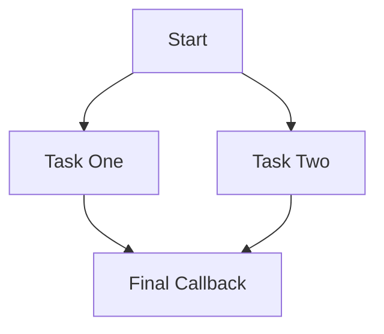
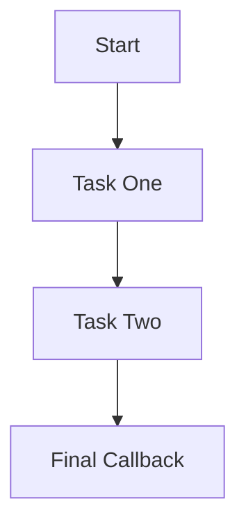
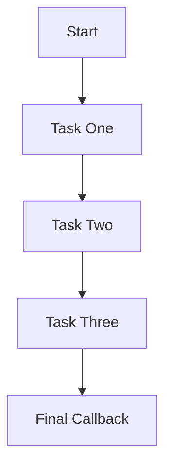

## 8.9 Managing Async Operations with Async.js

In the realm of JavaScript, managing asynchronous operations efficiently is crucial for building responsive and performant applications. While modern JavaScript has introduced Promises and async/await to simplify asynchronous programming, the Async.js library remains a powerful tool for handling complex asynchronous control flows, especially in Node.js environments. In this section, we will explore how Async.js can be leveraged to manage asynchronous operations, discuss its key functions, and provide practical examples to illustrate its usage.

### Introduction to Async.js

Async.js is a utility module that provides straightforward, powerful functions for working with asynchronous JavaScript. It was created to address the challenges of managing asynchronous operations, particularly in Node.js, where callbacks were the primary method for handling asynchronous tasks. Async.js offers a collection of functions that simplify the process of executing multiple asynchronous operations, handling errors, and controlling the flow of execution.

#### Problems Solved by Async.js

Before the advent of Promises and async/await, JavaScript developers often faced the notorious "callback hell" when dealing with multiple asynchronous operations. This problem arises when callbacks are nested within each other, leading to code that is difficult to read, maintain, and debug. Async.js helps alleviate this issue by providing a set of tools to manage asynchronous control flow in a more organized and readable manner.

### Key Functions of Async.js

Async.js offers a variety of functions to handle different asynchronous scenarios. Some of the most commonly used functions include `async.parallel`, `async.series`, and `async.waterfall`. Let's explore each of these functions in detail.

#### 1. `async.parallel`

The `async.parallel` function allows you to run multiple asynchronous operations in parallel. This is particularly useful when you have multiple tasks that can be executed independently and you want to wait for all of them to complete before proceeding.

```javascript
const async = require('async');

// Example of async.parallel
async.parallel([
    function(callback) {
        setTimeout(() => {
            console.log('Task One');
            callback(null, 'one');
        }, 200);
    },
    function(callback) {
        setTimeout(() => {
            console.log('Task Two');
            callback(null, 'two');
        }, 100);
    }
],
// Optional callback
function(err, results) {
    if (err) {
        console.error(err);
    } else {
        console.log(results); // ['one', 'two']
    }
});
```

In this example, both tasks run concurrently, and the final callback is executed once both tasks have completed. The results of each task are passed to the final callback as an array.

#### 2. `async.series`

The `async.series` function is used to run asynchronous operations in series, meaning each task is executed one after the other. This is useful when tasks need to be performed in a specific order.

```javascript
const async = require('async');

// Example of async.series
async.series([
    function(callback) {
        setTimeout(() => {
            console.log('Task One');
            callback(null, 'one');
        }, 200);
    },
    function(callback) {
        setTimeout(() => {
            console.log('Task Two');
            callback(null, 'two');
        }, 100);
    }
],
// Optional callback
function(err, results) {
    if (err) {
        console.error(err);
    } else {
        console.log(results); // ['one', 'two']
    }
});
```

Here, Task One is executed first, followed by Task Two. The results are collected in the order of execution and passed to the final callback.

#### 3. `async.waterfall`

The `async.waterfall` function is designed for scenarios where each task depends on the result of the previous task. It passes the result of one function to the next function in the array.

```javascript
const async = require('async');

// Example of async.waterfall
async.waterfall([
    function(callback) {
        callback(null, 'Task One Result');
    },
    function(arg1, callback) {
        console.log(arg1); // Task One Result
        callback(null, 'Task Two Result');
    },
    function(arg1, callback) {
        console.log(arg1); // Task Two Result
        callback(null, 'done');
    }
],
function(err, result) {
    if (err) {
        console.error(err);
    } else {
        console.log(result); // 'done'
    }
});
```

In this example, each function receives the result of the previous function, allowing for a seamless flow of data through the series of tasks.

### Error Handling and Flow Control

One of the strengths of Async.js is its robust error handling capabilities. In each of the functions discussed, errors are propagated to the final callback, allowing you to handle them in a centralized manner. This simplifies error management and ensures that errors do not go unnoticed.

```javascript
const async = require('async');

// Example of error handling with async.parallel
async.parallel([
    function(callback) {
        setTimeout(() => {
            callback(new Error('An error occurred in Task One'), null);
        }, 200);
    },
    function(callback) {
        setTimeout(() => {
            console.log('Task Two');
            callback(null, 'two');
        }, 100);
    }
],
function(err, results) {
    if (err) {
        console.error(err.message); // An error occurred in Task One
    } else {
        console.log(results);
    }
});
```

In this example, if an error occurs in any of the tasks, it is passed to the final callback, where it can be logged or handled appropriately.

### Benefits Over Traditional Callback Patterns

Async.js provides several advantages over traditional callback patterns:

- **Improved Readability**: By organizing asynchronous operations into parallel, series, or waterfall flows, Async.js makes code more readable and maintainable.
- **Centralized Error Handling**: Errors are propagated to a single callback, simplifying error management.
- **Reduced Callback Nesting**: Async.js functions help avoid deeply nested callbacks, reducing the complexity of the code.

### Relevance in Modern JavaScript

With the introduction of Promises and async/await in modern JavaScript, the need for libraries like Async.js has diminished. However, Async.js remains relevant in certain contexts, particularly in legacy codebases or when working with environments that do not fully support modern syntax. Additionally, Async.js provides a rich set of utility functions that can complement Promises and async/await, offering more control over complex asynchronous flows.

### Visualizing Async.js Operations

To better understand how Async.js manages asynchronous operations, let's visualize the flow of tasks using Mermaid.js diagrams.

#### Parallel Execution



In parallel execution, Task One and Task Two run concurrently, and the final callback is executed once both tasks are complete.

#### Series Execution



In series execution, Task One is completed before Task Two begins, ensuring a sequential flow of operations.

#### Waterfall Execution



In waterfall execution, each task passes its result to the next, creating a chain of dependent operations.

### Try It Yourself

To deepen your understanding of Async.js, try modifying the code examples provided. Experiment with different tasks, error scenarios, and flow control functions. Observe how changes affect the execution order and error handling.

### References and Further Reading

- [Async.js Official Documentation](https://caolan.github.io/async/)
- [MDN Web Docs: Asynchronous JavaScript](https://developer.mozilla.org/en-US/docs/Learn/JavaScript/Asynchronous)
- [Node.js Documentation](https://nodejs.org/en/docs/)

### Knowledge Check

- What are the main functions provided by Async.js for managing asynchronous operations?
- How does `async.parallel` differ from `async.series`?
- What is the purpose of `async.waterfall`?
- How does Async.js handle errors in asynchronous operations?
- Why might Async.js still be relevant in modern JavaScript development?

### Summary

In this section, we explored the Async.js library and its role in managing asynchronous operations in JavaScript. We discussed key functions such as `async.parallel`, `async.series`, and `async.waterfall`, and highlighted the benefits of using Async.js over traditional callback patterns. While modern JavaScript offers Promises and async/await for handling asynchronous tasks, Async.js remains a valuable tool in certain contexts, providing enhanced control flow and error handling capabilities.

Remember, mastering asynchronous programming is a journey. Keep experimenting, stay curious, and enjoy the process of building efficient and responsive applications!

## Test Your Knowledge on Managing Async Operations with Async.js



### What is the primary purpose of Async.js?

- [x] To manage asynchronous control flow in JavaScript
- [ ] To handle synchronous operations
- [ ] To replace JavaScript entirely
- [ ] To create new JavaScript syntax

> **Explanation:** Async.js is designed to manage asynchronous control flow, making it easier to handle multiple asynchronous operations.

### Which function in Async.js is used to run tasks in parallel?

- [x] async.parallel
- [ ] async.series
- [ ] async.waterfall
- [ ] async.each

> **Explanation:** `async.parallel` is used to run multiple tasks concurrently.

### How does async.series execute tasks?

- [x] In sequence, one after the other
- [ ] All at once, in parallel
- [ ] Randomly
- [ ] Based on task priority

> **Explanation:** `async.series` executes tasks in sequence, ensuring each task is completed before the next begins.

### What is a key advantage of using Async.js over traditional callbacks?

- [x] Improved readability and maintainability
- [ ] Increased code complexity
- [ ] Reduced functionality
- [ ] Elimination of asynchronous operations

> **Explanation:** Async.js improves code readability and maintainability by organizing asynchronous operations into structured flows.

### In async.waterfall, how are results passed between tasks?

- [x] From one task to the next
- [ ] Stored in a global variable
- [ ] Ignored
- [ ] Sent to a server

> **Explanation:** In `async.waterfall`, the result of one task is passed as an argument to the next task.

### Why might Async.js still be relevant in modern JavaScript development?

- [x] It provides utility functions for complex flows
- [ ] It is the only way to handle async operations
- [ ] It replaces Promises and async/await
- [ ] It is required for all Node.js applications

> **Explanation:** Async.js offers utility functions that can complement modern syntax, especially in complex scenarios.

### What happens if an error occurs in an Async.js task?

- [x] It is propagated to the final callback
- [ ] It is ignored
- [ ] It stops all execution
- [ ] It is logged automatically

> **Explanation:** Errors in Async.js tasks are propagated to the final callback for centralized handling.

### Which modern JavaScript features have reduced the need for Async.js?

- [x] Promises and async/await
- [ ] Synchronous functions
- [ ] Global variables
- [ ] Loops

> **Explanation:** Promises and async/await have simplified asynchronous programming, reducing the need for libraries like Async.js.

### Can Async.js be used with Promises and async/await?

- [x] Yes
- [ ] No
- [ ] Only with Promises
- [ ] Only with async/await

> **Explanation:** Async.js can be used alongside Promises and async/await to enhance control flow.

### True or False: Async.js is only useful for Node.js applications.

- [ ] True
- [x] False

> **Explanation:** While Async.js is commonly used in Node.js, it can be used in any JavaScript environment that requires managing asynchronous operations.


