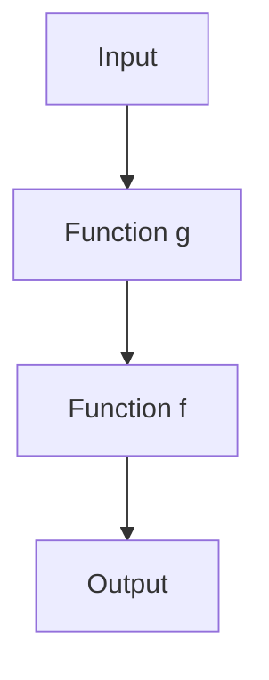

## 9.1 Principles of Functional Programming

Functional Programming (FP) is a programming paradigm that treats computation as the evaluation of mathematical functions and avoids changing state or mutable data. In this section, we will delve into the core principles of functional programming and explore how they can be applied in JavaScript to create cleaner, more predictable, and easier-to-test code.

### Defining Functional Programming

Functional programming is centered around the idea of building software by composing pure functions, avoiding shared state, mutable data, and side-effects. Let's break down some of the key concepts:

- **Pure Functions**: Functions that, given the same input, will always return the same output and do not have any side effects.
- **Immutability**: Data cannot be changed once created. Instead of modifying existing data, new data structures are created.
- **First-Class Functions**: Functions are treated as first-class citizens, meaning they can be assigned to variables, passed as arguments, and returned from other functions.
- **Higher-Order Functions**: Functions that take other functions as arguments or return them as results.

### Benefits of Functional Programming

Functional programming offers several advantages:

- **Ease of Testing**: Pure functions are easier to test because they do not depend on or modify the state outside their scope.
- **Predictability**: Code becomes more predictable as functions do not have side effects.
- **Modularity**: Functions can be composed together, promoting code reuse and modularity.
- **Concurrency**: Immutability makes it easier to write concurrent programs as there is no shared state to manage.

### Pure Functions

Pure functions are the building blocks of functional programming. They have two main characteristics:

1. **Deterministic**: Given the same input, they always produce the same output.
2. **No Side Effects**: They do not modify any external state.

#### Example of a Pure Function

```javascript
// Pure function: add
function add(a, b) {
    return a + b;
}

// Always returns the same result for the same inputs
console.log(add(2, 3)); // 5
console.log(add(2, 3)); // 5
```

In the example above, the `add` function is pure because it consistently returns the same result for the same inputs and does not alter any external state.

### Immutability

Immutability is a core principle in functional programming. Instead of changing existing data structures, new ones are created. This approach helps prevent unintended side effects and makes the code easier to reason about.

#### Example of Immutability

```javascript
// Using Object.freeze to create an immutable object
const person = Object.freeze({
    name: 'Alice',
    age: 30
});

// Attempting to modify the object will not change it
person.age = 31;
console.log(person.age); // 30
```

In this example, the `person` object is immutable. Any attempt to change its properties will not affect the original object.

### First-Class Functions

In JavaScript, functions are first-class citizens. This means they can be stored in variables, passed as arguments to other functions, and returned from functions.

#### Example of First-Class Functions

```javascript
// Assigning a function to a variable
const greet = function(name) {
    return `Hello, ${name}!`;
};

// Passing a function as an argument
function sayHello(greetFunction, name) {
    console.log(greetFunction(name));
}

sayHello(greet, 'Bob'); // Hello, Bob!
```

Here, the `greet` function is assigned to a variable and passed as an argument to another function, demonstrating the concept of first-class functions.

### Higher-Order Functions

Higher-order functions are functions that take other functions as arguments or return them as results. They are a powerful feature in functional programming, enabling function composition and abstraction.

#### Example of Higher-Order Functions

```javascript
// Higher-order function: map
function map(array, transform) {
    const result = [];
    for (let element of array) {
        result.push(transform(element));
    }
    return result;
}

// Using map with a transform function
const numbers = [1, 2, 3, 4];
const doubled = map(numbers, n => n * 2);
console.log(doubled); // [2, 4, 6, 8]
```

In this example, the `map` function is a higher-order function that takes a transformation function as an argument and applies it to each element of an array.

### Contrasting Functional Programming with Other Paradigms

Functional programming differs significantly from imperative and object-oriented paradigms:

- **Imperative Programming**: Focuses on how to perform tasks, using statements that change a program's state. Functional programming, in contrast, focuses on what to solve, using expressions and declarations.
- **Object-Oriented Programming (OOP)**: Centers around objects and encapsulation. While OOP can incorporate functional programming principles, it often involves mutable state and side effects.

### Compatibility with JavaScript Features

JavaScript is a multi-paradigm language, meaning it supports imperative, object-oriented, and functional programming styles. This flexibility allows developers to leverage functional programming principles alongside other paradigms.

#### JavaScript Features Supporting Functional Programming

- **Arrow Functions**: Provide a concise syntax for writing functions.
- **Array Methods**: Such as `map`, `filter`, and `reduce`, which are inherently functional.
- **Promises and Async/Await**: Facilitate handling asynchronous operations in a functional style.

### Code Examples Demonstrating Functional Principles

Let's explore some code examples that demonstrate functional programming principles in JavaScript.

#### Example: Using `map` and `filter`

```javascript
const numbers = [1, 2, 3, 4, 5, 6];

// Using map to transform each element
const squared = numbers.map(n => n * n);
console.log(squared); // [1, 4, 9, 16, 25, 36]

// Using filter to select elements
const even = numbers.filter(n => n % 2 === 0);
console.log(even); // [2, 4, 6]
```

In this example, `map` and `filter` are used to transform and filter an array, respectively, without modifying the original array.

#### Example: Composing Functions

```javascript
// Function composition
const compose = (f, g) => x => f(g(x));

// Functions to compose
const addOne = x => x + 1;
const double = x => x * 2;

// Composing functions
const addOneThenDouble = compose(double, addOne);
console.log(addOneThenDouble(3)); // 8
```

Here, we define a `compose` function that takes two functions and returns a new function that is their composition. This demonstrates how functions can be combined to create new functionality.

### Visualizing Functional Programming Concepts

To better understand the flow of data in functional programming, let's visualize the process of function composition using a diagram.



**Diagram Description**: This diagram illustrates the flow of data through two composed functions, `g` and `f`. The input is first processed by `g`, and its output is then passed to `f`, resulting in the final output.

### Try It Yourself

Experiment with the code examples provided. Try modifying the functions, adding new transformations, or composing additional functions to see how they interact.

### References and Links

- [MDN Web Docs: Functional Programming](https://developer.mozilla.org/en-US/docs/Glossary/Functional_programming)
- [Eloquent JavaScript: Functional Programming](https://eloquentjavascript.net/05_higher_order.html)
- [JavaScript.info: Functional Programming](https://javascript.info/functional-programming)

### Knowledge Check

- What are the key characteristics of pure functions?
- How does immutability contribute to code predictability?
- What is the difference between first-class functions and higher-order functions?
- How can functional programming principles be applied in JavaScript?

### Exercises

1. Write a pure function that calculates the factorial of a number.
2. Create a higher-order function that takes a function and a number, and applies the function to the number twice.
3. Implement a function that uses `reduce` to sum an array of numbers.

### Summary

Functional programming in JavaScript promotes cleaner, more predictable code by leveraging pure functions, immutability, first-class functions, and higher-order functions. By understanding and applying these principles, developers can create modular, testable, and maintainable code.

Remember, this is just the beginning. As you progress, you'll build more complex and interactive web applications. Keep experimenting, stay curious, and enjoy the journey!

## Quiz: Test Your Knowledge on Functional Programming Principles



### What is a pure function?

- [x] A function that always returns the same output for the same input and has no side effects.
- [ ] A function that modifies global variables.
- [ ] A function that can return different outputs for the same input.
- [ ] A function that relies on external state.

> **Explanation:** A pure function consistently returns the same output for the same input and does not modify any external state.

### Which of the following is a benefit of immutability?

- [x] Easier reasoning about code.
- [ ] Increased memory usage.
- [ ] More complex code.
- [ ] Slower execution.

> **Explanation:** Immutability makes code easier to reason about because it prevents unintended side effects.

### What does it mean for functions to be first-class citizens?

- [x] Functions can be assigned to variables, passed as arguments, and returned from other functions.
- [ ] Functions can only be used within classes.
- [ ] Functions cannot be passed as arguments.
- [ ] Functions must always return a value.

> **Explanation:** First-class functions can be treated like any other variable, allowing them to be passed around and manipulated.

### What is a higher-order function?

- [x] A function that takes other functions as arguments or returns them as results.
- [ ] A function that only performs arithmetic operations.
- [ ] A function that cannot return a value.
- [ ] A function that modifies global state.

> **Explanation:** Higher-order functions can take other functions as arguments or return them, enabling powerful abstractions.

### How does functional programming differ from imperative programming?

- [x] Functional programming focuses on what to solve, using expressions and declarations.
- [ ] Functional programming focuses on how to perform tasks, using statements.
- [ ] Functional programming always uses loops.
- [ ] Functional programming relies on mutable state.

> **Explanation:** Functional programming emphasizes what to solve, using expressions and declarations, rather than how to perform tasks.

### Which JavaScript feature supports functional programming?

- [x] Arrow functions.
- [ ] Classes.
- [ ] Global variables.
- [ ] `var` keyword.

> **Explanation:** Arrow functions provide a concise syntax for writing functions, supporting functional programming.

### What is the result of composing two functions?

- [x] A new function that is the combination of the two functions.
- [ ] A function that modifies the input data.
- [ ] A function that cannot be reused.
- [ ] A function that only works with numbers.

> **Explanation:** Composing two functions results in a new function that combines their functionality.

### What is the purpose of the `map` function in JavaScript?

- [x] To transform each element of an array without modifying the original array.
- [ ] To sort an array.
- [ ] To find the maximum value in an array.
- [ ] To remove elements from an array.

> **Explanation:** The `map` function transforms each element of an array, returning a new array without modifying the original.

### What is a common use case for higher-order functions?

- [x] Function composition and abstraction.
- [ ] Modifying global variables.
- [ ] Creating classes.
- [ ] Performing arithmetic operations.

> **Explanation:** Higher-order functions are commonly used for function composition and abstraction, enabling powerful code reuse.

### True or False: Functional programming in JavaScript can be combined with other paradigms.

- [x] True
- [ ] False

> **Explanation:** JavaScript is a multi-paradigm language, allowing functional programming to be combined with other paradigms like imperative and object-oriented programming.


