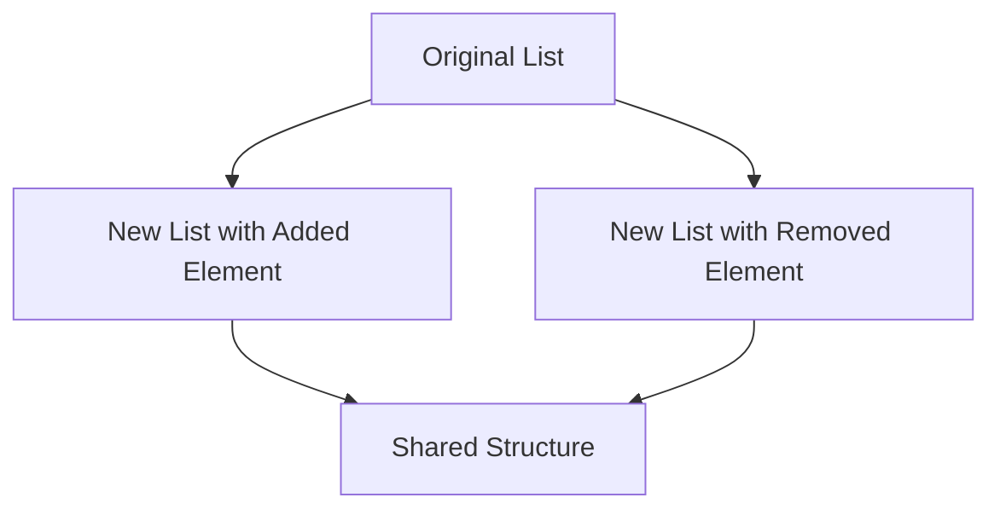

## 9.11 Immutable Data Structures with Immutable.js

In the realm of modern web development, managing state predictably and efficiently is crucial. Immutable data structures play a pivotal role in achieving this goal. In this section, we will delve into the use of [Immutable.js](https://immutable-js.com/), a library designed to enforce immutability in data structures, which is essential for predictable state management. We will explore the problems Immutable.js solves, provide examples of creating and manipulating immutable collections, discuss performance optimizations such as structural sharing, and highlight its integration with frameworks like React and Redux. Additionally, we will address considerations regarding interoperability with native JavaScript objects.

### Introduction to Immutable.js

Immutable.js is a JavaScript library that provides persistent immutable data structures. It allows developers to work with data in a way that prevents accidental mutations, leading to more predictable and bug-free code. Immutable.js offers a variety of data structures, including `List`, `Map`, `Set`, and `Record`, which are designed to be used in a functional programming style.

#### Why Immutability Matters

Immutability is a core concept in functional programming, where data is never modified after it is created. Instead, any changes to data result in the creation of a new data structure. This approach has several benefits:

- **Predictability**: Immutable data structures ensure that data remains consistent throughout the application, reducing the likelihood of unexpected side effects.
- **Performance**: Immutable.js uses structural sharing to optimize performance, allowing for efficient updates and memory usage.
- **Debugging**: With immutable data, tracking changes becomes easier, as the data's history can be preserved and inspected.

### Creating and Manipulating Immutable Collections

Immutable.js provides a rich API for creating and manipulating immutable collections. Let's explore some of the key data structures and operations provided by the library.

#### Immutable Lists

An `Immutable List` is similar to a JavaScript array but immutable. You can create a list using the `List` constructor:

```javascript
import { List } from 'immutable';

// Create an immutable list
const list = List([1, 2, 3]);

// Access elements
console.log(list.get(0)); // Output: 1

// Add elements
const newList = list.push(4);
console.log(newList.toString()); // Output: List [ 1, 2, 3, 4 ]

// Remove elements
const shorterList = newList.pop();
console.log(shorterList.toString()); // Output: List [ 1, 2, 3 ]
```

#### Immutable Maps

An `Immutable Map` is similar to a JavaScript object but immutable. It is used to store key-value pairs:

```javascript
import { Map } from 'immutable';

// Create an immutable map
const map = Map({ a: 1, b: 2, c: 3 });

// Access values
console.log(map.get('a')); // Output: 1

// Set values
const newMap = map.set('d', 4);
console.log(newMap.toString()); // Output: Map { "a": 1, "b": 2, "c": 3, "d": 4 }

// Delete values
const smallerMap = newMap.delete('b');
console.log(smallerMap.toString()); // Output: Map { "a": 1, "c": 3, "d": 4 }
```

#### Immutable Sets

An `Immutable Set` is similar to a JavaScript `Set` but immutable. It is used to store unique values:

```javascript
import { Set } from 'immutable';

// Create an immutable set
const set = Set([1, 2, 3]);

// Add values
const newSet = set.add(4);
console.log(newSet.toString()); // Output: Set { 1, 2, 3, 4 }

// Remove values
const smallerSet = newSet.remove(2);
console.log(smallerSet.toString()); // Output: Set { 1, 3, 4 }
```

### Performance Optimizations: Structural Sharing

One of the key performance optimizations in Immutable.js is structural sharing. This technique allows immutable data structures to share parts of their structure, minimizing memory usage and improving performance. When a new version of a data structure is created, only the parts that have changed are copied, while the rest is shared with the original structure.

#### Visualizing Structural Sharing



*Figure: Structural sharing in Immutable.js allows new lists to share unchanged parts of the structure with the original list.*

### Integration with React and Redux

Immutable.js is particularly useful in conjunction with React and Redux, where state management is a critical aspect of application architecture.

#### Using Immutable.js with React

React's component-based architecture benefits from immutable data structures, as they help ensure that components re-render only when necessary. By using Immutable.js, you can prevent unnecessary updates and improve performance.

```javascript
import React from 'react';
import { List } from 'immutable';

class MyComponent extends React.Component {
  state = {
    items: List([1, 2, 3])
  };

  addItem = () => {
    this.setState(prevState => ({
      items: prevState.items.push(prevState.items.size + 1)
    }));
  };

  render() {
    return (
      <div>
        <ul>
          {this.state.items.map(item => (
            <li key={item}>{item}</li>
          ))}
        </ul>
        <button onClick={this.addItem}>Add Item</button>
      </div>
    );
  }
}

export default MyComponent;
```

#### Using Immutable.js with Redux

Redux, a popular state management library, pairs well with Immutable.js. By using immutable data structures, you can ensure that state updates are predictable and efficient.

```javascript
import { createStore } from 'redux';
import { Map } from 'immutable';

// Initial state
const initialState = Map({
  count: 0
});

// Reducer function
function counterReducer(state = initialState, action) {
  switch (action.type) {
    case 'INCREMENT':
      return state.update('count', count => count + 1);
    case 'DECREMENT':
      return state.update('count', count => count - 1);
    default:
      return state;
  }
}

// Create Redux store
const store = createStore(counterReducer);

// Dispatch actions
store.dispatch({ type: 'INCREMENT' });
console.log(store.getState().toString()); // Output: Map { "count": 1 }
```

### Interoperability with Native JavaScript Objects

While Immutable.js provides powerful tools for managing immutable data, there are considerations when working with native JavaScript objects. Immutable.js data structures are not directly compatible with native objects, so you may need to convert between them when interacting with APIs or libraries that expect native data types.

#### Converting Between Immutable and Native Data Structures

Immutable.js provides methods to convert between immutable and native data structures:

```javascript
import { List } from 'immutable';

// Convert immutable list to native array
const immutableList = List([1, 2, 3]);
const nativeArray = immutableList.toArray();
console.log(nativeArray); // Output: [1, 2, 3]

// Convert native array to immutable list
const newImmutableList = List(nativeArray);
console.log(newImmutableList.toString()); // Output: List [ 1, 2, 3 ]
```

### Considerations and Best Practices

When using Immutable.js, consider the following best practices:

- **Use Immutable.js consistently**: Mixing immutable and mutable data structures can lead to confusion and bugs. Use Immutable.js consistently throughout your application.
- **Be mindful of performance**: While Immutable.js is optimized for performance, large data structures can still impact performance. Use profiling tools to identify bottlenecks.
- **Understand the API**: Immutable.js provides a rich API with many methods for manipulating data. Familiarize yourself with the API to take full advantage of its capabilities.

### Try It Yourself

To deepen your understanding of Immutable.js, try modifying the code examples provided. Experiment with different data structures and operations to see how they behave. Consider integrating Immutable.js into a small React or Redux project to experience its benefits firsthand.

### Knowledge Check

To reinforce your understanding of Immutable.js, consider the following questions:

- What are the benefits of using immutable data structures in JavaScript applications?
- How does structural sharing optimize performance in Immutable.js?
- How can Immutable.js be integrated with React and Redux for state management?
- What are the considerations when converting between Immutable.js data structures and native JavaScript objects?

### Conclusion

Immutable.js is a powerful tool for managing immutable data structures in JavaScript applications. By enforcing immutability, it helps ensure predictable state management, improves performance through structural sharing, and integrates seamlessly with frameworks like React and Redux. As you continue your journey in modern web development, consider incorporating Immutable.js into your projects to take advantage of its benefits.

## Quiz: Mastering Immutable Data Structures with Immutable.js



### What is the primary benefit of using immutable data structures?

- [x] Predictable state management
- [ ] Faster data processing
- [ ] Easier syntax
- [ ] Reduced code complexity

> **Explanation:** Immutable data structures ensure that data remains consistent throughout the application, reducing the likelihood of unexpected side effects.

### Which Immutable.js data structure is similar to a JavaScript array?

- [x] List
- [ ] Map
- [ ] Set
- [ ] Record

> **Explanation:** An `Immutable List` is similar to a JavaScript array but immutable.

### How does Immutable.js optimize performance?

- [x] Structural sharing
- [ ] Faster algorithms
- [ ] Smaller data sizes
- [ ] Parallel processing

> **Explanation:** Immutable.js uses structural sharing to optimize performance, allowing for efficient updates and memory usage.

### What is a key consideration when using Immutable.js with native JavaScript objects?

- [x] Conversion between data structures
- [ ] Increased memory usage
- [ ] Slower performance
- [ ] Incompatibility with all browsers

> **Explanation:** Immutable.js data structures are not directly compatible with native objects, so conversion may be necessary.

### How can Immutable.js be integrated with React?

- [x] By using immutable data structures to prevent unnecessary updates
- [ ] By replacing React's state management
- [ ] By using it as a styling library
- [ ] By optimizing network requests

> **Explanation:** Immutable.js helps ensure that components re-render only when necessary, improving performance.

### Which method converts an immutable list to a native array?

- [x] toArray()
- [ ] fromArray()
- [ ] convertToNative()
- [ ] listToArray()

> **Explanation:** The `toArray()` method converts an immutable list to a native array.

### What is the purpose of structural sharing in Immutable.js?

- [x] To minimize memory usage and improve performance
- [ ] To simplify the API
- [ ] To enhance security
- [ ] To support more data types

> **Explanation:** Structural sharing allows immutable data structures to share parts of their structure, minimizing memory usage and improving performance.

### What is a common use case for Immutable.js in Redux?

- [x] Ensuring predictable state updates
- [ ] Enhancing UI components
- [ ] Managing network requests
- [ ] Styling components

> **Explanation:** By using immutable data structures, you can ensure that state updates in Redux are predictable and efficient.

### What is a potential drawback of using Immutable.js?

- [x] Interoperability with native JavaScript objects
- [ ] Increased code complexity
- [ ] Reduced performance
- [ ] Limited browser support

> **Explanation:** Immutable.js data structures are not directly compatible with native objects, so conversion may be necessary.

### True or False: Immutable.js can be used to create mutable data structures.

- [ ] True
- [x] False

> **Explanation:** Immutable.js is specifically designed to create immutable data structures.



Remember, this is just the beginning. As you progress, you'll build more complex and interactive web applications. Keep experimenting, stay curious, and enjoy the journey!
