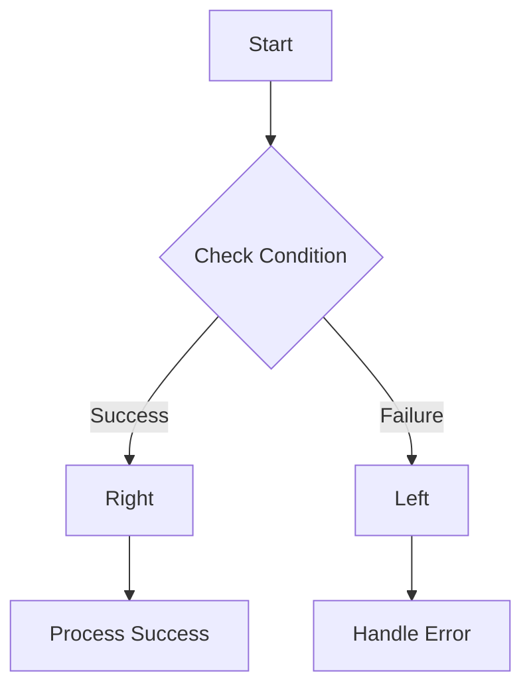
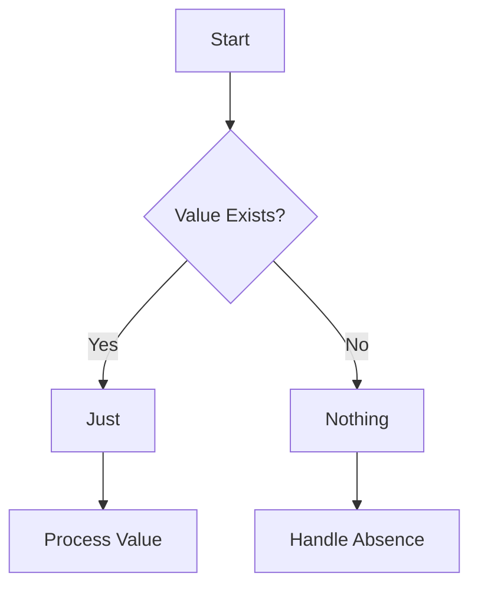

## 9.12 Functional Error Handling with Either and Maybe

In the realm of functional programming, handling errors gracefully is a fundamental aspect that enhances code reliability and robustness. In JavaScript, the Either and Maybe (also known as Option) monads provide a structured way to manage computations that may fail, without resorting to exceptions. This approach not only makes error handling more explicit but also leads to safer and more maintainable code.

### Understanding Either and Maybe Monads

#### What are Monads?

Monads are a design pattern used in functional programming to handle side effects, such as error handling, in a pure functional way. They encapsulate values and provide a way to chain operations on these values.

#### The Either Monad

The Either monad is a functional construct that represents a value of one of two possible types. It is typically used to handle computations that can result in either a success or a failure. The two types are conventionally called `Right` (for success) and `Left` (for failure).

- **Right**: Represents a successful computation.
- **Left**: Represents a failed computation.

#### The Maybe Monad

The Maybe monad, also known as the Option type, is used to represent optional values. It can either hold a value (`Just`) or no value (`Nothing`), thus eliminating the need for null checks.

- **Just**: Represents a value.
- **Nothing**: Represents the absence of a value.

### Constructing and Using Either and Maybe

Let's delve into how we can construct and use these monads in JavaScript to handle success and failure cases effectively.

#### Constructing Either

To construct an Either monad, we can use a simple factory function:

```javascript
// Either Monad
const Either = {
  Right: (value) => ({
    map: (fn) => Either.Right(fn(value)),
    fold: (f, g) => g(value),
    inspect: () => `Right(${value})`
  }),
  Left: (value) => ({
    map: (fn) => Either.Left(value),
    fold: (f, g) => f(value),
    inspect: () => `Left(${value})`
  })
};

// Example usage
const divide = (num, denom) => denom === 0 ? Either.Left('Division by zero') : Either.Right(num / denom);

const result = divide(10, 2)
  .map(x => x + 1)
  .fold(
    error => `Error: ${error}`,
    value => `Success: ${value}`
  );

console.log(result); // Output: Success: 6
```

In this example, the `divide` function returns an `Either` monad. If the division is successful, it returns a `Right` with the result; otherwise, it returns a `Left` with an error message.

#### Constructing Maybe

The Maybe monad can be constructed similarly:

```javascript
// Maybe Monad
const Maybe = {
  Just: (value) => ({
    map: (fn) => Maybe.Just(fn(value)),
    fold: (f, g) => g(value),
    inspect: () => `Just(${value})`
  }),
  Nothing: () => ({
    map: (fn) => Maybe.Nothing(),
    fold: (f, g) => f(),
    inspect: () => 'Nothing'
  })
};

// Example usage
const findUser = (id) => id === 1 ? Maybe.Just({ id: 1, name: 'Alice' }) : Maybe.Nothing();

const user = findUser(1)
  .map(user => user.name)
  .fold(
    () => 'User not found',
    name => `User found: ${name}`
  );

console.log(user); // Output: User found: Alice
```

Here, the `findUser` function returns a `Maybe` monad. If the user is found, it returns a `Just` with the user object; otherwise, it returns `Nothing`.

### Benefits of Explicit Error Handling

Using Either and Maybe monads for error handling offers several advantages:

1. **Explicitness**: Errors are handled explicitly, making the code easier to understand and maintain.
2. **No Null Checks**: Eliminates the need for null checks, reducing the risk of null pointer exceptions.
3. **Chainable Operations**: Allows chaining of operations, making the code more concise and expressive.
4. **Separation of Concerns**: Separates error handling logic from the main business logic, leading to cleaner code.

### Safer and More Robust Code

By adopting Either and Maybe monads, we can write safer and more robust JavaScript code. These constructs encourage developers to think about potential failure cases upfront and handle them gracefully.

### Libraries for Either and Maybe

Several libraries provide implementations of Either and Maybe monads in JavaScript. One such library is [Folktale](https://folktale.origamitower.com/), which offers a comprehensive set of functional programming tools.

#### Using Folktale

Here's how you can use Folktale to work with Either and Maybe:

```javascript
const { either, maybe } = require('folktale');

// Either Example
const divide = (num, denom) => denom === 0 ? either.Left('Division by zero') : either.Right(num / denom);

const result = divide(10, 2)
  .map(x => x + 1)
  .matchWith({
    Left: ({ value }) => `Error: ${value}`,
    Right: ({ value }) => `Success: ${value}`
  });

console.log(result); // Output: Success: 6

// Maybe Example
const findUser = (id) => id === 1 ? maybe.Just({ id: 1, name: 'Alice' }) : maybe.Nothing();

const user = findUser(1)
  .map(user => user.name)
  .matchWith({
    Nothing: () => 'User not found',
    Just: ({ value }) => `User found: ${value}`
  });

console.log(user); // Output: User found: Alice
```

### Visualizing Either and Maybe

To better understand how Either and Maybe work, let's visualize their flow using Mermaid.js diagrams.

#### Either Monad Flow



**Caption**: This diagram illustrates the flow of the Either monad, where a condition is checked, leading to either a `Right` (success) or `Left` (failure) path.

#### Maybe Monad Flow



**Caption**: This diagram shows the flow of the Maybe monad, where the existence of a value determines whether the path leads to `Just` or `Nothing`.

### Try It Yourself

To deepen your understanding, try modifying the code examples:

- Change the conditions in the `divide` and `findUser` functions to see how the monads handle different scenarios.
- Add more operations to the chain and observe how the monads propagate success or failure.

### Knowledge Check

- What are the main differences between Either and Maybe monads?
- How do Either and Maybe monads improve error handling in JavaScript?
- What are the benefits of using libraries like Folktale for functional programming in JavaScript?

### Key Takeaways

- Either and Maybe monads provide a structured way to handle errors and optional values in JavaScript.
- These monads make error handling explicit and eliminate the need for null checks.
- Using Either and Maybe leads to safer, more robust, and maintainable code.
- Libraries like Folktale offer ready-to-use implementations of these monads.

### Embrace the Journey

Remember, mastering functional error handling with Either and Maybe is just the beginning. As you continue to explore functional programming in JavaScript, you'll discover more powerful techniques to write clean, efficient, and reliable code. Keep experimenting, stay curious, and enjoy the journey!

## Quiz: Mastering Functional Error Handling with Either and Maybe



### What is the primary purpose of the Either monad?

- [x] To handle computations that may result in success or failure
- [ ] To represent optional values
- [ ] To encapsulate asynchronous operations
- [ ] To manage stateful computations

> **Explanation:** The Either monad is used to handle computations that can result in either a success (Right) or a failure (Left).

### Which of the following represents a successful computation in the Either monad?

- [ ] Left
- [x] Right
- [ ] Just
- [ ] Nothing

> **Explanation:** In the Either monad, a successful computation is represented by Right.

### What does the Maybe monad eliminate the need for?

- [ ] Error handling
- [x] Null checks
- [ ] State management
- [ ] Asynchronous handling

> **Explanation:** The Maybe monad eliminates the need for null checks by representing optional values as Just or Nothing.

### Which library provides implementations of Either and Maybe monads in JavaScript?

- [ ] Lodash
- [ ] Axios
- [x] Folktale
- [ ] Express

> **Explanation:** Folktale is a library that provides implementations of functional programming constructs, including Either and Maybe monads.

### What is the result of `Either.Left` in the fold operation?

- [x] The error handling function is executed
- [ ] The success handling function is executed
- [ ] The computation is retried
- [ ] The operation is aborted

> **Explanation:** In the fold operation, if the Either is Left, the error handling function is executed.

### What does the `map` function do in the context of Either and Maybe monads?

- [x] Applies a function to the value inside the monad
- [ ] Executes a side effect
- [ ] Converts the monad to a promise
- [ ] Logs the value to the console

> **Explanation:** The `map` function applies a given function to the value inside the monad, transforming it.

### How does the Maybe monad represent the absence of a value?

- [ ] Right
- [ ] Left
- [ ] Just
- [x] Nothing

> **Explanation:** The Maybe monad represents the absence of a value with Nothing.

### What is the benefit of using monads for error handling?

- [x] They make error handling explicit and chainable
- [ ] They eliminate the need for error handling
- [ ] They automatically retry failed operations
- [ ] They provide built-in logging

> **Explanation:** Monads make error handling explicit and allow chaining of operations, leading to cleaner code.

### Which of the following is NOT a benefit of using Either and Maybe monads?

- [ ] Explicit error handling
- [ ] Elimination of null checks
- [ ] Chainable operations
- [x] Automatic error correction

> **Explanation:** While Either and Maybe monads provide explicit error handling and eliminate null checks, they do not automatically correct errors.

### True or False: The Either monad can only represent errors.

- [ ] True
- [x] False

> **Explanation:** The Either monad can represent both success (Right) and failure (Left) cases.


