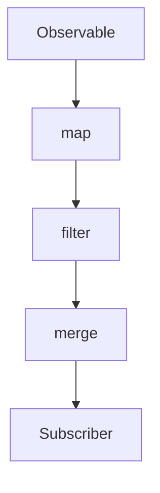

## 9.13 Functional Reactive Programming

Functional Reactive Programming (FRP) is a powerful paradigm that combines the principles of functional programming with reactive programming to handle asynchronous data streams in a declarative manner. In this section, we will delve into the core concepts of FRP, explore how it differs from traditional reactive programming, and demonstrate its application using RxJS, a popular library for reactive programming in JavaScript.

### Understanding Functional Reactive Programming

Functional Reactive Programming is a programming paradigm that focuses on the flow of data and the propagation of changes. It treats data as streams that can be manipulated using functional programming techniques. This approach allows developers to write code that is more declarative, composable, and easier to reason about, especially when dealing with asynchronous operations.

#### Principles of FRP

1. **Declarative Data Flow**: In FRP, you describe what data streams should do, rather than how to do it. This leads to more readable and maintainable code.
2. **Composability**: FRP promotes the composition of small, reusable functions to build complex data transformations and event handling logic.
3. **Asynchronous Data Streams**: FRP treats asynchronous events as first-class citizens, allowing you to work with them as easily as synchronous data.
4. **Time-Varying Values**: FRP models values that change over time, enabling you to react to changes in data streams seamlessly.

### Differences from Traditional Reactive Programming

While both FRP and traditional reactive programming deal with data streams and event handling, FRP emphasizes the use of functional programming techniques to transform and combine streams. Traditional reactive programming often focuses on the observer pattern and event-driven architectures, whereas FRP provides a more structured and declarative approach to managing data flow.

### RxJS: A Library for Functional Reactive Programming

RxJS (Reactive Extensions for JavaScript) is a library that enables functional reactive programming in JavaScript. It provides a rich set of operators to create, transform, and compose asynchronous data streams. Let's explore some key concepts and examples using RxJS.

#### Creating Observables

In RxJS, an observable represents a data stream that can emit values over time. You can create observables from various sources, such as events, promises, or even arrays.

```javascript
import { fromEvent } from 'rxjs';

// Create an observable from a DOM event
const clicks = fromEvent(document, 'click');

// Subscribe to the observable to react to click events
clicks.subscribe(event => console.log('Clicked:', event));
```

#### Transforming Data Streams

RxJS provides operators to transform data streams. For example, you can use the `map` operator to apply a function to each emitted value.

```javascript
import { from } from 'rxjs';
import { map } from 'rxjs/operators';

// Create an observable from an array
const numbers = from([1, 2, 3, 4, 5]);

// Transform the data stream by multiplying each number by 2
const doubled = numbers.pipe(
  map(value => value * 2)
);

// Subscribe to the transformed observable
doubled.subscribe(value => console.log('Doubled:', value));
```

#### Composing Streams

One of the strengths of FRP is the ability to compose multiple streams. You can combine streams using operators like `merge`, `concat`, and `combineLatest`.

```javascript
import { interval } from 'rxjs';
import { take, merge } from 'rxjs/operators';

// Create two observables that emit values at different intervals
const fast = interval(500).pipe(take(5));
const slow = interval(1000).pipe(take(3));

// Merge the two streams into a single stream
const merged = fast.pipe(
  merge(slow)
);

// Subscribe to the merged stream
merged.subscribe(value => console.log('Merged:', value));
```

### Use Cases for Functional Reactive Programming

Functional Reactive Programming is particularly useful in scenarios that involve real-time data processing and complex event handling. Here are some common use cases:

1. **Real-Time Data Processing**: FRP is ideal for applications that require real-time updates, such as live data feeds, stock tickers, and chat applications.
2. **Complex Event Handling**: FRP simplifies the management of complex event-driven logic, making it easier to handle user interactions, animations, and other asynchronous events.
3. **Data Transformation Pipelines**: FRP allows you to build data transformation pipelines that can process and transform data streams efficiently.

### Benefits of Composability and Declarative Data Flow

FRP offers several benefits that make it an attractive choice for modern web development:

- **Improved Readability**: The declarative nature of FRP makes code easier to read and understand, reducing the cognitive load on developers.
- **Enhanced Maintainability**: By promoting the use of small, composable functions, FRP encourages code reuse and simplifies maintenance.
- **Simplified Asynchronous Programming**: FRP abstracts away the complexities of asynchronous programming, allowing you to focus on the logic of your application.

### Visualizing Functional Reactive Programming

To better understand how FRP works, let's visualize the flow of data streams and the application of operators using a Mermaid.js diagram.



**Diagram Description**: This diagram illustrates a simple FRP pipeline where an observable emits data, which is then transformed using a `map` operator, filtered using a `filter` operator, merged with another stream, and finally consumed by a subscriber.

### Try It Yourself

To get hands-on experience with Functional Reactive Programming, try modifying the code examples provided. Experiment with different operators, create your own observables, and see how they interact. Here are some suggestions:

- Create an observable that emits values from a form input field and transforms them into uppercase.
- Combine multiple observables to handle different types of user interactions, such as clicks and key presses.
- Implement a simple real-time chat application using RxJS to manage incoming and outgoing messages.

### References and Further Reading

- [RxJS Documentation](https://rxjs.dev/): Official documentation for RxJS, including guides and API references.
- [MDN Web Docs: Asynchronous Programming](https://developer.mozilla.org/en-US/docs/Learn/JavaScript/Asynchronous): A comprehensive guide to asynchronous programming in JavaScript.
- [ReactiveX](http://reactivex.io/): A website dedicated to reactive programming, providing resources and documentation for various languages.

### Knowledge Check

To reinforce your understanding of Functional Reactive Programming, try answering the following questions and challenges.

## Mastering Functional Reactive Programming in JavaScript



### What is Functional Reactive Programming (FRP)?

- [x] A paradigm combining functional and reactive programming to handle asynchronous data streams.
- [ ] A programming language for building web applications.
- [ ] A database management system.
- [ ] A design pattern for object-oriented programming.

> **Explanation:** FRP is a paradigm that combines functional and reactive programming principles to manage asynchronous data streams effectively.

### Which library is commonly used for Functional Reactive Programming in JavaScript?

- [x] RxJS
- [ ] jQuery
- [ ] Lodash
- [ ] Angular

> **Explanation:** RxJS is a popular library for implementing Functional Reactive Programming in JavaScript.

### What is the primary benefit of using FRP?

- [x] Declarative data flow and composability.
- [ ] Faster execution of synchronous code.
- [ ] Simplified database queries.
- [ ] Enhanced security features.

> **Explanation:** FRP provides a declarative approach to data flow and promotes composability, making code more readable and maintainable.

### How does FRP differ from traditional reactive programming?

- [x] FRP emphasizes functional programming techniques for transforming and combining streams.
- [ ] FRP focuses solely on the observer pattern.
- [ ] FRP is used only for synchronous programming.
- [ ] FRP does not support event handling.

> **Explanation:** FRP uses functional programming techniques to transform and combine streams, providing a more structured approach than traditional reactive programming.

### Which operator is used to transform data streams in RxJS?

- [x] map
- [ ] filter
- [ ] reduce
- [ ] concat

> **Explanation:** The `map` operator is used to apply a function to each emitted value in a data stream.

### What is an observable in RxJS?

- [x] A data stream that can emit values over time.
- [ ] A function that returns a promise.
- [ ] A method for querying databases.
- [ ] A design pattern for object creation.

> **Explanation:** An observable in RxJS represents a data stream that can emit values over time, allowing you to react to changes.

### Which operator combines multiple streams into a single stream?

- [x] merge
- [ ] map
- [ ] filter
- [ ] take

> **Explanation:** The `merge` operator combines multiple streams into a single stream, allowing you to handle multiple data sources.

### What is a common use case for Functional Reactive Programming?

- [x] Real-time data processing.
- [ ] Static website generation.
- [ ] Database indexing.
- [ ] File compression.

> **Explanation:** FRP is well-suited for real-time data processing, such as live data feeds and chat applications.

### True or False: FRP treats asynchronous events as first-class citizens.

- [x] True
- [ ] False

> **Explanation:** FRP treats asynchronous events as first-class citizens, allowing you to work with them as easily as synchronous data.

### What is the purpose of the `fromEvent` function in RxJS?

- [x] To create an observable from a DOM event.
- [ ] To transform data streams.
- [ ] To combine multiple observables.
- [ ] To handle errors in data streams.

> **Explanation:** The `fromEvent` function creates an observable from a DOM event, enabling you to react to user interactions.



Remember, mastering Functional Reactive Programming is a journey. As you continue to explore and experiment with FRP, you'll discover new ways to harness the power of asynchronous data streams in your applications. Keep experimenting, stay curious, and enjoy the journey!
