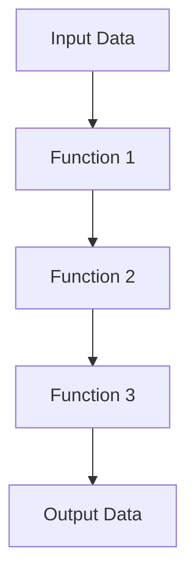

## 9.14 Using Ramda and Lodash/fp

Functional programming (FP) has gained significant traction in the JavaScript community, offering a paradigm that emphasizes immutability, first-class functions, and declarative code. Libraries like [Ramda](https://ramdajs.com/) and [Lodash/fp](https://github.com/lodash/lodash/wiki/FP-Guide) have emerged to facilitate FP in JavaScript, providing tools that enhance code expressiveness and conciseness. In this section, we will explore how these libraries empower developers to write cleaner, more maintainable code by leveraging functional programming techniques.

### Introduction to Ramda and Lodash/fp

Ramda and Lodash/fp are JavaScript libraries designed to make functional programming more accessible and practical. They provide a suite of utilities that allow developers to manipulate data structures, perform transformations, and compose functions in a functional style.

#### Ramda

Ramda is a library specifically designed for functional programming. It emphasizes immutability and pure functions, allowing developers to write code that is both predictable and easy to test. Ramda's API is designed to be curried by default, enabling partial application of functions without additional effort.

#### Lodash/fp

Lodash/fp is a functional programming variant of the popular Lodash library. It provides a similar set of utilities as Lodash but with a functional twist. Lodash/fp functions are automatically curried and follow a data-last argument order, making them more suitable for functional composition.

### Key Concepts in Functional Programming

Before diving into the specifics of Ramda and Lodash/fp, let's review some key concepts in functional programming that these libraries leverage:

- **Immutability**: Data structures are not modified after creation. Instead, new data structures are created with the desired changes.
- **Currying**: The process of transforming a function with multiple arguments into a sequence of functions each taking a single argument.
- **Function Composition**: Combining simple functions to build more complex ones, allowing for modular and reusable code.

### Common Functional Operations

Both Ramda and Lodash/fp provide a rich set of functions for common functional operations. Let's explore some of these operations with examples.

#### Currying

Currying is a fundamental concept in functional programming, allowing functions to be partially applied. Both Ramda and Lodash/fp support currying out of the box.

**Example with Ramda:**

```javascript
const R = require('ramda');

const add = R.add(5); // Partially apply the 'add' function
console.log(add(3)); // Outputs: 8
```

**Example with Lodash/fp:**

```javascript
const _ = require('lodash/fp');

const add = _.add(5); // Partially apply the 'add' function
console.log(add(3)); // Outputs: 8
```

#### Function Composition

Function composition allows developers to build complex operations by combining simple functions. This leads to more readable and maintainable code.

**Example with Ramda:**

```javascript
const R = require('ramda');

const double = x => x * 2;
const increment = x => x + 1;

const doubleThenIncrement = R.compose(increment, double);
console.log(doubleThenIncrement(3)); // Outputs: 7
```

**Example with Lodash/fp:**

```javascript
const _ = require('lodash/fp');

const double = x => x * 2;
const increment = x => x + 1;

const doubleThenIncrement = _.flow(double, increment);
console.log(doubleThenIncrement(3)); // Outputs: 7
```

#### Immutability

Both libraries encourage immutability by providing functions that do not mutate the original data.

**Example with Ramda:**

```javascript
const R = require('ramda');

const numbers = [1, 2, 3];
const newNumbers = R.append(4, numbers);

console.log(numbers); // Outputs: [1, 2, 3]
console.log(newNumbers); // Outputs: [1, 2, 3, 4]
```

**Example with Lodash/fp:**

```javascript
const _ = require('lodash/fp');

const numbers = [1, 2, 3];
const newNumbers = _.concat(numbers, [4]);

console.log(numbers); // Outputs: [1, 2, 3]
console.log(newNumbers); // Outputs: [1, 2, 3, 4]
```

### Differences from Standard Lodash

While Lodash/fp is derived from Lodash, there are key differences in API design that make it more suitable for functional programming:

- **Data-Last Argument Order**: Functions in Lodash/fp take the data as the last argument, facilitating function composition.
- **Automatic Currying**: Functions are curried by default, allowing partial application without additional effort.
- **Immutable Operations**: Functions do not mutate the input data, aligning with functional programming principles.

### Enhancing Code Expressiveness and Conciseness

Using Ramda and Lodash/fp can significantly enhance the expressiveness and conciseness of your code. By leveraging functional programming techniques, you can write code that is more declarative and easier to reason about.

#### Scenario: Data Transformation

Consider a scenario where you need to transform an array of objects by filtering, mapping, and reducing the data. Using Ramda or Lodash/fp, you can achieve this in a concise and readable manner.

**Example with Ramda:**

```javascript
const R = require('ramda');

const data = [
  { name: 'Alice', age: 25 },
  { name: 'Bob', age: 30 },
  { name: 'Charlie', age: 35 }
];

const getNamesOfAdults = R.pipe(
  R.filter(person => person.age >= 30),
  R.map(R.prop('name'))
);

console.log(getNamesOfAdults(data)); // Outputs: ['Bob', 'Charlie']
```

**Example with Lodash/fp:**

```javascript
const _ = require('lodash/fp');

const data = [
  { name: 'Alice', age: 25 },
  { name: 'Bob', age: 30 },
  { name: 'Charlie', age: 35 }
];

const getNamesOfAdults = _.flow(
  _.filter(person => person.age >= 30),
  _.map(_.get('name'))
);

console.log(getNamesOfAdults(data)); // Outputs: ['Bob', 'Charlie']
```

### Visualizing Function Composition

To better understand function composition, let's visualize how functions are combined to create a new function.



In this diagram, each function takes the output of the previous function as its input, demonstrating the flow of data through a composed function.

### When to Use Ramda and Lodash/fp

These libraries are particularly useful in scenarios where:

- You need to perform complex data transformations.
- You want to write more declarative and readable code.
- You aim to reduce side effects and enhance code predictability.
- You require a functional approach to handle asynchronous operations.

### Try It Yourself

To get hands-on experience with Ramda and Lodash/fp, try modifying the code examples provided. Experiment with different functions and compositions to see how they affect the output. Consider creating your own utility functions using these libraries to solve real-world problems.

### Knowledge Check

- What is currying, and how do Ramda and Lodash/fp support it?
- How does function composition enhance code readability and maintainability?
- What are the key differences between Lodash and Lodash/fp?
- How do Ramda and Lodash/fp encourage immutability in JavaScript?
- In what scenarios would you choose to use Ramda or Lodash/fp?

### Summary

In this section, we've explored how Ramda and Lodash/fp facilitate functional programming in JavaScript. By leveraging concepts like currying, function composition, and immutability, these libraries enable developers to write more expressive and concise code. As you continue your journey in mastering JavaScript design patterns, consider incorporating these tools to enhance your functional programming skills.

Remember, this is just the beginning. As you progress, you'll build more complex and interactive applications. Keep experimenting, stay curious, and enjoy the journey!

## Mastering Functional Programming with Ramda and Lodash/fp



### What is currying in functional programming?

- [x] Transforming a function with multiple arguments into a sequence of functions each taking a single argument.
- [ ] Combining multiple functions into a single function.
- [ ] Modifying data structures without changing the original.
- [ ] Executing functions in parallel.

> **Explanation:** Currying is the process of transforming a function with multiple arguments into a sequence of functions each taking a single argument, allowing for partial application.

### How does function composition enhance code readability?

- [x] By combining simple functions to build more complex ones.
- [ ] By reducing the number of lines of code.
- [ ] By using more complex syntax.
- [ ] By increasing the number of functions used.

> **Explanation:** Function composition enhances code readability by combining simple functions to build more complex ones, making the code more modular and easier to understand.

### What is a key difference between Lodash and Lodash/fp?

- [x] Lodash/fp functions are curried by default.
- [ ] Lodash/fp uses a data-first argument order.
- [ ] Lodash/fp mutates the input data.
- [ ] Lodash/fp is not suitable for functional programming.

> **Explanation:** Lodash/fp functions are curried by default and follow a data-last argument order, making them more suitable for functional programming.

### How do Ramda and Lodash/fp encourage immutability?

- [x] By providing functions that do not mutate the original data.
- [ ] By allowing direct modification of data structures.
- [ ] By using mutable data structures.
- [ ] By requiring manual copying of data.

> **Explanation:** Ramda and Lodash/fp encourage immutability by providing functions that do not mutate the original data, aligning with functional programming principles.

### In what scenarios would you choose to use Ramda or Lodash/fp?

- [x] When performing complex data transformations.
- [x] When writing declarative and readable code.
- [ ] When needing to mutate data structures.
- [ ] When avoiding functional programming techniques.

> **Explanation:** Ramda and Lodash/fp are useful when performing complex data transformations and writing declarative and readable code, leveraging functional programming techniques.

### What is the benefit of using a data-last argument order in Lodash/fp?

- [x] It facilitates function composition.
- [ ] It makes the code less readable.
- [ ] It requires more arguments.
- [ ] It is not beneficial.

> **Explanation:** A data-last argument order facilitates function composition, allowing functions to be easily combined and reused.

### How can you achieve immutability with Ramda?

- [x] By using functions like `R.append` that do not mutate the original data.
- [ ] By directly modifying arrays and objects.
- [ ] By using mutable data structures.
- [ ] By avoiding functional programming.

> **Explanation:** Ramda provides functions like `R.append` that do not mutate the original data, promoting immutability.

### What is the purpose of function composition in functional programming?

- [x] To build complex operations by combining simple functions.
- [ ] To execute functions in parallel.
- [ ] To reduce the number of functions used.
- [ ] To increase code complexity.

> **Explanation:** Function composition allows developers to build complex operations by combining simple functions, leading to more modular and reusable code.

### How does Lodash/fp handle argument order differently from standard Lodash?

- [x] Lodash/fp uses a data-last argument order.
- [ ] Lodash/fp uses a data-first argument order.
- [ ] Lodash/fp does not handle arguments.
- [ ] Lodash/fp requires manual argument ordering.

> **Explanation:** Lodash/fp uses a data-last argument order, which is more suitable for functional programming and function composition.

### True or False: Ramda and Lodash/fp are designed to mutate data structures.

- [ ] True
- [x] False

> **Explanation:** False. Ramda and Lodash/fp are designed to promote immutability and do not mutate data structures.




