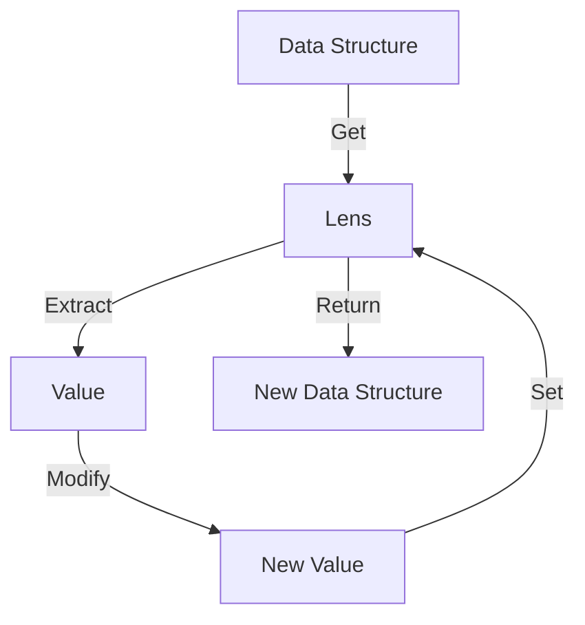

## 9.15 The Lens Pattern for Data Manipulation

### Introduction to the Lens Pattern

In the realm of functional programming, managing immutable data structures efficiently is a common challenge. The Lens Pattern emerges as a powerful solution for accessing and modifying nested data structures immutably. Lenses provide a clean and concise way to focus on specific parts of a data structure, allowing for both retrieval and update operations without mutating the original data.

### What Are Lenses?

Lenses are composable functions that enable you to focus on a particular part of a data structure. They consist of two main operations:

1. **Getter**: Extracts a value from a data structure.
2. **Setter**: Returns a new data structure with a modified value at a specific location.

By combining these operations, lenses allow you to work with deeply nested data structures in a functional and immutable manner.

### How Lenses Work

Lenses are typically represented as a pair of functions: one for getting a value and another for setting a value. Let's break down the concept with a simple example:

```javascript
// A basic lens implementation
const lens = (getter, setter) => ({
  get: (obj) => getter(obj),
  set: (val, obj) => setter(val, obj),
});

// Example usage
const nameLens = lens(
  (person) => person.name,
  (newName, person) => ({ ...person, name: newName })
);

const person = { name: "Alice", age: 30 };

// Using the lens to get the name
console.log(nameLens.get(person)); // Output: Alice

// Using the lens to set a new name
const updatedPerson = nameLens.set("Bob", person);
console.log(updatedPerson); // Output: { name: "Bob", age: 30 }
```

### Creating and Using Lenses

#### Step-by-Step Lens Creation

1. **Define the Getter**: Create a function that extracts the desired value from the data structure.
2. **Define the Setter**: Create a function that returns a new data structure with the updated value.
3. **Compose the Lens**: Combine the getter and setter into a lens object.

#### Example: Nested Data Structures

Consider a more complex data structure, such as a nested object representing a user profile:

```javascript
const userProfile = {
  user: {
    name: "Alice",
    address: {
      city: "Wonderland",
      zip: "12345"
    }
  }
};

// Lens for accessing the city
const cityLens = lens(
  (profile) => profile.user.address.city,
  (newCity, profile) => ({
    ...profile,
    user: {
      ...profile.user,
      address: {
        ...profile.user.address,
        city: newCity
      }
    }
  })
);

// Get the city
console.log(cityLens.get(userProfile)); // Output: Wonderland

// Set a new city
const updatedProfile = cityLens.set("New Wonderland", userProfile);
console.log(updatedProfile.user.address.city); // Output: New Wonderland
```

### Benefits of Using Lenses

#### Immutability

Lenses promote immutability by ensuring that data structures are not modified in place. Instead, they return new versions of the data structure with the desired changes. This approach aligns with functional programming principles and helps prevent side effects.

#### Conciseness and Readability

Lenses reduce the verbosity of code when dealing with deeply nested structures. They encapsulate the logic for accessing and updating data, making the code more readable and maintainable.

#### Composability

Lenses can be composed to create more complex lenses. This composability allows you to build lenses for deeply nested structures by combining simpler lenses.

### Libraries Implementing Lenses

Several libraries in the JavaScript ecosystem provide robust implementations of lenses. One of the most popular is **Ramda**, a functional programming library that offers a comprehensive set of tools for working with lenses.

#### Using Ramda for Lenses

Ramda provides a `lens` function along with `lensProp` and `lensPath` for creating lenses easily. Here's how you can use Ramda to work with lenses:

```javascript
const R = require('ramda');

// Create a lens for a property
const nameLens = R.lensProp('name');

// Get the name
console.log(R.view(nameLens, person)); // Output: Alice

// Set a new name
const updatedPerson = R.set(nameLens, 'Bob', person);
console.log(updatedPerson); // Output: { name: 'Bob', age: 30 }

// Create a lens for a nested path
const cityLens = R.lensPath(['user', 'address', 'city']);

// Get the city
console.log(R.view(cityLens, userProfile)); // Output: Wonderland

// Set a new city
const updatedProfile = R.set(cityLens, 'New Wonderland', userProfile);
console.log(updatedProfile.user.address.city); // Output: New Wonderland
```

### Use Cases for Lenses

#### State Management

Lenses are particularly useful in state management scenarios where immutability is crucial. They allow you to update specific parts of the state without affecting the rest of the data structure, making them ideal for frameworks like Redux.

#### Complex Data Transformations

When dealing with complex data transformations, lenses provide a clear and concise way to focus on specific parts of the data structure. This capability is invaluable when performing operations like data normalization or denormalization.

### Visualizing Lenses

To better understand how lenses work, let's visualize the process of accessing and updating a nested data structure using a lens.



**Diagram Description**: This diagram illustrates the flow of data when using a lens. The lens extracts a value from the data structure, modifies it, and then returns a new data structure with the updated value.

### Design Considerations

#### When to Use Lenses

- **Immutable Data Structures**: Use lenses when working with immutable data structures to simplify access and updates.
- **Nested Data**: Lenses are ideal for deeply nested data structures where direct access and updates would be cumbersome.
- **Functional Programming**: Lenses align well with functional programming paradigms, promoting immutability and composability.

#### Potential Pitfalls

- **Performance**: While lenses offer many benefits, they can introduce performance overhead due to the creation of new data structures. Consider the trade-offs in performance-sensitive applications.
- **Complexity**: Overusing lenses can lead to complex code that is difficult to understand. Use them judiciously and document their usage clearly.

### JavaScript Unique Features

JavaScript's dynamic nature and support for functional programming make it an excellent language for implementing lenses. The ability to create higher-order functions and leverage libraries like Ramda enhances the power and flexibility of lenses in JavaScript.

### Differences and Similarities

Lenses are often compared to other data manipulation patterns, such as **getters and setters** or **proxy objects**. While they share some similarities, lenses offer unique advantages in terms of immutability and composability.

### Try It Yourself

Experiment with the lens pattern by modifying the code examples provided. Try creating lenses for different parts of a data structure or composing multiple lenses to access deeply nested values. Consider using Ramda to simplify lens creation and manipulation.

### Knowledge Check

- What are the two main operations of a lens?
- How do lenses promote immutability in data structures?
- What are some benefits of using lenses in JavaScript?
- How can lenses be composed to access deeply nested data?
- What are some potential pitfalls of using lenses?

### Summary

The Lens Pattern is a powerful tool for managing immutable data structures in JavaScript. By providing a clean and concise way to access and modify nested data, lenses enhance code readability and maintainability. Libraries like Ramda make it easy to implement lenses, offering a robust solution for state management and complex data transformations. As you continue your journey in mastering JavaScript design patterns, consider incorporating lenses into your toolkit for efficient and functional data manipulation.

### Quiz: Mastering the Lens Pattern in JavaScript



### What is the primary purpose of a lens in JavaScript?

- [x] To access and modify nested data structures immutably
- [ ] To create new data structures from scratch
- [ ] To enhance performance of data processing
- [ ] To simplify asynchronous operations

> **Explanation:** Lenses are designed to access and modify nested data structures immutably, aligning with functional programming principles.

### Which library is commonly used for implementing lenses in JavaScript?

- [x] Ramda
- [ ] Lodash
- [ ] jQuery
- [ ] Axios

> **Explanation:** Ramda is a popular functional programming library that provides tools for creating and using lenses in JavaScript.

### What are the two main operations of a lens?

- [x] Getter and Setter
- [ ] Map and Filter
- [ ] Reduce and Compose
- [ ] Fetch and Update

> **Explanation:** Lenses consist of a getter to extract values and a setter to update values in a data structure.

### How do lenses promote immutability?

- [x] By returning new data structures with modifications
- [ ] By modifying the original data structure in place
- [ ] By using global variables
- [ ] By caching data for reuse

> **Explanation:** Lenses promote immutability by returning new data structures with the desired modifications, avoiding in-place changes.

### What is a potential pitfall of using lenses?

- [x] Performance overhead due to new data structures
- [ ] Increased memory usage from caching
- [ ] Difficulty in debugging asynchronous code
- [ ] Limited support for primitive data types

> **Explanation:** Lenses can introduce performance overhead due to the creation of new data structures, which may impact performance-sensitive applications.

### Can lenses be composed to access deeply nested data?

- [x] Yes
- [ ] No

> **Explanation:** Lenses can be composed to create more complex lenses for accessing deeply nested data structures.

### What is a key benefit of using lenses in state management?

- [x] Simplified updates to specific parts of the state
- [ ] Enhanced performance of state updates
- [ ] Automatic synchronization with the server
- [ ] Built-in error handling

> **Explanation:** Lenses simplify updates to specific parts of the state, making them ideal for state management scenarios.

### How do lenses improve code readability?

- [x] By encapsulating access and update logic
- [ ] By reducing the number of lines of code
- [ ] By using shorter variable names
- [ ] By eliminating the need for comments

> **Explanation:** Lenses encapsulate the logic for accessing and updating data, making the code more readable and maintainable.

### What is a common use case for lenses?

- [x] Complex data transformations
- [ ] Real-time data streaming
- [ ] Network request optimization
- [ ] User interface rendering

> **Explanation:** Lenses are commonly used for complex data transformations, allowing for clear and concise manipulation of data structures.

### True or False: Lenses modify the original data structure.

- [ ] True
- [x] False

> **Explanation:** Lenses do not modify the original data structure; they return a new structure with the desired changes.



Remember, mastering the Lens Pattern is just one step in your journey to becoming a proficient JavaScript developer. Keep exploring, experimenting, and applying these concepts to real-world scenarios. Happy coding!
