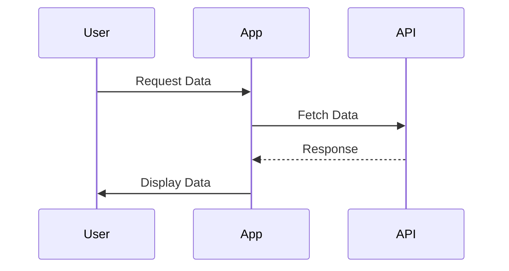

## 9.16 Composing Promises and Async Functions

In modern web development, handling asynchronous operations efficiently is crucial. JavaScript, with its non-blocking I/O model, provides powerful tools like Promises and `async`/`await` to manage asynchronous code. This section delves into composing Promises and async functions using functional programming techniques, offering cleaner and more readable workflows.

### Introduction to Asynchronous Composition

Asynchronous composition involves structuring your code to handle multiple asynchronous operations in a cohesive and manageable way. By composing Promises and async functions, we can create workflows that are not only efficient but also easy to understand and maintain.

### Composing Promises

Promises are a fundamental part of JavaScript's asynchronous programming model. They represent a value that may be available now, or in the future, or never. Composing Promises involves chaining them together to perform a sequence of asynchronous operations.

#### Chaining Promises

Chaining is a common technique for composing Promises. It allows you to execute a series of asynchronous tasks in sequence, where each task starts after the previous one completes.

```javascript
// Example of chaining Promises
function fetchData(url) {
  return fetch(url)
    .then(response => response.json())
    .then(data => {
      console.log('Data received:', data);
      return data;
    })
    .catch(error => {
      console.error('Error fetching data:', error);
    });
}

// Usage
fetchData('https://api.example.com/data')
  .then(data => {
    // Further processing of data
  });
```

In this example, each `.then()` method returns a new Promise, allowing further chaining. The `catch()` method handles any errors that occur during the chain.

#### Combining Promises

Sometimes, you need to perform multiple asynchronous operations concurrently and wait for all of them to complete. JavaScript provides utility functions like `Promise.all()` and `Promise.race()` for such scenarios.

- **`Promise.all()`**: Waits for all Promises to resolve and returns an array of results.

```javascript
// Example of Promise.all
const promise1 = fetch('https://api.example.com/data1').then(res => res.json());
const promise2 = fetch('https://api.example.com/data2').then(res => res.json());

Promise.all([promise1, promise2])
  .then(results => {
    console.log('All data received:', results);
  })
  .catch(error => {
    console.error('Error in one of the Promises:', error);
  });
```

- **`Promise.race()`**: Resolves or rejects as soon as one of the Promises resolves or rejects.

```javascript
// Example of Promise.race
const promise1 = new Promise((resolve, reject) => setTimeout(resolve, 500, 'First'));
const promise2 = new Promise((resolve, reject) => setTimeout(resolve, 100, 'Second'));

Promise.race([promise1, promise2])
  .then(result => {
    console.log('First resolved:', result);
  })
  .catch(error => {
    console.error('Error in race:', error);
  });
```

### Composing Async Functions

With the introduction of `async`/`await` in ES2017, handling asynchronous code became more straightforward. Async functions return Promises, allowing them to be composed similarly to Promises.

#### Using `async`/`await` for Composition

The `async` keyword before a function declaration makes the function return a Promise. Inside an async function, you can use `await` to pause execution until a Promise is resolved.

```javascript
// Example of async/await composition
async function fetchData(url) {
  try {
    const response = await fetch(url);
    const data = await response.json();
    console.log('Data received:', data);
    return data;
  } catch (error) {
    console.error('Error fetching data:', error);
  }
}

// Usage
(async () => {
  const data = await fetchData('https://api.example.com/data');
  // Further processing of data
})();
```

This approach makes asynchronous code look synchronous, improving readability and maintainability.

#### Combining Async Functions

Just like Promises, async functions can be combined using `Promise.all()` and `Promise.race()`.

```javascript
// Example of combining async functions with Promise.all
async function fetchData1() {
  const response = await fetch('https://api.example.com/data1');
  return response.json();
}

async function fetchData2() {
  const response = await fetch('https://api.example.com/data2');
  return response.json();
}

(async () => {
  try {
    const [data1, data2] = await Promise.all([fetchData1(), fetchData2()]);
    console.log('All data received:', data1, data2);
  } catch (error) {
    console.error('Error in fetching data:', error);
  }
})();
```

### Benefits of Composing Promises and Async Functions

Composing Promises and async functions offers several benefits:

- **Improved Readability**: Code is easier to read and understand, resembling synchronous code.
- **Better Error Handling**: Errors can be caught and handled in a centralized manner using `catch()` or `try...catch`.
- **Efficient Workflow Management**: Allows for both sequential and concurrent execution of asynchronous tasks.

### Utility Functions for Managing Async Flows

To further enhance the composition of asynchronous functions, utility functions can be employed. These functions abstract common patterns, making code more reusable and concise.

#### Example: Sequential Execution

A utility function to execute async functions sequentially:

```javascript
// Utility function for sequential execution
async function executeSequentially(tasks) {
  const results = [];
  for (const task of tasks) {
    results.push(await task());
  }
  return results;
}

// Usage
const tasks = [
  () => fetchData('https://api.example.com/data1'),
  () => fetchData('https://api.example.com/data2')
];

executeSequentially(tasks)
  .then(results => {
    console.log('Sequential results:', results);
  });
```

#### Example: Retry Logic

A utility function to retry an async operation:

```javascript
// Utility function for retry logic
async function retryAsync(fn, retries = 3) {
  for (let i = 0; i < retries; i++) {
    try {
      return await fn();
    } catch (error) {
      if (i === retries - 1) throw error;
    }
  }
}

// Usage
retryAsync(() => fetchData('https://api.example.com/data'))
  .then(data => {
    console.log('Data received after retry:', data);
  })
  .catch(error => {
    console.error('Failed after retries:', error);
  });
```

### Visualizing Asynchronous Composition

To better understand how Promises and async functions interact, let's visualize their flow using a sequence diagram.



This diagram illustrates a typical asynchronous data fetching process, where the application fetches data from an API and displays it to the user.

### Knowledge Check

- **What is the primary benefit of using `async`/`await` over traditional Promise chaining?**
- **How does `Promise.all()` differ from `Promise.race()`?**
- **What are some common patterns for managing asynchronous flows?**

### Try It Yourself

Experiment with the provided code examples by modifying URLs, adding more Promises, or changing the retry logic. This hands-on approach will solidify your understanding of composing Promises and async functions.

### Summary

Composing Promises and async functions is a powerful technique in JavaScript, enabling developers to manage asynchronous workflows efficiently. By leveraging functional programming principles, we can create code that is not only performant but also easy to read and maintain. Remember, this is just the beginning. As you progress, you'll build more complex and interactive web applications. Keep experimenting, stay curious, and enjoy the journey!

## Quiz: Mastering Promises and Async Functions in JavaScript



### What is the main advantage of using `async`/`await` over traditional Promise chaining?

- [x] Improved readability and maintainability
- [ ] Faster execution
- [ ] Reduced memory usage
- [ ] Increased security

> **Explanation:** `async`/`await` improves readability by making asynchronous code look synchronous, which enhances maintainability.

### Which method waits for all Promises to resolve and returns an array of results?

- [x] Promise.all()
- [ ] Promise.race()
- [ ] Promise.any()
- [ ] Promise.resolve()

> **Explanation:** `Promise.all()` waits for all Promises to resolve and returns an array of their results.

### What does `Promise.race()` do?

- [x] Resolves or rejects as soon as one of the Promises resolves or rejects
- [ ] Waits for all Promises to resolve
- [ ] Returns the fastest Promise
- [ ] Combines all Promise results

> **Explanation:** `Promise.race()` resolves or rejects as soon as one of the Promises in the iterable resolves or rejects.

### How can you handle errors in a chain of Promises?

- [x] Using the `.catch()` method
- [ ] Using `try...catch` inside each `.then()`
- [ ] Ignoring errors
- [ ] Using `finally`

> **Explanation:** The `.catch()` method is used to handle errors in a chain of Promises.

### What is a utility function for retrying an async operation?

- [x] retryAsync()
- [ ] retryPromise()
- [ ] asyncRetry()
- [ ] promiseRetry()

> **Explanation:** `retryAsync()` is a utility function that can be used to retry an async operation a specified number of times.

### What does the `await` keyword do in an async function?

- [x] Pauses execution until the Promise is resolved
- [ ] Speeds up the Promise resolution
- [ ] Converts a Promise to a synchronous function
- [ ] Cancels the Promise

> **Explanation:** The `await` keyword pauses the execution of the async function until the Promise is resolved.

### Which of the following is a benefit of composing Promises?

- [x] Efficient workflow management
- [ ] Faster code execution
- [ ] Reduced code size
- [ ] Increased complexity

> **Explanation:** Composing Promises allows for efficient workflow management by enabling both sequential and concurrent execution of asynchronous tasks.

### What is the purpose of `Promise.all()`?

- [x] To wait for all Promises to resolve and return their results
- [ ] To resolve the fastest Promise
- [ ] To reject all Promises if one fails
- [ ] To combine all Promises into one

> **Explanation:** `Promise.all()` is used to wait for all Promises to resolve and returns an array of their results.

### How does `Promise.race()` differ from `Promise.all()`?

- [x] `Promise.race()` resolves or rejects as soon as one Promise resolves or rejects
- [ ] `Promise.race()` waits for all Promises to resolve
- [ ] `Promise.race()` combines all results
- [ ] `Promise.race()` is faster

> **Explanation:** `Promise.race()` resolves or rejects as soon as one of the Promises resolves or rejects, unlike `Promise.all()` which waits for all to resolve.

### True or False: Async functions always return Promises.

- [x] True
- [ ] False

> **Explanation:** Async functions always return Promises, even if the function does not explicitly return a Promise.


