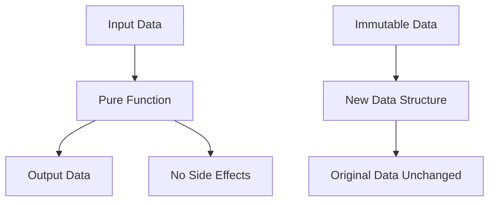

## 9.2 Pure Functions and Immutability

In the realm of functional programming, two foundational concepts stand out: pure functions and immutability. These principles not only enhance the reliability and predictability of your code but also simplify debugging and testing. Let's delve into these concepts and understand their significance in JavaScript.

### Understanding Pure Functions

**Pure functions** are the building blocks of functional programming. A function is considered pure if it satisfies two main criteria:

1. **Deterministic Output**: Given the same input, a pure function will always produce the same output.
2. **No Side Effects**: Pure functions do not alter any external state or data. They do not rely on or modify variables outside their scope.

#### Characteristics of Pure Functions

- **Referential Transparency**: You can replace a function call with its result without changing the program's behavior.
- **Predictability**: Pure functions are predictable, making them easier to test and debug.
- **Composability**: They can be easily composed to build more complex functions.

#### Example of a Pure Function

```javascript
// Pure function: adds two numbers
function add(a, b) {
  return a + b;
}

// Calling the function with the same arguments will always return the same result
console.log(add(2, 3)); // Output: 5
console.log(add(2, 3)); // Output: 5
```

### Side Effects

A **side effect** occurs when a function interacts with the outside world or modifies some state outside its scope. This can include:

- Modifying a global variable or object property.
- Changing the value of a parameter.
- Performing I/O operations like logging to the console or writing to a file.

#### Example of a Function with Side Effects

```javascript
let count = 0;

// Function with a side effect: modifies the external variable 'count'
function increment() {
  count += 1;
}

increment();
console.log(count); // Output: 1
```

In the above example, the `increment` function modifies the external variable `count`, thus having a side effect.

### Embracing Immutability

**Immutability** refers to the concept of not changing data after it has been created. Instead of modifying existing data structures, new ones are created. This approach leads to more predictable and bug-free code.

#### Achieving Immutability in JavaScript

JavaScript provides several ways to achieve immutability:

1. **`const` Declarations**: Use `const` to declare variables that should not be reassigned.
2. **Object and Array Methods**: Use methods like `Object.freeze()` to prevent modifications.
3. **Spread Operator**: Create shallow copies of objects and arrays.

#### Example of Immutability

```javascript
const originalArray = [1, 2, 3];

// Creating a new array with an additional element
const newArray = [...originalArray, 4];

console.log(originalArray); // Output: [1, 2, 3]
console.log(newArray);      // Output: [1, 2, 3, 4]
```

In this example, the original array remains unchanged, demonstrating immutability.

### Benefits of Pure Functions and Immutability

- **Easier Debugging**: With no side effects, tracking down bugs becomes simpler.
- **Concurrency**: Immutable data structures are inherently thread-safe.
- **Predictability**: Pure functions and immutable data lead to predictable code behavior.
- **Reusability**: Functions and data structures can be reused without unintended consequences.

### Libraries for Enforcing Immutability

Libraries like [Immutable.js](https://immutable-js.com/) provide persistent data structures that help enforce immutability. These structures are optimized for performance and can be used to manage complex state in applications.

#### Example with Immutable.js

```javascript
const { Map } = require('immutable');

const originalMap = Map({ key: 'value' });
const newMap = originalMap.set('key', 'newValue');

console.log(originalMap.get('key')); // Output: 'value'
console.log(newMap.get('key'));      // Output: 'newValue'
```

In this example, `Immutable.js` ensures that the original map remains unchanged when a new map is created with an updated value.

### Visualizing Pure Functions and Immutability

To better understand the flow of data in pure functions and the concept of immutability, let's visualize these concepts using a flowchart.



**Caption**: This diagram illustrates how pure functions transform input data into output data without side effects, and how immutable data leads to new data structures without altering the original.

### Try It Yourself

Experiment with the following code examples to reinforce your understanding of pure functions and immutability:

1. **Modify the `add` function** to include a side effect, such as logging to the console. Observe how this changes its purity.
2. **Create an immutable object** using `Object.freeze()` and attempt to modify its properties. Note the behavior.
3. **Use `Immutable.js`** to create a list and perform operations like adding or removing elements. Compare the performance with native JavaScript methods.

### Knowledge Check

- What are the two main criteria for a function to be considered pure?
- How can immutability be achieved in JavaScript?
- What are some benefits of using pure functions and immutability?
- How does `Immutable.js` help in enforcing immutability?

### Summary

Pure functions and immutability are cornerstones of functional programming in JavaScript. By adhering to these principles, we can write more reliable, maintainable, and bug-free code. Remember, this is just the beginning. As you progress, you'll build more complex and interactive applications. Keep experimenting, stay curious, and enjoy the journey!

## Quiz: Mastering Pure Functions and Immutability in JavaScript



### What is a characteristic of a pure function?

- [x] It produces the same output for the same input.
- [ ] It modifies global variables.
- [ ] It performs I/O operations.
- [ ] It relies on external state.

> **Explanation:** A pure function always produces the same output for the same input and does not rely on or modify external state.

### Which of the following is a side effect?

- [ ] Returning a value from a function.
- [x] Modifying a global variable.
- [ ] Passing arguments to a function.
- [ ] Using local variables.

> **Explanation:** Modifying a global variable is a side effect because it changes the state outside the function's scope.

### How can immutability be achieved in JavaScript?

- [x] Using `Object.freeze()`.
- [ ] Using `var` to declare variables.
- [ ] Modifying object properties directly.
- [ ] Using loops to change arrays.

> **Explanation:** `Object.freeze()` is used to make an object immutable, preventing modifications to its properties.

### What is a benefit of using pure functions?

- [x] Easier debugging.
- [ ] Increased side effects.
- [ ] Unpredictable behavior.
- [ ] Complex code.

> **Explanation:** Pure functions lead to easier debugging because they are predictable and do not have side effects.

### Which library helps enforce immutability in JavaScript?

- [x] Immutable.js
- [ ] jQuery
- [ ] Lodash
- [ ] Axios

> **Explanation:** Immutable.js provides persistent data structures that help enforce immutability in JavaScript.

### What does the spread operator do in the context of immutability?

- [x] Creates shallow copies of objects and arrays.
- [ ] Modifies the original object.
- [ ] Deletes properties from an object.
- [ ] Changes the data type of a variable.

> **Explanation:** The spread operator creates shallow copies of objects and arrays, aiding in maintaining immutability.

### What is referential transparency?

- [x] The ability to replace a function call with its result without changing the program's behavior.
- [ ] The ability to modify external state within a function.
- [ ] The ability to perform I/O operations within a function.
- [ ] The ability to change the function's parameters.

> **Explanation:** Referential transparency allows a function call to be replaced with its result without affecting the program's behavior, a key property of pure functions.

### What is a common pitfall when trying to achieve immutability?

- [ ] Using `const` for variable declarations.
- [x] Modifying nested objects directly.
- [ ] Using `Object.freeze()`.
- [ ] Creating new objects with the spread operator.

> **Explanation:** Modifying nested objects directly can lead to unintended changes, breaking immutability.

### How does `Immutable.js` differ from native JavaScript methods?

- [x] It provides persistent data structures.
- [ ] It modifies objects directly.
- [ ] It relies on mutable data.
- [ ] It does not support immutability.

> **Explanation:** Immutable.js provides persistent data structures that maintain immutability, unlike native JavaScript methods that allow direct modifications.

### True or False: Pure functions can have side effects.

- [ ] True
- [x] False

> **Explanation:** Pure functions cannot have side effects; they must not alter any external state or data.




