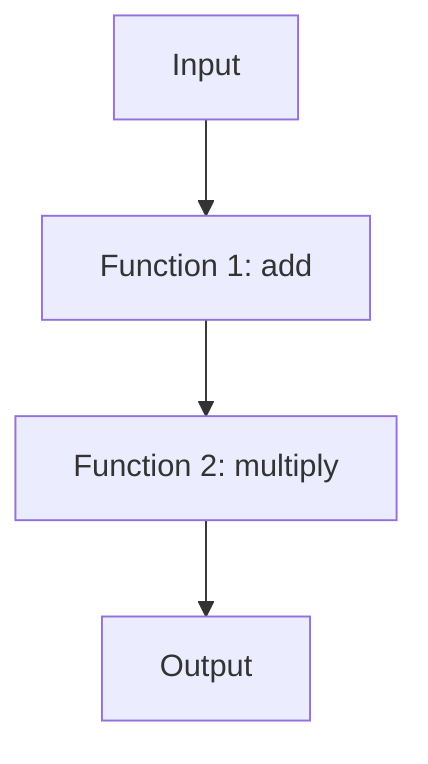

## 9.3 Higher-Order Functions and Function Composition

In the realm of functional programming (FP), higher-order functions and function composition are powerful tools that enable developers to write more modular, reusable, and expressive code. In this section, we will delve into these concepts, explore their applications in JavaScript, and demonstrate how they can be leveraged to build complex operations from simple functions.

### Understanding Higher-Order Functions

**Higher-order functions** are functions that can take other functions as arguments or return them as results. This capability allows for more abstract and flexible code, enabling developers to create functions that can be customized with different behaviors.

#### Key Characteristics of Higher-Order Functions

- **Function as an Argument**: A higher-order function can accept one or more functions as parameters.
- **Function as a Return Value**: It can return a function as its result.
- **Abstraction and Reusability**: By abstracting behavior, higher-order functions promote code reuse and reduce duplication.

#### Examples of Higher-Order Functions in JavaScript

JavaScript provides several built-in higher-order functions, such as `map`, `filter`, and `reduce`, which are commonly used for array manipulation.

##### Example: Using `map`

The `map` function creates a new array by applying a provided function to each element of the original array.

```javascript
const numbers = [1, 2, 3, 4, 5];

// Double each number in the array
const doubled = numbers.map(num => num * 2);

console.log(doubled); // Output: [2, 4, 6, 8, 10]
```

In this example, `map` takes a function that doubles a number and applies it to each element of the `numbers` array.

##### Example: Using `filter`

The `filter` function creates a new array with all elements that pass the test implemented by the provided function.

```javascript
const numbers = [1, 2, 3, 4, 5];

// Filter out even numbers
const evens = numbers.filter(num => num % 2 === 0);

console.log(evens); // Output: [2, 4]
```

Here, `filter` uses a function that checks if a number is even to filter the `numbers` array.

##### Example: Using `reduce`

The `reduce` function executes a reducer function on each element of the array, resulting in a single output value.

```javascript
const numbers = [1, 2, 3, 4, 5];

// Sum all numbers in the array
const sum = numbers.reduce((accumulator, currentValue) => accumulator + currentValue, 0);

console.log(sum); // Output: 15
```

In this case, `reduce` accumulates the sum of all numbers in the `numbers` array.

### Function Composition

**Function composition** is the process of combining two or more functions to produce a new function. This technique allows developers to build complex operations by chaining simple functions together.

#### Benefits of Function Composition

- **Modularity**: Breaks down complex operations into smaller, manageable functions.
- **Reusability**: Encourages the reuse of simple functions across different compositions.
- **Readability**: Enhances code readability by expressing complex logic in a clear, declarative manner.

#### Implementing Function Composition

In JavaScript, function composition can be implemented manually or with the help of utility libraries like Ramda or Lodash/fp.

##### Manual Function Composition

Let's manually compose two simple functions:

```javascript
const add = x => x + 1;
const multiply = x => x * 2;

// Compose functions to create a new function
const addThenMultiply = x => multiply(add(x));

console.log(addThenMultiply(5)); // Output: 12
```

In this example, `addThenMultiply` is a composed function that first adds 1 to the input and then multiplies the result by 2.

##### Function Composition with Ramda

Ramda is a functional programming library for JavaScript that provides a `compose` function to facilitate function composition.

```javascript
const R = require('ramda');

const add = x => x + 1;
const multiply = x => x * 2;

// Compose functions using Ramda
const addThenMultiply = R.compose(multiply, add);

console.log(addThenMultiply(5)); // Output: 12
```

With Ramda's `compose`, we can easily combine `add` and `multiply` into a single function.

##### Function Composition with Lodash/fp

Lodash/fp is a version of Lodash optimized for functional programming, offering a `flow` function for composition.

```javascript
const _ = require('lodash/fp');

const add = x => x + 1;
const multiply = x => x * 2;

// Compose functions using Lodash/fp
const addThenMultiply = _.flow(add, multiply);

console.log(addThenMultiply(5)); // Output: 12
```

Lodash/fp's `flow` function allows us to compose functions in a left-to-right order, which can be more intuitive for some developers.

### Practical Applications of Higher-Order Functions and Function Composition

Higher-order functions and function composition are not just theoretical concepts; they have practical applications in real-world JavaScript development.

#### Enhancing Code Modularity

By using higher-order functions and composition, we can break down complex logic into smaller, reusable pieces. This modularity makes our codebase easier to maintain and extend.

#### Improving Code Reusability

Functions created through composition can be reused across different parts of an application, reducing duplication and promoting consistency.

#### Simplifying Asynchronous Code

Higher-order functions can be used to create utility functions that handle asynchronous operations, such as fetching data from an API.

```javascript
const fetchData = url => fetch(url).then(response => response.json());

const logData = data => console.log(data);

// Compose functions to fetch and log data
const fetchAndLogData = url => fetchData(url).then(logData);

fetchAndLogData('https://api.example.com/data');
```

In this example, `fetchAndLogData` is a composed function that fetches data from a URL and logs it to the console.

### Visualizing Function Composition

To better understand function composition, let's visualize the process using a flowchart.



**Figure 1**: This flowchart illustrates the flow of data through a composed function, where the output of `Function 1` becomes the input for `Function 2`.

### Exploring Libraries for Function Composition

Several libraries provide utilities for function composition, making it easier to work with complex operations in JavaScript.

#### Ramda

Ramda is a functional programming library that emphasizes immutability and side-effect-free functions. Its `compose` function allows for right-to-left function composition.

- **Documentation**: [Ramda Documentation](https://ramdajs.com/docs/)

#### Lodash/fp

Lodash/fp is a functional programming variant of Lodash, offering a `flow` function for left-to-right composition.

- **Documentation**: [Lodash/fp Documentation](https://lodash.com/docs/4.17.15#flow)

### Knowledge Check

Before we conclude, let's test your understanding of higher-order functions and function composition with a few questions.

1. What is a higher-order function?
2. How does function composition enhance code modularity?
3. Provide an example of a higher-order function in JavaScript.
4. Explain the difference between Ramda's `compose` and Lodash/fp's `flow`.

### Try It Yourself

To solidify your understanding, try modifying the code examples provided in this section. Experiment with different functions and compositions to see how they affect the output.

### Summary

In this section, we've explored the concepts of higher-order functions and function composition in JavaScript. These powerful tools enable developers to write more modular, reusable, and expressive code. By leveraging libraries like Ramda and Lodash/fp, we can simplify complex operations and enhance the maintainability of our codebase.

Remember, this is just the beginning. As you progress, you'll discover even more ways to harness the power of functional programming in JavaScript. Keep experimenting, stay curious, and enjoy the journey!

## Quiz: Mastering Higher-Order Functions and Function Composition



### What is a higher-order function in JavaScript?

- [x] A function that takes other functions as arguments or returns them as results
- [ ] A function that only performs arithmetic operations
- [ ] A function that is only used for asynchronous operations
- [ ] A function that cannot be reused

> **Explanation:** A higher-order function is one that can take other functions as arguments or return them as results, allowing for more abstract and flexible code.

### Which built-in JavaScript method is a higher-order function?

- [x] `map`
- [ ] `parseInt`
- [ ] `toString`
- [ ] `charAt`

> **Explanation:** The `map` method is a higher-order function because it takes a function as an argument and applies it to each element of an array.

### What is the primary benefit of function composition?

- [x] It enhances code modularity and reusability
- [ ] It makes code run faster
- [ ] It reduces the need for variables
- [ ] It eliminates the need for comments

> **Explanation:** Function composition enhances code modularity and reusability by allowing developers to build complex operations from simple functions.

### How does Ramda's `compose` function work?

- [x] It composes functions from right to left
- [ ] It composes functions from left to right
- [ ] It only works with asynchronous functions
- [ ] It requires a callback function

> **Explanation:** Ramda's `compose` function combines functions from right to left, allowing the output of one function to be the input of the next.

### Which library provides the `flow` function for function composition?

- [x] Lodash/fp
- [ ] Ramda
- [ ] jQuery
- [ ] Axios

> **Explanation:** Lodash/fp provides the `flow` function, which allows for left-to-right function composition.

### What is the output of the following composed function: `const addThenMultiply = x => multiply(add(x));` if `add = x => x + 1` and `multiply = x => x * 2`?

- [x] 12
- [ ] 10
- [ ] 14
- [ ] 11

> **Explanation:** The composed function first adds 1 to the input and then multiplies the result by 2. For an input of 5, the output is 12.

### Which of the following is NOT a characteristic of higher-order functions?

- [ ] They can take functions as arguments
- [ ] They can return functions as results
- [x] They can only be used with arrays
- [ ] They promote code reuse

> **Explanation:** Higher-order functions are not limited to arrays; they can be used in various contexts to promote code reuse and abstraction.

### What is the purpose of the `reduce` method in JavaScript?

- [x] To execute a reducer function on each element of an array, resulting in a single output value
- [ ] To filter elements of an array based on a condition
- [ ] To map each element of an array to a new value
- [ ] To sort elements of an array

> **Explanation:** The `reduce` method executes a reducer function on each element of an array, accumulating a single output value.

### Which of the following is an example of function composition?

- [x] Combining two functions to create a new function
- [ ] Using a function to sort an array
- [ ] Declaring a function inside another function
- [ ] Using a function to log data to the console

> **Explanation:** Function composition involves combining two or more functions to create a new function that performs a complex operation.

### True or False: Function composition can only be achieved with external libraries.

- [ ] True
- [x] False

> **Explanation:** Function composition can be achieved manually in JavaScript without the need for external libraries, although libraries like Ramda and Lodash/fp provide utilities to simplify the process.


