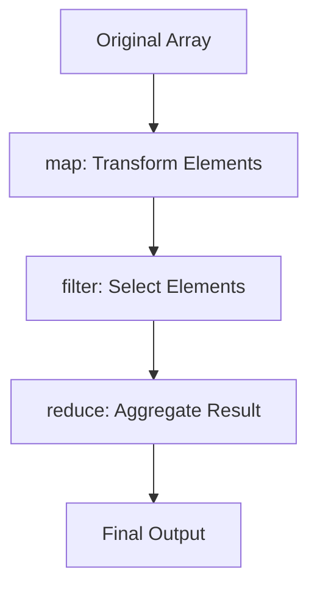

## 9.6 Using Map, Filter, and Reduce

In the realm of JavaScript, the `map`, `filter`, and `reduce` methods are indispensable tools for developers aiming to harness the power of functional programming. These methods allow for elegant and efficient data transformations, promoting immutability and reducing side effects. In this section, we will delve into each of these methods, exploring their purposes, use cases, and best practices.

### Understanding the Basics

Before we dive into each method, let's establish a foundational understanding of what these methods do and why they are central to functional programming in JavaScript.

- **Map**: Transforms each element in an array and returns a new array of the same length.
- **Filter**: Creates a new array with all elements that pass a test implemented by a provided function.
- **Reduce**: Executes a reducer function on each element of the array, resulting in a single output value.

### The `map` Method

#### Purpose and Functionality

The `map` method is used to apply a function to each element of an array, transforming the elements and returning a new array with the transformed values. It is particularly useful when you want to perform operations on each element of an array without mutating the original array.

#### Code Example

```javascript
// Example: Doubling each number in an array
const numbers = [1, 2, 3, 4, 5];
const doubled = numbers.map(num => num * 2);

console.log(doubled); // Output: [2, 4, 6, 8, 10]
```

In this example, we use the `map` method to double each number in the `numbers` array. The original array remains unchanged, demonstrating the immutability principle.

#### Best Practices

- **Avoid Side Effects**: Ensure that the function passed to `map` does not alter external variables or the original array.
- **Immutability**: Always return a new array and do not modify the original array.
- **Performance**: For large datasets, consider using libraries like Lodash for optimized performance.

### The `filter` Method

#### Purpose and Functionality

The `filter` method creates a new array with all elements that pass the test implemented by the provided function. It is ideal for situations where you need to extract a subset of elements from an array based on certain criteria.

#### Code Example

```javascript
// Example: Filtering out even numbers
const numbers = [1, 2, 3, 4, 5];
const oddNumbers = numbers.filter(num => num % 2 !== 0);

console.log(oddNumbers); // Output: [1, 3, 5]
```

Here, the `filter` method is used to extract only the odd numbers from the `numbers` array.

#### Best Practices

- **Predicate Function**: Ensure the function returns a boolean value to determine if an element should be included.
- **Immutability**: Like `map`, `filter` should not modify the original array.
- **Performance**: Be mindful of the performance impact when filtering large arrays.

### The `reduce` Method

#### Purpose and Functionality

The `reduce` method applies a function against an accumulator and each element in the array (from left to right) to reduce it to a single value. It is highly versatile and can be used for a variety of operations, such as summing numbers, flattening arrays, or building complex data structures.

#### Code Example

```javascript
// Example: Summing all numbers in an array
const numbers = [1, 2, 3, 4, 5];
const sum = numbers.reduce((accumulator, currentValue) => accumulator + currentValue, 0);

console.log(sum); // Output: 15
```

In this example, `reduce` is used to calculate the sum of all numbers in the `numbers` array.

#### Best Practices

- **Initial Value**: Always provide an initial value for the accumulator to avoid unexpected results.
- **Complexity**: Keep the reducer function simple and focused on a single operation.
- **Immutability**: Ensure the reducer function does not mutate the accumulator or any other external state.

### Combining `map`, `filter`, and `reduce`

These methods can be combined to perform complex data transformations in a concise and readable manner. Let's see an example where we use all three methods together.

#### Code Example

```javascript
// Example: Transforming and filtering an array, then summing the results
const numbers = [1, 2, 3, 4, 5, 6, 7, 8, 9, 10];
const result = numbers
  .map(num => num * 2) // Double each number
  .filter(num => num > 10) // Keep only numbers greater than 10
  .reduce((acc, num) => acc + num, 0); // Sum the remaining numbers

console.log(result); // Output: 60
```

In this example, we first double each number, then filter out numbers less than or equal to 10, and finally sum the remaining numbers.

### Performance Considerations

While `map`, `filter`, and `reduce` are powerful, they can be less performant on large datasets due to their iterative nature. Consider the following strategies to optimize performance:

- **Use Libraries**: Libraries like Lodash offer optimized versions of these methods.
- **Parallel Processing**: For extremely large datasets, consider using Web Workers or other parallel processing techniques.
- **Avoid Chaining**: Excessive chaining of these methods can lead to performance bottlenecks. Consider combining operations where possible.

### Immutability and Side Effects

A key principle of functional programming is immutability, which means that data should not be changed after it is created. This principle is crucial when using `map`, `filter`, and `reduce`:

- **Immutability**: Always return new arrays or values without modifying the original data.
- **Avoid Side Effects**: Ensure that the functions passed to these methods do not alter external variables or state.

### Visualizing the Process

To better understand how these methods work, let's visualize the process using a flowchart.



**Diagram Description**: This flowchart illustrates the sequential process of transforming an array using `map`, selecting elements with `filter`, and aggregating the result with `reduce`.

### Try It Yourself

To truly master these methods, it's important to experiment and see how they work in different scenarios. Here are some suggestions:

- **Modify the Code**: Try changing the transformation function in `map` or the predicate in `filter` to see how the output changes.
- **Experiment with Data**: Use different datasets, such as arrays of objects, to explore more complex transformations.
- **Combine Methods**: Practice combining `map`, `filter`, and `reduce` in various orders to achieve different results.

### Knowledge Check

To reinforce your understanding, consider these questions:

- What is the primary purpose of the `map` method?
- How does `filter` differ from `map` in terms of output?
- What are some best practices for using `reduce` effectively?
- Why is immutability important when using these methods?
- How can performance be optimized when working with large datasets?

### Conclusion

The `map`, `filter`, and `reduce` methods are powerful tools in the JavaScript developer's toolkit, enabling efficient and expressive data transformations. By adhering to best practices and understanding their nuances, you can leverage these methods to write cleaner, more maintainable code. Remember, this is just the beginning. As you progress, you'll build more complex and interactive web pages. Keep experimenting, stay curious, and enjoy the journey!

## Quiz: Mastering Map, Filter, and Reduce in JavaScript



### What is the primary purpose of the `map` method in JavaScript?

- [x] To transform each element in an array and return a new array.
- [ ] To filter elements in an array based on a condition.
- [ ] To reduce an array to a single value.
- [ ] To sort elements in an array.

> **Explanation:** The `map` method is used to apply a function to each element of an array, transforming the elements and returning a new array with the transformed values.

### How does the `filter` method differ from `map`?

- [x] `filter` creates a new array with elements that pass a test, while `map` transforms each element.
- [ ] `filter` transforms each element, while `map` creates a new array with elements that pass a test.
- [ ] `filter` reduces an array to a single value, while `map` transforms each element.
- [ ] `filter` sorts elements, while `map` transforms each element.

> **Explanation:** The `filter` method creates a new array with all elements that pass a test implemented by a provided function, whereas `map` transforms each element.

### What is a best practice when using the `reduce` method?

- [x] Always provide an initial value for the accumulator.
- [ ] Avoid using an initial value for the accumulator.
- [ ] Use `reduce` to sort arrays.
- [ ] Use `reduce` to filter arrays.

> **Explanation:** Providing an initial value for the accumulator ensures that the `reduce` method behaves predictably and avoids unexpected results.

### Why is immutability important when using `map`, `filter`, and `reduce`?

- [x] It prevents unintended side effects and maintains data integrity.
- [ ] It allows for faster execution of code.
- [ ] It enables the use of global variables.
- [ ] It simplifies the use of loops.

> **Explanation:** Immutability ensures that data is not changed after it is created, preventing unintended side effects and maintaining data integrity.

### How can performance be optimized when working with large datasets using these methods?

- [x] Use libraries like Lodash for optimized performance.
- [ ] Avoid using these methods altogether.
- [ ] Use global variables to store intermediate results.
- [ ] Use `eval` to execute code dynamically.

> **Explanation:** Libraries like Lodash offer optimized versions of these methods, which can improve performance when working with large datasets.

### What does the `reduce` method return?

- [x] A single value.
- [ ] A new array of the same length.
- [ ] A new array with filtered elements.
- [ ] A sorted array.

> **Explanation:** The `reduce` method executes a reducer function on each element of the array, resulting in a single output value.

### Which method would you use to double each number in an array?

- [x] `map`
- [ ] `filter`
- [ ] `reduce`
- [ ] `sort`

> **Explanation:** The `map` method is used to apply a function to each element of an array, transforming the elements and returning a new array with the transformed values.

### What is a key characteristic of the `filter` method?

- [x] It returns a new array with elements that pass a test.
- [ ] It returns a single value.
- [ ] It modifies the original array.
- [ ] It sorts the array.

> **Explanation:** The `filter` method creates a new array with all elements that pass a test implemented by a provided function.

### Can `map`, `filter`, and `reduce` be used together?

- [x] True
- [ ] False

> **Explanation:** These methods can be combined to perform complex data transformations in a concise and readable manner.

### What should you avoid in the callback functions for these methods?

- [x] Side effects
- [ ] Returning values
- [ ] Using parameters
- [ ] Using constants

> **Explanation:** Avoiding side effects ensures that the functions do not alter external variables or the original array, maintaining immutability.




