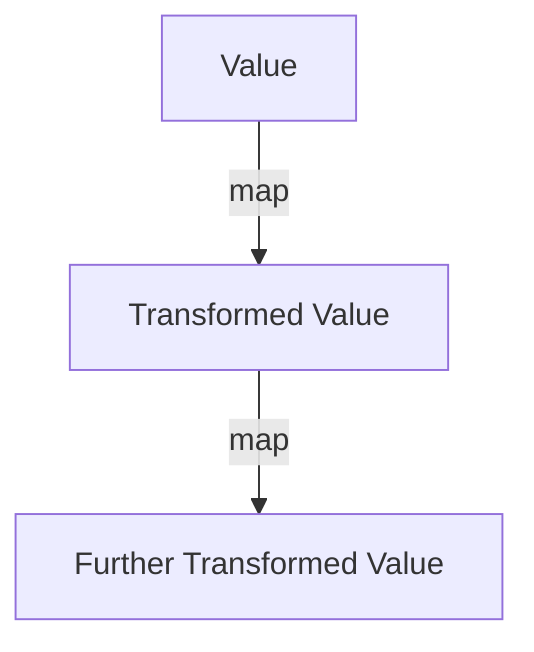
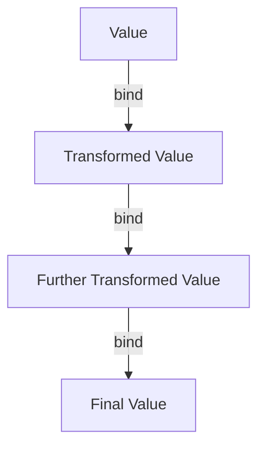

## 9.7 Functors and Monads in JavaScript

In the realm of functional programming (FP), functors and monads are pivotal concepts that enable developers to handle values and computations in a structured and predictable manner. These abstract structures are not only theoretical constructs but also have practical applications in JavaScript, particularly in managing asynchronous operations and dealing with null or undefined values. In this section, we will delve into the intricacies of functors and monads, exploring their definitions, relationships, and applications in JavaScript.

### Understanding Functors

#### What is a Functor?

In functional programming, a functor is a type that implements a `map` method. This method allows you to apply a function to a value wrapped in a context, such as an array or an object, without altering the context itself. The concept of a functor is fundamental because it provides a way to apply transformations to values while maintaining the structure that holds them.

#### Functors and the `map` Method

In JavaScript, arrays are the most common example of functors. The `Array.prototype.map()` method is a perfect illustration of how functors work. Let's explore this with a simple example:

```javascript
// Define an array of numbers
const numbers = [1, 2, 3, 4, 5];

// Use the map method to double each number
const doubledNumbers = numbers.map(num => num * 2);

console.log(doubledNumbers); // Output: [2, 4, 6, 8, 10]
```

In this example, the `map` method takes a function that doubles each number in the array. The array itself acts as a functor, providing a context in which the transformation occurs.

#### Creating Custom Functors

While arrays are built-in functors, you can create your own functor by implementing a `map` method. Here's a simple example of a custom functor:

```javascript
// Define a custom functor
class Box {
  constructor(value) {
    this.value = value;
  }

  // Implement the map method
  map(fn) {
    return new Box(fn(this.value));
  }
}

// Create a new Box instance
const box = new Box(10);

// Use the map method to transform the value
const newBox = box.map(value => value + 5);

console.log(newBox.value); // Output: 15
```

In this example, the `Box` class encapsulates a value and provides a `map` method to apply a transformation function to that value. The `map` method returns a new `Box` instance, preserving the functor's context.

### Introducing Monads

#### What is a Monad?

Monads are a more advanced concept in functional programming, building upon the idea of functors. A monad is a type that implements two essential operations: `bind` (also known as `flatMap` or `chain`) and `unit` (often called `return` or `of`). These operations allow for the chaining of computations while maintaining the context.

Monads are particularly useful for handling side effects, managing asynchronous operations, and dealing with null or undefined values in a functional way.

#### Monads in JavaScript: Promises

In JavaScript, Promises are a well-known example of monads. They provide a way to handle asynchronous operations by chaining computations. Let's explore how Promises work as monads:

```javascript
// Create a promise that resolves with a value
const promise = Promise.resolve(5);

// Chain computations using then (bind/flatMap)
promise
  .then(value => value * 2)
  .then(value => value + 3)
  .then(value => console.log(value)); // Output: 13
```

In this example, the `then` method acts as the `bind` operation, allowing us to chain computations on the resolved value. Each `then` call returns a new Promise, preserving the monadic context.

#### Handling Null Values with Monads

Monads can also be used to handle null or undefined values gracefully. The `Maybe` monad is a common pattern for this purpose. Let's implement a simple `Maybe` monad in JavaScript:

```javascript
// Define the Maybe monad
class Maybe {
  constructor(value) {
    this.value = value;
  }

  // Implement the bind method
  bind(fn) {
    return this.value == null ? this : new Maybe(fn(this.value));
  }

  // Static method to create a Maybe instance
  static of(value) {
    return new Maybe(value);
  }
}

// Create a Maybe instance with a value
const maybeValue = Maybe.of(10);

// Chain computations using bind
const result = maybeValue
  .bind(value => value * 2)
  .bind(value => value + 5);

console.log(result.value); // Output: 25
```

In this example, the `Maybe` monad encapsulates a value that may be null or undefined. The `bind` method checks for null values and only applies the transformation function if the value is not null.

### Use Cases for Functors and Monads

#### Managing Asynchronous Operations

Functors and monads are invaluable for managing asynchronous operations in JavaScript. Promises, as monads, provide a clean and composable way to handle asynchronous tasks, avoiding the infamous "callback hell."

#### Handling Null or Undefined Values

The `Maybe` monad is a powerful tool for dealing with null or undefined values, allowing you to chain computations without worrying about null checks at every step.

#### Composing Complex Computations

By using functors and monads, you can compose complex computations in a modular and reusable way. This approach leads to cleaner and more maintainable code.

### Theoretical Aspects and Practical Applications

#### Theoretical Foundations

Functors and monads are rooted in category theory, a branch of mathematics that deals with abstract structures and their relationships. While the theoretical aspects can be complex, the practical applications in JavaScript are straightforward and immensely beneficial.

#### Practical Applications

In practice, functors and monads enable developers to write more expressive and robust code. They provide a framework for handling side effects, managing state, and composing functions in a functional style.

### Visualizing Functors and Monads

To better understand the flow of data and transformations in functors and monads, let's visualize these concepts using Mermaid.js diagrams.

#### Functor Flow



**Caption**: This diagram illustrates the flow of data through a functor, where each `map` operation transforms the value while preserving the context.

#### Monad Flow



**Caption**: This diagram shows the chaining of computations in a monad, where each `bind` operation transforms the value and returns a new monadic context.

### Try It Yourself

To deepen your understanding of functors and monads, try modifying the code examples provided. Experiment with different transformation functions and explore how these concepts can be applied to your own projects.

### References and Further Reading

- [MDN Web Docs: Array.prototype.map()](https://developer.mozilla.org/en-US/docs/Web/JavaScript/Reference/Global_Objects/Array/map)
- [MDN Web Docs: Promise](https://developer.mozilla.org/en-US/docs/Web/JavaScript/Reference/Global_Objects/Promise)
- [Functional Programming in JavaScript: Functors and Monads](https://www.sitepoint.com/functional-programming-functors-monads/)

### Knowledge Check

Before moving on, take a moment to reflect on what you've learned. Consider how functors and monads can enhance your JavaScript development skills, particularly in managing asynchronous operations and handling null values.

### Embrace the Journey

Remember, mastering functors and monads is a journey. As you continue to explore these concepts, you'll discover new ways to write cleaner, more efficient, and more expressive code. Keep experimenting, stay curious, and enjoy the journey!

## Quiz: Mastering Functors and Monads in JavaScript



### What is a functor in functional programming?

- [x] A type that implements a `map` method
- [ ] A type that implements a `bind` method
- [ ] A type that implements a `filter` method
- [ ] A type that implements a `reduce` method

> **Explanation:** A functor is a type that implements a `map` method, allowing transformations on values within a context.

### Which JavaScript feature is a common example of a functor?

- [x] Arrays
- [ ] Objects
- [ ] Functions
- [ ] Promises

> **Explanation:** Arrays in JavaScript are common examples of functors because they implement the `map` method.

### What is the primary purpose of a monad?

- [x] To chain operations while maintaining context
- [ ] To filter values based on a condition
- [ ] To reduce a list of values to a single value
- [ ] To sort values in a specific order

> **Explanation:** Monads are used to chain operations while maintaining the context, allowing for composable computations.

### How do Promises in JavaScript act as monads?

- [x] By allowing chaining of asynchronous operations using `then`
- [ ] By providing a `map` method for transformations
- [ ] By filtering resolved values
- [ ] By reducing multiple promises to a single value

> **Explanation:** Promises act as monads by allowing chaining of asynchronous operations using the `then` method.

### What is the `bind` method in the context of monads?

- [x] A method that chains computations and returns a new monadic context
- [ ] A method that maps values to a new context
- [ ] A method that filters values within a context
- [ ] A method that reduces values to a single result

> **Explanation:** The `bind` method chains computations and returns a new monadic context, enabling composable operations.

### Which monad is commonly used to handle null or undefined values?

- [x] Maybe
- [ ] Promise
- [ ] Either
- [ ] List

> **Explanation:** The `Maybe` monad is commonly used to handle null or undefined values, providing a safe way to chain computations.

### What does the `map` method do in a functor?

- [x] Transforms values while preserving the context
- [ ] Chains computations and returns a new context
- [ ] Filters values based on a condition
- [ ] Reduces values to a single result

> **Explanation:** The `map` method transforms values while preserving the context, allowing for composable transformations.

### How can functors and monads help in managing asynchronous operations?

- [x] By providing a structured way to chain computations
- [ ] By filtering asynchronous results
- [ ] By reducing multiple asynchronous operations to a single result
- [ ] By sorting asynchronous results

> **Explanation:** Functors and monads provide a structured way to chain computations, making it easier to manage asynchronous operations.

### What is the primary benefit of using the `Maybe` monad?

- [x] It allows safe chaining of computations without null checks
- [ ] It provides a way to filter values
- [ ] It reduces values to a single result
- [ ] It sorts values in a specific order

> **Explanation:** The `Maybe` monad allows safe chaining of computations without null checks, handling null or undefined values gracefully.

### True or False: Monads are only theoretical constructs with no practical applications in JavaScript.

- [ ] True
- [x] False

> **Explanation:** False. Monads have practical applications in JavaScript, particularly in managing asynchronous operations and handling null values.




