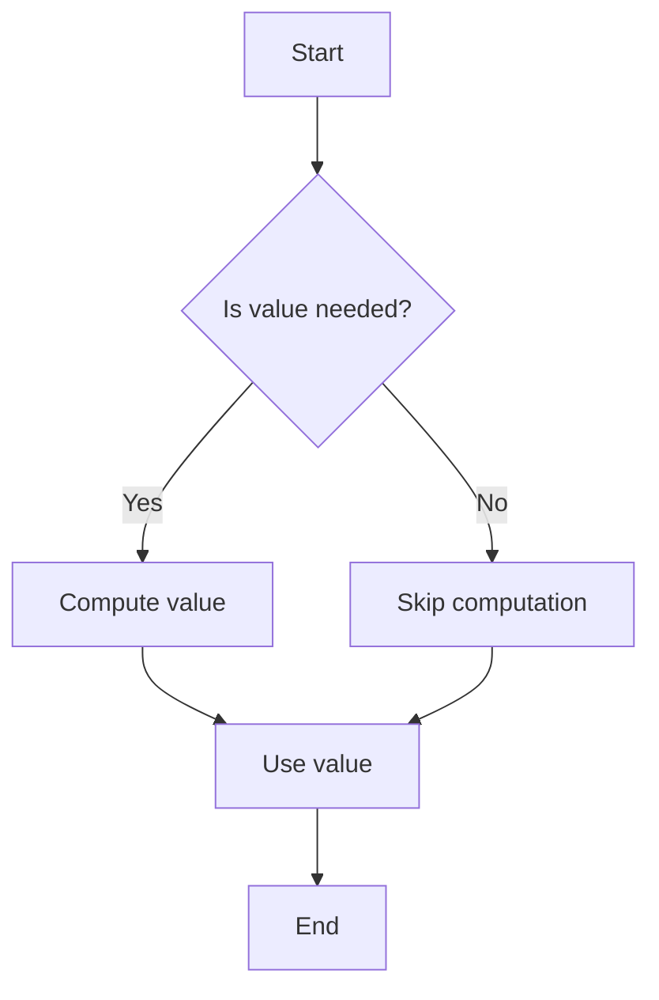

## 9.8 Lazy Evaluation Techniques

Lazy evaluation is a powerful concept in programming that can significantly enhance the performance of your JavaScript applications. By delaying the computation of expressions until their values are actually needed, lazy evaluation helps in avoiding unnecessary calculations, which can be particularly beneficial in scenarios involving expensive computations or infinite data structures.

### Understanding Lazy Evaluation

Lazy evaluation is a strategy that defers the evaluation of an expression until its value is required. This approach can lead to performance improvements by preventing unnecessary calculations and reducing memory usage. In contrast, eager evaluation computes expressions as soon as they are bound to a variable.

#### Benefits of Lazy Evaluation

1. **Performance Optimization**: By avoiding unnecessary calculations, lazy evaluation can lead to more efficient code execution.
2. **Memory Efficiency**: Lazy evaluation can help in reducing memory usage by not storing intermediate results that are never used.
3. **Handling Infinite Data Structures**: Lazy evaluation allows the creation and manipulation of infinite data structures, such as streams or sequences, without running into memory issues.

### Lazy Evaluation in JavaScript

JavaScript, being a versatile language, supports lazy evaluation through various constructs, with generators being one of the most prominent tools for implementing laziness.

#### Generators in JavaScript

Generators are special functions that can be paused and resumed, making them ideal for implementing lazy evaluation. They are defined using the `function*` syntax and use the `yield` keyword to produce a sequence of values lazily.

```javascript
function* lazySequence() {
  let i = 0;
  while (true) {
    yield i++;
  }
}

const sequence = lazySequence();
console.log(sequence.next().value); // 0
console.log(sequence.next().value); // 1
console.log(sequence.next().value); // 2
```

In this example, the `lazySequence` generator function produces an infinite sequence of numbers. Each call to `next()` computes the next value only when needed, demonstrating lazy evaluation.

#### Use Cases for Lazy Evaluation

1. **Infinite Sequences**: Generators can be used to create infinite sequences, such as Fibonacci numbers or prime numbers, without consuming infinite memory.

   ```javascript
   function* fibonacci() {
     let [prev, curr] = [0, 1];
     while (true) {
       yield curr;
       [prev, curr] = [curr, prev + curr];
     }
   }

   const fib = fibonacci();
   console.log(fib.next().value); // 1
   console.log(fib.next().value); // 1
   console.log(fib.next().value); // 2
   console.log(fib.next().value); // 3
   ```

2. **Expensive Computations**: Lazy evaluation can defer expensive computations until their results are actually needed, improving performance.

   ```javascript
   function* expensiveComputation() {
     console.log('Computing...');
     yield Math.pow(2, 10);
   }

   const compute = expensiveComputation();
   console.log('Before computation');
   console.log(compute.next().value); // Logs 'Computing...' and then 1024
   ```

3. **Data Processing Pipelines**: Lazy evaluation is useful in data processing pipelines where data is processed in stages, and only the necessary stages are executed.

   ```javascript
   function* filterEvenNumbers(numbers) {
     for (const number of numbers) {
       if (number % 2 === 0) {
         yield number;
       }
     }
   }

   const numbers = [1, 2, 3, 4, 5, 6];
   const evenNumbers = filterEvenNumbers(numbers);
   console.log([...evenNumbers]); // [2, 4, 6]
   ```

### Eager vs. Lazy Evaluation

Understanding the difference between eager and lazy evaluation is crucial for leveraging the benefits of lazy evaluation effectively.

- **Eager Evaluation**: Computes expressions as soon as they are bound to a variable. This approach can lead to unnecessary computations and memory usage if the results are not used.

  ```javascript
  const eagerResult = [1, 2, 3].map(x => x * 2); // Computed immediately
  ```

- **Lazy Evaluation**: Delays computation until the result is needed. This can improve performance and memory efficiency.

  ```javascript
  function* lazyMap(array, transform) {
    for (const item of array) {
      yield transform(item);
    }
  }

  const lazyResult = lazyMap([1, 2, 3], x => x * 2);
  console.log([...lazyResult]); // Computed when needed
  ```

### Libraries Supporting Lazy Evaluation

Several libraries in the JavaScript ecosystem support lazy evaluation, providing additional tools and abstractions for developers:

1. **Lodash**: A popular utility library that includes functions for lazy evaluation, such as `_.lazyMap` and `_.lazyFilter`.

2. **Lazy.js**: A library specifically designed for lazy evaluation, offering a wide range of functions for working with lazy sequences.

3. **RxJS**: A library for reactive programming that supports lazy evaluation through observables, allowing for efficient data stream processing.

### Visualizing Lazy Evaluation

To better understand how lazy evaluation works, let's visualize the process using a flowchart:



This flowchart illustrates the decision-making process in lazy evaluation, where computation is only performed if the value is needed.

### Try It Yourself

Experiment with the code examples provided in this section. Try modifying the generator functions to produce different sequences or perform different computations. Observe how lazy evaluation affects performance and memory usage.

### Knowledge Check

- What is lazy evaluation, and how does it differ from eager evaluation?
- How can generators be used to implement lazy evaluation in JavaScript?
- What are some use cases where lazy evaluation can be beneficial?
- Name some libraries that support lazy evaluation in JavaScript.

### Summary

Lazy evaluation is a powerful technique that can significantly improve the performance and efficiency of JavaScript applications. By deferring computations until they are needed, lazy evaluation helps in optimizing resource usage and handling infinite data structures. Generators, along with libraries like Lodash, Lazy.js, and RxJS, provide robust tools for implementing lazy evaluation in JavaScript.

Remember, this is just the beginning. As you progress, you'll build more complex and interactive applications. Keep experimenting, stay curious, and enjoy the journey!

## Quiz: Mastering Lazy Evaluation Techniques in JavaScript



### What is lazy evaluation?

- [x] A strategy that delays computation until the result is needed
- [ ] A method of computing expressions as soon as they are bound to a variable
- [ ] A technique for optimizing memory usage by storing intermediate results
- [ ] A process of evaluating all expressions eagerly

> **Explanation:** Lazy evaluation defers computation until the result is required, optimizing performance by avoiding unnecessary calculations.

### Which JavaScript feature is commonly used to implement lazy evaluation?

- [x] Generators
- [ ] Promises
- [ ] Async/Await
- [ ] Callbacks

> **Explanation:** Generators, with their ability to pause and resume execution, are ideal for implementing lazy evaluation in JavaScript.

### What is a benefit of lazy evaluation?

- [x] Improved performance by avoiding unnecessary calculations
- [ ] Immediate computation of all expressions
- [ ] Increased memory usage
- [ ] Reduced code readability

> **Explanation:** Lazy evaluation improves performance by deferring computations until necessary, thus avoiding unnecessary calculations.

### How does lazy evaluation handle infinite sequences?

- [x] By generating values on demand without consuming infinite memory
- [ ] By precomputing all values and storing them in memory
- [ ] By limiting the sequence to a finite number of elements
- [ ] By using recursion to generate all values at once

> **Explanation:** Lazy evaluation generates values on demand, allowing the handling of infinite sequences without consuming infinite memory.

### Which library is specifically designed for lazy evaluation in JavaScript?

- [x] Lazy.js
- [ ] Lodash
- [ ] RxJS
- [ ] jQuery

> **Explanation:** Lazy.js is a library specifically designed for lazy evaluation, offering functions for working with lazy sequences.

### What is the difference between eager and lazy evaluation?

- [x] Eager evaluation computes expressions immediately, while lazy evaluation defers computation until needed
- [ ] Eager evaluation defers computation, while lazy evaluation computes expressions immediately
- [ ] Both eager and lazy evaluation compute expressions immediately
- [ ] Both eager and lazy evaluation defer computation until needed

> **Explanation:** Eager evaluation computes expressions immediately, whereas lazy evaluation defers computation until the result is needed.

### How can lazy evaluation improve memory efficiency?

- [x] By not storing intermediate results that are never used
- [ ] By storing all intermediate results in memory
- [ ] By precomputing all values and caching them
- [ ] By using recursion to reduce memory usage

> **Explanation:** Lazy evaluation improves memory efficiency by not storing intermediate results that are never used, reducing memory usage.

### What keyword is used in JavaScript to produce values lazily in a generator?

- [x] yield
- [ ] return
- [ ] async
- [ ] await

> **Explanation:** The `yield` keyword is used in generators to produce values lazily, pausing execution until the next value is requested.

### Which of the following is a use case for lazy evaluation?

- [x] Expensive computations
- [ ] Immediate computation of all expressions
- [ ] Storing all intermediate results in memory
- [ ] Precomputing all values

> **Explanation:** Lazy evaluation is beneficial for expensive computations, as it defers computation until the result is needed, optimizing performance.

### True or False: Lazy evaluation can handle infinite data structures without running into memory issues.

- [x] True
- [ ] False

> **Explanation:** True. Lazy evaluation can handle infinite data structures by generating values on demand, avoiding memory issues.


