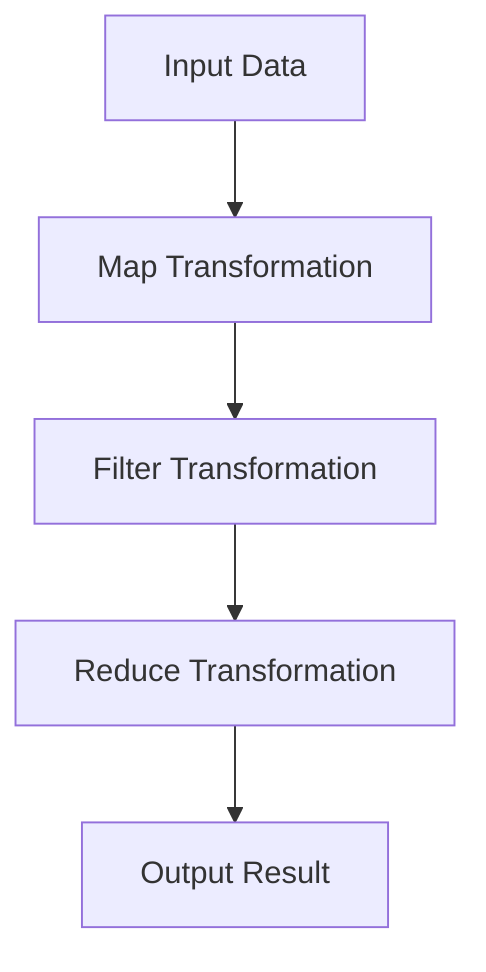

## 9.9 Transducers for Data Transformation

In the realm of functional programming, transducers stand out as a powerful tool for transforming data efficiently. They allow us to compose higher-order reducers that can process data without creating intermediate collections, leading to improved performance and memory efficiency. In this section, we'll delve into the concept of transducers, explore how to build them for common transformations, and discuss their benefits in JavaScript.

### What Are Transducers?

Transducers are composable higher-order functions that transform data step-by-step in a pipeline, without creating intermediate data structures. They are designed to work with any data source that can be reduced, such as arrays, streams, or iterators. By eliminating the need for intermediate collections, transducers improve both performance and memory usage.

#### Purpose of Transducers

The primary purpose of transducers is to enable efficient data processing by:

- **Composing transformations**: Transducers allow you to compose a series of transformations into a single operation.
- **Avoiding intermediate collections**: By processing data in a single pass, transducers eliminate the need for temporary data structures.
- **Enhancing performance**: With fewer memory allocations and reduced overhead, transducers can significantly boost performance.

### Building Transducers for Common Transformations

Let's explore how to build transducers for common data transformations such as mapping, filtering, and reducing.

#### Mapping with Transducers

Mapping is a common operation where each element of a collection is transformed based on a function. Here's how you can create a transducer for mapping:

```javascript
// A simple map transducer
const mapTransducer = (mapFn) => (reducer) => (acc, value) => reducer(acc, mapFn(value));

// Example usage
const addOne = (x) => x + 1;
const sumReducer = (acc, value) => acc + value;

const transducedMap = mapTransducer(addOne)(sumReducer);

const result = [1, 2, 3, 4].reduce(transducedMap, 0);
console.log(result); // Output: 14
```

In this example, `mapTransducer` takes a mapping function `mapFn` and returns a new reducer that applies `mapFn` to each value before passing it to the original reducer.

#### Filtering with Transducers

Filtering involves selecting elements from a collection based on a predicate function. Here's how to create a filter transducer:

```javascript
// A simple filter transducer
const filterTransducer = (predicate) => (reducer) => (acc, value) =>
  predicate(value) ? reducer(acc, value) : acc;

// Example usage
const isEven = (x) => x % 2 === 0;

const transducedFilter = filterTransducer(isEven)(sumReducer);

const filteredResult = [1, 2, 3, 4].reduce(transducedFilter, 0);
console.log(filteredResult); // Output: 6
```

The `filterTransducer` checks each value against the predicate and only passes it to the reducer if the predicate returns true.

#### Combining Transducers

One of the key strengths of transducers is their composability. You can easily combine multiple transducers to perform complex transformations in a single pass:

```javascript
// Composing map and filter transducers
const composedTransducer = mapTransducer(addOne)(filterTransducer(isEven)(sumReducer));

const combinedResult = [1, 2, 3, 4].reduce(composedTransducer, 0);
console.log(combinedResult); // Output: 10
```

In this example, we first map each element by adding one, then filter out odd numbers, and finally sum the remaining values.

### Benefits of Using Transducers

Transducers offer several advantages over traditional data transformation methods:

- **Improved Performance**: By eliminating intermediate collections, transducers reduce the overhead of memory allocation and garbage collection, leading to faster execution.
- **Memory Efficiency**: Transducers process data in a single pass, minimizing memory usage and avoiding unnecessary data duplication.
- **Reusability and Composability**: Transducers are highly composable, allowing you to build complex transformations from simple, reusable components.
- **Flexibility**: Transducers can be applied to any data source that supports reduction, making them versatile for various use cases.

### Avoiding Unnecessary Intermediate Data Structures

Traditional methods of chaining transformations often involve creating intermediate arrays, which can be inefficient for large datasets. Transducers address this issue by processing data in a single pass, as illustrated in the following diagram:



In this flowchart, data flows through each transformation step without creating intermediate collections, resulting in a more efficient process.

### Libraries for Transducers

While you can implement transducers manually, several libraries provide robust implementations and additional utilities. One such library is [transducers.js](https://github.com/cognitect-labs/transducers-js), which offers a comprehensive set of transducer functions and utilities for JavaScript.

#### Using transducers.js

Here's an example of using `transducers.js` to perform a series of transformations:

```javascript
const t = require('transducers-js');

const addOne = (x) => x + 1;
const isEven = (x) => x % 2 === 0;

const transducer = t.compose(
  t.map(addOne),
  t.filter(isEven)
);

const result = t.into([], transducer, [1, 2, 3, 4]);
console.log(result); // Output: [2, 4]
```

In this example, we use `transducers.js` to compose a map and filter transducer, then apply it to an array using `t.into`.

### Key Takeaways

- **Transducers** are powerful tools for efficient data transformation, enabling you to compose transformations without creating intermediate collections.
- **Performance and Memory Efficiency**: Transducers improve performance and memory usage by processing data in a single pass.
- **Composability**: Transducers can be easily composed to build complex transformations from simple components.
- **Flexibility**: They can be applied to any data source that supports reduction, making them versatile for various use cases.

### Try It Yourself

Experiment with the provided code examples by modifying the transformation functions or combining different transducers. Try using `transducers.js` to explore additional utilities and features.

### Further Reading

For more information on transducers and functional programming in JavaScript, consider exploring the following resources:

- [MDN Web Docs on Functional Programming](https://developer.mozilla.org/en-US/docs/Web/JavaScript/Guide/Functions)
- [transducers.js GitHub Repository](https://github.com/cognitect-labs/transducers-js)
- [JavaScript Info on Functional Programming](https://javascript.info/functional-programming)

### Knowledge Check

To reinforce your understanding of transducers, try answering the following questions:

## Transducers in JavaScript: Quiz



### What is the primary purpose of transducers in JavaScript?

- [x] To enable efficient data processing by composing transformations without intermediate collections.
- [ ] To create new data structures for each transformation.
- [ ] To simplify asynchronous programming.
- [ ] To improve error handling in JavaScript.

> **Explanation:** Transducers are designed to enable efficient data processing by composing transformations without creating intermediate collections, thus improving performance and memory efficiency.

### How do transducers improve performance?

- [x] By eliminating intermediate collections and reducing memory allocations.
- [ ] By increasing the number of iterations over data.
- [ ] By using more complex algorithms.
- [ ] By simplifying the code structure.

> **Explanation:** Transducers improve performance by eliminating the need for intermediate collections, which reduces memory allocations and overhead.

### Which library provides robust implementations of transducers in JavaScript?

- [x] transducers.js
- [ ] lodash
- [ ] underscore
- [ ] async.js

> **Explanation:** The `transducers.js` library provides robust implementations of transducers and additional utilities for JavaScript.

### What is a key benefit of using transducers?

- [x] They allow for composing transformations into a single operation.
- [ ] They require more memory for processing data.
- [ ] They are only applicable to arrays.
- [ ] They simplify error handling.

> **Explanation:** Transducers allow for composing transformations into a single operation, which enhances performance and memory efficiency.

### What is the output of the following code snippet?

```javascript
const addOne = (x) => x + 1;
const isEven = (x) => x % 2 === 0;

const transducer = t.compose(
  t.map(addOne),
  t.filter(isEven)
);

const result = t.into([], transducer, [1, 2, 3, 4]);
console.log(result);
```

- [x] [2, 4]
- [ ] [1, 3]
- [ ] [3, 5]
- [ ] [2, 3, 4]

> **Explanation:** The code snippet uses a transducer to first add one to each element and then filter out odd numbers, resulting in `[2, 4]`.

### What is the role of a reducer in a transducer?

- [x] To accumulate results based on transformed data.
- [ ] To create intermediate collections.
- [ ] To handle asynchronous operations.
- [ ] To manage error handling.

> **Explanation:** In a transducer, a reducer accumulates results based on transformed data, allowing for efficient data processing.

### Which of the following is a common transformation that can be performed using transducers?

- [x] Mapping
- [x] Filtering
- [ ] Sorting
- [ ] Asynchronous operations

> **Explanation:** Transducers are commonly used for transformations like mapping and filtering, which can be composed into a single operation.

### What is a key advantage of transducers over traditional methods?

- [x] They process data in a single pass without intermediate collections.
- [ ] They require more complex code structures.
- [ ] They are limited to specific data types.
- [ ] They simplify asynchronous programming.

> **Explanation:** Transducers process data in a single pass without creating intermediate collections, which enhances performance and memory efficiency.

### True or False: Transducers can only be used with arrays.

- [ ] True
- [x] False

> **Explanation:** Transducers can be applied to any data source that supports reduction, not just arrays.

### True or False: Transducers are only useful for small datasets.

- [ ] True
- [x] False

> **Explanation:** Transducers are particularly beneficial for large datasets, as they improve performance and memory efficiency by avoiding intermediate collections.



Remember, this is just the beginning. As you progress, you'll build more complex and interactive web applications. Keep experimenting, stay curious, and enjoy the journey!
