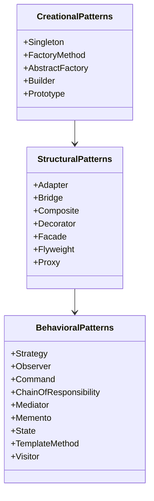

## 1.1 What Are Design Patterns?

### Definition and Purpose

Design patterns are a cornerstone of software engineering, providing general, reusable solutions to common problems encountered in software design. They are not finished designs that can be directly transformed into code but are templates for how to solve a problem in various situations. By understanding and applying design patterns, developers can create more flexible, elegant, and ultimately reusable code.

In the context of Julia, a high-level, high-performance programming language for technical computing, design patterns help developers leverage Julia’s unique features such as multiple dispatch, metaprogramming, and its rich type system. This guide aims to equip you with the knowledge to apply these patterns effectively in Julia, enhancing your ability to build efficient, scalable, and maintainable applications.

### Historical Context

The concept of design patterns in software engineering was popularized by the "Gang of Four" (GoF) in their seminal book, "Design Patterns: Elements of Reusable Object-Oriented Software," published in 1994. The authors—Erich Gamma, Richard Helm, Ralph Johnson, and John Vlissides—introduced 23 classic design patterns that have since become foundational in the field of software development.

The idea of design patterns originated from the work of architect Christopher Alexander, who introduced the concept in the context of architecture and urban design. Alexander's patterns were intended to provide a common language for discussing design problems and solutions, a concept that translated well into software engineering.

### Classification of Design Patterns

Design patterns are typically classified into three main categories: Creational, Structural, and Behavioral. Each category addresses a different aspect of software design.

#### Creational Patterns

Creational patterns focus on the process of object creation. They abstract the instantiation process, making it more flexible and reusable. These patterns help make a system independent of how its objects are created, composed, and represented. Key creational patterns include:

- **Singleton**: Ensures a class has only one instance and provides a global point of access to it.
- **Factory Method**: Defines an interface for creating an object but lets subclasses alter the type of objects that will be created.
- **Abstract Factory**: Provides an interface for creating families of related or dependent objects without specifying their concrete classes.
- **Builder**: Separates the construction of a complex object from its representation, allowing the same construction process to create different representations.
- **Prototype**: Specifies the kinds of objects to create using a prototypical instance and creates new objects by copying this prototype.

#### Structural Patterns

Structural patterns deal with object composition or the structure of classes. They help ensure that if one part of a system changes, the entire system doesn’t need to change. These patterns focus on how classes and objects can be combined to form larger structures. Key structural patterns include:

- **Adapter**: Allows incompatible interfaces to work together by converting the interface of a class into another interface the client expects.
- **Bridge**: Separates an object’s abstraction from its implementation so that the two can vary independently.
- **Composite**: Composes objects into tree structures to represent part-whole hierarchies, allowing clients to treat individual objects and compositions uniformly.
- **Decorator**: Adds additional responsibilities to an object dynamically, providing a flexible alternative to subclassing for extending functionality.
- **Facade**: Provides a simplified interface to a complex subsystem, making it easier to use.
- **Flyweight**: Reduces the cost of creating and manipulating a large number of similar objects.
- **Proxy**: Provides a surrogate or placeholder for another object to control access to it.

#### Behavioral Patterns

Behavioral patterns focus on communication between objects, specifically how they interact and communicate with each other. These patterns help define how objects exchange information and responsibilities. Key behavioral patterns include:

- **Strategy**: Defines a family of algorithms, encapsulates each one, and makes them interchangeable, allowing the algorithm to vary independently from clients that use it.
- **Observer**: Defines a one-to-many dependency between objects so that when one object changes state, all its dependents are notified and updated automatically.
- **Command**: Encapsulates a request as an object, thereby allowing for parameterization of clients with queues, requests, and operations.
- **Chain of Responsibility**: Passes a request along a chain of handlers, allowing multiple objects to handle the request without coupling the sender to the receiver.
- **Mediator**: Defines an object that encapsulates how a set of objects interact, promoting loose coupling by keeping objects from referring to each other explicitly.
- **Memento**: Captures and externalizes an object’s internal state without violating encapsulation, so that the object can be restored to this state later.
- **State**: Allows an object to alter its behavior when its internal state changes, appearing to change its class.
- **Template Method**: Defines the skeleton of an algorithm in an operation, deferring some steps to subclasses.
- **Visitor**: Represents an operation to be performed on the elements of an object structure, allowing you to define a new operation without changing the classes of the elements on which it operates.

### Visualizing Design Patterns

To better understand how design patterns fit into software design, let's visualize the relationships and interactions between these patterns using a class diagram.



**Diagram Explanation**: This class diagram illustrates the three main categories of design patterns: Creational, Structural, and Behavioral. Each category contains specific patterns that address different aspects of software design. The arrows indicate the flow and interaction between these categories, emphasizing how they can be used together to solve complex design problems.

### Code Examples

Let's explore a simple example of the Singleton pattern in Julia to illustrate how design patterns can be implemented.

```julia

mutable struct Singleton
    value::Int
end

const instance = Ref{Singleton}()

function get_instance()
    if instance[] === nothing
        instance[] = Singleton(0)  # Initialize with default value
    end
    return instance[]
end

singleton1 = get_instance()
singleton2 = get_instance()

println(singleton1 === singleton2)  # Output: true

singleton1.value = 42
println(singleton2.value)  # Output: 42
```

**Code Explanation**: In this example, we define a `Singleton` struct and use a global `Ref` to hold the single instance. The `get_instance` function checks if the instance is already created; if not, it initializes it. This ensures that only one instance of `Singleton` exists throughout the application.

### Try It Yourself

To deepen your understanding, try modifying the Singleton pattern example:

- Change the default value of the `Singleton` instance.
- Add a method to reset the singleton instance.
- Implement a thread-safe version of the Singleton pattern.

### References and Links

For further reading on design patterns, consider exploring the following resources:

- [Design Patterns: Elements of Reusable Object-Oriented Software](https://en.wikipedia.org/wiki/Design_Patterns) by Erich Gamma et al.
- [Refactoring.Guru](https://refactoring.guru/design-patterns) for detailed explanations and examples of design patterns.
- [JuliaLang](https://julialang.org/) for official Julia documentation and resources.

### Knowledge Check

To reinforce your understanding, consider the following questions:

- What are the three main categories of design patterns?
- How does the Singleton pattern ensure only one instance of a class is created?
- What is the historical origin of design patterns in software engineering?

### Embrace the Journey

Remember, this is just the beginning. As you progress, you'll discover more complex patterns and how they can be applied in Julia. Keep experimenting, stay curious, and enjoy the journey!

## Quiz Time!



### What is the primary purpose of design patterns in software engineering?

- [x] To provide reusable solutions to common design problems
- [ ] To dictate the exact code structure for applications
- [ ] To replace the need for software documentation
- [ ] To enforce strict coding standards

> **Explanation:** Design patterns offer reusable solutions to common design problems, helping developers create flexible and maintainable code.

### Which book popularized the concept of design patterns in software engineering?

- [x] "Design Patterns: Elements of Reusable Object-Oriented Software"
- [ ] "The Pragmatic Programmer"
- [ ] "Clean Code"
- [ ] "Code Complete"

> **Explanation:** The book "Design Patterns: Elements of Reusable Object-Oriented Software" by the "Gang of Four" is credited with popularizing design patterns.

### What are the three main categories of design patterns?

- [x] Creational, Structural, Behavioral
- [ ] Functional, Procedural, Object-Oriented
- [ ] Abstract, Concrete, Hybrid
- [ ] Static, Dynamic, Hybrid

> **Explanation:** Design patterns are classified into three main categories: Creational, Structural, and Behavioral.

### Which pattern ensures a class has only one instance?

- [x] Singleton
- [ ] Factory Method
- [ ] Observer
- [ ] Adapter

> **Explanation:** The Singleton pattern ensures that a class has only one instance and provides a global point of access to it.

### What is the main focus of Structural design patterns?

- [x] Object composition and class structure
- [ ] Object creation
- [ ] Object behavior and communication
- [ ] Object destruction

> **Explanation:** Structural patterns focus on object composition and the structure of classes.

### Which pattern is used to define a family of algorithms and make them interchangeable?

- [x] Strategy
- [ ] Observer
- [ ] Command
- [ ] Proxy

> **Explanation:** The Strategy pattern defines a family of algorithms, encapsulates each one, and makes them interchangeable.

### What is the role of the Adapter pattern?

- [x] To allow incompatible interfaces to work together
- [ ] To create a simplified interface to a complex subsystem
- [ ] To add additional responsibilities to an object dynamically
- [ ] To reduce the cost of creating and manipulating objects

> **Explanation:** The Adapter pattern allows incompatible interfaces to work together by converting one interface into another.

### Which pattern is used to capture and externalize an object's internal state?

- [x] Memento
- [ ] State
- [ ] Mediator
- [ ] Visitor

> **Explanation:** The Memento pattern captures and externalizes an object's internal state without violating encapsulation.

### True or False: The Bridge pattern separates an object's abstraction from its implementation.

- [x] True
- [ ] False

> **Explanation:** The Bridge pattern separates an object's abstraction from its implementation, allowing them to vary independently.

### Which pattern provides a surrogate or placeholder for another object to control access to it?

- [x] Proxy
- [ ] Decorator
- [ ] Composite
- [ ] Flyweight

> **Explanation:** The Proxy pattern provides a surrogate or placeholder for another object to control access to it.




