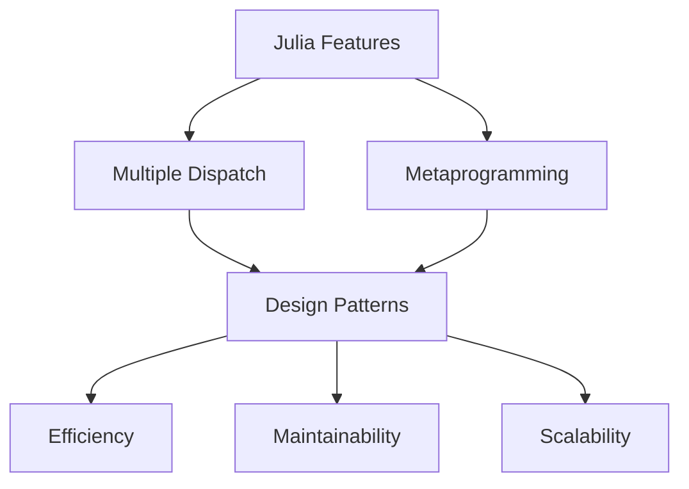

## 1.2 The Importance of Design Patterns in Julia

In the realm of software development, design patterns serve as time-tested solutions to common problems. They provide a structured approach to solving design challenges, ensuring that code is not only functional but also efficient, maintainable, and scalable. In this section, we will explore the significance of design patterns in the Julia programming language, focusing on how Julia's unique features like multiple dispatch and metaprogramming influence these patterns.

### Julia's Unique Features

Julia stands out in the programming world due to its distinctive features, which include multiple dispatch and metaprogramming. These features not only enhance the language's flexibility and performance but also shape the way design patterns are implemented.

#### Multiple Dispatch

Multiple dispatch is a core feature of Julia that allows functions to be defined for different combinations of argument types. This capability enables more flexible and reusable code, as functions can be tailored to handle various data types seamlessly.

**Example:**

```julia
function area(shape::Circle)
    return π * shape.radius^2
end

function area(shape::Rectangle)
    return shape.width * shape.height
end

struct Circle
    radius::Float64
end

struct Rectangle
    width::Float64
    height::Float64
end

c = Circle(5.0)
r = Rectangle(4.0, 6.0)

println(area(c))  # Output: 78.53981633974483
println(area(r))  # Output: 24.0
```

In this example, the `area` function is defined for both `Circle` and `Rectangle` types, demonstrating how multiple dispatch allows for clean and efficient handling of different data structures.

#### Metaprogramming

Metaprogramming in Julia allows developers to write code that generates other code. This feature is particularly powerful for creating domain-specific languages (DSLs) and optimizing performance by eliminating repetitive code patterns.

**Example:**

```julia
macro generate_getters(T)
    quote
        for field in fieldnames($T)
            @eval function get_$(field)(x::$T)
                return getfield(x, field)
            end
        end
    end
end

struct Point
    x::Float64
    y::Float64
end

@generate_getters Point

p = Point(3.0, 4.0)

println(get_x(p))  # Output: 3.0
println(get_y(p))  # Output: 4.0
```

Here, the `@generate_getters` macro dynamically creates getter functions for each field in the `Point` struct, showcasing the power of metaprogramming in reducing boilerplate code.

### Benefits in Julia Development

Design patterns in Julia offer several benefits that contribute to the development of efficient, maintainable, and scalable applications.

#### Efficiency

By leveraging multiple dispatch, Julia allows developers to write concise and efficient code. Design patterns that utilize this feature can lead to performance improvements, as functions are optimized for specific data types.

#### Maintainability

Design patterns provide a blueprint for organizing code, making it easier to understand and maintain. In Julia, patterns that incorporate metaprogramming can reduce code duplication, leading to cleaner and more maintainable codebases.

#### Scalability

Julia's ability to handle large datasets and perform complex computations efficiently makes it ideal for scalable applications. Design patterns that take advantage of Julia's parallel computing capabilities can further enhance scalability.

### Bridging Concepts

For developers transitioning from other languages to Julia, understanding design patterns can ease the learning curve. Many patterns are language-agnostic, allowing developers to apply familiar concepts in a new context.

#### Transitioning from Object-Oriented Languages

In object-oriented languages, design patterns often revolve around classes and inheritance. Julia, however, emphasizes composition over inheritance, using structs and multiple dispatch to achieve similar outcomes.

**Example:**

```julia
struct Animal
    name::String
end

function speak(animal::Animal)
    println("Generic animal sound")
end

struct Dog <: Animal
end

function speak(dog::Dog)
    println("Woof!")
end

a = Animal("Generic")
d = Dog("Buddy")

speak(a)  # Output: Generic animal sound
speak(d)  # Output: Woof!
```

In this example, we see how Julia uses multiple dispatch to achieve polymorphic behavior, similar to method overriding in object-oriented languages.

#### Transitioning from Functional Languages

Functional programming concepts, such as higher-order functions and immutability, are also prevalent in Julia. Design patterns that incorporate these concepts can help developers transition from functional languages.

**Example:**

```julia
function apply_twice(f, x)
    return f(f(x))
end

square(x) = x^2

println(apply_twice(square, 2))  # Output: 16
```

Here, the `apply_twice` function demonstrates how higher-order functions can be used in Julia, a concept familiar to developers from functional programming backgrounds.

### Visualizing Julia's Interaction with Design Patterns

To better understand how Julia's features influence design patterns, let's visualize the interaction between multiple dispatch, metaprogramming, and design patterns.



**Diagram Description:** This diagram illustrates how Julia's features, such as multiple dispatch and metaprogramming, interact with design patterns to enhance efficiency, maintainability, and scalability in software development.

### Conclusion

Design patterns play a crucial role in Julia development, providing structured solutions to common design challenges. By leveraging Julia's unique features like multiple dispatch and metaprogramming, developers can create efficient, maintainable, and scalable applications. Understanding these patterns not only enhances one's ability to write robust Julia code but also facilitates the transition from other programming paradigms.

Remember, this is just the beginning. As you progress, you'll discover more complex patterns and techniques that will further enhance your Julia programming skills. Keep experimenting, stay curious, and enjoy the journey!

## Quiz Time!



### What is a core feature of Julia that allows functions to be defined for different combinations of argument types?

- [x] Multiple Dispatch
- [ ] Single Dispatch
- [ ] Polymorphism
- [ ] Inheritance

> **Explanation:** Multiple dispatch is a core feature of Julia that enables functions to be defined for various combinations of argument types, enhancing flexibility and reusability.

### How does metaprogramming benefit Julia developers?

- [x] By allowing code to generate other code
- [ ] By enforcing strict type checking
- [ ] By simplifying syntax
- [ ] By improving runtime performance only

> **Explanation:** Metaprogramming allows developers to write code that generates other code, reducing redundancy and enabling the creation of domain-specific languages.

### Which design pattern is demonstrated by using multiple dispatch to handle different data types?

- [x] Strategy Pattern
- [ ] Singleton Pattern
- [ ] Observer Pattern
- [ ] Factory Pattern

> **Explanation:** The Strategy Pattern is demonstrated by using multiple dispatch to define functions for different data types, allowing for flexible and reusable code.

### What is the primary benefit of using design patterns in Julia?

- [x] They provide structured solutions to common design challenges.
- [ ] They enforce a specific coding style.
- [ ] They eliminate the need for testing.
- [ ] They increase code verbosity.

> **Explanation:** Design patterns offer structured solutions to common design challenges, improving code efficiency, maintainability, and scalability.

### How does Julia's emphasis on composition over inheritance influence design patterns?

- [x] It encourages the use of structs and multiple dispatch.
- [ ] It mandates the use of classes and inheritance.
- [ ] It discourages the use of functions.
- [ ] It limits code reusability.

> **Explanation:** Julia emphasizes composition over inheritance, encouraging the use of structs and multiple dispatch to achieve similar outcomes as method overriding in object-oriented languages.

### What is a higher-order function in Julia?

- [x] A function that takes other functions as arguments
- [ ] A function that returns a constant value
- [ ] A function that modifies global variables
- [ ] A function that only performs arithmetic operations

> **Explanation:** A higher-order function is one that takes other functions as arguments, allowing for more abstract and flexible code design.

### How can design patterns help developers transitioning from other languages to Julia?

- [x] By providing familiar concepts in a new context
- [ ] By enforcing strict language-specific rules
- [ ] By limiting the use of Julia's unique features
- [ ] By simplifying syntax

> **Explanation:** Design patterns offer familiar concepts that can be applied in Julia, easing the transition for developers coming from other programming languages.

### What role does metaprogramming play in reducing boilerplate code?

- [x] It allows for dynamic code generation.
- [ ] It enforces strict syntax rules.
- [ ] It simplifies error handling.
- [ ] It limits code execution.

> **Explanation:** Metaprogramming allows for dynamic code generation, reducing boilerplate code and enhancing code maintainability.

### Which feature of Julia is particularly powerful for creating domain-specific languages?

- [x] Metaprogramming
- [ ] Multiple Dispatch
- [ ] Type Inference
- [ ] Garbage Collection

> **Explanation:** Metaprogramming is particularly powerful for creating domain-specific languages, as it allows developers to write code that generates other code.

### True or False: Design patterns in Julia can lead to performance improvements by optimizing functions for specific data types.

- [x] True
- [ ] False

> **Explanation:** True. Design patterns that leverage multiple dispatch can optimize functions for specific data types, leading to performance improvements.


