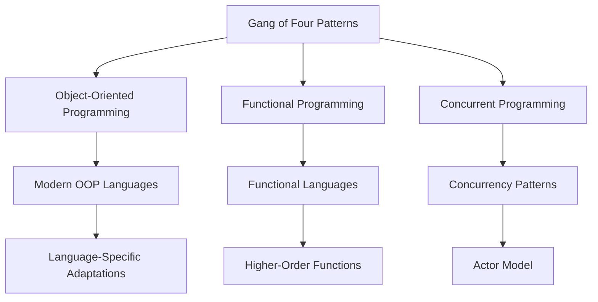

## 1.3 History and Evolution of Design Patterns

Design patterns are a cornerstone of software engineering, providing reusable solutions to common problems in software design. They offer a shared language for developers to communicate complex ideas succinctly. In this section, we will delve into the history and evolution of design patterns, beginning with the seminal work of the Gang of Four (GoF), exploring their adaptation over time, and examining their modern relevance, particularly in the context of the Julia programming language.

### The Gang of Four (GoF)

The concept of design patterns in software engineering was popularized by the book *"Design Patterns: Elements of Reusable Object-Oriented Software"*, published in 1994 by Erich Gamma, Richard Helm, Ralph Johnson, and John Vlissides, collectively known as the Gang of Four (GoF). This book introduced 23 classic design patterns, categorized into creational, structural, and behavioral patterns, which have become foundational in object-oriented design.

#### Impact on Software Design

The GoF's work had a profound impact on software design by formalizing the concept of design patterns. It provided a vocabulary for software architects and developers to describe solutions to recurring design problems. This not only facilitated better communication but also encouraged the reuse of proven solutions, leading to more robust and maintainable software systems.

**Key Contributions of the GoF:**

- **Standardization**: The GoF book standardized the terminology and structure for documenting design patterns, making it easier for developers to learn and apply them.
- **Reusability**: By promoting the reuse of design patterns, the GoF helped reduce development time and improve code quality.
- **Education**: The book became a staple in computer science education, influencing generations of software engineers.

### Adaptation Over Time

As programming paradigms and languages have evolved, so too have design patterns. The original GoF patterns were primarily focused on object-oriented programming (OOP), but the principles behind them have been adapted to suit other paradigms, such as functional programming and concurrent programming.

#### Evolution with Programming Paradigms

1. **Functional Programming**: In functional programming languages, such as Haskell and Scala, some traditional OOP patterns are less relevant or take on different forms. For example, the Strategy pattern can be implemented using higher-order functions.

2. **Concurrent and Parallel Programming**: With the rise of multi-core processors, patterns that address concurrency and parallelism have gained prominence. Patterns like the Actor model and Futures/Promises are examples of this evolution.

3. **Domain-Specific Languages (DSLs)**: As DSLs have become more popular, design patterns have been adapted to fit the unique requirements of these languages. For instance, the Interpreter pattern is often used in the implementation of DSLs.

#### Language-Specific Adaptations

Different programming languages have unique features that influence how design patterns are implemented. For example, in Julia, multiple dispatch and metaprogramming offer new ways to implement patterns that might be cumbersome in other languages.

**Example: Implementing the Singleton Pattern in Julia**

```julia
module SingletonExample

mutable struct Singleton
    value::Int
end

const instance = Singleton(0)

function get_instance()
    return instance
end

function set_value(new_value::Int)
    instance.value = new_value
end

end

using .SingletonExample

singleton = SingletonExample.get_instance()
println("Initial value: ", singleton.value)

SingletonExample.set_value(42)
println("Updated value: ", singleton.value)
```

In this example, we use Julia's module system to encapsulate the Singleton pattern. The `instance` is a global constant within the module, ensuring that only one instance exists.

### Modern Relevance

Despite the changes in programming languages and paradigms, design patterns remain relevant in contemporary software development. They continue to provide a framework for solving common design problems and are especially valuable in complex systems where clear communication and maintainability are crucial.

#### Why Design Patterns Matter Today

1. **Complexity Management**: As software systems grow in complexity, design patterns help manage this complexity by providing proven solutions to common problems.

2. **Interdisciplinary Communication**: Design patterns offer a common language that can be understood across different teams and disciplines, facilitating better collaboration.

3. **Adaptability**: Patterns can be adapted to new technologies and paradigms, ensuring their continued relevance. For instance, patterns like MVC (Model-View-Controller) have been adapted for use in web development frameworks.

4. **Educational Value**: Design patterns are an essential part of software engineering education, helping new developers understand the principles of good design.

#### Design Patterns in Julia

Julia, with its unique features like multiple dispatch and metaprogramming, offers new opportunities for implementing design patterns. These features allow for more flexible and efficient pattern implementations, making Julia an exciting language for exploring modern design patterns.

**Example: Strategy Pattern with Multiple Dispatch in Julia**

```julia
abstract type Strategy end

struct ConcreteStrategyA <: Strategy end
struct ConcreteStrategyB <: Strategy end

function execute_strategy(strategy::ConcreteStrategyA)
    println("Executing strategy A")
end

function execute_strategy(strategy::ConcreteStrategyB)
    println("Executing strategy B")
end

strategy = ConcreteStrategyA()
execute_strategy(strategy)

strategy = ConcreteStrategyB()
execute_strategy(strategy)
```

In this example, we leverage Julia's multiple dispatch to implement the Strategy pattern. Each strategy is a subtype of the abstract `Strategy` type, and the appropriate method is dispatched based on the concrete strategy type.

### Visualizing the Evolution of Design Patterns

To better understand the evolution of design patterns, let's visualize the transition from the GoF's original patterns to their modern adaptations.



**Diagram Description**: This diagram illustrates the evolution of design patterns from the original GoF patterns to their adaptations in modern programming paradigms, including object-oriented, functional, and concurrent programming.

### Conclusion

The history and evolution of design patterns demonstrate their enduring value in software development. From the foundational work of the Gang of Four to their modern adaptations in languages like Julia, design patterns continue to provide essential tools for managing complexity and improving communication in software design. As we continue to explore new paradigms and technologies, design patterns will undoubtedly evolve further, maintaining their relevance in the ever-changing landscape of software engineering.

### Embrace the Journey

Remember, understanding design patterns is just the beginning. As you progress in your journey with Julia and other programming languages, you'll discover new ways to apply these patterns to solve complex problems. Keep experimenting, stay curious, and enjoy the journey!

## Quiz Time!



### Who are the authors of the seminal book on design patterns?

- [x] Erich Gamma, Richard Helm, Ralph Johnson, John Vlissides
- [ ] Martin Fowler, Kent Beck, Erich Gamma, John Vlissides
- [ ] Robert C. Martin, Martin Fowler, Kent Beck, Ralph Johnson
- [ ] Erich Gamma, Martin Fowler, Robert C. Martin, Kent Beck

> **Explanation:** The authors of the seminal book *"Design Patterns: Elements of Reusable Object-Oriented Software"* are Erich Gamma, Richard Helm, Ralph Johnson, and John Vlissides, collectively known as the Gang of Four.

### What is the primary focus of the original GoF design patterns?

- [x] Object-Oriented Programming
- [ ] Functional Programming
- [ ] Concurrent Programming
- [ ] Domain-Specific Languages

> **Explanation:** The original GoF design patterns primarily focus on object-oriented programming.

### How have design patterns adapted to functional programming?

- [x] By using higher-order functions
- [ ] By using global variables
- [ ] By avoiding recursion
- [ ] By using inheritance

> **Explanation:** In functional programming, design patterns often adapt by using higher-order functions, which allow functions to be passed as arguments and returned as values.

### Which feature of Julia allows for flexible implementation of design patterns?

- [x] Multiple Dispatch
- [ ] Single Inheritance
- [ ] Static Typing
- [ ] Global Variables

> **Explanation:** Julia's multiple dispatch allows for flexible implementation of design patterns by enabling method selection based on the types of all arguments.

### What is the Strategy pattern used for?

- [x] Encapsulating algorithms
- [ ] Managing global state
- [ ] Creating complex objects
- [ ] Simplifying interfaces

> **Explanation:** The Strategy pattern is used to encapsulate algorithms, allowing them to be interchangeable.

### Which modern programming paradigm has influenced the evolution of design patterns?

- [x] Concurrent Programming
- [ ] Procedural Programming
- [ ] Assembly Programming
- [ ] Machine Language

> **Explanation:** Concurrent programming has influenced the evolution of design patterns, leading to the development of patterns that address concurrency and parallelism.

### What is a key benefit of using design patterns?

- [x] Improved code maintainability
- [ ] Increased code complexity
- [ ] Reduced code readability
- [ ] Increased development time

> **Explanation:** A key benefit of using design patterns is improved code maintainability, as they provide proven solutions to common design problems.

### How do design patterns help in interdisciplinary communication?

- [x] By providing a common language
- [ ] By increasing technical jargon
- [ ] By reducing documentation
- [ ] By focusing on implementation details

> **Explanation:** Design patterns help in interdisciplinary communication by providing a common language that can be understood across different teams and disciplines.

### What is a common use of the Interpreter pattern?

- [x] Implementing domain-specific languages
- [ ] Managing global state
- [ ] Simplifying interfaces
- [ ] Creating complex objects

> **Explanation:** The Interpreter pattern is commonly used in the implementation of domain-specific languages.

### True or False: Design patterns are only relevant in object-oriented programming.

- [ ] True
- [x] False

> **Explanation:** False. Design patterns are relevant in various programming paradigms, including functional and concurrent programming, and have been adapted to suit the unique features of different languages.


