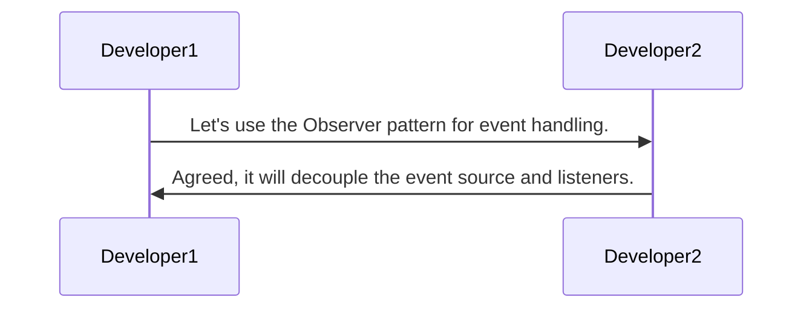
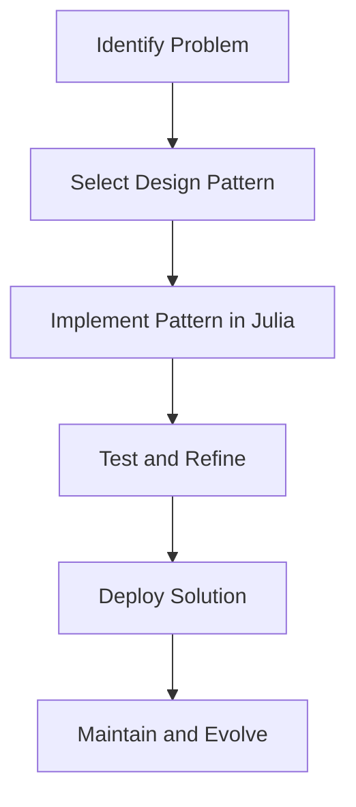

## 1.4 The Role of Design Patterns in Software Development

Design patterns are a cornerstone of software engineering, offering a set of proven solutions to common problems encountered during software development. They serve as a bridge between theoretical design principles and practical implementation, providing a shared language that enhances communication among developers and guides architectural decisions. In this section, we will explore the multifaceted role of design patterns in software development, with a particular focus on their application in Julia programming.

### Problem-Solving Tools

Design patterns are akin to a toolkit for developers, offering solutions that have been refined through years of practical application. They encapsulate best practices and provide a blueprint for solving recurring design challenges. By leveraging design patterns, developers can avoid reinventing the wheel and focus on the unique aspects of their projects.

#### Example: Singleton Pattern in Julia

The Singleton pattern ensures that a class has only one instance and provides a global point of access to it. This pattern is particularly useful in scenarios where a single object is needed to coordinate actions across the system.

```julia

module SingletonExample

mutable struct Singleton
    value::Int
end

const _instance = Singleton(0)

function get_instance()
    return _instance
end

function set_value(val::Int)
    _instance.value = val
end

function get_value()
    return _instance.value
end

end

using .SingletonExample

instance = SingletonExample.get_instance()
SingletonExample.set_value(42)
println(SingletonExample.get_value())  # Output: 42
```

In this example, the `Singleton` struct is designed to have only one instance, which is accessed and modified through the `get_instance`, `set_value`, and `get_value` functions. This pattern is particularly useful for managing shared resources or configurations.

### Communication Among Developers

Design patterns serve as a lingua franca among developers, facilitating clear and concise communication. By using well-known patterns, developers can convey complex design ideas succinctly, reducing misunderstandings and improving collaboration.

#### Visualizing Communication with Design Patterns



In this sequence diagram, two developers quickly agree on using the Observer pattern, demonstrating how design patterns streamline communication and decision-making.

### Framework for Design Decisions

Design patterns provide a framework for making informed design decisions. They guide developers in structuring their code in a way that is both efficient and maintainable. By adhering to established patterns, developers can ensure that their code is robust and scalable.

#### Example: Factory Method Pattern in Julia

The Factory Method pattern defines an interface for creating objects but allows subclasses to alter the type of objects that will be created. This pattern is useful for promoting loose coupling and enhancing flexibility.

```julia

abstract type Product end

struct ConcreteProductA <: Product end
struct ConcreteProductB <: Product end

abstract type Creator end

mutable struct ConcreteCreatorA <: Creator end
mutable struct ConcreteCreatorB <: Creator end

function create_product(creator::ConcreteCreatorA)::Product
    return ConcreteProductA()
end

function create_product(creator::ConcreteCreatorB)::Product
    return ConcreteProductB()
end

creator_a = ConcreteCreatorA()
product_a = create_product(creator_a)

creator_b = ConcreteCreatorB()
product_b = create_product(creator_b)
```

In this example, the `create_product` function acts as a factory method, allowing different creators to produce different products. This pattern is particularly useful when the exact type of object to be created is determined at runtime.

### Design Patterns in Julia: Unique Considerations

Julia's unique features, such as multiple dispatch and metaprogramming, offer new dimensions to the application of design patterns. These features allow for more flexible and dynamic implementations, enabling developers to tailor patterns to their specific needs.

#### Leveraging Multiple Dispatch

Multiple dispatch in Julia allows functions to be defined for different combinations of argument types, providing a powerful mechanism for implementing design patterns.

```julia

abstract type Strategy end

struct ConcreteStrategyA <: Strategy end
struct ConcreteStrategyB <: Strategy end

function execute_strategy(strategy::ConcreteStrategyA)
    println("Executing strategy A")
end

function execute_strategy(strategy::ConcreteStrategyB)
    println("Executing strategy B")
end

strategy_a = ConcreteStrategyA()
execute_strategy(strategy_a)

strategy_b = ConcreteStrategyB()
execute_strategy(strategy_b)
```

In this example, multiple dispatch is used to implement the Strategy pattern, allowing different strategies to be executed based on the type of the strategy object.

### Try It Yourself

Experiment with the code examples provided by modifying the structures and functions. For instance, try creating additional strategies in the Strategy pattern example and observe how multiple dispatch handles the new types.

### Visualizing Design Patterns in Julia

To better understand the role of design patterns in Julia, let's visualize how they fit into the broader software development process.



This flowchart illustrates the iterative process of identifying a problem, selecting an appropriate design pattern, implementing it in Julia, and refining the solution through testing and maintenance.

### References and Further Reading

For more information on design patterns and their application in software development, consider exploring the following resources:

- [Design Patterns: Elements of Reusable Object-Oriented Software](https://en.wikipedia.org/wiki/Design_Patterns) by Erich Gamma, Richard Helm, Ralph Johnson, and John Vlissides.
- [Refactoring: Improving the Design of Existing Code](https://martinfowler.com/books/refactoring.html) by Martin Fowler.
- [The Julia Language Documentation](https://docs.julialang.org/)

### Knowledge Check

To reinforce your understanding of the role of design patterns in software development, consider the following questions:

- How do design patterns facilitate communication among developers?
- What are the benefits of using the Singleton pattern in a software project?
- How does multiple dispatch enhance the implementation of design patterns in Julia?

### Embrace the Journey

Remember, mastering design patterns is a journey. As you continue to explore and apply these patterns in your projects, you'll gain deeper insights into their power and versatility. Keep experimenting, stay curious, and enjoy the process of becoming a more proficient Julia developer.

## Quiz Time!



### What is the primary role of design patterns in software development?

- [x] To provide proven solutions to common design problems
- [ ] To replace the need for documentation
- [ ] To eliminate the need for testing
- [ ] To automate code writing

> **Explanation:** Design patterns offer tried-and-tested solutions to recurring design challenges, helping developers avoid reinventing the wheel.

### How do design patterns facilitate communication among developers?

- [x] By providing a common language for discussing design solutions
- [ ] By eliminating the need for meetings
- [ ] By automating code reviews
- [ ] By reducing the need for documentation

> **Explanation:** Design patterns serve as a shared language that allows developers to communicate complex design ideas succinctly.

### What is a key benefit of using the Singleton pattern?

- [x] Ensures a class has only one instance
- [ ] Allows multiple instances of a class
- [ ] Simplifies code by removing the need for classes
- [ ] Automates object creation

> **Explanation:** The Singleton pattern ensures that a class has only one instance, which is useful for managing shared resources.

### How does multiple dispatch enhance design patterns in Julia?

- [x] By allowing functions to be defined for different combinations of argument types
- [ ] By eliminating the need for functions
- [ ] By simplifying the syntax of loops
- [ ] By automating memory management

> **Explanation:** Multiple dispatch allows for more flexible and dynamic implementations of design patterns by defining functions for different argument types.

### Which design pattern is useful for creating objects without specifying their exact class?

- [x] Factory Method
- [ ] Singleton
- [ ] Observer
- [ ] Strategy

> **Explanation:** The Factory Method pattern defines an interface for creating objects but allows subclasses to alter the type of objects that will be created.

### What is the primary purpose of the Strategy pattern?

- [x] To define a family of algorithms and make them interchangeable
- [ ] To ensure a class has only one instance
- [ ] To automate code writing
- [ ] To simplify the syntax of loops

> **Explanation:** The Strategy pattern defines a family of algorithms, encapsulates each one, and makes them interchangeable.

### How can design patterns guide architectural decisions?

- [x] By providing a framework for structuring code
- [ ] By eliminating the need for architecture
- [ ] By automating design choices
- [ ] By simplifying syntax

> **Explanation:** Design patterns provide a framework for making informed design decisions, ensuring code is robust and scalable.

### What is a key advantage of using design patterns in Julia?

- [x] They leverage Julia's unique features like multiple dispatch and metaprogramming
- [ ] They eliminate the need for functions
- [ ] They simplify syntax
- [ ] They automate memory management

> **Explanation:** Julia's unique features, such as multiple dispatch and metaprogramming, offer new dimensions to the application of design patterns.

### How do design patterns contribute to code maintainability?

- [x] By promoting best practices and reusable solutions
- [ ] By eliminating the need for documentation
- [ ] By automating code writing
- [ ] By simplifying syntax

> **Explanation:** Design patterns encapsulate best practices and provide reusable solutions, enhancing code maintainability.

### True or False: Design patterns can replace the need for testing in software development.

- [ ] True
- [x] False

> **Explanation:** While design patterns provide proven solutions, they do not replace the need for thorough testing to ensure code quality and functionality.




