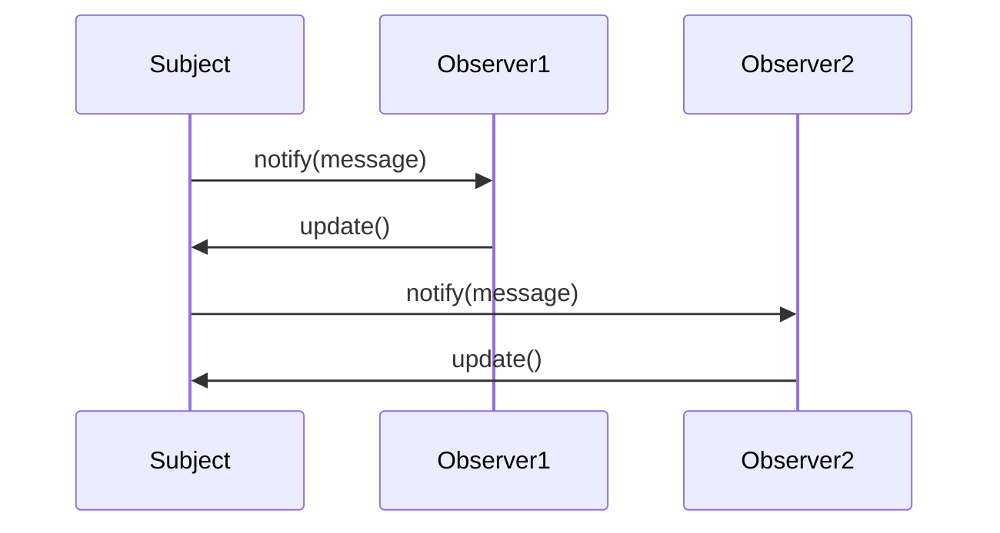

## 1.5 Benefits of Using Design Patterns in Julia

Design patterns are a crucial aspect of software development, providing a proven solution to common problems. In the context of Julia, a high-level, high-performance programming language for technical computing, design patterns offer several benefits that enhance the development process. Let's delve into these benefits and understand how they can be leveraged to create efficient, scalable, and maintainable applications.

### Enhanced Code Reusability

One of the primary benefits of using design patterns is the promotion of code reusability. Design patterns provide a template for solving problems that can be reused across different projects. This not only saves time but also ensures consistency in the codebase.

#### Example: Singleton Pattern

The Singleton pattern ensures a class has only one instance and provides a global point of access to it. This pattern is particularly useful in scenarios where a single object is required to coordinate actions across the system.

```julia
module SingletonExample

mutable struct Singleton
    value::Int
end

const instance = Singleton(0)

function get_instance()
    return instance
end

end
```

In this example, the `Singleton` struct is used to ensure that only one instance of the object exists. The `get_instance` function provides access to this instance, promoting code reusability by allowing different parts of the application to use the same instance without creating new ones.

#### Try It Yourself

Experiment with the Singleton pattern by modifying the `value` of the `Singleton` instance and observing how changes are reflected across different parts of your application.

### Improved Readability and Maintenance

Design patterns contribute to clearer and more organized codebases, making it easier for developers to read and maintain the code. By following a standard approach to solving problems, design patterns reduce the complexity of the code and make it more understandable.

#### Example: Observer Pattern

The Observer pattern is used to create a subscription mechanism to allow multiple objects to listen and react to events or changes in another object.

```julia
module ObserverExample

abstract type Observer end

mutable struct ConcreteObserver <: Observer
    id::Int
end

function update(observer::ConcreteObserver, message::String)
    println("Observer $(observer.id) received message: $message")
end

mutable struct Subject
    observers::Vector{Observer}
end

function Subject()
    return Subject(Vector{Observer}())
end

function attach(subject::Subject, observer::Observer)
    push!(subject.observers, observer)
end

function notify(subject::Subject, message::String)
    for observer in subject.observers
        update(observer, message)
    end
end

end
```

In this example, the `Observer` pattern is implemented to allow multiple observers to listen to changes in the `Subject`. This pattern improves readability by clearly defining the roles of the `Subject` and `Observer`, making the code easier to understand and maintain.

#### Try It Yourself

Add more observers to the `Subject` and send different messages to see how the pattern handles multiple notifications.

### Leveraging Julia's Strengths

Julia's strengths lie in its performance and expressive syntax. Design patterns can be adapted to exploit these strengths, resulting in efficient and elegant solutions.

#### Example: Factory Method Pattern

The Factory Method pattern provides an interface for creating objects in a superclass but allows subclasses to alter the type of objects that will be created.

```julia
module FactoryMethodExample

abstract type Product end

mutable struct ConcreteProductA <: Product
    name::String
end

mutable struct ConcreteProductB <: Product
    name::String
end

function create_product(type::Symbol)
    if type == :A
        return ConcreteProductA("Product A")
    elseif type == :B
        return ConcreteProductB("Product B")
    else
        error("Unknown product type")
    end
end

end
```

In this example, the Factory Method pattern is used to create different types of products. Julia's multiple dispatch feature allows for a clean and efficient implementation of this pattern, leveraging the language's strengths.

#### Try It Yourself

Extend the `FactoryMethodExample` module by adding new product types and modifying the `create_product` function to handle them.

### Visualizing Design Patterns in Julia

To better understand the interaction between different components in a design pattern, let's visualize the Observer pattern using a sequence diagram.



**Diagram Description:** This sequence diagram illustrates the interaction between the `Subject` and multiple `Observers` in the Observer pattern. The `Subject` notifies each `Observer`, which then updates itself based on the received message.

### References and Further Reading

- [Design Patterns: Elements of Reusable Object-Oriented Software](https://en.wikipedia.org/wiki/Design_Patterns) - A foundational book on design patterns.
- [JuliaLang Documentation](https://docs.julialang.org/) - Official documentation for Julia programming language.
- [Observer Pattern](https://refactoring.guru/design-patterns/observer) - Detailed explanation and examples of the Observer pattern.

### Knowledge Check

- What are the main benefits of using design patterns in Julia?
- How does the Singleton pattern promote code reusability?
- Why is the Observer pattern useful for improving code readability?
- How can the Factory Method pattern leverage Julia's strengths?

### Embrace the Journey

Remember, understanding and applying design patterns is just the beginning. As you progress, you'll discover more complex patterns and techniques that will enhance your Julia programming skills. Keep experimenting, stay curious, and enjoy the journey!

## Quiz Time!



### What is a primary benefit of using design patterns in Julia?

- [x] Enhanced code reusability
- [ ] Increased code complexity
- [ ] Reduced performance
- [ ] Limited flexibility

> **Explanation:** Design patterns promote reusable code structures, which is a primary benefit.

### How does the Singleton pattern enhance code reusability?

- [x] By ensuring a class has only one instance
- [ ] By creating multiple instances of a class
- [ ] By increasing code complexity
- [ ] By reducing code readability

> **Explanation:** The Singleton pattern ensures a class has only one instance, promoting reusability.

### What is the role of the Observer pattern?

- [x] To create a subscription mechanism for event handling
- [ ] To increase code complexity
- [ ] To reduce code readability
- [ ] To create multiple instances of a class

> **Explanation:** The Observer pattern allows multiple objects to listen and react to events or changes in another object.

### Which Julia feature is leveraged in the Factory Method pattern?

- [x] Multiple dispatch
- [ ] Single inheritance
- [ ] Global variables
- [ ] Static typing

> **Explanation:** Julia's multiple dispatch feature allows for a clean and efficient implementation of the Factory Method pattern.

### What is a benefit of improved code readability?

- [x] Easier maintenance
- [ ] Increased complexity
- [ ] Reduced performance
- [ ] Limited flexibility

> **Explanation:** Improved readability leads to easier maintenance and understanding of the codebase.

### How can design patterns be adapted in Julia?

- [x] By leveraging Julia's performance and expressive syntax
- [ ] By increasing code complexity
- [ ] By reducing code readability
- [ ] By limiting flexibility

> **Explanation:** Design patterns can be adapted to exploit Julia's strengths, resulting in efficient and elegant solutions.

### What is a key feature of the Singleton pattern?

- [x] Global point of access to a single instance
- [ ] Multiple instances of a class
- [ ] Increased code complexity
- [ ] Reduced performance

> **Explanation:** The Singleton pattern provides a global point of access to a single instance, ensuring only one instance exists.

### How does the Observer pattern improve code organization?

- [x] By clearly defining roles of Subject and Observer
- [ ] By increasing code complexity
- [ ] By reducing code readability
- [ ] By creating multiple instances of a class

> **Explanation:** The Observer pattern improves readability by clearly defining the roles of the Subject and Observer.

### What is a benefit of leveraging Julia's strengths in design patterns?

- [x] Efficient and elegant solutions
- [ ] Increased code complexity
- [ ] Reduced performance
- [ ] Limited flexibility

> **Explanation:** Leveraging Julia's strengths results in efficient and elegant solutions.

### True or False: Design patterns reduce the complexity of the code.

- [x] True
- [ ] False

> **Explanation:** Design patterns reduce the complexity of the code by providing a standard approach to solving problems.



By understanding and applying these benefits, you'll be well-equipped to harness the full potential of design patterns in Julia, leading to more efficient, readable, and maintainable code.
