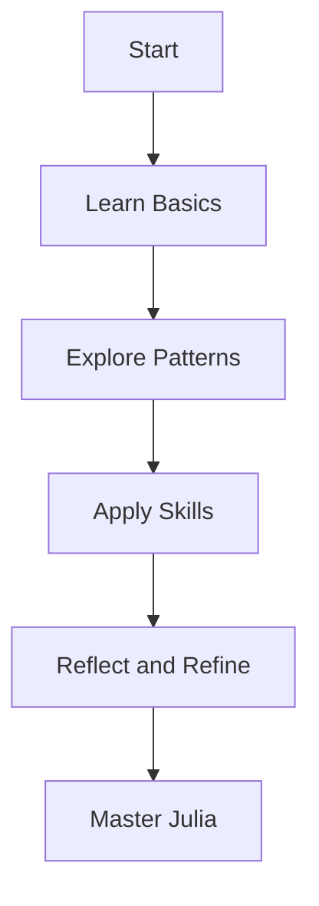

## 1.6 How to Use This Guide

Welcome to the **Julia Design Patterns & Best Practices: A Comprehensive Guide from Beginner to Expert**. This guide is meticulously crafted to help you navigate the intricacies of Julia programming, from foundational concepts to advanced design patterns. Whether you're a novice or a seasoned developer, this guide is structured to enhance your understanding and application of Julia's unique features. Let's explore how you can make the most of this resource.

### Navigating the Content

The guide is organized into a series of chapters, each focusing on a specific aspect of Julia programming and design patterns. Here's a roadmap to help you navigate through the content:

1. **Introduction to Design Patterns in Julia**: Begin with an understanding of what design patterns are and their significance in Julia. This section sets the stage for the rest of the guide by explaining the history, evolution, and benefits of using design patterns.

2. **Getting Started with Julia**: Familiarize yourself with the Julia environment, including installation, basic syntax, and language constructs. This section is crucial for setting up your development environment and understanding the basics of Julia programming.

3. **Julia Programming Fundamentals**: Dive deeper into Julia's core features, such as arrays, strings, and the type system. This section builds a strong foundation for more complex topics.

4. **Principles of Software Design in Julia**: Explore the programming paradigms supported by Julia and learn how to leverage multiple dispatch for flexible design. This section introduces key design principles and how they apply to Julia.

5. **Creational, Structural, and Behavioral Design Patterns**: These sections cover the various design patterns in detail, providing code examples and practical applications. Each pattern is explained with its intent, applicability, and sample code snippets.

6. **Idiomatic Julia Patterns**: Learn about idiomatic patterns that make Julia unique, such as multiple dispatch and metaprogramming. This section emphasizes writing efficient and elegant Julia code.

7. **Data Visualization, Machine Learning, and Scientific Computing**: Discover how to apply Julia in data-intensive fields, with sections dedicated to data visualization, machine learning, and scientific computing.

8. **Parallel and Concurrent Computing**: Understand how to harness Julia's capabilities for parallel and concurrent computing, essential for building high-performance applications.

9. **Testing, Debugging, and Performance Optimization**: Gain insights into best practices for testing, debugging, and optimizing Julia applications.

10. **Security, Integration, and Anti-Patterns**: Learn about secure coding practices, integration patterns, and how to avoid common anti-patterns in Julia development.

11. **Best Practices and Case Studies**: Conclude with best practices for Julia development and real-world case studies that illustrate the application of concepts learned throughout the guide.

### Hands-On Learning

This guide emphasizes hands-on learning through interactive code examples and exercises. Here's how you can actively engage with the content:

- **Code Examples**: Each section includes well-commented code examples that illustrate key concepts. These examples are designed to be functional and error-free, allowing you to experiment and modify them to deepen your understanding.

```julia
function greet(name::String)
    println("Hello, $name!")
end

greet("Julia Programmer")
```

- **Try It Yourself**: At the end of each section, you'll find "Try It Yourself" prompts encouraging you to modify the code examples. For instance, try changing the `greet` function to include a personalized message based on the time of day.

- **Exercises and Practice Problems**: Engage with exercises and practice problems to reinforce your learning. These challenges are designed to test your understanding and encourage you to apply what you've learned in new contexts.

### From Basics to Advanced

The guide is structured to take you on a journey from basic concepts to advanced topics. Here's how the progression works:

1. **Start with the Basics**: Begin with the introductory sections to build a solid foundation in Julia programming. These sections cover essential topics such as syntax, control structures, and functions.

2. **Build on Your Knowledge**: As you progress, you'll encounter more complex topics such as multiple dispatch, metaprogramming, and design patterns. Each section builds on the previous ones, gradually increasing in complexity.

3. **Explore Advanced Patterns**: Once you're comfortable with the fundamentals, dive into advanced design patterns and best practices. These sections cover creational, structural, and behavioral patterns in detail.

4. **Apply Your Skills**: The guide culminates in sections dedicated to applying your skills in real-world scenarios, such as data visualization, machine learning, and scientific computing.

5. **Reflect and Refine**: Use the best practices and case studies sections to reflect on your learning and refine your skills. These sections provide insights into industry standards and real-world applications of Julia.

### Visualizing Concepts

To enhance your understanding, the guide incorporates visual aids such as diagrams and charts. These visuals are created using Hugo-compatible Mermaid.js diagrams, providing a clear representation of complex concepts.



**Diagram Description**: This flowchart illustrates the learning journey outlined in this guide, from starting with the basics to mastering Julia.

### References and Links

Throughout the guide, you'll find hyperlinks to reputable external resources for further reading. These links supplement the explanations and provide deeper dives into specific topics. For example, you can explore the [JuliaLang Documentation](https://docs.julialang.org/) for official language references.

### Knowledge Check

To ensure you're retaining the information, the guide includes knowledge checks in the form of questions and small challenges. These are strategically placed within the text to engage you and reinforce key concepts.

### Embrace the Journey

Remember, learning is a journey, not a destination. As you progress through this guide, keep experimenting, stay curious, and enjoy the process. Julia is a powerful language with a vibrant community, and this guide is just the beginning of your exploration.

### Formatting and Structure

The guide is organized with clear headings and subheadings, making it easy to follow. Bullet points are used to break down complex information, and important terms are highlighted for emphasis.

### Writing Style

The content is written in a collaborative tone, using first-person plural (we, let's) to create a sense of partnership in learning. Gender-neutral language is used throughout, ensuring inclusivity.

### Conclusion

By following this guide, you'll gain a comprehensive understanding of Julia design patterns and best practices. You'll be equipped to build efficient, scalable, and maintainable applications, leveraging Julia's unique features to their fullest potential.

## Quiz Time!



### What is the primary focus of this guide?

- [x] To teach Julia design patterns and best practices
- [ ] To provide a history of programming languages
- [ ] To focus solely on machine learning in Julia
- [ ] To compare Julia with other programming languages

> **Explanation:** The guide is designed to teach Julia design patterns and best practices, helping developers build efficient applications.

### How is the guide structured?

- [x] From basic concepts to advanced topics
- [ ] Randomly organized topics
- [ ] Focused only on advanced topics
- [ ] Only covers basic concepts

> **Explanation:** The guide progresses from basic concepts to advanced topics, building on previous sections.

### What is emphasized in the learning approach?

- [x] Hands-on learning with code examples
- [ ] Memorization of syntax
- [ ] Theoretical knowledge without practice
- [ ] Reading without interaction

> **Explanation:** Hands-on learning with code examples is emphasized to encourage active engagement.

### What tool is used for creating diagrams in the guide?

- [x] Mermaid.js
- [ ] Photoshop
- [ ] Excel
- [ ] PowerPoint

> **Explanation:** Mermaid.js is used for creating Hugo-compatible diagrams to visualize concepts.

### What is the purpose of the "Try It Yourself" section?

- [x] To encourage experimentation with code
- [ ] To provide answers to exercises
- [ ] To summarize the chapter
- [ ] To list additional resources

> **Explanation:** The "Try It Yourself" section encourages readers to experiment with code examples.

### What is the tone of the guide?

- [x] Encouraging and supportive
- [ ] Formal and rigid
- [ ] Critical and judgmental
- [ ] Casual and unstructured

> **Explanation:** The guide maintains an encouraging and supportive tone to motivate learners.

### How are complex topics broken down?

- [x] Using bullet points and clear headings
- [ ] Through lengthy paragraphs
- [ ] By skipping them
- [ ] Using only code examples

> **Explanation:** Bullet points and clear headings are used to break down complex topics for better understanding.

### What is the role of external links in the guide?

- [x] To provide further reading and deeper dives
- [ ] To distract from the main content
- [ ] To replace the guide's content
- [ ] To provide unrelated information

> **Explanation:** External links supplement explanations and offer deeper dives into specific topics.

### What is the ultimate goal of using this guide?

- [x] To master Julia design patterns and best practices
- [ ] To learn a new programming language
- [ ] To become a data scientist
- [ ] To write a book on Julia

> **Explanation:** The ultimate goal is to master Julia design patterns and best practices.

### True or False: The guide uses gender-specific pronouns.

- [ ] True
- [x] False

> **Explanation:** The guide uses gender-neutral language to ensure inclusivity.


