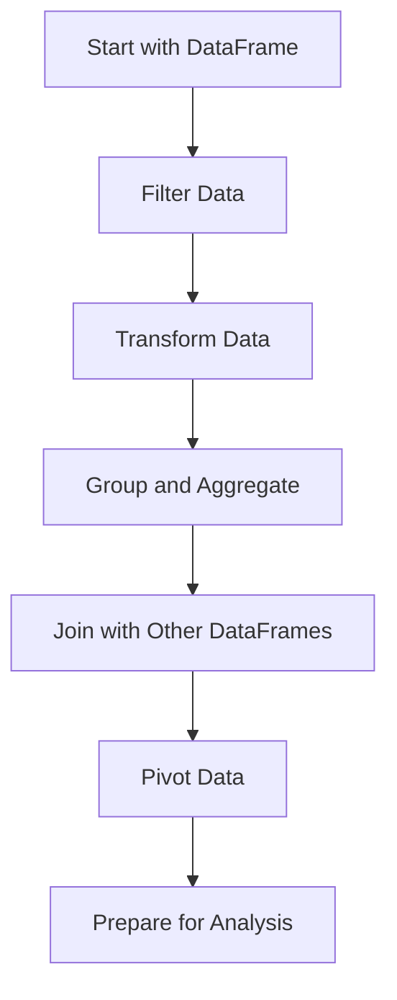

## 10.1 DataFrames.jl for Tabular Data Manipulation

Data manipulation is a cornerstone of data analysis and scientific computing. In Julia, the `DataFrames.jl` package provides a powerful and flexible framework for handling tabular data. This section will guide you through the essential features and operations of `DataFrames.jl`, enabling you to perform complex data manipulation tasks efficiently.

### Introduction to DataFrames

DataFrames in Julia are akin to data frames in R or pandas DataFrames in Python. They offer a flexible data structure for handling heterogeneous tabular data, making them ideal for data analysis tasks. Let's explore the core concepts and operations that make `DataFrames.jl` an indispensable tool for data scientists and developers.

#### Flexible Data Structures

DataFrames allow you to store and manipulate data in a tabular format, where each column can have a different data type. This flexibility is crucial for real-world data analysis, where datasets often contain a mix of numerical, categorical, and textual data.

```julia
using DataFrames

df = DataFrame(Name = ["Alice", "Bob", "Charlie"],
               Age = [25, 30, 35],
               Salary = [50000, 60000, 70000])

println(df)
```

In this example, we create a simple DataFrame with three columns: `Name`, `Age`, and `Salary`. Each column can hold different types of data, such as strings and integers.

### Core Operations

#### Selection and Filtering

One of the most common tasks in data manipulation is selecting and filtering data. DataFrames.jl provides intuitive syntax for accessing and modifying subsets of data.

```julia
ages = df[:Age]

filtered_df = filter(row -> row[:Age] > 28, df)

println(filtered_df)
```

In the code above, we demonstrate how to select a column and filter rows based on a condition. The `filter` function is used to create a new DataFrame containing only the rows that meet the specified criteria.

#### Transformation

Data transformation involves applying functions to columns or rows to modify the data. This is often necessary for data cleaning and preparation.

```julia
df[:NetSalary] = df[:Salary] .- 5000

df[:AgeGroup] = map(age -> age > 30 ? "Senior" : "Junior", df[:Age])

println(df)
```

Here, we add a new column `NetSalary` by subtracting a fixed amount from the `Salary` column. We also create an `AgeGroup` column by mapping a function over the `Age` column.

### Grouping and Aggregation

#### GroupBy Operations

Grouping and aggregation are essential for summarizing data. DataFrames.jl provides powerful tools for performing calculations on grouped data.

```julia
grouped_df = groupby(df, :AgeGroup)
agg_df = combine(grouped_df, :Salary => mean => :MeanSalary)

println(agg_df)
```

In this example, we group the DataFrame by `AgeGroup` and calculate the mean salary for each group. The `groupby` function creates a grouped DataFrame, and `combine` applies the aggregation function.

### Data Joining and Reshaping

#### Merges and Joins

Combining datasets is a common task in data analysis. DataFrames.jl supports various types of joins to merge datasets based on keys.

```julia
df2 = DataFrame(Name = ["Alice", "Bob", "David"],
                Department = ["HR", "Engineering", "Marketing"])

joined_df = innerjoin(df, df2, on = :Name)

println(joined_df)
```

Here, we perform an inner join on the `Name` column, combining rows from both DataFrames where the `Name` matches.

#### Pivoting Data

Pivoting is the process of reshaping data from wide to long format or vice versa. This is useful for preparing data for analysis or visualization.

```julia
long_df = stack(df, [:Salary, :NetSalary], variable_name = :Type, value_name = :Amount)

println(long_df)
```

In this example, we use the `stack` function to pivot the DataFrame, creating a long format where `Salary` and `NetSalary` are combined into a single column with a corresponding `Type` column.

### Use Cases and Examples

#### Statistical Analysis

DataFrames.jl is particularly useful for preparing data for statistical analysis or visualization. By leveraging its powerful manipulation capabilities, you can clean and transform data to fit the requirements of various analytical models.

```julia
describe(df)
```

The `describe` function provides a quick overview of the dataset, including count, mean, minimum, and maximum values for each column.

### Visualizing Data Manipulation

To better understand the flow of data manipulation using DataFrames.jl, let's visualize the process of filtering, transforming, and aggregating data.



This flowchart illustrates the typical steps involved in manipulating tabular data using DataFrames.jl, from initial filtering to final preparation for analysis.

### Try It Yourself

Experiment with the code examples provided in this section. Try modifying the filtering criteria, adding new transformations, or experimenting with different types of joins. By actively engaging with the code, you'll deepen your understanding of DataFrames.jl and its capabilities.

### Knowledge Check

- What is the purpose of the `filter` function in DataFrames.jl?
- How can you add a new column to a DataFrame?
- What is the difference between `innerjoin` and `outerjoin`?
- How does the `stack` function help in reshaping data?

### Summary

In this section, we've explored the core features of DataFrames.jl for tabular data manipulation in Julia. From selection and filtering to grouping, aggregation, and data joining, DataFrames.jl provides a comprehensive toolkit for handling complex data manipulation tasks. By mastering these techniques, you'll be well-equipped to tackle a wide range of data analysis challenges.

## Quiz Time!



### What is the primary purpose of DataFrames.jl in Julia?

- [x] To handle and manipulate tabular data efficiently.
- [ ] To perform numerical computations.
- [ ] To create visualizations.
- [ ] To manage file I/O operations.

> **Explanation:** DataFrames.jl is designed for handling and manipulating tabular data, similar to data frames in R or pandas in Python.

### Which function is used to filter rows in a DataFrame based on a condition?

- [x] filter
- [ ] select
- [ ] map
- [ ] reduce

> **Explanation:** The `filter` function is used to select rows that meet a specific condition in a DataFrame.

### How can you add a new column to an existing DataFrame?

- [x] By assigning a new array to a column name, e.g., `df[:NewColumn] = array`.
- [ ] By using the `addcolumn` function.
- [ ] By using the `insert` function.
- [ ] By using the `append` function.

> **Explanation:** In DataFrames.jl, you can add a new column by assigning an array to a new column name.

### What is the result of performing an inner join on two DataFrames?

- [x] A DataFrame containing rows with matching keys in both DataFrames.
- [ ] A DataFrame containing all rows from both DataFrames.
- [ ] A DataFrame containing only the rows from the first DataFrame.
- [ ] A DataFrame containing only the rows from the second DataFrame.

> **Explanation:** An inner join returns rows that have matching keys in both DataFrames.

### Which function is used to pivot a DataFrame from wide to long format?

- [x] stack
- [ ] unstack
- [ ] pivot
- [ ] reshape

> **Explanation:** The `stack` function is used to pivot a DataFrame from wide to long format.

### What does the `groupby` function do in DataFrames.jl?

- [x] It groups the DataFrame by one or more columns for aggregation.
- [ ] It filters the DataFrame based on a condition.
- [ ] It sorts the DataFrame by a specified column.
- [ ] It joins two DataFrames together.

> **Explanation:** The `groupby` function is used to group a DataFrame by specified columns, enabling aggregation operations.

### How can you calculate the mean of a column in a grouped DataFrame?

- [x] By using the `combine` function with an aggregation function.
- [ ] By using the `mean` function directly on the DataFrame.
- [ ] By using the `aggregate` function.
- [ ] By using the `summarize` function.

> **Explanation:** The `combine` function, along with an aggregation function like `mean`, is used to calculate the mean of a column in a grouped DataFrame.

### What is the purpose of the `describe` function in DataFrames.jl?

- [x] To provide summary statistics for each column in the DataFrame.
- [ ] To filter rows based on a condition.
- [ ] To join two DataFrames together.
- [ ] To pivot the DataFrame.

> **Explanation:** The `describe` function provides summary statistics, such as count, mean, and min/max values, for each column in the DataFrame.

### Which operation is NOT supported by DataFrames.jl?

- [ ] Selection and filtering
- [ ] Grouping and aggregation
- [ ] Data joining
- [x] 3D plotting

> **Explanation:** DataFrames.jl is focused on data manipulation and does not support 3D plotting, which is typically handled by visualization libraries.

### True or False: DataFrames.jl can handle heterogeneous data types within a single DataFrame.

- [x] True
- [ ] False

> **Explanation:** DataFrames.jl is designed to handle heterogeneous data types, allowing each column to have a different data type.



Remember, mastering DataFrames.jl is just the beginning of your journey in data manipulation with Julia. As you progress, you'll discover more advanced techniques and tools that will enhance your data analysis capabilities. Keep experimenting, stay curious, and enjoy the journey!
