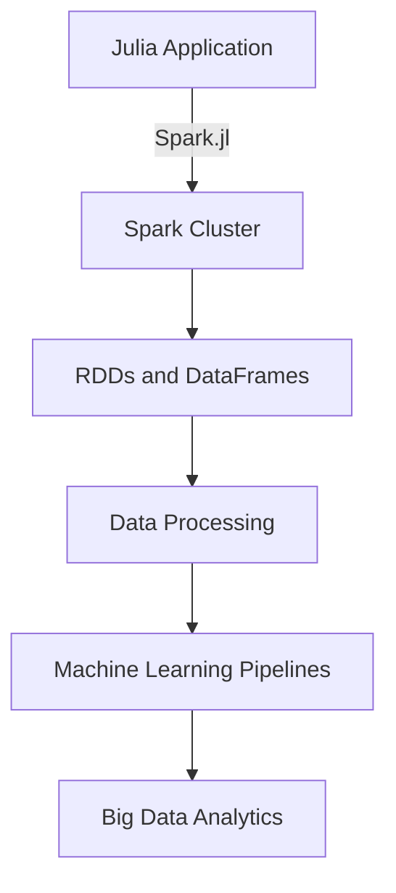

## 10.10 Interfacing with Hadoop and Spark Using Spark.jl

In today's data-driven world, the ability to process and analyze large datasets efficiently is crucial. Apache Spark, a powerful open-source processing engine, is designed for big data analytics. By leveraging Spark.jl, a Julia package that interfaces with Apache Spark, we can harness the power of Spark's distributed computing capabilities directly from Julia. This section will guide you through setting up Spark.jl, performing data operations, and utilizing advanced analytics for big data processing.

### Setting Up Spark.jl

#### Configuration

To begin interfacing Julia with a Spark cluster, we need to configure Spark.jl. This involves setting up the necessary environment and establishing a connection to the Spark cluster.

1. **Install Spark.jl**: First, ensure that you have Julia installed on your system. Then, add Spark.jl to your Julia environment using the following command:

   ```julia
   using Pkg
   Pkg.add("Spark")
   ```

2. **Set Up Spark Environment**: You need to have Apache Spark installed on your machine. Set the `SPARK_HOME` environment variable to point to your Spark installation directory. This can be done by adding the following line to your `.bashrc` or `.bash_profile`:

   ```bash
   export SPARK_HOME=/path/to/spark
   ```

3. **Configure Spark.jl**: In your Julia script or REPL, configure Spark.jl to connect to your Spark cluster. You can specify the master URL and other Spark configurations:

   ```julia
   using Spark

   # Initialize Spark context
   conf = SparkConf()
   conf.setMaster("local[*]")  # Use all available cores
   conf.setAppName("JuliaSparkApp")

   sc = SparkContext(conf)
   ```

   > **Note**: The `local[*]` setting runs Spark locally using all available cores. For a cluster setup, replace it with the appropriate master URL.

### Data Operations

#### RDDs and DataFrames

Spark.jl allows us to work with Spark's core abstractions: Resilient Distributed Datasets (RDDs) and DataFrames. These abstractions enable efficient data processing across a distributed cluster.

1. **Creating RDDs**: RDDs are the fundamental data structure in Spark, representing an immutable distributed collection of objects. Here's how to create an RDD from a local collection:

   ```julia
   # Create an RDD from a local collection
   data = [1, 2, 3, 4, 5]
   rdd = parallelize(sc, data)

   # Perform a simple transformation
   rdd_squared = map(x -> x^2, rdd)
   ```

2. **Working with DataFrames**: Spark DataFrames are similar to Julia's DataFrames, providing a higher-level API for data manipulation. You can create a DataFrame from an RDD or load data from external sources:

   ```julia
   using DataFrames

   # Convert RDD to DataFrame
   df = toDF(rdd_squared, ["value"])

   # Show the DataFrame
   show(df)
   ```

   > **Try It Yourself**: Modify the code to create an RDD from a larger dataset and perform different transformations, such as filtering or aggregating data.

### Advanced Analytics

#### Machine Learning Pipelines

Spark MLlib is a scalable machine learning library built on top of Spark. With Spark.jl, we can leverage MLlib to build machine learning pipelines for large-scale data processing.

1. **Building a Machine Learning Pipeline**: A typical machine learning pipeline involves data preprocessing, model training, and evaluation. Here's an example of building a simple pipeline using Spark.jl:

   ```julia
   using Spark.MLlib

   # Load and preprocess data
   data = loadLibSVMFile(sc, "data/sample_libsvm_data.txt")
   splits = randomSplit(data, [0.8, 0.2])
   trainingData, testData = splits

   # Configure a logistic regression model
   lr = LogisticRegression()
   model = fit(lr, trainingData)

   # Evaluate the model
   predictions = transform(model, testData)
   evaluator = BinaryClassificationEvaluator()
   accuracy = evaluate(evaluator, predictions)

   println("Model accuracy: ", accuracy)
   ```

   > **Knowledge Check**: What are the key components of a machine learning pipeline in Spark.jl? How can you modify the pipeline to use a different algorithm?

### Use Cases and Examples

#### Big Data Analytics

Interfacing Julia with Spark using Spark.jl opens up numerous possibilities for big data analytics. Let's explore a few use cases where this integration can be particularly beneficial.

1. **Processing Large Datasets**: With Spark.jl, you can efficiently process and analyze large datasets that don't fit into memory. This is particularly useful for tasks such as log analysis, data transformation, and ETL (Extract, Transform, Load) processes.

2. **Real-time Data Processing**: Spark Streaming, a component of Spark, allows for real-time data processing. By integrating Spark.jl with Spark Streaming, you can build applications that process data in real-time, such as monitoring systems or recommendation engines.

3. **Scalable Machine Learning**: Spark MLlib provides scalable machine learning algorithms that can be used for tasks such as classification, regression, clustering, and collaborative filtering. By leveraging Spark.jl, you can build and deploy machine learning models at scale.

### Visualizing the Integration

To better understand the integration of Julia with Spark using Spark.jl, let's visualize the workflow using a Mermaid.js diagram.



> **Diagram Description**: This diagram illustrates the flow of data and operations from a Julia application to a Spark cluster using Spark.jl. It highlights the key components involved in data processing and analytics.

### References and Links

- [Apache Spark Documentation](https://spark.apache.org/docs/latest/)
- [Spark.jl GitHub Repository](https://github.com/dfdx/Spark.jl)
- [JuliaLang Official Website](https://julialang.org/)

### Embrace the Journey

Remember, this is just the beginning of your journey with Julia and Spark. As you progress, you'll discover more advanced techniques and optimizations for big data processing. Keep experimenting, stay curious, and enjoy the journey!

## Quiz Time!



### What is the primary purpose of Spark.jl in Julia?

- [x] To interface Julia with Apache Spark for big data processing
- [ ] To create graphical user interfaces in Julia
- [ ] To perform symbolic mathematics in Julia
- [ ] To develop web applications in Julia

> **Explanation:** Spark.jl is used to interface Julia with Apache Spark, enabling big data processing and analytics.

### Which environment variable must be set to configure Spark.jl?

- [x] SPARK_HOME
- [ ] JULIA_HOME
- [ ] JAVA_HOME
- [ ] PYTHON_HOME

> **Explanation:** The `SPARK_HOME` environment variable should be set to point to the Spark installation directory.

### What is an RDD in Spark?

- [x] Resilient Distributed Dataset
- [ ] Random Data Distribution
- [ ] Real-time Data Delivery
- [ ] Recursive Data Definition

> **Explanation:** RDD stands for Resilient Distributed Dataset, which is a fundamental data structure in Spark.

### How can you create an RDD from a local collection in Spark.jl?

- [x] Use the `parallelize` function
- [ ] Use the `collect` function
- [ ] Use the `map` function
- [ ] Use the `filter` function

> **Explanation:** The `parallelize` function is used to create an RDD from a local collection in Spark.jl.

### What is the role of Spark MLlib?

- [x] To provide scalable machine learning algorithms
- [ ] To manage Spark cluster resources
- [ ] To visualize data in Spark
- [ ] To perform data serialization in Spark

> **Explanation:** Spark MLlib provides scalable machine learning algorithms for tasks such as classification, regression, and clustering.

### Which function is used to load data in LibSVM format in Spark.jl?

- [x] `loadLibSVMFile`
- [ ] `loadCSVFile`
- [ ] `loadJSONFile`
- [ ] `loadParquetFile`

> **Explanation:** The `loadLibSVMFile` function is used to load data in LibSVM format in Spark.jl.

### What is the purpose of the `BinaryClassificationEvaluator` in Spark.jl?

- [x] To evaluate the performance of binary classification models
- [ ] To visualize binary data
- [ ] To transform binary data
- [ ] To serialize binary data

> **Explanation:** The `BinaryClassificationEvaluator` is used to evaluate the performance of binary classification models in Spark.jl.

### Which component of Spark allows for real-time data processing?

- [x] Spark Streaming
- [ ] Spark SQL
- [ ] Spark MLlib
- [ ] Spark GraphX

> **Explanation:** Spark Streaming is the component of Spark that allows for real-time data processing.

### What is the benefit of using Spark.jl for big data analytics?

- [x] Efficient processing and analysis of large datasets
- [ ] Creating interactive web applications
- [ ] Performing symbolic computations
- [ ] Developing graphical user interfaces

> **Explanation:** Spark.jl enables efficient processing and analysis of large datasets, making it beneficial for big data analytics.

### True or False: Spark.jl can only be used for batch processing, not real-time processing.

- [ ] True
- [x] False

> **Explanation:** False. Spark.jl can be used for both batch and real-time processing, leveraging Spark Streaming for real-time data processing.



By following this guide, you should now have a solid understanding of how to interface Julia with Hadoop and Spark using Spark.jl. This powerful integration allows you to leverage the strengths of both Julia and Spark for efficient big data processing and analytics. Keep exploring and experimenting to unlock the full potential of these tools!
