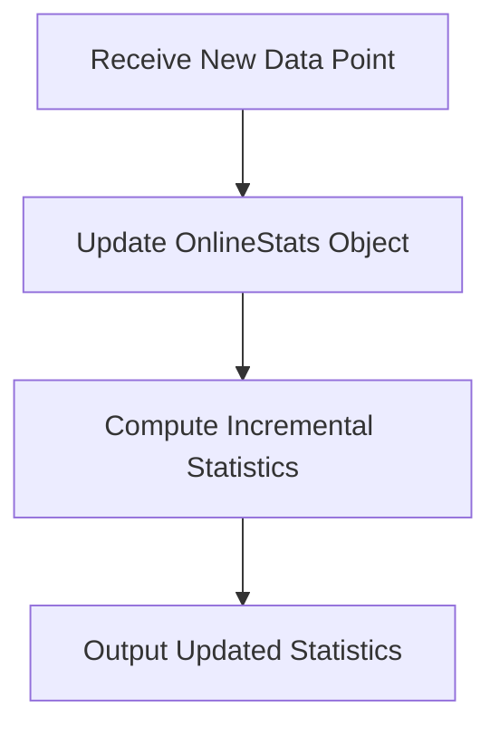

## 10.11 OnlineStats.jl for Streaming Data Analysis

In the world of data analysis, the ability to process data in real-time is becoming increasingly crucial. Whether you're monitoring sensor data, analyzing financial transactions, or processing social media feeds, the need for efficient, incremental data processing is paramount. This is where **OnlineStats.jl**, a powerful Julia package, comes into play. OnlineStats.jl is designed to handle streaming data efficiently, allowing you to compute statistics incrementally without the need to store all the data in memory. In this section, we will delve into the capabilities of OnlineStats.jl, explore its use cases, and provide practical examples to help you master streaming data analysis in Julia.

### Understanding Online Algorithms

Before we dive into OnlineStats.jl, it's important to understand the concept of online algorithms. Unlike traditional batch processing algorithms that require all data to be available before processing, online algorithms process data incrementally. This means they can update their results as new data arrives, making them ideal for real-time applications.

#### Incremental Calculations

One of the key features of online algorithms is their ability to perform incremental calculations. This involves updating statistics or results as each new data point is received, without needing to reprocess the entire dataset. This approach is not only memory-efficient but also allows for immediate insights from streaming data.

### OnlineStats.jl: An Overview

OnlineStats.jl is a Julia package specifically designed for online algorithms. It provides a suite of tools for performing incremental calculations on streaming data. With OnlineStats.jl, you can compute a wide range of statistics, including means, variances, histograms, and more, all in an online fashion.

#### Key Features of OnlineStats.jl

- **Memory Efficiency**: OnlineStats.jl allows you to compute statistics without storing all the data, making it suitable for large datasets.
- **Real-Time Processing**: The package is designed for real-time data analysis, enabling you to update statistics as new data arrives.
- **Flexibility**: OnlineStats.jl supports a variety of statistics and can be easily extended to accommodate custom calculations.

### Supported Statistics

OnlineStats.jl supports a wide range of statistics that can be computed incrementally. Let's explore some of the most commonly used statistics and how they can be applied in real-time data analysis.

#### Means and Variances

Computing the mean and variance of a dataset is a common requirement in data analysis. OnlineStats.jl provides efficient methods for calculating these statistics incrementally.

```julia
using OnlineStats

o = MeanVar()

fit!(o, 5.0)
fit!(o, 10.0)
fit!(o, 15.0)

println("Mean: ", mean(o))
println("Variance: ", var(o))
```

In this example, we create an online mean and variance object using `MeanVar()`. As new data points are received, we update the object using the `fit!` function. The mean and variance can be retrieved at any point using the `mean` and `var` functions.

#### Histograms

Histograms are useful for understanding the distribution of data. OnlineStats.jl allows you to build histograms incrementally, which is particularly useful for streaming data.

```julia
using OnlineStats

o = Hist(10)

fit!(o, 1.0)
fit!(o, 2.0)
fit!(o, 3.0)

println("Histogram: ", o)
```

Here, we create an online histogram with 10 bins using `Hist(10)`. As new data points are received, we update the histogram using the `fit!` function. The histogram can be retrieved at any point to analyze the data distribution.

### Use Cases and Examples

OnlineStats.jl is versatile and can be applied to various real-time data analysis scenarios. Let's explore some common use cases and examples.

#### Real-Time Monitoring

One of the most compelling use cases for OnlineStats.jl is real-time monitoring. Whether you're analyzing sensor data, financial transactions, or social media feeds, OnlineStats.jl allows you to compute statistics on-the-fly, providing immediate insights.

##### Example: Monitoring Sensor Data

Consider a scenario where you're monitoring temperature data from a network of sensors. You want to compute the average temperature and detect anomalies in real-time.

```julia
using OnlineStats

temperature_stats = MeanVar()

for temperature in [22.5, 23.0, 22.8, 23.5, 24.0]
    fit!(temperature_stats, temperature)
    println("Current Mean Temperature: ", mean(temperature_stats))
    println("Current Temperature Variance: ", var(temperature_stats))
end
```

In this example, we simulate streaming temperature data and update the mean and variance using OnlineStats.jl. This allows us to monitor the average temperature and detect anomalies in real-time.

#### Financial Data Analysis

OnlineStats.jl can also be applied to financial data analysis, where real-time insights are crucial for decision-making.

##### Example: Analyzing Stock Prices

Imagine you're analyzing stock prices and want to compute the moving average to identify trends.

```julia
using OnlineStats

stock_prices = [100.0, 101.5, 102.0, 101.0, 100.5]
moving_average = Mean()

for price in stock_prices
    fit!(moving_average, price)
    println("Current Moving Average: ", mean(moving_average))
end
```

In this example, we compute the moving average of stock prices using OnlineStats.jl. This allows us to identify trends and make informed decisions based on real-time data.

### Visualizing Streaming Data Analysis

To enhance understanding, let's visualize the process of streaming data analysis using OnlineStats.jl. The following diagram illustrates the flow of data and the incremental calculation of statistics.



**Diagram Description**: This flowchart represents the process of streaming data analysis using OnlineStats.jl. As new data points are received, the OnlineStats object is updated, and incremental statistics are computed and outputted.

### Try It Yourself

To truly master streaming data analysis with OnlineStats.jl, it's important to experiment with the concepts and examples provided. Here are a few suggestions for modifications and experiments:

- **Experiment with Different Statistics**: Try computing other statistics such as medians or percentiles using OnlineStats.jl.
- **Simulate Real-Time Data Streams**: Create a simulation of real-time data streams and apply OnlineStats.jl to analyze the data.
- **Visualize Data Distributions**: Use OnlineStats.jl to build histograms and visualize data distributions in real-time.

### References and Further Reading

- [OnlineStats.jl Documentation](https://joshday.github.io/OnlineStats.jl/latest/)
- [JuliaLang Documentation](https://docs.julialang.org/)
- [Streaming Data Analysis Concepts](https://en.wikipedia.org/wiki/Streaming_algorithm)

### Knowledge Check

To reinforce your understanding of OnlineStats.jl and streaming data analysis, consider the following questions and exercises:

- **What are the advantages of using online algorithms for streaming data analysis?**
- **How does OnlineStats.jl handle memory efficiency when processing large datasets?**
- **Experiment with different types of data streams and analyze them using OnlineStats.jl.**

### Embrace the Journey

Remember, mastering streaming data analysis with OnlineStats.jl is just the beginning. As you progress, you'll be able to tackle more complex data analysis challenges and build powerful real-time applications. Keep experimenting, stay curious, and enjoy the journey!

## Quiz Time!



### What is the primary advantage of using online algorithms for data analysis?

- [x] They process data incrementally without storing all data.
- [ ] They require all data to be available before processing.
- [ ] They are slower than batch processing algorithms.
- [ ] They are only suitable for small datasets.

> **Explanation:** Online algorithms process data incrementally, allowing for real-time analysis without storing all data.

### Which Julia package is designed for streaming data analysis?

- [x] OnlineStats.jl
- [ ] DataFrames.jl
- [ ] Plots.jl
- [ ] Flux.jl

> **Explanation:** OnlineStats.jl is specifically designed for streaming data analysis in Julia.

### How does OnlineStats.jl handle memory efficiency?

- [x] By computing statistics without storing all data.
- [ ] By storing all data in memory.
- [ ] By using external databases for storage.
- [ ] By compressing data before processing.

> **Explanation:** OnlineStats.jl computes statistics incrementally, which eliminates the need to store all data in memory.

### What function is used to update statistics with new data in OnlineStats.jl?

- [x] fit!
- [ ] update!
- [ ] compute!
- [ ] refresh!

> **Explanation:** The `fit!` function is used to update statistics with new data in OnlineStats.jl.

### Which statistic can be computed incrementally using OnlineStats.jl?

- [x] Mean
- [x] Variance
- [ ] Median
- [ ] Mode

> **Explanation:** OnlineStats.jl can compute mean and variance incrementally, but not median or mode.

### What is a common use case for OnlineStats.jl?

- [x] Real-time monitoring of sensor data
- [ ] Batch processing of historical data
- [ ] Static data visualization
- [ ] Offline data storage

> **Explanation:** OnlineStats.jl is commonly used for real-time monitoring of streaming data, such as sensor data.

### How can you visualize data distributions using OnlineStats.jl?

- [x] By building histograms incrementally
- [ ] By storing all data and plotting later
- [ ] By using external plotting libraries
- [ ] By exporting data to CSV

> **Explanation:** OnlineStats.jl allows you to build histograms incrementally to visualize data distributions.

### What is the purpose of the `MeanVar` object in OnlineStats.jl?

- [x] To compute mean and variance incrementally
- [ ] To store all data points
- [ ] To visualize data
- [ ] To compress data

> **Explanation:** The `MeanVar` object in OnlineStats.jl is used to compute mean and variance incrementally.

### Which of the following is NOT a feature of OnlineStats.jl?

- [ ] Memory efficiency
- [ ] Real-time processing
- [ ] Flexibility
- [x] Batch processing

> **Explanation:** OnlineStats.jl is designed for online, real-time processing, not batch processing.

### True or False: OnlineStats.jl can only be used for numerical data.

- [ ] True
- [x] False

> **Explanation:** OnlineStats.jl can be used for various types of data, not just numerical data.


