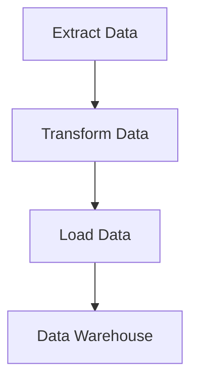

## 10.12 Building Data Engineering Pipelines

In the world of data engineering, building efficient and scalable pipelines is crucial for processing and analyzing large volumes of data. Julia, with its high performance and ease of use, is an excellent choice for constructing these pipelines. In this section, we will explore how to design and implement data engineering pipelines using Julia, focusing on key aspects such as modularity, automation, error handling, and real-world use cases.

### Designing ETL Pipelines

ETL (Extract, Transform, Load) pipelines are the backbone of data engineering. They involve extracting data from various sources, transforming it into a suitable format, and loading it into a destination system. Let's delve into the essential components of designing ETL pipelines with Julia.

#### Modularity

Modularity is a fundamental principle in software design that involves breaking down a system into smaller, manageable, and reusable components. In the context of ETL pipelines, modularity allows us to create distinct stages for extraction, transformation, and loading, which can be independently developed, tested, and maintained.

**Key Benefits of Modularity:**

- **Reusability:** Components can be reused across different pipelines, reducing redundancy.
- **Maintainability:** Easier to update and debug individual components without affecting the entire system.
- **Scalability:** New features can be added by integrating additional modules.

**Implementing Modularity in Julia:**

```julia
module ETL

export extract_data, transform_data, load_data

function extract_data(source::String)
    # Simulate data extraction
    println("Extracting data from $source")
    return ["data1", "data2", "data3"]
end

function transform_data(data::Vector{String})
    # Simulate data transformation
    println("Transforming data")
    return [uppercase(d) for d in data]
end

function load_data(data::Vector{String}, destination::String)
    # Simulate data loading
    println("Loading data to $destination")
end

end
```

In this example, we define an `ETL` module with three functions: `extract_data`, `transform_data`, and `load_data`. Each function represents a stage in the ETL process, making the pipeline modular and easy to manage.

#### Automation

Automation is key to ensuring that data pipelines run efficiently and consistently without manual intervention. By automating tasks, we can schedule pipeline executions, monitor their progress, and handle any issues that arise.

**Scheduling Tasks:**

To automate the execution of Julia scripts, we can use scheduling tools like Apache Airflow or Cron. These tools allow us to define workflows, set execution times, and manage dependencies between tasks.

**Example: Scheduling with Cron**

```bash
crontab -e

0 0 * * * julia /path/to/your_script.jl
```

In this example, we use Cron to schedule a Julia script to run daily at midnight. This ensures that our ETL pipeline executes automatically at the specified time.

#### Error Handling and Logging

Robust error handling and logging are essential for building reliable data pipelines. They help us identify and resolve issues quickly, ensuring that data processing continues smoothly.

**Implementing Robustness:**

- **Try-Catch Blocks:** Use try-catch blocks to handle exceptions gracefully and prevent pipeline failures.
- **Logging:** Implement logging to record pipeline activities and errors for troubleshooting.

**Example: Error Handling in Julia**

```julia
using Logging

function process_data()
    try
        data = ETL.extract_data("source")
        transformed_data = ETL.transform_data(data)
        ETL.load_data(transformed_data, "destination")
    catch e
        @error "Error processing data: $e"
    end
end

process_data()
```

In this example, we use a try-catch block to handle exceptions during data processing. The `@error` macro from the `Logging` module logs any errors that occur, providing valuable information for debugging.

### Use Cases and Examples

To illustrate the concepts discussed, let's explore some real-world use cases of data engineering pipelines built with Julia.

#### Data Warehousing

Data warehousing involves consolidating data from multiple sources into a central repository for analysis and reporting. Julia's performance and ease of integration with various data sources make it an ideal choice for building data warehousing pipelines.

**Example: Data Warehousing Pipeline**

```julia
using DataFrames, CSV

function extract_sales_data()
    # Extract sales data from CSV files
    return CSV.File("sales_data.csv") |> DataFrame
end

function transform_sales_data(df::DataFrame)
    # Transform sales data
    df[!, :Total] = df.Price .* df.Quantity
    return df
end

function load_sales_data(df::DataFrame)
    # Load transformed data into a database
    println("Loading data into the warehouse")
    # Database loading logic goes here
end

sales_data = extract_sales_data()
transformed_data = transform_sales_data(sales_data)
load_sales_data(transformed_data)
```

In this example, we extract sales data from a CSV file, transform it by calculating the total sales, and load the transformed data into a data warehouse. This pipeline demonstrates how Julia can be used to build efficient data warehousing solutions.

### Visualizing Data Engineering Pipelines

To better understand the flow of data through an ETL pipeline, let's visualize the process using a flowchart.



**Diagram Description:** This flowchart illustrates the typical stages of an ETL pipeline: extracting data from sources, transforming it into a suitable format, and loading it into a data warehouse.

### Try It Yourself

Now that we've covered the basics of building data engineering pipelines with Julia, it's time to put your knowledge into practice. Try modifying the code examples provided to suit your own data sources and requirements. Experiment with different data transformations and loading strategies to see how they affect the pipeline's performance and reliability.

### References and Links

For further reading on data engineering and ETL pipelines, consider exploring the following resources:

- [Apache Airflow Documentation](https://airflow.apache.org/docs/)
- [Cron Job Basics](https://www.geeksforgeeks.org/cron-command-in-unix-linux-with-examples/)
- [Julia Logging Documentation](https://docs.julialang.org/en/v1/stdlib/Logging/)

### Knowledge Check

Before moving on, take a moment to reflect on what you've learned. Consider the following questions:

- How does modularity benefit the design of ETL pipelines?
- What tools can be used to automate the execution of Julia scripts?
- Why is error handling important in data engineering pipelines?

### Embrace the Journey

Building data engineering pipelines is a rewarding endeavor that combines technical skills with creativity. As you continue to explore Julia and its capabilities, remember that this is just the beginning. Keep experimenting, stay curious, and enjoy the journey of mastering data engineering with Julia!

## Quiz Time!



### What is the primary benefit of modularity in ETL pipelines?

- [x] Reusability of components
- [ ] Increased complexity
- [ ] Higher cost
- [ ] Slower execution

> **Explanation:** Modularity allows components to be reused across different pipelines, reducing redundancy and improving maintainability.

### Which tool can be used to schedule Julia scripts for automated execution?

- [x] Cron
- [ ] Git
- [ ] Docker
- [ ] Kubernetes

> **Explanation:** Cron is a scheduling tool that can be used to automate the execution of Julia scripts at specified times.

### What is the purpose of try-catch blocks in error handling?

- [x] To handle exceptions gracefully
- [ ] To increase execution speed
- [ ] To reduce code size
- [ ] To improve data accuracy

> **Explanation:** Try-catch blocks are used to handle exceptions gracefully, preventing pipeline failures and allowing for error logging.

### What does the `@error` macro do in Julia?

- [x] Logs error messages
- [ ] Increases performance
- [ ] Optimizes memory usage
- [ ] Compiles code faster

> **Explanation:** The `@error` macro from the `Logging` module logs error messages, providing valuable information for debugging.

### In the context of ETL, what does "Load" refer to?

- [x] Loading data into a destination system
- [ ] Extracting data from sources
- [ ] Transforming data into a suitable format
- [ ] Deleting data from a database

> **Explanation:** "Load" refers to the process of loading transformed data into a destination system, such as a data warehouse.

### What is a common use case for data engineering pipelines?

- [x] Data warehousing
- [ ] Video streaming
- [ ] Game development
- [ ] Graphic design

> **Explanation:** Data warehousing is a common use case for data engineering pipelines, involving the consolidation of data from multiple sources for analysis.

### Which of the following is NOT a benefit of automation in data pipelines?

- [ ] Consistent execution
- [ ] Reduced manual intervention
- [x] Increased manual errors
- [ ] Efficient monitoring

> **Explanation:** Automation reduces manual intervention and errors, ensuring consistent and efficient execution of data pipelines.

### What is the role of logging in data engineering pipelines?

- [x] To record pipeline activities and errors
- [ ] To increase data volume
- [ ] To transform data
- [ ] To extract data

> **Explanation:** Logging records pipeline activities and errors, providing valuable information for troubleshooting and ensuring reliability.

### How can Julia's performance benefit data engineering pipelines?

- [x] By processing large volumes of data efficiently
- [ ] By increasing code complexity
- [ ] By reducing data accuracy
- [ ] By limiting data sources

> **Explanation:** Julia's high performance allows it to process large volumes of data efficiently, making it ideal for data engineering pipelines.

### True or False: Modularity in ETL pipelines makes it harder to update and debug individual components.

- [ ] True
- [x] False

> **Explanation:** Modularity makes it easier to update and debug individual components without affecting the entire system.


