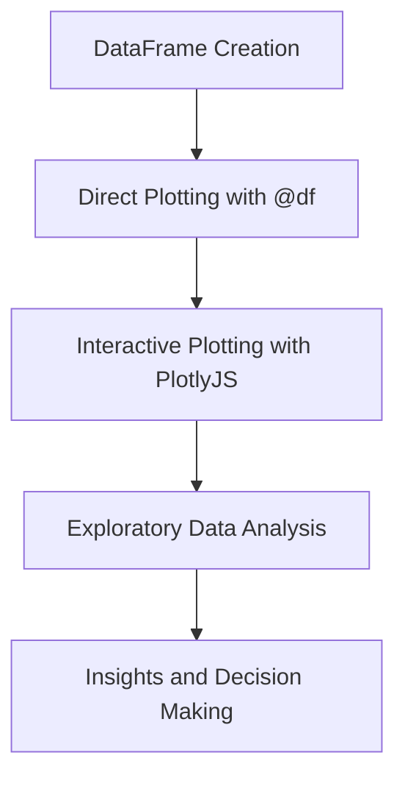

## 10.13 Data Visualization Integration with Plots.jl

Data visualization is a crucial aspect of data analysis, enabling us to derive insights and communicate findings effectively. In Julia, Plots.jl is a powerful and flexible library that facilitates data visualization. This section will guide you through integrating Plots.jl with DataFrames for direct plotting, creating interactive dashboards, and performing exploratory data analysis.

### Visualizing DataFrames

DataFrames are a fundamental data structure in Julia for handling tabular data. Plots.jl provides seamless integration with DataFrames, allowing you to visualize data directly from these structures.

#### Direct Plotting

To plot data directly from a DataFrame, you can use the `@df` macro provided by the StatsPlots package, which extends Plots.jl. This macro simplifies the syntax for plotting columns from a DataFrame.

```julia
using DataFrames
using Plots
using StatsPlots

df = DataFrame(
    x = 1:10,
    y = rand(10),
    z = rand(10)
)

@df df plot(:x, :y, label="Y values", xlabel="X-axis", ylabel="Y-axis", title="Direct Plotting from DataFrame")
```

In this example, we create a simple DataFrame with three columns: `x`, `y`, and `z`. Using the `@df` macro, we plot the `x` and `y` columns directly, labeling the axes and the plot for clarity.

#### Interactive Data Exploration

Interactive data exploration allows users to engage with data dynamically, providing a more insightful analysis experience. Plots.jl supports interactive features through various backends, such as PlotlyJS.jl and GR.jl, enabling the creation of interactive plots and dashboards.

##### Linked Plots

Linked plots are a powerful feature for interactive data exploration, allowing users to select data subsets and see corresponding changes in related plots. This can be particularly useful for exploring relationships between variables.

```julia
using PlotlyJS

p1 = plot(df.x, df.y, mode="markers", name="Scatter Plot")
p2 = plot(df.x, df.z, mode="lines", name="Line Plot")

layout = grid([p1 p2], layout=(1, 2))
display(layout)
```

In this example, we use PlotlyJS to create a scatter plot and a line plot from the DataFrame. These plots are then combined into a dashboard layout, allowing for interactive exploration.

### Use Cases and Examples

Data visualization is essential for various use cases, from exploratory data analysis to presenting findings in reports. Here, we explore some common scenarios where Plots.jl can be effectively utilized.

#### Exploratory Data Analysis

Exploratory Data Analysis (EDA) is a crucial step in the data analysis process, involving the use of visual methods to understand data distributions, relationships, and patterns. Plots.jl provides a range of plotting functions to facilitate EDA.

```julia
@df df histogram(:y, bins=10, title="Histogram of Y", xlabel="Y values", ylabel="Frequency")

@df df boxplot(:z, title="Boxplot of Z", ylabel="Z values")
```

In these examples, we use a histogram to visualize the distribution of the `y` column and a boxplot to summarize the distribution of the `z` column. These plots help identify outliers and understand the spread of data.

### Try It Yourself

To deepen your understanding, try modifying the code examples above. Experiment with different plot types, such as bar plots or heatmaps, and explore how changing the DataFrame's data affects the visualizations.

### Visualizing Data Integration

To better understand how Plots.jl integrates with DataFrames and facilitates interactive data exploration, let's visualize the workflow using a diagram.



**Diagram Explanation:** This flowchart illustrates the process of integrating Plots.jl with DataFrames. It starts with creating a DataFrame, followed by direct plotting using the `@df` macro. Interactive plotting with PlotlyJS enables dynamic exploration, leading to insights and informed decision-making.

### References and Further Reading

- [Plots.jl Documentation](https://docs.juliaplots.org/latest/)
- [DataFrames.jl Documentation](https://dataframes.juliadata.org/stable/)
- [PlotlyJS.jl Documentation](https://juliaplots.org/PlotlyJS.jl/stable/)

### Knowledge Check

Before moving on, consider these questions to test your understanding:

1. How can you plot data directly from a DataFrame using Plots.jl?
2. What are the benefits of using interactive plots for data exploration?
3. How can linked plots enhance the data exploration process?

### Embrace the Journey

Remember, mastering data visualization is a journey. As you continue to explore Plots.jl and its capabilities, you'll discover new ways to visualize and interpret data. Stay curious, experiment with different plot types, and enjoy the process of turning data into insights.

## Quiz Time!



### What is the primary purpose of using the `@df` macro in Plots.jl?

- [x] To simplify plotting columns directly from a DataFrame
- [ ] To create interactive plots
- [ ] To perform data cleaning
- [ ] To manage DataFrame memory

> **Explanation:** The `@df` macro is used to simplify the syntax for plotting columns directly from a DataFrame in Plots.jl.

### Which backend can be used with Plots.jl for interactive plotting?

- [x] PlotlyJS.jl
- [ ] CSV.jl
- [ ] DataFrames.jl
- [ ] HTTP.jl

> **Explanation:** PlotlyJS.jl is a backend that supports interactive plotting with Plots.jl.

### What type of plot is useful for visualizing the distribution of a single variable?

- [x] Histogram
- [ ] Scatter plot
- [ ] Line plot
- [ ] Bar plot

> **Explanation:** A histogram is used to visualize the distribution of a single variable by showing the frequency of data points within specified ranges.

### How can linked plots enhance data exploration?

- [x] By allowing users to select data subsets and see changes in related plots
- [ ] By cleaning the data automatically
- [ ] By generating random data
- [ ] By exporting plots to CSV

> **Explanation:** Linked plots enhance data exploration by allowing users to interactively select data subsets and observe corresponding changes in related plots.

### What is a common use case for Plots.jl in data analysis?

- [x] Exploratory Data Analysis
- [ ] Data Encryption
- [ ] Web Development
- [ ] Machine Learning Model Training

> **Explanation:** Plots.jl is commonly used for Exploratory Data Analysis to visualize and understand data distributions and relationships.

### Which function is used to create a histogram in Plots.jl?

- [x] histogram
- [ ] scatter
- [ ] plot
- [ ] line

> **Explanation:** The `histogram` function is used to create histograms in Plots.jl.

### What is the benefit of using interactive plots?

- [x] They allow dynamic engagement with data
- [ ] They automatically clean data
- [ ] They generate data reports
- [ ] They encrypt data

> **Explanation:** Interactive plots allow users to dynamically engage with data, providing a more insightful analysis experience.

### Which package extends Plots.jl to support DataFrame plotting?

- [x] StatsPlots
- [ ] CSV
- [ ] HTTP
- [ ] JSON

> **Explanation:** StatsPlots extends Plots.jl to support DataFrame plotting with the `@df` macro.

### What type of plot is used to summarize the distribution of data and identify outliers?

- [x] Boxplot
- [ ] Line plot
- [ ] Scatter plot
- [ ] Bar plot

> **Explanation:** A boxplot is used to summarize the distribution of data and identify outliers.

### True or False: Plots.jl can only be used for static plots.

- [ ] True
- [x] False

> **Explanation:** False. Plots.jl can be used for both static and interactive plots, depending on the backend used.


