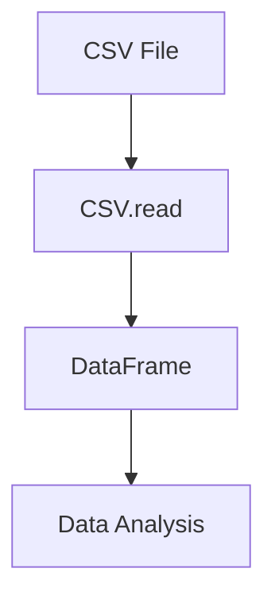

## 10.2 Reading and Writing CSV Files with CSV.jl

In the world of data processing, CSV (Comma-Separated Values) files are ubiquitous due to their simplicity and ease of use. Julia, with its powerful CSV.jl package, offers efficient and flexible tools for handling CSV files. In this section, we'll delve into reading and writing CSV files using CSV.jl, explore performance optimization techniques, and address common edge cases.

### Introduction to CSV.jl

CSV.jl is a Julia package designed for fast and flexible reading and writing of CSV files. It leverages Julia's strengths in performance and multiple dispatch to provide a robust solution for data handling. Whether you're dealing with small datasets or large-scale data processing, CSV.jl is equipped to handle your needs.

### Reading Data with CSV.jl

#### Using `CSV.read`

The primary function for reading CSV files in CSV.jl is `CSV.read`. This function reads a CSV file and returns a DataFrame, which is a tabular data structure provided by the DataFrames.jl package. Let's explore how to use `CSV.read` effectively.

```julia
using CSV
using DataFrames

df = CSV.read("data.csv", DataFrame)

println(first(df, 5))
```

In this example, we use `CSV.read` to load a CSV file named `data.csv` into a DataFrame. The `DataFrame` argument specifies the type of object to return. You can then manipulate and analyze the data using DataFrames.jl's rich set of functions.

#### Handling Delimiters and Headers

CSV files can vary in their structure, with different delimiters and header configurations. CSV.jl provides options to handle these variations.

```julia
df = CSV.read("data.tsv", DataFrame; delim='\t', header=false)

rename!(df, [:Column1, :Column2, :Column3])
```

In this example, we read a tab-separated file (`.tsv`) by specifying the `delim` parameter. We also handle files without headers by setting `header=false` and manually renaming the columns.

#### Managing Missing Data

CSV files often contain missing data, which can be represented in various ways. CSV.jl allows you to specify how missing data should be handled.

```julia
df = CSV.read("data.csv", DataFrame; missingstring="NA")

replace!(df, missing => 0)
```

Here, we specify that the string "NA" should be treated as missing data. We then replace missing values with zeros using the `replace!` function.

### Writing Data with CSV.jl

#### Using `CSV.write`

Writing data to a CSV file is straightforward with the `CSV.write` function. This function takes a DataFrame and writes it to a specified file.

```julia
CSV.write("output.csv", df)
```

This simple command exports the DataFrame `df` to a file named `output.csv`. CSV.jl handles the conversion of data types and formatting automatically.

#### Customizing Output

You can customize the output format by specifying additional options in `CSV.write`.

```julia
CSV.write("output.tsv", df; delim='\t', quotechar='\'')
```

In this example, we write the DataFrame to a tab-separated file and use a single quote for quoting fields.

### Performance Optimization

CSV.jl is designed for performance, but there are additional techniques you can use to optimize reading and writing operations.

#### Multithreading

CSV.jl can utilize multiple cores to speed up parsing, especially for large files. Enable multithreading by setting the `threads` parameter.

```julia
df = CSV.read("large_data.csv", DataFrame; threads=4)
```

This command uses four threads to read the CSV file, significantly reducing parsing time for large datasets.

#### Type Inference

By default, CSV.jl infers column types automatically, which can be computationally expensive. You can control type inference to improve performance.

```julia
df = CSV.read("data.csv", DataFrame; types=Dict(:Column1 => Int, :Column2 => Float64))
```

Here, we explicitly define the types for columns, bypassing the automatic inference process.

### Handling Edge Cases

CSV files can present various challenges, such as irregular delimiters, inconsistent quoting, and malformed rows. CSV.jl provides options to handle these edge cases gracefully.

#### Managing Irregular Delimiters

Sometimes, CSV files may have inconsistent delimiters. CSV.jl allows you to specify a range of delimiters to accommodate such files.

```julia
df = CSV.read("irregular_data.csv", DataFrame; delim=[',', ';', '\t'])
```

This command reads a file with mixed delimiters, ensuring that all variations are correctly parsed.

#### Handling Quoting and Escaping

CSV files may use different quoting and escaping conventions. CSV.jl provides options to customize these settings.

```julia
df = CSV.read("quoted_data.csv", DataFrame; quotechar='"', escapechar='\\')
```

In this example, we specify the characters used for quoting and escaping, ensuring that fields are parsed correctly.

### Visualizing the CSV Reading Process

To better understand the CSV reading process, let's visualize the flow of data from a CSV file to a DataFrame.



This diagram illustrates the flow of data from a CSV file through the `CSV.read` function into a DataFrame, which can then be used for data analysis.

### Try It Yourself

Experiment with the following code snippets to deepen your understanding of CSV.jl. Try modifying the delimiter, header, and missing data options to see how they affect the output.

```julia
df1 = CSV.read("data.csv", DataFrame; delim=',')

df2 = CSV.read("data.csv", DataFrame; missingstring="NULL")

CSV.write("custom_output.csv", df1; delim=';', quotechar='"')
```

### References and Further Reading

- [CSV.jl Documentation](https://csv.juliadata.org/stable/)
- [DataFrames.jl Documentation](https://dataframes.juliadata.org/stable/)
- [JuliaLang Official Website](https://julialang.org/)

### Knowledge Check

- What is the primary function used to read CSV files in CSV.jl?
- How can you specify a custom delimiter when reading a CSV file?
- What option allows you to handle missing data in CSV.jl?
- How can you enable multithreading for faster CSV parsing?
- What is the purpose of specifying column types in `CSV.read`?

### Embrace the Journey

Remember, mastering CSV.jl is just the beginning of your journey in data processing with Julia. As you progress, you'll encounter more complex data formats and challenges. Keep experimenting, stay curious, and enjoy the journey!

## Quiz Time!



### What is the primary function used to read CSV files in CSV.jl?

- [x] CSV.read
- [ ] CSV.load
- [ ] CSV.import
- [ ] CSV.open

> **Explanation:** `CSV.read` is the primary function used to read CSV files into a DataFrame in CSV.jl.

### How can you specify a custom delimiter when reading a CSV file?

- [x] By using the `delim` parameter in `CSV.read`
- [ ] By using the `delimiter` parameter in `CSV.read`
- [ ] By using the `sep` parameter in `CSV.read`
- [ ] By using the `split` parameter in `CSV.read`

> **Explanation:** The `delim` parameter in `CSV.read` allows you to specify a custom delimiter for parsing CSV files.

### What option allows you to handle missing data in CSV.jl?

- [x] `missingstring`
- [ ] `missingvalue`
- [ ] `nullvalue`
- [ ] `emptystring`

> **Explanation:** The `missingstring` option in `CSV.read` specifies how missing data is represented in the CSV file.

### How can you enable multithreading for faster CSV parsing?

- [x] By setting the `threads` parameter in `CSV.read`
- [ ] By setting the `cores` parameter in `CSV.read`
- [ ] By setting the `parallel` parameter in `CSV.read`
- [ ] By setting the `async` parameter in `CSV.read`

> **Explanation:** The `threads` parameter in `CSV.read` allows you to specify the number of threads for parallel parsing.

### What is the purpose of specifying column types in `CSV.read`?

- [x] To improve performance by avoiding automatic type inference
- [ ] To ensure data integrity by enforcing strict types
- [ ] To enable multithreading during parsing
- [ ] To allow for custom delimiters

> **Explanation:** Specifying column types in `CSV.read` improves performance by bypassing the automatic type inference process.

### Which function is used to write a DataFrame to a CSV file in CSV.jl?

- [x] CSV.write
- [ ] CSV.save
- [ ] CSV.export
- [ ] CSV.output

> **Explanation:** `CSV.write` is the function used to write a DataFrame to a CSV file in CSV.jl.

### How can you customize the quoting behavior when writing a CSV file?

- [x] By using the `quotechar` parameter in `CSV.write`
- [ ] By using the `quotes` parameter in `CSV.write`
- [ ] By using the `quote` parameter in `CSV.write`
- [ ] By using the `escape` parameter in `CSV.write`

> **Explanation:** The `quotechar` parameter in `CSV.write` allows you to customize the quoting behavior for fields.

### What is the benefit of using multithreading in CSV.jl?

- [x] Faster parsing of large CSV files
- [ ] Improved data integrity
- [ ] Enhanced data visualization
- [ ] Better error handling

> **Explanation:** Multithreading in CSV.jl speeds up the parsing process, especially for large CSV files.

### How can you handle files with multiple delimiters in CSV.jl?

- [x] By specifying a list of delimiters in the `delim` parameter
- [ ] By using the `multidelim` parameter
- [ ] By setting the `delimiter` parameter to `auto`
- [ ] By using the `split` parameter

> **Explanation:** You can specify a list of delimiters in the `delim` parameter to handle files with multiple delimiters.

### True or False: CSV.jl can only handle files with a single delimiter.

- [ ] True
- [x] False

> **Explanation:** CSV.jl can handle files with multiple delimiters by specifying them in the `delim` parameter.


