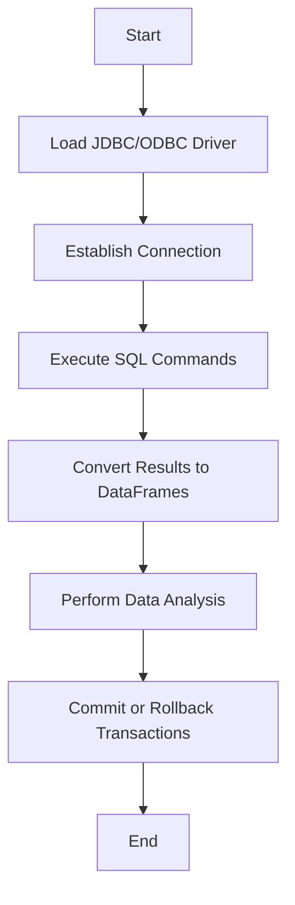

## 10.3 Database Interaction with JDBC.jl and ODBC.jl

In this section, we will delve into the world of database interaction in Julia using two powerful packages: **JDBC.jl** and **ODBC.jl**. These packages allow us to connect to a wide range of databases, execute SQL commands, and integrate data seamlessly into our Julia applications. Whether you're working with relational databases like MySQL, PostgreSQL, or SQL Server, or need to interface with legacy systems, JDBC.jl and ODBC.jl provide the tools you need.

### Establishing Connections

Establishing a connection to a database is the first step in any database interaction. Both JDBC.jl and ODBC.jl offer robust methods for connecting to databases, each with its own strengths and use cases.

#### JDBC.jl

**JDBC.jl** is a Julia package that allows you to connect to databases using Java Database Connectivity (JDBC) drivers. This is particularly useful if you're working in environments where JDBC drivers are readily available or if you need to connect to databases that are not natively supported by Julia.

**Steps to Connect Using JDBC.jl:**

1. **Install JDBC.jl**: First, ensure that you have the JDBC.jl package installed. You can do this using Julia's package manager.

   ```julia
   using Pkg
   Pkg.add("JDBC")
   ```

2. **Load the JDBC Driver**: You need to have the JDBC driver for your database. This is typically a `.jar` file that you can download from the database vendor's website.

3. **Establish a Connection**: Use the `JDBC.Connection` function to establish a connection to your database.

   ```julia
   using JDBC

   # Load the JDBC driver
   JDBC.load_driver("path/to/your/jdbc/driver.jar")

   # Establish a connection
   conn = JDBC.Connection("jdbc:your_database_url", "username", "password")
   ```

   > **Note:** Replace `your_database_url`, `username`, and `password` with your actual database credentials.

#### ODBC.jl

**ODBC.jl** provides an interface to databases via Open Database Connectivity (ODBC). This is a more universal method of connecting to databases and is supported by a wide range of database systems.

**Steps to Connect Using ODBC.jl:**

1. **Install ODBC.jl**: Like JDBC.jl, you need to install the ODBC.jl package.

   ```julia
   using Pkg
   Pkg.add("ODBC")
   ```

2. **Configure ODBC Data Source**: Ensure that your ODBC data source is configured on your system. This typically involves setting up a DSN (Data Source Name) using your operating system's ODBC Data Source Administrator.

3. **Establish a Connection**: Use the `ODBC.Connection` function to connect to your database.

   ```julia
   using ODBC

   # Establish a connection
   conn = ODBC.Connection("DSN=your_dsn;UID=username;PWD=password")
   ```

   > **Note:** Replace `your_dsn`, `username`, and `password` with your actual DSN and credentials.

### Executing SQL Commands

Once a connection is established, the next step is to execute SQL commands. Both JDBC.jl and ODBC.jl allow you to run a variety of SQL statements, including SELECT, INSERT, UPDATE, and DELETE.

#### Query Execution

**Executing Queries with JDBC.jl:**

```julia
stmt = JDBC.Statement(conn)
result = JDBC.execute(stmt, "SELECT * FROM your_table")

while JDBC.next(result)
    println(JDBC.getvalue(result, 1))  # Print the first column of each row
end

JDBC.close(stmt)
```

**Executing Queries with ODBC.jl:**

```julia
query = "SELECT * FROM your_table"
result = ODBC.query(conn, query)

using DataFrames
df = DataFrame(result)

println(df)
```

### Data Integration

Integrating data into Julia workflows is a crucial step in data analysis and manipulation. Both JDBC.jl and ODBC.jl allow you to convert query results into DataFrames, which can then be used for further analysis.

#### DataFrames Conversion

**Converting JDBC Results to DataFrames:**

```julia
using DataFrames

df = DataFrame(JDBC.ResultSet(result))

println(df)
```

**Converting ODBC Results to DataFrames:**

```julia
using DataFrames

df = DataFrame(result)

println(df)
```

### Transaction Management

Managing transactions is essential for ensuring data integrity and consistency. Both JDBC.jl and ODBC.jl provide mechanisms for controlling transactions programmatically.

#### Commit and Rollback

**Transaction Management with JDBC.jl:**

```julia
JDBC.setautocommit(conn, false)

try
    # Execute some SQL commands
    JDBC.execute(conn, "INSERT INTO your_table (column1) VALUES ('value1')")
    JDBC.execute(conn, "UPDATE your_table SET column1 = 'value2' WHERE column1 = 'value1'")

    # Commit the transaction
    JDBC.commit(conn)
catch e
    # Rollback the transaction in case of an error
    JDBC.rollback(conn)
    println("Transaction failed: ", e)
finally
    # Restore auto-commit mode
    JDBC.setautocommit(conn, true)
end
```

**Transaction Management with ODBC.jl:**

```julia
ODBC.setautocommit(conn, false)

try
    # Execute some SQL commands
    ODBC.execute(conn, "INSERT INTO your_table (column1) VALUES ('value1')")
    ODBC.execute(conn, "UPDATE your_table SET column1 = 'value2' WHERE column1 = 'value1'")

    # Commit the transaction
    ODBC.commit(conn)
catch e
    # Rollback the transaction in case of an error
    ODBC.rollback(conn)
    println("Transaction failed: ", e)
finally
    # Restore auto-commit mode
    ODBC.setautocommit(conn, true)
end
```

### Use Cases and Examples

Database interaction is a critical component of many applications. Here are some common use cases where JDBC.jl and ODBC.jl can be effectively utilized:

#### Enterprise Data Integration

Incorporating database operations into Julia workflows is essential for enterprise data integration. This allows organizations to leverage Julia's powerful data processing capabilities while maintaining seamless access to existing data sources.

**Example:**

Imagine a scenario where you need to analyze sales data stored in a SQL Server database. By using ODBC.jl, you can easily connect to the database, retrieve the data, and perform complex analyses using Julia's data manipulation libraries.

```julia
using ODBC, DataFrames

conn = ODBC.Connection("DSN=SalesDB;UID=user;PWD=pass")

query = "SELECT * FROM Sales"
sales_data = DataFrame(ODBC.query(conn, query))

total_sales = sum(sales_data[:Amount])
println("Total Sales: ", total_sales)
```

### Visualizing Database Interaction

To better understand the process of database interaction using JDBC.jl and ODBC.jl, let's visualize the workflow:



**Diagram Description:** This flowchart illustrates the typical workflow for interacting with databases using JDBC.jl and ODBC.jl. It starts with loading the appropriate driver, establishing a connection, executing SQL commands, converting results to DataFrames, performing data analysis, and managing transactions.

### Try It Yourself

Now that we've covered the basics, it's time to try it yourself. Experiment with the code examples provided, and consider making the following modifications:

- **Change the Database**: Try connecting to a different database system and executing queries.
- **Modify SQL Commands**: Experiment with different SQL commands, such as JOINs or complex WHERE clauses.
- **Integrate with DataFrames**: Use the DataFrames package to perform more advanced data manipulation and analysis.

### References and Links

For further reading and more in-depth information, consider the following resources:

- [JDBC.jl Documentation](https://github.com/JuliaDatabases/JDBC.jl)
- [ODBC.jl Documentation](https://github.com/JuliaDatabases/ODBC.jl)
- [DataFrames.jl Documentation](https://dataframes.juliadata.org/stable/)

### Knowledge Check

Before we wrap up, let's reinforce what we've learned with a few questions:

- What are the key differences between JDBC.jl and ODBC.jl?
- How do you manage transactions in JDBC.jl and ODBC.jl?
- What are some common use cases for database interaction in Julia?

### Embrace the Journey

Remember, mastering database interaction in Julia is just the beginning. As you progress, you'll be able to build more complex and data-driven applications. Keep experimenting, stay curious, and enjoy the journey!

## Quiz Time!



### What is the primary purpose of JDBC.jl and ODBC.jl in Julia?

- [x] To connect to databases and execute SQL commands
- [ ] To perform data visualization
- [ ] To handle file I/O operations
- [ ] To manage Julia packages

> **Explanation:** JDBC.jl and ODBC.jl are used to connect to databases and execute SQL commands, enabling database interaction in Julia.

### Which package would you use to connect to a database using JDBC drivers?

- [x] JDBC.jl
- [ ] ODBC.jl
- [ ] DataFrames.jl
- [ ] CSV.jl

> **Explanation:** JDBC.jl is specifically designed for connecting to databases using JDBC drivers.

### What is the first step in establishing a connection using JDBC.jl?

- [x] Load the JDBC driver
- [ ] Execute a SQL query
- [ ] Convert results to DataFrames
- [ ] Commit a transaction

> **Explanation:** The first step in establishing a connection using JDBC.jl is to load the JDBC driver.

### How do you convert query results to DataFrames using ODBC.jl?

- [x] Use the DataFrame constructor
- [ ] Use the CSV.read function
- [ ] Use the JSON.parse function
- [ ] Use the FileIO.load function

> **Explanation:** You can convert query results to DataFrames using the DataFrame constructor in ODBC.jl.

### What is the purpose of setting autocommit to false in transaction management?

- [x] To manually control when transactions are committed
- [ ] To automatically commit transactions
- [ ] To prevent any changes to the database
- [ ] To execute queries without a connection

> **Explanation:** Setting autocommit to false allows you to manually control when transactions are committed, providing more control over database operations.

### Which function is used to execute SQL commands in ODBC.jl?

- [x] ODBC.execute
- [ ] JDBC.execute
- [ ] DataFrames.execute
- [ ] CSV.execute

> **Explanation:** The ODBC.execute function is used to execute SQL commands in ODBC.jl.

### What is a common use case for database interaction in Julia?

- [x] Enterprise data integration
- [ ] Image processing
- [ ] Web scraping
- [ ] Game development

> **Explanation:** Enterprise data integration is a common use case for database interaction in Julia, allowing seamless access to existing data sources.

### What is the role of DataFrames in database interaction?

- [x] To convert query results for analysis
- [ ] To visualize data
- [ ] To manage database connections
- [ ] To execute SQL commands

> **Explanation:** DataFrames are used to convert query results into a format suitable for analysis in Julia.

### Which package provides an interface to databases via ODBC?

- [x] ODBC.jl
- [ ] JDBC.jl
- [ ] DataFrames.jl
- [ ] CSV.jl

> **Explanation:** ODBC.jl provides an interface to databases via ODBC.

### True or False: JDBC.jl and ODBC.jl can be used to interact with both relational and non-relational databases.

- [x] True
- [ ] False

> **Explanation:** JDBC.jl and ODBC.jl can be used to interact with a variety of databases, including both relational and non-relational databases, depending on the availability of appropriate drivers.


