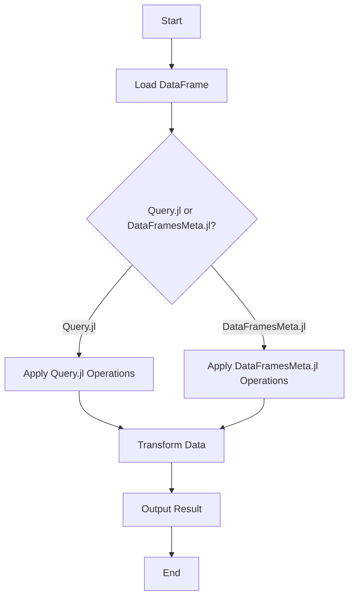

## 10.4 Querying Data with Query.jl and DataFramesMeta.jl

In the realm of data manipulation and analysis, Julia offers powerful tools that make querying and transforming data both intuitive and efficient. Two such tools are **Query.jl** and **DataFramesMeta.jl**. These packages provide robust frameworks for handling data, each with its unique strengths and syntax styles. In this section, we will delve into the capabilities of these packages, explore their syntax, and demonstrate how to leverage them for complex data transformations.

### Introduction to Query.jl

**Query.jl** is a package inspired by LINQ (Language Integrated Query) from the .NET framework. It provides a fluent query interface that allows you to perform complex data manipulations using a chain of operations. This approach is particularly beneficial for those familiar with LINQ or those who prefer a more functional programming style.

#### Key Features of Query.jl

- **Fluent Interface**: Query.jl uses a method-chaining syntax that allows for concise and readable queries.
- **Integration with Multiple Data Sources**: It can operate on various data structures, including DataFrames, arrays, and even databases.
- **Powerful Data Transformation**: Offers a wide range of operations such as filtering, sorting, grouping, and joining.

#### Basic Syntax and Operations

Let's start with a simple example to illustrate the basic syntax of Query.jl. Suppose we have a DataFrame containing information about a group of people:

```julia
using DataFrames, Query

people = DataFrame(Name = ["Alice", "Bob", "Charlie", "David"],
                   Age = [25, 30, 35, 40],
                   Occupation = ["Engineer", "Doctor", "Artist", "Engineer"])

result = @from p in people begin
    @where p.Age > 30
    @select {p.Name, p.Occupation}
    @collect DataFrame
end

println(result)
```

In this example, we use the `@from`, `@where`, and `@select` macros to filter and select data. The `@collect` macro is used to specify the output format, which in this case is a DataFrame.

### Advanced Querying with Query.jl

Query.jl shines when it comes to more complex data operations. Let's explore some advanced features such as grouping and joining.

#### Grouping Data

Grouping data is a common operation in data analysis. Query.jl provides a straightforward way to group data and perform aggregate operations.

```julia
grouped_result = @from p in people begin
    @group p by p.Occupation into g
    @select {Occupation = g.key, AverageAge = mean(g.Age)}
    @collect DataFrame
end

println(grouped_result)
```

In this example, we group the data by `Occupation` and calculate the average age for each group.

#### Joining DataFrames

Joining multiple DataFrames is another powerful feature of Query.jl. It allows you to combine data from different sources based on common keys.

```julia
salaries = DataFrame(Name = ["Alice", "Bob", "Charlie", "David"],
                     Salary = [70000, 120000, 50000, 90000])

joined_result = @from p in people, s in salaries begin
    @where p.Name == s.Name
    @select {p.Name, p.Occupation, s.Salary}
    @collect DataFrame
end

println(joined_result)
```

Here, we join the `people` and `salaries` DataFrames on the `Name` column, allowing us to combine occupation and salary information.

### Introduction to DataFramesMeta.jl

**DataFramesMeta.jl** is another powerful package for data manipulation in Julia. It extends the functionality of DataFrames.jl by providing macros that simplify common data operations. The syntax is inspired by the dplyr package in R, making it accessible to those familiar with R's data manipulation paradigms.

#### Key Features of DataFramesMeta.jl

- **Macro-Based Syntax**: Provides macros like `@where`, `@select`, and `@transform` to simplify DataFrame operations.
- **Integration with DataFrames.jl**: Seamlessly integrates with DataFrames.jl, enhancing its capabilities.
- **Concise and Readable Code**: Reduces boilerplate code, making data manipulation more intuitive.

#### Basic Syntax and Operations

Let's explore the basic syntax of DataFramesMeta.jl with a simple example:

```julia
using DataFrames, DataFramesMeta

df = DataFrame(Name = ["Alice", "Bob", "Charlie", "David"],
               Age = [25, 30, 35, 40],
               Occupation = ["Engineer", "Doctor", "Artist", "Engineer"])

result_df = @where(df, :Age .> 30)

println(result_df)
```

In this example, the `@where` macro is used to filter rows where the `Age` column is greater than 30.

### Advanced Querying with DataFramesMeta.jl

DataFramesMeta.jl also supports more complex operations such as transformations and aggregations.

#### Transforming Data

Transforming data is a common requirement in data analysis. DataFramesMeta.jl provides the `@transform` macro to add or modify columns.

```julia
transformed_df = @transform(df, AgeInMonths = :Age * 12)

println(transformed_df)
```

Here, we add a new column `AgeInMonths` by multiplying the `Age` column by 12.

#### Aggregating Data

Aggregating data is another powerful feature of DataFramesMeta.jl. You can use the `@by` macro to group and summarize data.

```julia
aggregated_df = @by(df, :Occupation, AverageAge = mean(:Age))

println(aggregated_df)
```

In this example, we group the data by `Occupation` and calculate the average age for each group.

### Comparison and Selection: Choosing the Right Tool

When deciding between Query.jl and DataFramesMeta.jl, consider the following factors:

- **Syntax Preference**: If you prefer a LINQ-like, method-chaining syntax, Query.jl might be more suitable. If you are familiar with R's dplyr, you might find DataFramesMeta.jl more intuitive.
- **Complexity of Operations**: For complex operations involving multiple data sources or intricate transformations, Query.jl's fluent interface can be advantageous. DataFramesMeta.jl excels in scenarios where concise and readable code is paramount.
- **Performance Considerations**: Both packages are optimized for performance, but the choice may depend on specific use cases and data sizes.

### Use Cases and Examples

Let's explore some practical use cases where these packages can be applied effectively.

#### Complex Data Transformations

Suppose you have a dataset containing sales data, and you want to perform a series of transformations to analyze sales trends.

```julia
using DataFrames, Query, DataFramesMeta

sales = DataFrame(Product = ["A", "B", "A", "C"],
                  Sales = [100, 200, 150, 300],
                  Month = [1, 1, 2, 2])

total_sales_query = @from s in sales begin
    @group s by s.Product into g
    @select {Product = g.key, TotalSales = sum(g.Sales)}
    @collect DataFrame
end

println(total_sales_query)

total_sales_meta = @by(sales, :Product, TotalSales = sum(:Sales))

println(total_sales_meta)
```

Both Query.jl and DataFramesMeta.jl allow you to achieve the same result, showcasing their flexibility and power.

### Visualizing Data Query Workflows

To better understand the flow of data through these queries, let's visualize the process using a flowchart.



**Figure 1**: This flowchart illustrates the decision-making process when choosing between Query.jl and DataFramesMeta.jl for data transformations.

### Try It Yourself

Experiment with the examples provided by modifying the data or operations. For instance, try adding new columns, changing the grouping criteria, or joining additional DataFrames. This hands-on approach will deepen your understanding and help you master these powerful tools.

### References and Further Reading

- [Query.jl Documentation](https://github.com/queryverse/Query.jl)
- [DataFramesMeta.jl Documentation](https://github.com/JuliaData/DataFramesMeta.jl)
- [DataFrames.jl Documentation](https://dataframes.juliadata.org/stable/)

### Knowledge Check

Before we wrap up, let's reinforce what we've learned with a few questions and exercises.

## Quiz Time!



### What is the primary inspiration for Query.jl's syntax?

- [x] LINQ from .NET
- [ ] SQL
- [ ] dplyr from R
- [ ] Pandas from Python

> **Explanation:** Query.jl's syntax is inspired by LINQ (Language Integrated Query) from the .NET framework, providing a fluent query interface.

### Which macro in DataFramesMeta.jl is used to filter rows?

- [ ] @select
- [x] @where
- [ ] @transform
- [ ] @group

> **Explanation:** The `@where` macro in DataFramesMeta.jl is used to filter rows based on a condition.

### What is a key advantage of using Query.jl?

- [x] Fluent method-chaining syntax
- [ ] Macro-based syntax
- [ ] Integration with R
- [ ] Built-in plotting capabilities

> **Explanation:** Query.jl offers a fluent method-chaining syntax, making it easy to perform complex data manipulations.

### Which package is more similar to R's dplyr?

- [ ] Query.jl
- [x] DataFramesMeta.jl
- [ ] DataFrames.jl
- [ ] Plots.jl

> **Explanation:** DataFramesMeta.jl's syntax is inspired by dplyr from R, providing similar macros for data manipulation.

### How can you add a new column in DataFramesMeta.jl?

- [x] Using the @transform macro
- [ ] Using the @select macro
- [ ] Using the @where macro
- [ ] Using the @group macro

> **Explanation:** The `@transform` macro in DataFramesMeta.jl is used to add or modify columns in a DataFrame.

### What operation does the @group macro perform in Query.jl?

- [x] Groups data by a specified key
- [ ] Filters data based on a condition
- [ ] Joins two DataFrames
- [ ] Adds a new column

> **Explanation:** The `@group` macro in Query.jl is used to group data by a specified key, allowing for aggregate operations.

### Which package allows joining multiple DataFrames?

- [x] Query.jl
- [ ] DataFramesMeta.jl
- [ ] Plots.jl
- [ ] CSV.jl

> **Explanation:** Query.jl allows joining multiple DataFrames based on common keys, enabling complex data combinations.

### What is a common use case for DataFramesMeta.jl?

- [ ] Plotting data
- [x] Simplifying DataFrame operations with macros
- [ ] Machine learning
- [ ] Web development

> **Explanation:** DataFramesMeta.jl is commonly used to simplify DataFrame operations with macros, making data manipulation more intuitive.

### Which package provides a LINQ-like interface?

- [x] Query.jl
- [ ] DataFramesMeta.jl
- [ ] DataFrames.jl
- [ ] Plots.jl

> **Explanation:** Query.jl provides a LINQ-like interface, allowing for fluent query operations on data.

### True or False: Both Query.jl and DataFramesMeta.jl can perform data transformations.

- [x] True
- [ ] False

> **Explanation:** Both Query.jl and DataFramesMeta.jl are capable of performing data transformations, each with its unique syntax and features.



Remember, mastering these tools is just the beginning. As you continue your journey in Julia, you'll discover even more powerful techniques for data manipulation and analysis. Keep experimenting, stay curious, and enjoy the process!
