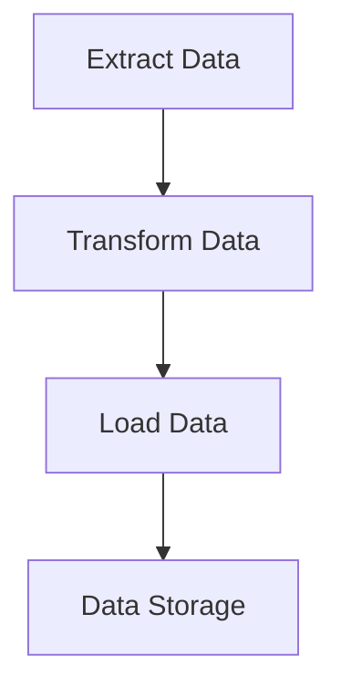

## 10.6 Data Transformation Pipelines

Data transformation pipelines are essential components in data engineering and analytics, enabling the seamless processing of data from raw formats to structured, actionable insights. In Julia, these pipelines can be constructed efficiently using the language's powerful features, such as method chaining, lazy evaluation, and multiple dispatch. This section will guide you through the process of building effective data transformation pipelines in Julia, with a focus on performance optimization and practical applications like ETL (Extract, Transform, Load) processes.

### Building Pipelines

#### Chaining Operations

Chaining operations is a technique used to create clear and concise sequences of transformations. In Julia, this can be achieved using method chaining or the piping operator (`|>`), which allows for a more readable and maintainable code structure.

**Example: Method Chaining**

```julia
using DataFrames

df = DataFrame(Name = ["Alice", "Bob", "Charlie"],
               Age = [25, 30, 35],
               Salary = [50000, 60000, 70000])

result = df |> 
    @filter(_.Age > 25) |> 
    @select(_.Name, _.Salary) |> 
    @transform(SalaryInThousands = _.Salary / 1000)

println(result)
```

In this example, we use the `DataFramesMeta.jl` package to filter, select, and transform data in a DataFrame. The piping operator (`|>`) is used to chain these operations, making the code more readable and expressive.

**Try It Yourself**

Experiment with the code by adding more transformations, such as grouping or aggregating data. For instance, try adding a step to calculate the average salary.

#### Lazy vs. Eager Evaluation

Lazy evaluation is a strategy where computation is deferred until the results are needed. This can lead to significant performance improvements, especially when dealing with large datasets. In contrast, eager evaluation computes results immediately.

**Performance Considerations**

Deciding between lazy and eager evaluation depends on the specific use case and performance requirements. Lazy evaluation can save memory and processing time by avoiding unnecessary computations, while eager evaluation might be more straightforward for smaller datasets.

**Example: Lazy Evaluation with Iterators**

```julia
using IterTools

lazy_iter = IterTools.take(10, 1:100)

transformed_iter = IterTools.map(x -> x^2, lazy_iter)

result = collect(transformed_iter)
println(result)
```

In this example, we use the `IterTools.jl` package to create a lazy iterator that squares numbers in a range. The computation is only performed when the results are collected.

**Try It Yourself**

Modify the code to use different transformations, such as filtering out even numbers before squaring them.

### Use Cases and Examples

#### ETL Processes

ETL (Extract, Transform, Load) processes are common in data engineering, where data is extracted from various sources, transformed into a suitable format, and loaded into a destination system. Julia's capabilities make it an excellent choice for implementing ETL pipelines.

**Example: ETL Pipeline in Julia**

```julia
using CSV, DataFrames

data = CSV.File("data.csv") |> DataFrame

cleaned_data = data |>
    @filter(_.Age .> 18) |>
    @select(_.Name, _.Age, _.Salary) |>
    @transform(SalaryInThousands = _.Salary / 1000)

CSV.write("cleaned_data.csv", cleaned_data)
```

In this ETL example, we extract data from a CSV file, apply transformations to clean and prepare the data, and finally load the transformed data into a new CSV file.

**Try It Yourself**

Extend the ETL pipeline to include additional transformations, such as normalizing salary data or handling missing values.

### Visualizing Data Transformation Pipelines

To better understand the flow of data through a transformation pipeline, we can use diagrams to visualize the process. Below is a simple flowchart representing a typical ETL pipeline.



**Diagram Description**

- **Extract Data**: Represents the initial step of loading data from a source.
- **Transform Data**: Involves cleaning, filtering, and preparing the data.
- **Load Data**: The final step of saving the transformed data to a destination.
- **Data Storage**: Where the final data resides, ready for analysis or reporting.

### References and Links

For further reading on data transformation pipelines and related concepts, consider exploring the following resources:

- [DataFrames.jl Documentation](https://dataframes.juliadata.org/stable/)
- [CSV.jl Documentation](https://csv.juliadata.org/stable/)
- [IterTools.jl Documentation](https://juliacollections.github.io/IterTools.jl/stable/)

### Knowledge Check

- What are the benefits of using method chaining in data transformation pipelines?
- How does lazy evaluation improve performance in data processing?
- Describe a scenario where eager evaluation might be more appropriate than lazy evaluation.

### Embrace the Journey

Remember, mastering data transformation pipelines in Julia is a journey. As you progress, you'll discover more efficient ways to process and analyze data. Keep experimenting, stay curious, and enjoy the process of building powerful data workflows!

## Quiz Time!



### What is the primary advantage of method chaining in data transformation pipelines?

- [x] Improved readability and maintainability
- [ ] Faster execution time
- [ ] Reduced memory usage
- [ ] Increased complexity

> **Explanation:** Method chaining improves readability and maintainability by creating a clear sequence of operations.

### Which operator is commonly used for method chaining in Julia?

- [ ] `->`
- [x] `|>`
- [ ] `=>`
- [ ] `::`

> **Explanation:** The piping operator (`|>`) is used for method chaining in Julia.

### What is lazy evaluation?

- [x] Deferring computation until results are needed
- [ ] Computing results immediately
- [ ] Avoiding computation altogether
- [ ] Performing computations in parallel

> **Explanation:** Lazy evaluation defers computation until the results are actually needed, optimizing resource usage.

### In which scenario might eager evaluation be more appropriate?

- [ ] When dealing with large datasets
- [x] When immediate results are required
- [ ] When optimizing memory usage
- [ ] When computations are complex

> **Explanation:** Eager evaluation is more appropriate when immediate results are required.

### What does ETL stand for?

- [x] Extract, Transform, Load
- [ ] Evaluate, Test, Launch
- [ ] Execute, Transfer, Log
- [ ] Edit, Translate, Link

> **Explanation:** ETL stands for Extract, Transform, Load, a common process in data engineering.

### Which package is used for handling CSV files in Julia?

- [ ] DataFrames.jl
- [x] CSV.jl
- [ ] IterTools.jl
- [ ] Plots.jl

> **Explanation:** CSV.jl is used for handling CSV files in Julia.

### What is the purpose of the `@filter` macro in DataFramesMeta.jl?

- [x] To filter rows based on a condition
- [ ] To sort rows in ascending order
- [ ] To group rows by a column
- [ ] To join two DataFrames

> **Explanation:** The `@filter` macro is used to filter rows based on a specified condition.

### How can lazy evaluation save memory?

- [x] By avoiding unnecessary computations
- [ ] By storing data in compressed formats
- [ ] By using more efficient data structures
- [ ] By parallelizing computations

> **Explanation:** Lazy evaluation saves memory by avoiding unnecessary computations until the results are needed.

### What is a common use case for data transformation pipelines?

- [x] ETL processes
- [ ] Web development
- [ ] Game design
- [ ] Network security

> **Explanation:** Data transformation pipelines are commonly used in ETL processes to prepare data for analysis.

### True or False: Lazy evaluation always results in faster execution times.

- [ ] True
- [x] False

> **Explanation:** Lazy evaluation does not always result in faster execution times; it depends on the specific use case and data size.


