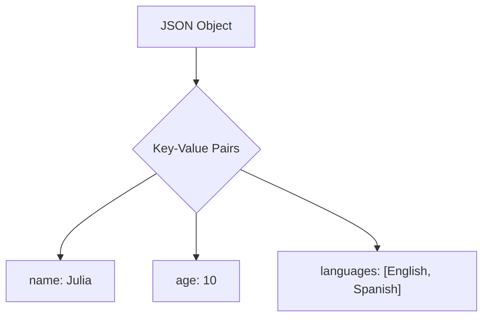
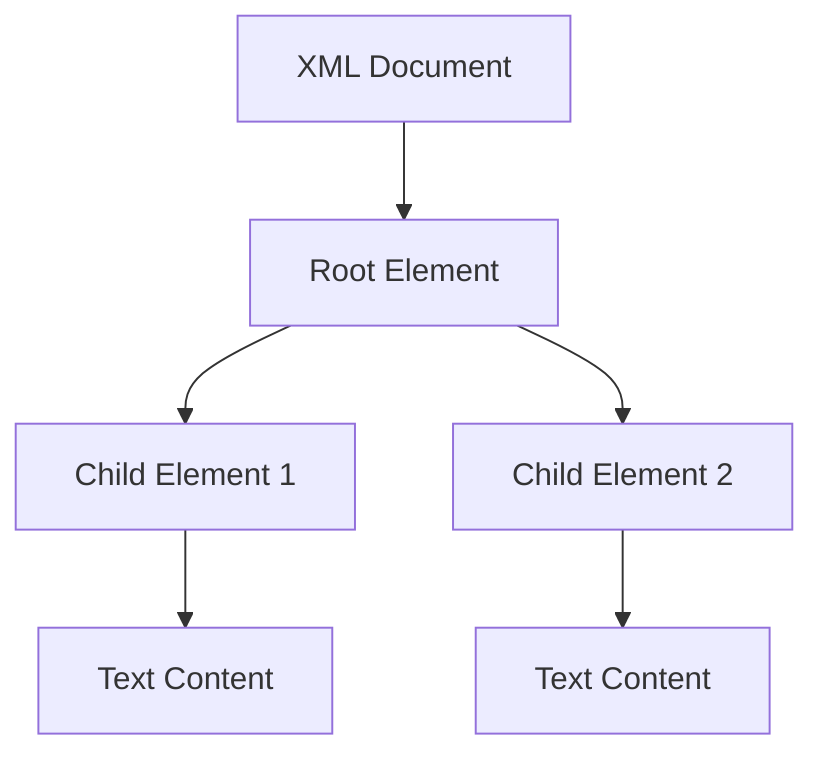

## 10.7 Working with JSON, XML, and Other Formats

In today's data-driven world, handling various data formats is crucial for any software developer. Julia, with its rich ecosystem, provides robust tools for working with popular data formats like JSON, XML, and others. In this section, we'll explore how to efficiently parse, generate, and manipulate these formats using Julia's powerful libraries. We'll also delve into use cases, best practices, and provide practical examples to solidify your understanding.

### JSON Handling

JSON (JavaScript Object Notation) is a lightweight data interchange format that's easy for humans to read and write, and easy for machines to parse and generate. It's widely used for APIs, configuration files, and data storage.

#### JSON.jl

**JSON.jl** is a popular Julia package for parsing and generating JSON data. It provides a simple interface for converting between JSON strings and Julia data structures.

**Installation:**

To use JSON.jl, you need to install it first. Open the Julia REPL and run:

```julia
using Pkg
Pkg.add("JSON")
```

**Parsing JSON:**

To parse a JSON string into a Julia object, use the `JSON.parse` function. Here's an example:

```julia
using JSON

json_str = """
{
    "name": "Julia",
    "age": 10,
    "languages": ["English", "Spanish"]
}
"""

data = JSON.parse(json_str)

println(data["name"])  # Output: Julia
println(data["age"])   # Output: 10
println(data["languages"])  # Output: ["English", "Spanish"]
```

**Generating JSON:**

To convert a Julia object into a JSON string, use the `JSON.json` function:

```julia
julia_obj = Dict("name" => "Julia", "age" => 10, "languages" => ["English", "Spanish"])

json_output = JSON.json(julia_obj)

println(json_output)
```

**Handling Complex Data Structures:**

JSON.jl can handle complex nested structures, including arrays and dictionaries. Here's an example:

```julia
complex_data = Dict(
    "users" => [
        Dict("id" => 1, "name" => "Alice"),
        Dict("id" => 2, "name" => "Bob")
    ],
    "active" => true
)

json_complex = JSON.json(complex_data)
println(json_complex)
```

### XML Processing

XML (eXtensible Markup Language) is a markup language that defines rules for encoding documents in a format that is both human-readable and machine-readable. It's commonly used for data interchange in web services.

#### EzXML.jl

**EzXML.jl** is a Julia package for reading and manipulating XML documents. It provides a straightforward API for parsing XML files and accessing their elements.

**Installation:**

To use EzXML.jl, install it via the Julia package manager:

```julia
using Pkg
Pkg.add("EzXML")
```

**Reading XML:**

To read an XML file, use the `EzXML.parse_file` function. Here's an example:

```julia
using EzXML

doc = EzXML.parse_file("example.xml")

root = EzXML.root(doc)
println(EzXML.name(root))  # Output: root element name

for child in EzXML.children(root)
    println(EzXML.name(child), ": ", EzXML.text(child))
end
```

**Manipulating XML:**

EzXML.jl allows you to modify XML documents by adding, removing, or updating elements:

```julia
new_element = EzXML.Node("newElement")
EzXML.set_text(new_element, "This is a new element")
EzXML.push!(root, new_element)

EzXML.write(doc, "modified_example.xml")
```

### Other Formats

In addition to JSON and XML, Julia supports various other data formats, including Excel files and serialization formats.

#### Excel Files with XLSX.jl

Excel files are widely used for data storage and analysis. **XLSX.jl** is a Julia package that allows you to read and write Excel files.

**Installation:**

```julia
using Pkg
Pkg.add("XLSX")
```

**Reading Excel Files:**

To read data from an Excel file, use the `XLSX.readtable` function:

```julia
using XLSX

data = XLSX.readtable("data.xlsx", "Sheet1")

for row in data
    println(row)
end
```

**Writing Excel Files:**

To write data to an Excel file, use the `XLSX.writetable` function:

```julia
data_to_write = [
    ("Name", "Age"),
    ("Alice", 30),
    ("Bob", 25)
]

XLSX.writetable("output.xlsx", data_to_write)
```

#### Serialization with JLSO.jl

Serialization is the process of converting a data structure into a format that can be easily stored and retrieved. **JLSO.jl** is a Julia package for serializing and deserializing Julia objects.

**Installation:**

```julia
using Pkg
Pkg.add("JLSO")
```

**Serializing Data:**

To serialize a Julia object, use the `JLSO.save` function:

```julia
using JLSO

data = Dict("key1" => "value1", "key2" => "value2")

JLSO.save("data.jlso", data)
```

**Deserializing Data:**

To deserialize a Julia object, use the `JLSO.load` function:

```julia
loaded_data = JLSO.load("data.jlso")

println(loaded_data)
```

### Use Cases and Examples

#### Configuration Files

Configuration files are essential for managing application settings. JSON and YAML are popular formats for configuration files due to their readability and ease of use.

**Using JSON for Configuration:**

```julia
config_json = """
{
    "app_name": "MyApp",
    "version": "1.0",
    "settings": {
        "theme": "dark",
        "language": "en"
    }
}
"""

config = JSON.parse(config_json)

println("App Name: ", config["app_name"])
println("Theme: ", config["settings"]["theme"])
```

**Using YAML for Configuration:**

YAML (YAML Ain't Markup Language) is another human-readable data serialization format. Use the **YAML.jl** package to handle YAML files in Julia.

**Installation:**

```julia
using Pkg
Pkg.add("YAML")
```

**Reading YAML:**

```julia
using YAML

yaml_str = """
app_name: MyApp
version: 1.0
settings:
  theme: dark
  language: en
"""

config_yaml = YAML.load(yaml_str)

println("App Name: ", config_yaml["app_name"])
println("Theme: ", config_yaml["settings"]["theme"])
```

### Try It Yourself

Experiment with the code examples provided in this section. Try modifying the JSON and XML data structures, or create your own configuration files using JSON or YAML. Explore the capabilities of the libraries mentioned and see how they can be applied to your projects.

### Visualizing Data Formats

To better understand the structure of JSON and XML data, let's visualize them using Mermaid.js diagrams.



*Figure 1: JSON Object Structure*



*Figure 2: XML Document Structure*

### References and Links

- [JSON.jl Documentation](https://github.com/JuliaIO/JSON.jl)
- [EzXML.jl Documentation](https://github.com/bicycle1885/EzXML.jl)
- [XLSX.jl Documentation](https://github.com/felipenoris/XLSX.jl)
- [JLSO.jl Documentation](https://github.com/invenia/JLSO.jl)
- [YAML.jl Documentation](https://github.com/JuliaData/YAML.jl)

### Knowledge Check

- What are the primary differences between JSON and XML?
- How can you handle nested data structures in JSON using Julia?
- What are some common use cases for serialization in Julia?

### Embrace the Journey

Remember, mastering data formats is just one step in your journey as a Julia developer. Keep experimenting, stay curious, and enjoy the process of learning and applying new skills. The more you practice, the more proficient you'll become in handling complex data scenarios.

## Quiz Time!



### What is the primary use of JSON.jl in Julia?

- [x] Parsing and generating JSON data
- [ ] Reading and writing Excel files
- [ ] Serializing Julia objects
- [ ] Manipulating XML documents

> **Explanation:** JSON.jl is used for parsing and generating JSON data in Julia.

### Which package is used for XML processing in Julia?

- [ ] JSON.jl
- [x] EzXML.jl
- [ ] XLSX.jl
- [ ] JLSO.jl

> **Explanation:** EzXML.jl is the package used for XML processing in Julia.

### How do you install a package in Julia?

- [x] using Pkg; Pkg.add("PackageName")
- [ ] import PackageName
- [ ] include("PackageName.jl")
- [ ] using PackageName

> **Explanation:** To install a package in Julia, you use the Pkg.add function.

### What function is used to parse a JSON string in JSON.jl?

- [ ] JSON.stringify
- [x] JSON.parse
- [ ] JSON.read
- [ ] JSON.load

> **Explanation:** JSON.parse is used to parse a JSON string into a Julia object.

### Which package allows reading and writing Excel files in Julia?

- [ ] JSON.jl
- [ ] EzXML.jl
- [x] XLSX.jl
- [ ] JLSO.jl

> **Explanation:** XLSX.jl is used for reading and writing Excel files in Julia.

### What is the purpose of serialization in Julia?

- [x] Converting a data structure into a storable format
- [ ] Parsing JSON data
- [ ] Manipulating XML documents
- [ ] Reading Excel files

> **Explanation:** Serialization is used to convert a data structure into a format that can be easily stored and retrieved.

### Which package is used for YAML processing in Julia?

- [ ] JSON.jl
- [ ] EzXML.jl
- [ ] XLSX.jl
- [x] YAML.jl

> **Explanation:** YAML.jl is used for processing YAML files in Julia.

### How do you serialize a Julia object using JLSO.jl?

- [ ] JLSO.parse
- [x] JLSO.save
- [ ] JLSO.write
- [ ] JLSO.dump

> **Explanation:** JLSO.save is used to serialize a Julia object to a file.

### What is a common use case for JSON in applications?

- [x] Configuration files
- [ ] Reading Excel files
- [ ] XML document manipulation
- [ ] Serializing Julia objects

> **Explanation:** JSON is commonly used for configuration files due to its readability and ease of use.

### True or False: JSON is a markup language like XML.

- [ ] True
- [x] False

> **Explanation:** JSON is a data interchange format, not a markup language like XML.


