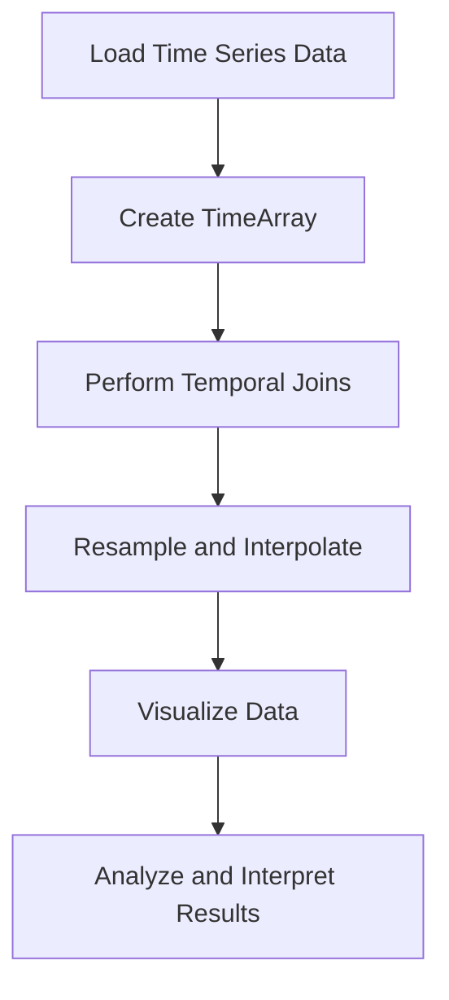

## 10.8 Time Series Analysis with TimeSeries.jl

Time series analysis is a crucial aspect of data analysis, especially when dealing with data that is indexed in time order. Julia, with its rich ecosystem, provides a powerful package called TimeSeries.jl to handle time series data efficiently. In this section, we will delve into the capabilities of TimeSeries.jl, exploring its core features such as the `TimeArray` type, temporal joins, resampling, interpolation, and visualization techniques. We will also discuss practical use cases, such as financial analysis, to illustrate the application of these concepts.

### Working with TimeSeries Data

Time series data is a sequence of data points collected or recorded at successive points in time. It is prevalent in various fields such as finance, economics, environmental studies, and more. TimeSeries.jl is designed to make working with such data in Julia both intuitive and efficient.

#### TimeArray Type

At the heart of TimeSeries.jl is the `TimeArray` type, a specialized array that includes a timestamp index. This structure allows for efficient manipulation and analysis of time-indexed data.

```julia
using TimeSeries

timestamps = DateTime(2024, 1, 1):Day(1):DateTime(2024, 1, 10)
data = rand(10, 2)  # Random data for demonstration
ta = TimeArray(timestamps, data, ["Series1", "Series2"])

println(ta)
```

In this example, we create a `TimeArray` with random data indexed by daily timestamps. The `TimeArray` structure is flexible and can handle various data types, making it suitable for diverse time series applications.

### Operations

TimeSeries.jl provides a suite of operations to manipulate and analyze time series data effectively.

#### Temporal Joins

Temporal joins are essential for merging data based on time alignment. This operation is particularly useful when combining datasets from different sources or when aligning data with different frequencies.

```julia
timestamps2 = DateTime(2024, 1, 5):Day(1):DateTime(2024, 1, 15)
data2 = rand(11, 2)
ta2 = TimeArray(timestamps2, data2, ["Series3", "Series4"])

joined_ta = merge(ta, ta2)

println(joined_ta)
```

In this example, we merge two `TimeArray` objects, aligning them based on their timestamps. The `merge` function handles the alignment, ensuring that the resulting `TimeArray` contains data from both sources.

#### Resampling and Interpolation

Resampling involves changing the frequency of time series data, which is often necessary when dealing with datasets of different granularities. Interpolation is used to estimate missing values in a time series.

```julia
resampled_ta = resample(ta, Day(2))

interpolated_ta = interpolate(resampled_ta, method=:linear)

println(interpolated_ta)
```

Here, we resample the `TimeArray` to a lower frequency and use linear interpolation to fill in missing values. These operations are crucial for preparing data for analysis, especially when dealing with incomplete datasets.

### Visualization

Visualizing time series data is vital for understanding trends, patterns, and anomalies. TimeSeries.jl integrates seamlessly with Julia's plotting libraries, enabling effective visualization of time-based data.

#### Plotting Time Series

To plot time series data, we can use libraries such as Plots.jl or Makie.jl, which provide a wide range of plotting capabilities.

```julia
using Plots

plot(ta, label=["Series1" "Series2"], title="Time Series Plot", xlabel="Time", ylabel="Value")
```

This code snippet demonstrates how to plot a `TimeArray` using Plots.jl. The resulting chart provides a visual representation of the data, making it easier to identify trends and patterns.

### Use Cases and Examples

Time series analysis has numerous applications across different domains. Let's explore a few practical examples to illustrate the use of TimeSeries.jl.

#### Financial Analysis

In finance, time series analysis is used to model stock prices, economic indicators, and other financial metrics over time. TimeSeries.jl provides the tools necessary to perform such analyses efficiently.

```julia
stock_prices = TimeArray(DateTime(2024, 1, 1):Day(1):DateTime(2024, 1, 30), cumsum(randn(30)), ["StockPrice"])

plot(stock_prices, title="Simulated Stock Prices", xlabel="Date", ylabel="Price")
```

In this example, we simulate stock price data and plot it to visualize the trend over a month. Such analyses can be extended to include more sophisticated models and techniques for forecasting and risk assessment.

### Try It Yourself

Experiment with the code examples provided by modifying the data, timestamps, and operations. Try creating your own `TimeArray` with real-world data, perform temporal joins with different datasets, and visualize the results. This hands-on approach will deepen your understanding of time series analysis with TimeSeries.jl.

### Visualizing Time Series Analysis Workflow

To better understand the workflow of time series analysis using TimeSeries.jl, let's visualize the process using a flowchart.



This flowchart represents the typical steps involved in time series analysis, from loading data to analyzing and interpreting the results. Each step builds upon the previous one, creating a comprehensive analysis pipeline.

### References and Links

For further reading and exploration of time series analysis in Julia, consider the following resources:

- [TimeSeries.jl Documentation](https://juliastats.org/TimeSeries.jl/stable/)
- [Plots.jl Documentation](https://docs.juliaplots.org/latest/)
- [Makie.jl Documentation](https://makie.juliaplots.org/stable/)

### Knowledge Check

To reinforce your understanding of time series analysis with TimeSeries.jl, consider the following questions and challenges:

- What is a `TimeArray`, and how does it differ from a regular array?
- How would you perform a temporal join between two datasets with different frequencies?
- Try resampling a `TimeArray` to a higher frequency and discuss the implications.
- Experiment with different interpolation methods and observe their effects on the data.

### Embrace the Journey

Remember, mastering time series analysis is a journey. As you progress, you'll encounter more complex datasets and analysis techniques. Keep experimenting, stay curious, and enjoy the process of discovery and learning.

### Summary

In this section, we explored the powerful capabilities of TimeSeries.jl for time series analysis in Julia. We covered the `TimeArray` type, temporal joins, resampling, interpolation, and visualization techniques. By applying these concepts to practical use cases, such as financial analysis, you can unlock valuable insights from time-indexed data.

## Quiz Time!



### What is the primary data structure used in TimeSeries.jl for handling time-indexed data?

- [x] TimeArray
- [ ] DataFrame
- [ ] Array
- [ ] Matrix

> **Explanation:** The `TimeArray` is the primary data structure in TimeSeries.jl designed for handling time-indexed data efficiently.

### Which function is used to merge two TimeArray objects based on their timestamps?

- [x] merge
- [ ] join
- [ ] append
- [ ] concatenate

> **Explanation:** The `merge` function is used to perform temporal joins by aligning two `TimeArray` objects based on their timestamps.

### What is the purpose of resampling in time series analysis?

- [x] To change the frequency of the time series data
- [ ] To remove outliers from the data
- [ ] To normalize the data
- [ ] To perform statistical tests

> **Explanation:** Resampling is used to change the frequency of time series data, which is essential when dealing with datasets of different granularities.

### Which method is commonly used for filling missing values in a time series?

- [x] Interpolation
- [ ] Extrapolation
- [ ] Normalization
- [ ] Standardization

> **Explanation:** Interpolation is commonly used to estimate and fill missing values in a time series.

### What is a practical application of time series analysis in finance?

- [x] Modeling stock prices over time
- [ ] Analyzing customer feedback
- [ ] Optimizing supply chain logistics
- [ ] Designing marketing campaigns

> **Explanation:** Time series analysis is widely used in finance for modeling stock prices, economic indicators, and other financial metrics over time.

### Which plotting library is mentioned for visualizing time series data in Julia?

- [x] Plots.jl
- [ ] Matplotlib
- [ ] ggplot2
- [ ] Seaborn

> **Explanation:** Plots.jl is a popular plotting library in Julia used for visualizing time series data.

### What is the first step in the time series analysis workflow?

- [x] Load Time Series Data
- [ ] Perform Temporal Joins
- [ ] Resample and Interpolate
- [ ] Visualize Data

> **Explanation:** The first step in the time series analysis workflow is to load the time series data.

### How can you visualize the workflow of time series analysis?

- [x] Using a flowchart
- [ ] Using a pie chart
- [ ] Using a histogram
- [ ] Using a bar chart

> **Explanation:** A flowchart is an effective way to visualize the workflow of time series analysis, illustrating the sequence of steps involved.

### True or False: TimeSeries.jl can only handle financial data.

- [ ] True
- [x] False

> **Explanation:** False. TimeSeries.jl is versatile and can handle time series data from various domains, not just financial data.

### Which of the following is NOT a feature of TimeSeries.jl?

- [ ] Temporal Joins
- [ ] Resampling
- [ ] Interpolation
- [x] Machine Learning Models

> **Explanation:** TimeSeries.jl focuses on time series data manipulation and analysis, not on providing machine learning models.


