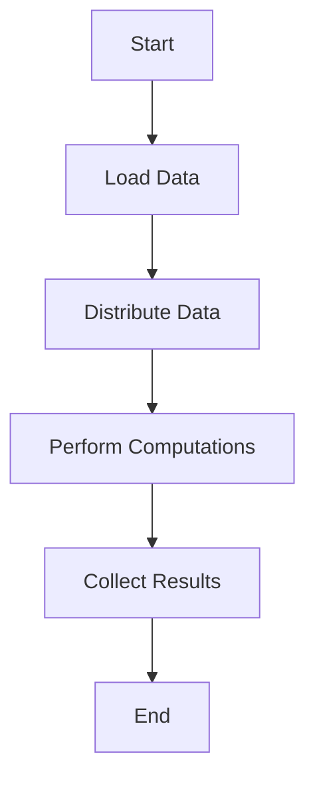

## 10.9 Big Data Processing and Integration

In today's data-driven world, the ability to efficiently process and integrate large datasets is crucial for businesses and researchers alike. Julia, with its high-performance capabilities and ease of use, is an excellent choice for big data processing. In this section, we will explore how Julia can be leveraged for handling large datasets, utilizing parallel and distributed computing, and integrating with big data tools like Apache Spark.

### Handling Large Datasets

Handling large datasets requires strategies that go beyond the capabilities of traditional in-memory processing. Julia offers several tools and packages to facilitate the processing of large datasets efficiently.

#### Out-of-Core Processing

Out-of-core processing refers to techniques that allow data to be processed without loading the entire dataset into memory. This is particularly useful when dealing with datasets that exceed the available RAM.

- **Dagger.jl**: Dagger.jl is a powerful package for distributed computing in Julia. It allows for out-of-core processing by enabling computations to be distributed across multiple workers, which can be on the same machine or across a cluster.

```julia
using Dagger

function compute(x)
    return x * 2
end

darr = Dagger.@darray [1, 2, 3, 4, 5]

result = Dagger.@compute compute.(darr)

collected_result = collect(result)
println(collected_result)  # Output: [2, 4, 6, 8, 10]
```

In this example, we define a simple computation that doubles each element in an array. Using Dagger.jl, we distribute this computation across multiple workers, allowing for efficient processing of large datasets.

### Parallel and Distributed Computing

Julia's built-in support for parallel and distributed computing makes it an ideal choice for big data processing. By distributing workloads across multiple processors or machines, we can significantly reduce computation time.

#### Distributed.jl

Distributed.jl is a standard library in Julia that provides tools for parallel and distributed computing. It allows us to distribute workloads across multiple processors or machines, making it easier to handle large datasets.

```julia
using Distributed

addprocs(4)

@everywhere function parallel_compute(x)
    return x * 2
end

results = pmap(parallel_compute, [1, 2, 3, 4, 5])

println(results)  # Output: [2, 4, 6, 8, 10]
```

In this example, we use `Distributed.jl` to add worker processes and distribute a simple computation across them. The `pmap` function is used to apply the `parallel_compute` function to each element in the array, distributing the workload across the available workers.

### Integration with Big Data Tools

Integrating Julia with existing big data tools allows us to leverage their capabilities while benefiting from Julia's performance and ease of use.

#### Apache Spark Integration

Apache Spark is a popular big data processing framework that provides a unified analytics engine for large-scale data processing. Julia can be integrated with Spark using the Spark.jl package, allowing us to utilize Spark's capabilities from within Julia.

```julia
using Spark

spark = SparkSession.builder()
    .appName("JuliaSparkIntegration")
    .getOrCreate()

data = spark.read().json("path/to/large/dataset.json")

transformed_data = data.select("column1", "column2").filter("column1 > 100")

transformed_data.show()
```

In this example, we initialize a Spark session and create a DataFrame from a large JSON dataset. We then perform a simple transformation on the data, selecting specific columns and filtering rows based on a condition.

### Use Cases and Examples

Julia's capabilities for big data processing can be applied to a wide range of use cases, from scalable data analysis to real-time data processing.

#### Scalable Data Analysis

Scalable data analysis involves performing computations that exceed local resource limitations. By leveraging Julia's parallel and distributed computing capabilities, we can efficiently analyze large datasets.

```julia
using Distributed, DataFrames

addprocs(4)

@everywhere using DataFrames

data = DataFrame(rand(1:100, 1000000, 5), :auto)

@everywhere function analyze_data(df)
    return describe(df)
end

results = pmap(analyze_data, [data])

println(results)
```

In this example, we load a large dataset into a DataFrame and distribute the analysis across multiple workers using `pmap`. This allows us to efficiently perform data analysis on large datasets.

### Visualizing Big Data Processing in Julia

To better understand the flow of data and computations in Julia's big data processing, let's visualize the process using a flowchart.



**Figure 1: Big Data Processing Flow in Julia**

This flowchart illustrates the typical steps involved in processing big data with Julia. We start by loading the data, distributing it across workers, performing computations, collecting the results, and finally ending the process.

### Try It Yourself

Experiment with the code examples provided in this section. Try modifying the computations or the size of the datasets to see how Julia handles different scenarios. Consider integrating Julia with other big data tools or frameworks to explore additional capabilities.

### References and Links

- [Dagger.jl Documentation](https://github.com/JuliaParallel/Dagger.jl)
- [Distributed.jl Documentation](https://docs.julialang.org/en/v1/stdlib/Distributed/)
- [Apache Spark Documentation](https://spark.apache.org/docs/latest/)
- [Spark.jl Documentation](https://github.com/dfdx/Spark.jl)

### Knowledge Check

- What is out-of-core processing, and why is it important for big data?
- How does Dagger.jl facilitate distributed computing in Julia?
- Explain the role of Distributed.jl in parallel computing.
- How can Julia be integrated with Apache Spark?
- What are some use cases for scalable data analysis in Julia?

### Embrace the Journey

Remember, mastering big data processing and integration in Julia is a journey. As you continue to explore and experiment, you'll discover new ways to leverage Julia's capabilities for your data processing needs. Stay curious, keep learning, and enjoy the process!

## Quiz Time!



### What is out-of-core processing?

- [x] Processing data without loading the entire dataset into memory
- [ ] Processing data entirely in memory
- [ ] Processing data using only a single processor
- [ ] Processing data without any parallelization

> **Explanation:** Out-of-core processing allows for handling datasets that exceed available memory by processing data in chunks.

### Which package in Julia is used for distributed computing and out-of-core processing?

- [x] Dagger.jl
- [ ] DataFrames.jl
- [ ] Plots.jl
- [ ] Flux.jl

> **Explanation:** Dagger.jl is specifically designed for distributed computing and out-of-core processing in Julia.

### What is the primary purpose of Distributed.jl?

- [x] To distribute workloads across multiple processors or machines
- [ ] To visualize data
- [ ] To perform machine learning tasks
- [ ] To handle string manipulations

> **Explanation:** Distributed.jl is used to distribute workloads across multiple processors or machines, facilitating parallel computing.

### How can Julia be integrated with Apache Spark?

- [x] Using the Spark.jl package
- [ ] Using the Plots.jl package
- [ ] Using the DataFrames.jl package
- [ ] Using the Flux.jl package

> **Explanation:** The Spark.jl package allows Julia to integrate with Apache Spark for big data processing.

### What is a common use case for scalable data analysis in Julia?

- [x] Performing computations that exceed local resource limitations
- [ ] Creating simple plots
- [ ] Writing small scripts
- [ ] Managing small datasets

> **Explanation:** Scalable data analysis involves handling large datasets that exceed local resource limitations, making Julia's parallel capabilities essential.

### What function is used in Distributed.jl to distribute computations across workers?

- [x] pmap
- [ ] map
- [ ] filter
- [ ] reduce

> **Explanation:** The `pmap` function is used to distribute computations across workers in Distributed.jl.

### Which of the following is a benefit of using Julia for big data processing?

- [x] High-performance capabilities
- [x] Ease of use
- [ ] Limited library support
- [ ] Lack of parallel computing features

> **Explanation:** Julia offers high-performance capabilities and ease of use, making it suitable for big data processing.

### What does the Spark.jl package allow you to do?

- [x] Utilize Apache Spark's capabilities from within Julia
- [ ] Create interactive plots
- [ ] Perform symbolic mathematics
- [ ] Develop web applications

> **Explanation:** Spark.jl allows Julia to utilize Apache Spark's capabilities for big data processing.

### What is the role of Dagger.jl in Julia?

- [x] Facilitating distributed computing and out-of-core processing
- [ ] Visualizing data
- [ ] Performing machine learning tasks
- [ ] Handling string manipulations

> **Explanation:** Dagger.jl is used for distributed computing and out-of-core processing in Julia.

### True or False: Julia can only handle small datasets efficiently.

- [ ] True
- [x] False

> **Explanation:** Julia is capable of handling large datasets efficiently through its parallel and distributed computing capabilities.


