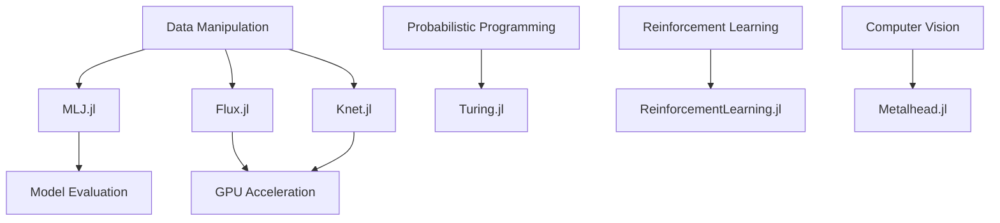

## 11.1 Overview of Machine Learning Tools

### Introduction to Julia's ML Ecosystem

Julia has rapidly emerged as a powerful language for machine learning (ML), offering a unique blend of high performance, ease of integration, and rapid prototyping. This section provides an in-depth overview of Julia's machine learning ecosystem, highlighting key libraries and frameworks that make Julia an attractive choice for ML practitioners.

#### Why Choose Julia for Machine Learning?

Julia stands out in the machine learning landscape for several reasons:

- **High Performance**: Julia's design allows it to achieve performance comparable to low-level languages like C and C++, making it ideal for computationally intensive ML tasks.
- **Ease of Use**: With syntax similar to Python, Julia is easy to learn and use, facilitating rapid development and prototyping.
- **Unified Ecosystem**: Julia's ecosystem seamlessly integrates data manipulation, visualization, and modeling, providing a cohesive environment for ML development.
- **Multiple Dispatch**: Julia's multiple dispatch system enables flexible and efficient code, which is particularly beneficial for ML algorithms that require different implementations based on input types.

### Key Packages in Julia's Machine Learning Ecosystem

Julia's machine learning ecosystem is rich with libraries and frameworks that cater to various aspects of ML, from traditional machine learning to deep learning and probabilistic programming. Let's explore some of the key packages:

#### MLJ.jl: A Comprehensive Machine Learning Framework

**MLJ.jl** is a powerful framework that provides a unified interface for machine learning in Julia. It supports a wide range of models and algorithms, making it a versatile choice for ML practitioners.

- **Unified Interface**: MLJ.jl offers a consistent API for training, evaluating, and tuning models, simplifying the workflow for users.
- **Model Composition**: It allows for the composition of models and pipelines, enabling complex workflows to be built with ease.
- **Interoperability**: MLJ.jl integrates with other Julia packages, such as DataFrames.jl for data manipulation and Plots.jl for visualization.

**Example**: Here's a simple example of using MLJ.jl to train a decision tree classifier:

```julia
using MLJ
using DecisionTree

X, y = @load_iris

tree_model = @load DecisionTreeClassifier pkg=DecisionTree

tree_machine = machine(tree_model, X, y)

fit!(tree_machine)

evaluate!(tree_machine, resampling=CV(nfolds=5), measure=accuracy)
```

#### Flux.jl and Knet.jl: Native Julia Libraries for Deep Learning

**Flux.jl** and **Knet.jl** are two of the most popular deep learning libraries in Julia, each offering unique features and capabilities.

- **Flux.jl**: Known for its simplicity and flexibility, Flux.jl is a pure Julia library that supports GPU acceleration and automatic differentiation. It is ideal for building custom neural networks and experimenting with novel architectures.

**Example**: Building a simple neural network with Flux.jl:

```julia
using Flux

model = Chain(
    Dense(4, 8, relu),
    Dense(8, 3),
    softmax
)

loss(x, y) = Flux.crossentropy(model(x), y)

opt = ADAM()
Flux.train!(loss, params(model), data, opt)
```

- **Knet.jl**: Knet.jl is another deep learning library that emphasizes performance and scalability. It provides features like dynamic computation graphs and efficient GPU support.

#### Turing.jl: Probabilistic Programming in Julia

**Turing.jl** is a powerful library for probabilistic programming, allowing users to define and infer complex probabilistic models.

- **Flexible Modeling**: Turing.jl supports a wide range of probabilistic models, from simple Bayesian models to complex hierarchical models.
- **Integration with Julia's Ecosystem**: It seamlessly integrates with other Julia packages, such as Distributions.jl for statistical distributions and MCMCChains.jl for Markov Chain Monte Carlo (MCMC) analysis.

**Example**: Defining a simple Bayesian model with Turing.jl:

```julia
using Turing

@model function coin_flip(y)
    p ~ Beta(1, 1)
    for i in 1:length(y)
        y[i] ~ Bernoulli(p)
    end
end

chain = sample(coin_flip(data), NUTS(), 1000)
```

#### ReinforcementLearning.jl: Framework for Reinforcement Learning

**ReinforcementLearning.jl** provides a comprehensive framework for developing and experimenting with reinforcement learning (RL) algorithms.

- **Modular Design**: The package is designed with modularity in mind, allowing users to easily swap out components like environments, policies, and learning algorithms.
- **Rich Set of Environments**: It includes a variety of environments for testing and benchmarking RL algorithms, from classic control problems to more complex tasks.

**Example**: Setting up a simple RL environment with ReinforcementLearning.jl:

```julia
using ReinforcementLearning

env = CartPoleEnv()

agent = DQNAgent(env)

run(agent, env, StopAfterEpisode(100))
```

#### Metalhead.jl: Pre-trained Models for Computer Vision

**Metalhead.jl** provides access to a collection of pre-trained models for computer vision tasks, such as image classification and object detection.

- **Pre-trained Models**: It includes models like ResNet, VGG, and DenseNet, which can be used for transfer learning or as feature extractors.
- **Ease of Use**: The package is designed to be user-friendly, allowing users to quickly load and use pre-trained models.

**Example**: Using a pre-trained ResNet model with Metalhead.jl:

```julia
using Metalhead

model = ResNet()

img = load("path/to/image.jpg")

predictions = model(img)
```

### Julia's Strength in Machine Learning

Julia's unique features make it particularly well-suited for machine learning applications:

- **Combining Speed and Readability**: Julia combines the speed of C/C++ with the readability of Python, allowing for efficient and maintainable ML code.
- **Seamless Integration**: Julia's ecosystem provides seamless integration between data manipulation, visualization, and modeling, enabling a smooth workflow for ML practitioners.
- **Rich Ecosystem**: With a growing number of packages and a vibrant community, Julia's ML ecosystem continues to expand, offering new tools and capabilities for researchers and developers.

### Visualizing Julia's Machine Learning Ecosystem

To better understand the relationships and interactions between different components of Julia's ML ecosystem, let's visualize it using a Mermaid.js diagram:



**Diagram Description**: This diagram illustrates the key components of Julia's machine learning ecosystem, highlighting the connections between data manipulation, modeling, evaluation, and specialized libraries for deep learning, probabilistic programming, reinforcement learning, and computer vision.

### Try It Yourself

To deepen your understanding of Julia's machine learning tools, try modifying the code examples provided in this section. Experiment with different models, datasets, and hyperparameters to see how they affect the results. For instance, try changing the architecture of the neural network in the Flux.jl example or use a different pre-trained model in Metalhead.jl.

### Knowledge Check

Before moving on, let's review some key concepts:

- How does Julia's performance compare to other languages commonly used for ML?
- What are the advantages of using MLJ.jl for machine learning in Julia?
- How do Flux.jl and Knet.jl differ in their approach to deep learning?
- What types of models can be defined using Turing.jl?
- How does ReinforcementLearning.jl facilitate the development of RL algorithms?

### Embrace the Journey

Remember, this is just the beginning of your journey with Julia's machine learning ecosystem. As you progress, you'll discover more advanced techniques and tools that will enable you to build sophisticated ML applications. Keep experimenting, stay curious, and enjoy the journey!

## Quiz Time!



### What is a key advantage of using Julia for machine learning?

- [x] High performance comparable to C/C++
- [ ] Limited library support
- [ ] Complex syntax
- [ ] Lack of community support

> **Explanation:** Julia offers high performance comparable to low-level languages like C and C++, making it ideal for computationally intensive ML tasks.

### Which package provides a unified interface for machine learning in Julia?

- [x] MLJ.jl
- [ ] Flux.jl
- [ ] Knet.jl
- [ ] Turing.jl

> **Explanation:** MLJ.jl provides a unified interface for training, evaluating, and tuning machine learning models in Julia.

### What is Flux.jl primarily used for?

- [x] Deep learning
- [ ] Probabilistic programming
- [ ] Data visualization
- [ ] Reinforcement learning

> **Explanation:** Flux.jl is a native Julia library primarily used for deep learning.

### Which package is used for probabilistic programming in Julia?

- [x] Turing.jl
- [ ] MLJ.jl
- [ ] Flux.jl
- [ ] Metalhead.jl

> **Explanation:** Turing.jl is a powerful library for probabilistic programming in Julia.

### What does Metalhead.jl provide?

- [x] Pre-trained models for computer vision
- [ ] Reinforcement learning algorithms
- [ ] Probabilistic models
- [ ] Data manipulation tools

> **Explanation:** Metalhead.jl provides access to a collection of pre-trained models for computer vision tasks.

### How does Julia's syntax compare to Python?

- [x] Similar syntax
- [ ] More complex
- [ ] Less readable
- [ ] Completely different

> **Explanation:** Julia's syntax is similar to Python, making it easy to learn and use.

### What is a feature of ReinforcementLearning.jl?

- [x] Modular design
- [ ] Limited environments
- [ ] Lack of support for policies
- [ ] No integration with other packages

> **Explanation:** ReinforcementLearning.jl is designed with modularity in mind, allowing users to easily swap out components like environments, policies, and learning algorithms.

### Which library supports GPU acceleration in Julia?

- [x] Flux.jl
- [ ] MLJ.jl
- [ ] Turing.jl
- [ ] Metalhead.jl

> **Explanation:** Flux.jl supports GPU acceleration, making it suitable for building and training deep learning models.

### What is a benefit of using MLJ.jl?

- [x] Consistent API for ML workflows
- [ ] Limited model support
- [ ] Complex integration
- [ ] Lack of documentation

> **Explanation:** MLJ.jl offers a consistent API for training, evaluating, and tuning models, simplifying the workflow for users.

### True or False: Julia's ecosystem provides seamless integration between data manipulation, visualization, and modeling.

- [x] True
- [ ] False

> **Explanation:** Julia's ecosystem offers seamless integration between data manipulation, visualization, and modeling, providing a cohesive environment for ML development.


