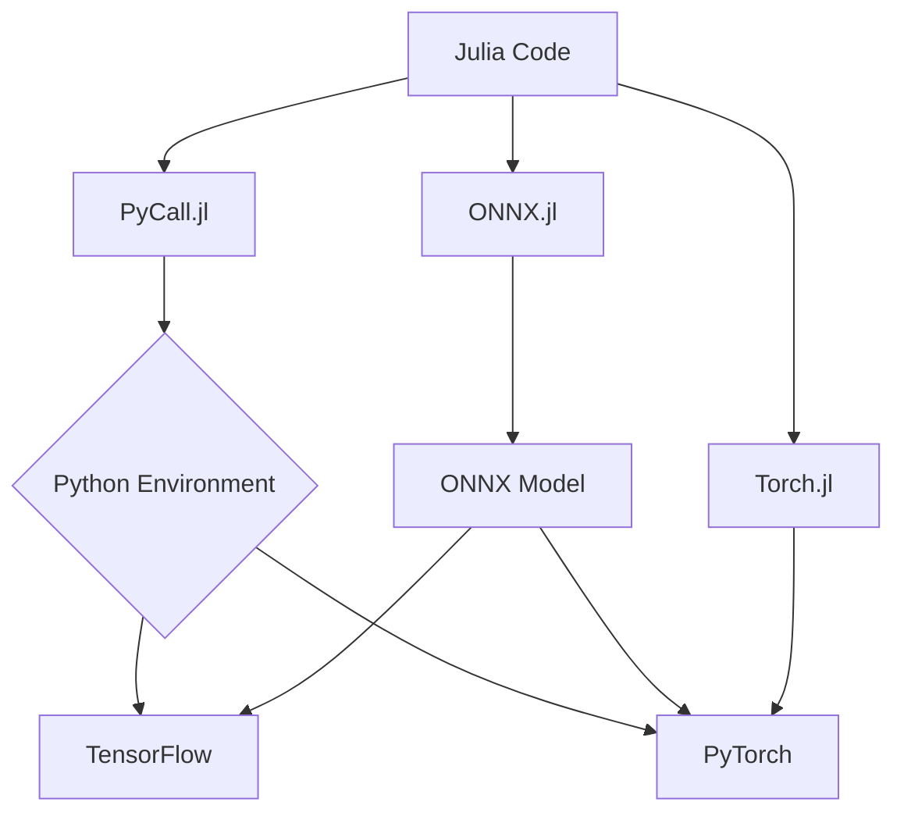

## 11.10 Interoperability with TensorFlow and PyTorch

In the realm of machine learning, TensorFlow and PyTorch have emerged as dominant frameworks, each offering unique strengths and extensive ecosystems. Julia, known for its high performance and ease of use, can be seamlessly integrated with these frameworks to leverage their capabilities while benefiting from Julia's speed and expressiveness. This section will guide you through the process of interfacing Julia with TensorFlow and PyTorch using tools like PyCall.jl, ONNX.jl, and Torch.jl.

### Using PyCall.jl

#### Interfacing with Python Libraries

PyCall.jl is a powerful package that allows Julia to call Python functions and use Python libraries as if they were native Julia functions. This capability is crucial for accessing TensorFlow and PyTorch, which are primarily Python-based.

**Setting Up PyCall.jl**

To begin using PyCall.jl, you need to install it and configure it to use your Python environment:

```julia
using Pkg
Pkg.add("PyCall")
```

By default, PyCall uses the Conda.jl package to install a private Python distribution. If you want to use a specific Python installation, you can set the `PYTHON` environment variable before building PyCall:

```bash
ENV["PYTHON"] = "/path/to/your/python"
Pkg.build("PyCall")
```

**Calling TensorFlow and PyTorch Functions**

Once PyCall is set up, you can import and use TensorFlow and PyTorch libraries:

```julia
using PyCall

tf = pyimport("tensorflow")

torch = pyimport("torch")

a = tf.constant(3.0)
b = tf.constant(4.0)
c = tf.add(a, b)
println("TensorFlow addition result: ", c.numpy())

x = torch.tensor([1.0, 2.0, 3.0])
y = torch.tensor([4.0, 5.0, 6.0])
z = torch.add(x, y)
println("PyTorch addition result: ", z)
```

In this example, we demonstrate how to create and manipulate tensors using both TensorFlow and PyTorch from within Julia. The `pyimport` function is used to import Python modules, and you can call functions and access attributes using the familiar dot notation.

### ONNX.jl

#### Model Interchange

ONNX (Open Neural Network Exchange) is an open format built to represent machine learning models. ONNX.jl provides Julia with the ability to import and export models in the ONNX format, facilitating interoperability between different frameworks.

**Importing and Exporting Models**

To use ONNX.jl, you first need to install it:

```julia
using Pkg
Pkg.add("ONNX")
```

Here's how you can import and export models using ONNX.jl:

```julia
using ONNX

model = ONNX.load_model("model.onnx")

ONNX.save_model("exported_model.onnx", model)
```

ONNX.jl allows you to work with models across different platforms, making it easier to integrate Julia with existing machine learning workflows that use TensorFlow or PyTorch.

### Torch.jl

#### Native Julia Interface to PyTorch

Torch.jl is a Julia package that provides a native interface to PyTorch, allowing you to access PyTorch models and functions directly without needing to go through Python.

**Accessing PyTorch Models and Functions**

To get started with Torch.jl, install it using:

```julia
using Pkg
Pkg.add("Torch")
```

Here's an example of using Torch.jl to create and manipulate tensors:

```julia
using Torch

x = torch.tensor([1.0, 2.0, 3.0])
y = torch.tensor([4.0, 5.0, 6.0])

z = x + y
println("Torch.jl addition result: ", z)
```

Torch.jl provides a more Julia-native experience when working with PyTorch, reducing the overhead of interfacing through Python.

### Use Cases

#### Combining Julia's Performance with Existing Python ML Ecosystems

The interoperability between Julia and Python's machine learning frameworks opens up a plethora of possibilities:

1. **Performance Optimization**: Use Julia for performance-critical parts of your machine learning pipeline, such as data preprocessing or custom layer implementation, while leveraging TensorFlow or PyTorch for model training and inference.

2. **Seamless Integration**: Integrate Julia into existing Python-based workflows, allowing you to gradually adopt Julia without needing to rewrite entire codebases.

3. **Cross-Platform Model Deployment**: Use ONNX to deploy models trained in TensorFlow or PyTorch across different platforms, including those that support Julia.

4. **Research and Experimentation**: Quickly prototype and experiment with new ideas by combining Julia's ease of use with the extensive libraries available in the Python ecosystem.

### Visualizing Interoperability

To better understand how Julia interacts with TensorFlow and PyTorch, let's visualize the process using a flowchart:



**Diagram Description**: This flowchart illustrates the pathways through which Julia can interact with TensorFlow and PyTorch. PyCall.jl acts as a bridge to the Python environment, allowing direct calls to TensorFlow and PyTorch. ONNX.jl facilitates model interchange, while Torch.jl provides a native interface to PyTorch.

### Try It Yourself

To deepen your understanding, try modifying the code examples provided:

- Experiment with different TensorFlow and PyTorch functions.
- Use ONNX.jl to convert a model from one framework to another.
- Explore Torch.jl's documentation to implement a simple neural network.

### References and Links

- [PyCall.jl Documentation](https://github.com/JuliaPy/PyCall.jl)
- [ONNX.jl Documentation](https://github.com/FluxML/ONNX.jl)
- [Torch.jl Documentation](https://github.com/FluxML/Torch.jl)
- [TensorFlow Official Site](https://www.tensorflow.org/)
- [PyTorch Official Site](https://pytorch.org/)

### Knowledge Check

- What are the benefits of using Julia with TensorFlow and PyTorch?
- How does PyCall.jl facilitate interoperability between Julia and Python?
- What role does ONNX.jl play in model interchange?
- How does Torch.jl differ from PyCall.jl when interfacing with PyTorch?

### Embrace the Journey

Remember, integrating Julia with TensorFlow and PyTorch is just the beginning. As you continue to explore, you'll discover new ways to enhance your machine learning workflows. Keep experimenting, stay curious, and enjoy the journey!

## Quiz Time!



### What is PyCall.jl used for in Julia?

- [x] To call Python functions and use Python libraries from Julia.
- [ ] To compile Julia code into Python.
- [ ] To convert Julia code into ONNX format.
- [ ] To create native Julia interfaces for Python libraries.

> **Explanation:** PyCall.jl allows Julia to call Python functions and use Python libraries as if they were native Julia functions.

### How can you specify a custom Python installation for PyCall.jl?

- [x] By setting the `PYTHON` environment variable before building PyCall.
- [ ] By editing the PyCall.jl source code.
- [ ] By using a special Julia command.
- [ ] By installing a separate package.

> **Explanation:** You can set the `PYTHON` environment variable to point to your desired Python installation before building PyCall.

### What is ONNX used for?

- [x] To represent machine learning models in an open format for cross-platform compatibility.
- [ ] To compile Julia code into machine learning models.
- [ ] To convert Python code into Julia.
- [ ] To create native Julia interfaces for TensorFlow.

> **Explanation:** ONNX is an open format built to represent machine learning models, facilitating interoperability between different frameworks.

### What is the primary advantage of using Torch.jl?

- [x] It provides a native Julia interface to PyTorch.
- [ ] It allows Julia to compile into PyTorch models.
- [ ] It converts PyTorch models into TensorFlow.
- [ ] It creates ONNX models from Julia code.

> **Explanation:** Torch.jl provides a native Julia interface to PyTorch, allowing direct access to PyTorch models and functions.

### Which package allows you to import and export models in ONNX format?

- [x] ONNX.jl
- [ ] PyCall.jl
- [ ] Torch.jl
- [ ] TensorFlow.jl

> **Explanation:** ONNX.jl is used to import and export models in the ONNX format.

### What is a key benefit of using Julia with TensorFlow and PyTorch?

- [x] Combining Julia's performance with existing Python ML ecosystems.
- [ ] Replacing Python entirely with Julia.
- [ ] Converting all Python code into Julia.
- [ ] Eliminating the need for Python libraries.

> **Explanation:** Julia can be used to optimize performance-critical parts of machine learning workflows while leveraging TensorFlow and PyTorch.

### How does PyCall.jl interact with Python libraries?

- [x] By importing Python modules and calling functions using dot notation.
- [ ] By converting Python code into Julia syntax.
- [ ] By creating a virtual Python environment.
- [ ] By compiling Python code into Julia.

> **Explanation:** PyCall.jl allows importing Python modules and calling functions using the familiar dot notation.

### What is the role of ONNX in machine learning?

- [x] It facilitates model interchange between different platforms.
- [ ] It compiles Julia code into machine learning models.
- [ ] It converts Python code into Julia.
- [ ] It creates native Julia interfaces for TensorFlow.

> **Explanation:** ONNX facilitates model interchange, allowing models to be used across different platforms.

### What does Torch.jl provide for Julia users?

- [x] A native interface to PyTorch.
- [ ] A way to compile Julia code into PyTorch models.
- [ ] A method to convert PyTorch models into TensorFlow.
- [ ] A tool to create ONNX models from Julia code.

> **Explanation:** Torch.jl provides a native interface to PyTorch, allowing direct access to its models and functions.

### True or False: ONNX.jl can be used to convert models between TensorFlow and PyTorch.

- [x] True
- [ ] False

> **Explanation:** ONNX.jl can be used to import and export models in the ONNX format, facilitating conversion between TensorFlow and PyTorch.


