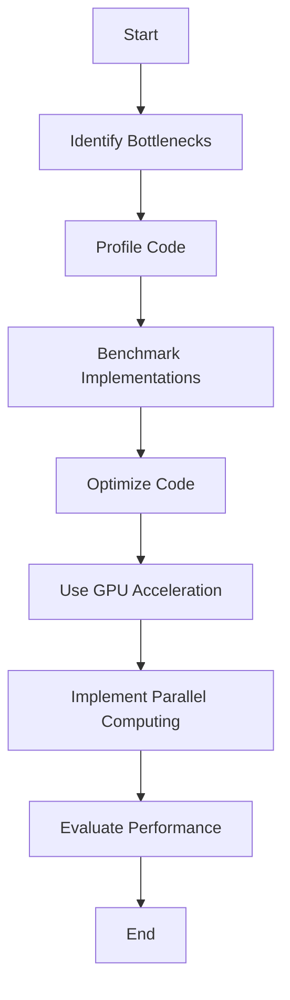

## 11.11 Performance Optimization in Machine Learning Tasks

In the realm of machine learning, performance optimization is crucial for handling large datasets and complex models efficiently. Julia, with its high-performance capabilities and ease of use, offers a robust platform for optimizing machine learning tasks. In this section, we will explore various techniques to enhance performance, including profiling and benchmarking, GPU acceleration, parallel computing, and code optimization.

### Profiling and Benchmarking

#### Identifying Bottlenecks

Before optimizing, it's essential to identify where the bottlenecks lie in your code. Julia provides powerful tools like `Profile.jl` and `BenchmarkTools.jl` to help with this task.

- **Profile.jl**: This tool allows you to collect detailed information about where time is being spent in your code. By visualizing the call graph, you can pinpoint the functions that consume the most time.

```julia
using Profile

function slow_function()
    for i in 1:10^6
        sqrt(i)
    end
end

@profile slow_function()
Profile.print()  # Display the profiling results
```

- **BenchmarkTools.jl**: This package provides macros for robust benchmarking. It helps in comparing different implementations and understanding their performance characteristics.

```julia
using BenchmarkTools

function fast_function()
    for i in 1:10^6
        sqrt(i)
    end
end

@btime fast_function()  # Benchmark the function
```

### GPU Acceleration

Leveraging the power of GPUs can significantly speed up machine learning tasks. Julia's ecosystem includes packages like `CUDA.jl` and `GPUArrays.jl` for writing GPU-accelerated code.

#### CUDA.jl and GPUArrays.jl

- **CUDA.jl**: This package provides a comprehensive interface for CUDA programming in Julia. It allows you to write high-performance GPU code with ease.

```julia
using CUDA

function gpu_function()
    a = CUDA.fill(1.0f0, 1024)  # Create a GPU array
    b = CUDA.fill(2.0f0, 1024)
    c = a .+ b  # Perform element-wise addition on the GPU
    return c
end

result = gpu_function()
```

- **GPUArrays.jl**: This package offers a high-level interface for GPU computing, making it easier to work with GPU arrays.

```julia
using GPUArrays

function gpu_array_function()
    a = GPUArray(rand(Float32, 1024))
    b = GPUArray(rand(Float32, 1024))
    c = a .+ b  # Element-wise addition
    return c
end

result = gpu_array_function()
```

#### CuArrays

`CuArrays` is a specialized package for deep learning, providing optimized GPU array operations.

```julia
using CuArrays

function deep_learning_gpu()
    a = CuArray(rand(Float32, 1024, 1024))
    b = CuArray(rand(Float32, 1024, 1024))
    c = a * b  # Matrix multiplication on the GPU
    return c
end

result = deep_learning_gpu()
```

### Parallel Computing

Parallel computing is another powerful technique to enhance performance, especially for training large models.

#### Distributed Training

Data parallelism allows you to distribute training across multiple GPUs or nodes, significantly speeding up the process.

```julia
using Distributed
addprocs(4)  # Add 4 worker processes

@everywhere function parallel_training()
    # Simulate training task
    sleep(1)
    return myid()
end

results = @distributed (vcat) for i in 1:10
    parallel_training()
end

println(results)
```

### Optimizing Code

Optimizing your code is crucial for achieving maximum performance. Key areas include ensuring type stability and reducing memory allocations.

#### Type Stability

Type stability means that the return type of a function is predictable based on the input types. This predictability allows Julia to generate more efficient machine code.

```julia
function type_stable_function(x::Int)
    return x + 1
end

@code_warntype type_stable_function(5)  # Check for type stability
```

#### Memory Allocation

Reducing unnecessary memory allocations can lead to significant performance gains. Use in-place operations and pre-allocate memory where possible.

```julia
function reduce_allocations!(a, b, c)
    @. c = a + b  # In-place operation
end

a = rand(1024)
b = rand(1024)
c = similar(a)

reduce_allocations!(a, b, c)
```

### Use Cases

Scaling up training for large-scale language models is a common use case for these optimization techniques. By combining GPU acceleration, parallel computing, and code optimization, you can train models more efficiently and handle larger datasets.

### Visualizing Performance Optimization

To better understand the flow of performance optimization in machine learning tasks, let's visualize the process using a flowchart.



**Caption**: This flowchart illustrates the process of optimizing performance in machine learning tasks, from identifying bottlenecks to evaluating performance improvements.

### Try It Yourself

Experiment with the code examples provided. Try modifying the functions to see how changes affect performance. For instance, alter the size of arrays in GPU functions or the number of processes in parallel computing examples to observe the impact on execution time.

### References and Links

For further reading on performance optimization in Julia, consider the following resources:

- [JuliaLang Documentation](https://docs.julialang.org/)
- [CUDA.jl GitHub Repository](https://github.com/JuliaGPU/CUDA.jl)
- [BenchmarkTools.jl Documentation](https://github.com/JuliaCI/BenchmarkTools.jl)

### Knowledge Check

- What is type stability, and why is it important?
- How can you reduce memory allocations in Julia?
- What are the benefits of using GPU acceleration in machine learning tasks?

### Embrace the Journey

Remember, optimizing performance is an iterative process. As you gain experience, you'll develop an intuition for identifying and addressing performance bottlenecks. Keep experimenting, stay curious, and enjoy the journey of mastering performance optimization in Julia!

## Quiz Time!



### What tool can you use to profile Julia code?

- [x] Profile.jl
- [ ] CUDA.jl
- [ ] GPUArrays.jl
- [ ] Distributed.jl

> **Explanation:** Profile.jl is used for profiling Julia code to identify performance bottlenecks.

### Which package provides a high-level interface for GPU computing in Julia?

- [ ] CUDA.jl
- [x] GPUArrays.jl
- [ ] BenchmarkTools.jl
- [ ] CuArrays

> **Explanation:** GPUArrays.jl offers a high-level interface for GPU computing in Julia.

### What is the primary benefit of using CUDA.jl?

- [x] Writing GPU-accelerated code
- [ ] Profiling code
- [ ] Reducing memory allocations
- [ ] Distributed computing

> **Explanation:** CUDA.jl is used for writing GPU-accelerated code in Julia.

### How can you ensure type stability in a Julia function?

- [x] By ensuring the return type is predictable based on input types
- [ ] By using GPU arrays
- [ ] By distributing tasks across nodes
- [ ] By reducing memory allocations

> **Explanation:** Type stability is achieved when the return type of a function is predictable based on input types.

### What is a common use case for parallel computing in machine learning?

- [x] Distributed training across multiple GPUs
- [ ] Profiling code
- [ ] Writing GPU-accelerated code
- [ ] Reducing memory allocations

> **Explanation:** Parallel computing is commonly used for distributed training across multiple GPUs in machine learning.

### Which package is used for benchmarking in Julia?

- [x] BenchmarkTools.jl
- [ ] Profile.jl
- [ ] CUDA.jl
- [ ] GPUArrays.jl

> **Explanation:** BenchmarkTools.jl is used for benchmarking code in Julia.

### What is the benefit of reducing memory allocations in Julia code?

- [x] Improved performance
- [ ] Easier debugging
- [ ] Better GPU utilization
- [ ] Enhanced profiling capabilities

> **Explanation:** Reducing memory allocations can lead to improved performance in Julia code.

### What does the `@btime` macro do?

- [x] Benchmarks the execution time of a function
- [ ] Profiles the code
- [ ] Distributes tasks across nodes
- [ ] Writes GPU-accelerated code

> **Explanation:** The `@btime` macro is used to benchmark the execution time of a function.

### What is the role of CuArrays in Julia?

- [x] Optimized GPU array operations for deep learning
- [ ] Profiling code
- [ ] Benchmarking code
- [ ] Distributed computing

> **Explanation:** CuArrays provides optimized GPU array operations for deep learning in Julia.

### True or False: Type stability is not important for performance optimization in Julia.

- [ ] True
- [x] False

> **Explanation:** Type stability is crucial for performance optimization in Julia as it allows for more efficient machine code generation.




