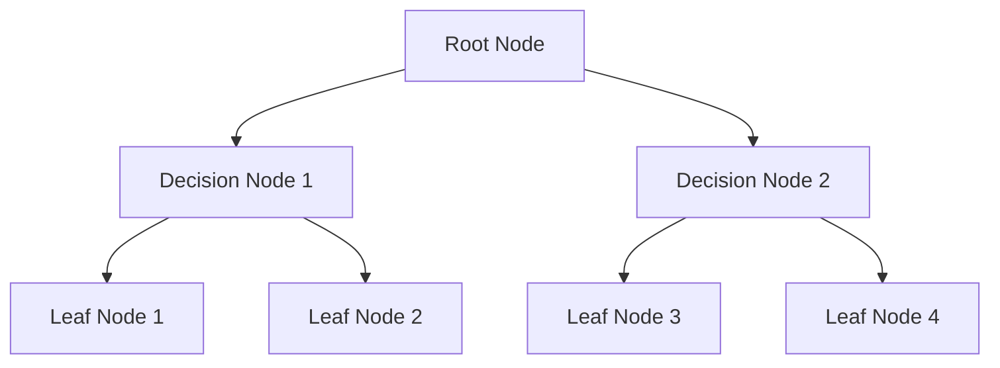
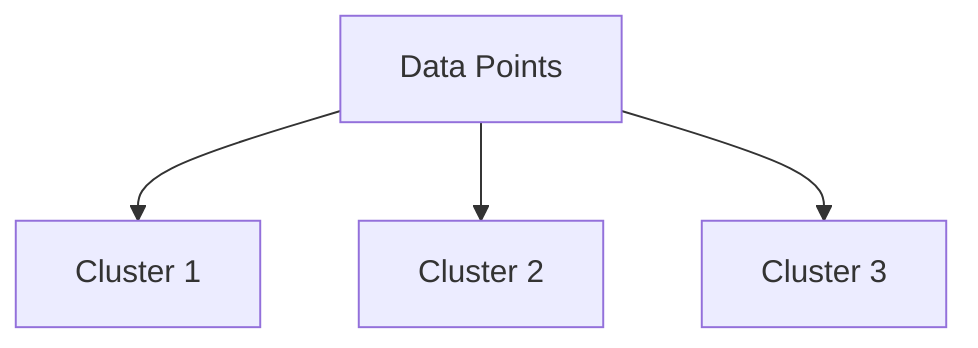

## 11.12 Implementing AI Algorithms: Examples and Case Studies

In this section, we will delve into the practical implementation of AI algorithms using Julia, a language renowned for its performance and ease of use in scientific computing. We will explore decision trees, random forests, and clustering algorithms, followed by case studies in healthcare analytics and financial modeling. By the end of this chapter, you will have a solid understanding of how to implement these algorithms and apply them to real-world problems.

### Practical Implementations

#### Decision Trees and Random Forests

**Decision Trees** are a popular choice for classification and regression tasks due to their interpretability and simplicity. They work by recursively splitting the data into subsets based on feature values, forming a tree-like structure.

**Random Forests** are an ensemble method that builds multiple decision trees and merges their results to improve accuracy and control overfitting.

Let's implement a decision tree in Julia using the `DecisionTree.jl` package.

```julia
using DecisionTree

features = [0.5 1.5; 1.0 1.0; 1.5 0.5; 2.0 0.0]
labels = [1, 1, 0, 0]

model = DecisionTreeClassifier(max_depth=2)
fit!(model, features, labels)

predictions = predict(model, features)

println("Predictions: ", predictions)
```

In this example, we train a simple decision tree classifier on a small dataset. The `max_depth` parameter controls the depth of the tree, which can be adjusted to prevent overfitting.

**Random Forests** can be implemented similarly by using the `RandomForestClassifier` from the same package.

```julia
using DecisionTree

rf_model = RandomForestClassifier(n_trees=10, max_depth=2)
fit!(rf_model, features, labels)

rf_predictions = predict(rf_model, features)

println("Random Forest Predictions: ", rf_predictions)
```

The `n_trees` parameter specifies the number of trees in the forest, which can be increased to improve the model's performance.

#### Clustering Algorithms

Clustering algorithms group similar data points together. **K-means** and **hierarchical clustering** are two widely used methods.

**K-means Clustering** partitions data into `k` clusters by minimizing the variance within each cluster.

```julia
using Clustering

data = [1.0 2.0; 1.5 1.8; 5.0 8.0; 8.0 8.0; 1.0 0.6; 9.0 11.0]

k = 2
result = kmeans(data, k)

println("Cluster centers: ", result.centers)
println("Cluster assignments: ", result.assignments)
```

In this example, we perform K-means clustering on a dataset with two clusters. The `kmeans` function returns the cluster centers and assignments.

**Hierarchical Clustering** builds a tree of clusters, which can be visualized as a dendrogram.

```julia
using Clustering

hclust_result = hclust(data, linkage=:ward)

println("Hierarchical clustering dendrogram: ", hclust_result)
```

Hierarchical clustering is useful for visualizing the nested structure of data and does not require specifying the number of clusters in advance.

### Case Studies

#### Healthcare Analytics: Predictive Models for Patient Outcomes

In healthcare, predictive models can be used to forecast patient outcomes, optimize treatment plans, and improve resource allocation. Let's explore a case study where we use decision trees to predict patient outcomes based on clinical data.

**Dataset**: Assume we have a dataset containing patient information such as age, blood pressure, cholesterol levels, and whether they experienced a cardiac event.

```julia
using DecisionTree, CSV, DataFrames

data = CSV.read("patient_data.csv", DataFrame)

features = select(data, Not(:cardiac_event))
labels = data.cardiac_event

model = DecisionTreeClassifier(max_depth=3)
fit!(model, features, labels)

accuracy = sum(predict(model, features) .== labels) / length(labels)
println("Model Accuracy: ", accuracy)
```

In this example, we load a dataset of patient information, train a decision tree classifier, and evaluate its accuracy. This model can help healthcare providers identify high-risk patients and tailor interventions accordingly.

#### Financial Modeling: Time-Series Forecasting and Risk Assessment

In finance, AI algorithms are used for time-series forecasting, risk assessment, and portfolio optimization. Let's examine a case study where we use clustering to segment financial data for risk assessment.

**Dataset**: Assume we have a dataset of stock prices and financial indicators.

```julia
using Clustering, CSV, DataFrames

financial_data = CSV.read("financial_data.csv", DataFrame)

features = select(financial_data, Not(:stock_id))

k = 3
result = kmeans(features, k)

for i in 1:k
    println("Cluster $i: ", findall(result.assignments .== i))
end
```

In this example, we perform K-means clustering on financial data to identify segments with similar risk profiles. This segmentation can inform investment strategies and risk management.

### Try It Yourself

Experiment with the code examples by modifying parameters such as `max_depth` in decision trees or `k` in K-means clustering. Observe how these changes affect the model's performance and clustering results.

### Visualizing AI Algorithms

To enhance understanding, let's visualize the decision tree structure and clustering results using Mermaid.js diagrams.



**Diagram Description**: This diagram represents a simple decision tree with a root node, decision nodes, and leaf nodes.



**Diagram Description**: This diagram illustrates the clustering of data points into three clusters.

### References and Links

- [DecisionTree.jl Documentation](https://github.com/bensadeghi/DecisionTree.jl)
- [Clustering.jl Documentation](https://github.com/JuliaStats/Clustering.jl)
- [Machine Learning in Julia](https://juliaai.github.io/MLJ.jl/stable/)

### Knowledge Check

- What are the key differences between decision trees and random forests?
- How does K-means clustering determine the optimal number of clusters?
- What are the benefits of using hierarchical clustering over K-means?

### Embrace the Journey

Remember, this is just the beginning. As you progress, you'll build more complex models and tackle diverse challenges. Keep experimenting, stay curious, and enjoy the journey!

## Quiz Time!



### What is the primary advantage of using random forests over decision trees?

- [x] Improved accuracy and reduced overfitting
- [ ] Simplicity and interpretability
- [ ] Faster training time
- [ ] Requires less data

> **Explanation:** Random forests improve accuracy and reduce overfitting by averaging the results of multiple decision trees.

### Which parameter controls the depth of a decision tree in Julia's DecisionTree.jl?

- [ ] n_trees
- [x] max_depth
- [ ] k
- [ ] linkage

> **Explanation:** The `max_depth` parameter controls the depth of a decision tree, limiting how many splits can be made.

### In K-means clustering, what does the `k` parameter represent?

- [x] The number of clusters
- [ ] The number of data points
- [ ] The number of features
- [ ] The number of iterations

> **Explanation:** The `k` parameter represents the number of clusters into which the data will be partitioned.

### What is a key benefit of hierarchical clustering?

- [x] It does not require specifying the number of clusters in advance
- [ ] It is faster than K-means
- [ ] It is more accurate than decision trees
- [ ] It requires less data preprocessing

> **Explanation:** Hierarchical clustering builds a tree of clusters and does not require specifying the number of clusters beforehand.

### Which Julia package is used for implementing decision trees?

- [x] DecisionTree.jl
- [ ] Clustering.jl
- [ ] MLJ.jl
- [ ] Flux.jl

> **Explanation:** DecisionTree.jl is the package used for implementing decision trees in Julia.

### What is the purpose of the `linkage` parameter in hierarchical clustering?

- [x] It determines how clusters are merged
- [ ] It specifies the number of clusters
- [ ] It controls the depth of the tree
- [ ] It sets the number of iterations

> **Explanation:** The `linkage` parameter determines how clusters are merged in hierarchical clustering.

### Which algorithm is typically used for time-series forecasting in finance?

- [x] ARIMA
- [ ] K-means
- [ ] Decision Trees
- [ ] Random Forests

> **Explanation:** ARIMA (AutoRegressive Integrated Moving Average) is commonly used for time-series forecasting.

### What is a common use case for clustering in financial modeling?

- [x] Risk assessment and segmentation
- [ ] Predicting stock prices
- [ ] Portfolio optimization
- [ ] Fraud detection

> **Explanation:** Clustering is often used for risk assessment and segmentation in financial modeling.

### Which of the following is a benefit of using random forests?

- [x] They are robust to overfitting
- [ ] They are faster to train than decision trees
- [ ] They require less data preprocessing
- [ ] They are more interpretable than decision trees

> **Explanation:** Random forests are robust to overfitting due to the ensemble of multiple decision trees.

### True or False: Hierarchical clustering requires specifying the number of clusters in advance.

- [ ] True
- [x] False

> **Explanation:** Hierarchical clustering does not require specifying the number of clusters in advance, as it builds a tree of clusters.


