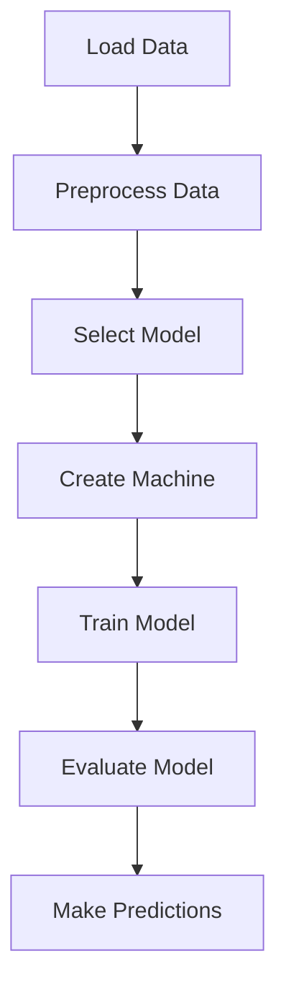

## 11.2 MLJ.jl for Unified Machine Learning Interface

Machine learning is a cornerstone of modern data science, and Julia, with its high performance and ease of use, is an excellent choice for implementing machine learning solutions. MLJ.jl is a powerful package in Julia that provides a unified interface for a wide range of machine learning models and tools. In this section, we will explore the purpose of MLJ.jl, how to use it for model selection, data preprocessing, training, and evaluation, and provide practical examples to illustrate its capabilities.

### Purpose of MLJ.jl

MLJ.jl is designed to streamline the machine learning workflow by offering a consistent API to access various machine learning algorithms. It facilitates model selection, evaluation, tuning, and comparison, making it easier for developers to focus on solving problems rather than dealing with the intricacies of different libraries.

#### Key Features of MLJ.jl

- **Consistent API**: MLJ.jl provides a uniform interface to a wide range of models, allowing users to switch between models with minimal code changes.
- **Model Selection**: It supports various techniques for selecting the best model for a given task, including hyperparameter tuning and cross-validation.
- **Data Preprocessing**: MLJ.jl includes tools for scaling, encoding categorical variables, imputation, and feature engineering.
- **Evaluation and Tuning**: Users can easily evaluate model performance using different metrics and tune hyperparameters to optimize models.
- **Interoperability**: MLJ.jl integrates seamlessly with other Julia packages, enhancing its functionality and flexibility.

### Using MLJ.jl

Let's delve into how to use MLJ.jl for model selection, building pipelines, data preprocessing, training, and evaluation.

#### Model Selection and Pipelines

Model selection is a critical step in the machine learning process. MLJ.jl simplifies this by providing a framework for choosing models and building pipelines for data preprocessing and modeling.

```julia
using MLJ

X, y = @load_iris

model = @load DecisionTreeClassifier

pipe = @pipeline Standardizer model

mach = machine(pipe, X, y)

fit!(mach)
```

In this example, we load the Iris dataset, define a decision tree classifier, and create a pipeline that includes data standardization. The pipeline is then wrapped in a machine, which is trained on the data.

#### Data Preprocessing

Data preprocessing is essential for preparing data for machine learning models. MLJ.jl provides various tools for this purpose.

- **Scaling**: Standardizing features to have zero mean and unit variance.
- **Encoding Categorical Variables**: Converting categorical variables into numerical format.
- **Imputation**: Filling missing values in the dataset.
- **Feature Engineering**: Creating new features from existing ones to improve model performance.

```julia
using MLJ

X, y = @load_some_data_with_missing_values

preprocess_pipe = @pipeline Imputer Standardizer OneHotEncoder

preprocessed_data = fit_transform!(preprocess_pipe, X)
```

This code snippet demonstrates how to create a preprocessing pipeline that imputes missing values, standardizes features, and encodes categorical variables.

#### Training and Evaluation

Training and evaluating models are crucial steps in the machine learning workflow. MLJ.jl provides tools for fitting models, performing cross-validation, and assessing performance metrics.

```julia
using MLJ

model = @load RandomForestClassifier

mach = machine(model, X, y)

fit!(mach)

cv_results = evaluate!(mach, resampling=CV(nfolds=5), measure=accuracy)
```

In this example, we define a random forest classifier, create a machine, train the model, and evaluate its performance using 5-fold cross-validation.

### Use Cases and Examples

MLJ.jl can be used for various machine learning tasks, including regression, classification, clustering, and dimensionality reduction. Let's explore some practical examples.

#### Regression Example: Predicting Housing Prices

Predicting housing prices is a common regression task. We can use MLJ.jl to implement this using various regression models.

```julia
using MLJ

X, y = @load_housing_data

model = @load LinearRegressor

mach = machine(model, X, y)

fit!(mach)

y_pred = predict(mach, X)
```

This code snippet demonstrates how to load a housing dataset, define a linear regression model, train it, and make predictions.

#### Classification Example: Classifying Iris Species

Classifying iris species is a classic classification task. MLJ.jl makes it easy to implement this using various classification models.

```julia
using MLJ

X, y = @load_iris

model = @load DecisionTreeClassifier

mach = machine(model, X, y)

fit!(mach)

y_pred = predict(mach, X)
```

This example shows how to load the iris dataset, define a decision tree classifier, train it, and make predictions.

#### Clustering Example: Clustering Customer Data

Clustering is useful for grouping similar data points. MLJ.jl supports various clustering algorithms.

```julia
using MLJ

X = @load_customer_data

model = @load KMeans

mach = machine(model, X)

fit!(mach)

clusters = predict(mach, X)
```

This code snippet demonstrates how to load customer data, define a KMeans clustering model, train it, and obtain cluster assignments.

#### Dimensionality Reduction Example: Reducing Feature Space

Dimensionality reduction is useful for reducing the number of features in a dataset. MLJ.jl supports various dimensionality reduction techniques.

```julia
using MLJ

X = @load_high_dimensional_data

model = @load PCA

mach = machine(model, X)

fit!(mach)

X_reduced = transform(mach, X)
```

This example shows how to load a high-dimensional dataset, define a PCA model, train it, and transform the data to a reduced feature space.

### Try It Yourself

Experiment with the code examples provided by modifying the models, datasets, and parameters. Try using different models for the same task and observe how the performance changes. This hands-on approach will deepen your understanding of MLJ.jl and its capabilities.

### Visualizing MLJ.jl Workflow

To better understand the workflow of MLJ.jl, let's visualize the process of model selection, training, and evaluation using a flowchart.



**Figure 1**: This flowchart illustrates the typical workflow in MLJ.jl, from loading and preprocessing data to model selection, training, evaluation, and making predictions.

### References and Links

For further reading and deeper dives into MLJ.jl and machine learning in Julia, consider the following resources:

- [MLJ.jl Documentation](https://alan-turing-institute.github.io/MLJ.jl/stable/)
- [JuliaLang Machine Learning](https://julialang.org/learning/machine-learning/)
- [MLJ.jl GitHub Repository](https://github.com/alan-turing-institute/MLJ.jl)

### Knowledge Check

To reinforce your understanding, consider the following questions:

- What are the key features of MLJ.jl?
- How does MLJ.jl facilitate model selection and evaluation?
- What are some common data preprocessing techniques supported by MLJ.jl?
- How can you implement a regression task using MLJ.jl?

### Embrace the Journey

Remember, mastering machine learning with Julia and MLJ.jl is a journey. As you progress, you'll build more complex models and solve more challenging problems. Keep experimenting, stay curious, and enjoy the journey!

## Quiz Time!



### What is the primary purpose of MLJ.jl?

- [x] To provide a consistent API for various machine learning algorithms
- [ ] To replace all other machine learning libraries in Julia
- [ ] To focus solely on deep learning models
- [ ] To provide visualization tools for data analysis

> **Explanation:** MLJ.jl is designed to offer a unified interface for accessing a wide range of machine learning models, making it easier to switch between them and streamline the workflow.

### Which of the following is NOT a feature of MLJ.jl?

- [ ] Model selection
- [ ] Data preprocessing
- [x] Real-time data streaming
- [ ] Model evaluation

> **Explanation:** MLJ.jl focuses on model selection, data preprocessing, and evaluation, but it does not specifically handle real-time data streaming.

### How does MLJ.jl help in model selection?

- [x] By providing tools for hyperparameter tuning and cross-validation
- [ ] By automatically selecting the best model
- [ ] By limiting the number of models available
- [ ] By focusing only on regression models

> **Explanation:** MLJ.jl facilitates model selection through hyperparameter tuning and cross-validation, allowing users to choose the best model for their task.

### What is the role of a pipeline in MLJ.jl?

- [x] To combine data preprocessing and modeling steps
- [ ] To visualize model performance
- [ ] To store datasets
- [ ] To generate random data

> **Explanation:** In MLJ.jl, a pipeline is used to combine data preprocessing and modeling steps, streamlining the workflow.

### Which of the following tasks can be performed using MLJ.jl?

- [x] Regression
- [x] Classification
- [x] Clustering
- [ ] Image rendering

> **Explanation:** MLJ.jl supports various machine learning tasks, including regression, classification, and clustering, but not image rendering.

### What is the function of the `fit!` method in MLJ.jl?

- [x] To train the model on the provided data
- [ ] To evaluate the model's performance
- [ ] To preprocess the data
- [ ] To visualize the data

> **Explanation:** The `fit!` method in MLJ.jl is used to train the model on the provided data.

### How can you evaluate a model's performance in MLJ.jl?

- [x] Using cross-validation and performance metrics
- [ ] By visualizing the data
- [ ] By manually inspecting the predictions
- [ ] By using only accuracy as a metric

> **Explanation:** MLJ.jl allows for model evaluation using cross-validation and various performance metrics, providing a comprehensive assessment.

### What is the purpose of the `machine` function in MLJ.jl?

- [x] To wrap a model and dataset together for training
- [ ] To visualize the model's architecture
- [ ] To preprocess the data
- [ ] To generate random datasets

> **Explanation:** The `machine` function in MLJ.jl is used to wrap a model and dataset together, preparing them for training.

### Which of the following is a common data preprocessing technique in MLJ.jl?

- [x] Scaling
- [x] Encoding categorical variables
- [x] Imputation
- [ ] Image augmentation

> **Explanation:** MLJ.jl supports various data preprocessing techniques such as scaling, encoding categorical variables, and imputation, but not image augmentation.

### True or False: MLJ.jl can be used for dimensionality reduction tasks.

- [x] True
- [ ] False

> **Explanation:** MLJ.jl supports dimensionality reduction tasks, allowing users to reduce the number of features in a dataset.


