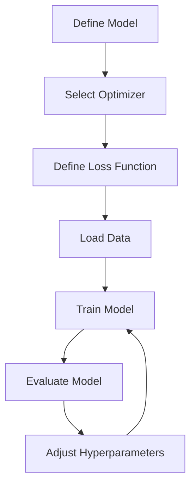

## 11.3 Deep Learning with Flux.jl and Knet.jl

Deep learning has revolutionized the field of artificial intelligence, enabling breakthroughs in image recognition, natural language processing, and more. Julia, with its high-performance capabilities, offers powerful tools for deep learning through libraries like Flux.jl and Knet.jl. In this section, we will explore these libraries, understand their key features, and learn how to build and train neural networks effectively.

### Introduction to Flux.jl

Flux.jl is a pure Julia library that provides a flexible and intuitive interface for building and training neural networks. It leverages Julia's strengths, such as multiple dispatch and metaprogramming, to offer a seamless deep learning experience.

#### Key Features of Flux.jl

- **Pure Julia Implementation**: Flux.jl is written entirely in Julia, ensuring compatibility and performance optimization.
- **Intuitive Model Definition**: Models are defined using simple and readable syntax, making it easy to prototype and iterate.
- **Automatic Differentiation**: Flux.jl uses Zygote.jl for automatic differentiation, allowing gradient computation without manual intervention.
- **Custom Layers and Models**: Users can easily define custom layers and models, providing flexibility in designing complex architectures.

#### Building Neural Networks with Flux.jl

Flux.jl provides a straightforward way to define neural networks using the `Chain` function, which allows stacking layers sequentially. Common layers include `Dense` for fully connected layers, `Conv` for convolutional layers, and `LSTM` for recurrent networks.

```julia
using Flux

model = Chain(
    Dense(28^2, 128, relu),  # Input layer with ReLU activation
    Dense(128, 64, relu),    # Hidden layer
    Dense(64, 10),           # Output layer for 10 classes
    softmax                  # Softmax activation for classification
)

println(model)
```

In this example, we define a simple feedforward neural network with two hidden layers. The `Dense` layer represents a fully connected layer, and `relu` is used as the activation function.

#### Training Models with Flux.jl

Training a model in Flux.jl involves defining a loss function, selecting an optimizer, and iterating over the dataset. Flux.jl supports various optimizers, such as `Descent` and `Adam`, which can be used to minimize the loss function.

```julia
using Flux.Optimise

loss(x, y) = Flux.crossentropy(model(x), y)

opt = Adam()

for epoch in 1:10
    for (x, y) in train_data
        # Perform a gradient descent step
        Flux.train!(loss, params(model), [(x, y)], opt)
    end
    println("Epoch $epoch completed")
end
```

In this code snippet, we define a cross-entropy loss function and use the `Adam` optimizer to train the model. The `train!` function updates the model parameters based on the computed gradients.

#### Monitoring Training with Callbacks

Flux.jl allows monitoring the training process using callbacks, which can be used to log metrics, adjust learning rates, or implement early stopping.

```julia
using Flux: throttle

cb = throttle(() -> println("Current loss: ", loss(x, y)), 10)

Flux.train!(loss, params(model), train_data, opt, cb = cb)
```

Here, we use the `throttle` function to print the current loss every 10 iterations, providing insights into the training progress.

### Introduction to Knet.jl

Knet.jl is another powerful deep learning library in Julia, known for its dynamic computation graph and define-by-run framework. It offers flexibility in model definition and supports efficient training on GPUs.

#### Define-by-Run Framework

Knet.jl's define-by-run framework allows dynamic computation graphs, enabling flexible model definition and modification during runtime. This approach is particularly useful for models with varying input sizes or architectures.

#### Model Definition and Training with Knet.jl

In Knet.jl, models are typically represented using arrays and functions. This approach provides a high degree of flexibility and control over the model architecture.

```julia
using Knet

function model(x)
    x = relu(x * param(randn(28^2, 128)))
    x = relu(x * param(randn(128, 64)))
    x = x * param(randn(64, 10))
    return softmax(x)
end

loss(x, y) = nll(model(x), y)

for epoch in 1:10
    for (x, y) in train_data
        grad = grad(loss, x, y)
        update!(model, grad)
    end
    println("Epoch $epoch completed")
end
```

In this example, we define a simple feedforward network using matrix multiplications and activation functions. The `param` function is used to create trainable parameters, and the `grad` function computes gradients for backpropagation.

### Use Cases and Examples

Flux.jl and Knet.jl can be used to implement a wide range of deep learning models, including image classifiers, sequence models, and generative models. Let's explore a practical example of training a convolutional neural network (CNN) on the MNIST dataset.

#### Example: Training a CNN on the MNIST Dataset

The MNIST dataset is a popular benchmark for image classification tasks, consisting of handwritten digits. We will use Flux.jl to build and train a CNN for this task.

```julia
using Flux, Flux.Data.MNIST, Flux.Optimise

train_data = MNIST.traindata(Float32)
test_data = MNIST.testdata(Float32)

cnn_model = Chain(
    Conv((5, 5), 1=>16, relu),  # Convolutional layer
    MaxPool((2, 2)),            # Max pooling layer
    Conv((5, 5), 16=>32, relu), # Convolutional layer
    MaxPool((2, 2)),            # Max pooling layer
    flatten,                    # Flatten layer
    Dense(512, 10),             # Fully connected layer
    softmax                     # Softmax activation
)

loss(x, y) = Flux.crossentropy(cnn_model(x), y)

opt = Adam()

for epoch in 1:10
    for (x, y) in train_data
        Flux.train!(loss, params(cnn_model), [(x, y)], opt)
    end
    println("Epoch $epoch completed")
end

accuracy = mean([argmax(cnn_model(x)) == argmax(y) for (x, y) in test_data])
println("Test accuracy: $accuracy")
```

In this example, we define a CNN with two convolutional layers followed by max pooling. The model is trained using the Adam optimizer, and we evaluate its accuracy on the test dataset.

### Visualizing the Deep Learning Workflow

To better understand the workflow of building and training neural networks with Flux.jl and Knet.jl, let's visualize the process using a flowchart.



**Figure 1**: The deep learning workflow involves defining the model, selecting an optimizer, defining a loss function, loading data, training the model, evaluating its performance, and adjusting hyperparameters as needed.

### Try It Yourself

Experiment with the code examples provided in this section. Try modifying the architecture of the neural networks, changing the optimizer, or using different datasets. This hands-on approach will deepen your understanding of deep learning with Flux.jl and Knet.jl.

### References and Links

- [Flux.jl Documentation](https://fluxml.ai/Flux.jl/stable/)
- [Knet.jl Documentation](https://denizyuret.github.io/Knet.jl/latest/)
- [MNIST Dataset](http://yann.lecun.com/exdb/mnist/)

### Knowledge Check

- What are the key features of Flux.jl and Knet.jl?
- How do you define a neural network using Flux.jl?
- What is the define-by-run framework in Knet.jl?
- How can you monitor the training process in Flux.jl?
- What are some common use cases for deep learning with Flux.jl and Knet.jl?

### Embrace the Journey

Remember, mastering deep learning with Flux.jl and Knet.jl is a journey. As you progress, you'll build more complex models and tackle challenging problems. Keep experimenting, stay curious, and enjoy the process!

## Quiz Time!



### What is a key feature of Flux.jl?

- [x] Pure Julia implementation
- [ ] Written in Python
- [ ] Requires external C libraries
- [ ] Only supports CPU computation

> **Explanation:** Flux.jl is a pure Julia library, ensuring compatibility and performance optimization.

### How are models defined in Flux.jl?

- [x] Using the `Chain` function
- [ ] Using Python scripts
- [ ] Using XML configuration files
- [ ] Using Java classes

> **Explanation:** Models in Flux.jl are defined using the `Chain` function, which allows stacking layers sequentially.

### What optimizer is commonly used in Flux.jl?

- [x] Adam
- [ ] SGD
- [ ] RMSProp
- [ ] AdaGrad

> **Explanation:** Adam is a popular optimizer used in Flux.jl for training neural networks.

### What is the define-by-run framework in Knet.jl?

- [x] Dynamic computation graphs
- [ ] Static computation graphs
- [ ] Predefined model templates
- [ ] Only supports linear models

> **Explanation:** Knet.jl uses a define-by-run framework with dynamic computation graphs, allowing flexible model definition.

### How can you monitor training in Flux.jl?

- [x] Using callbacks
- [ ] Using print statements only
- [ ] Using external monitoring tools
- [ ] Using SQL queries

> **Explanation:** Flux.jl allows monitoring the training process using callbacks, which can log metrics or adjust learning rates.

### What is a common use case for deep learning with Flux.jl?

- [x] Image classification
- [ ] Database management
- [ ] Web development
- [ ] Operating system design

> **Explanation:** Flux.jl is commonly used for image classification tasks among other deep learning applications.

### What function is used to define trainable parameters in Knet.jl?

- [x] `param`
- [ ] `variable`
- [ ] `tensor`
- [ ] `matrix`

> **Explanation:** The `param` function in Knet.jl is used to create trainable parameters for models.

### What is the purpose of the `softmax` function in a neural network?

- [x] To convert logits to probabilities
- [ ] To perform matrix multiplication
- [ ] To initialize weights
- [ ] To compute gradients

> **Explanation:** The `softmax` function is used to convert logits to probabilities in the output layer of a classification model.

### What is the role of the `train!` function in Flux.jl?

- [x] To update model parameters based on gradients
- [ ] To initialize the model
- [ ] To load the dataset
- [ ] To evaluate the model

> **Explanation:** The `train!` function in Flux.jl updates the model parameters based on computed gradients during training.

### True or False: Knet.jl supports GPU computation.

- [x] True
- [ ] False

> **Explanation:** Knet.jl supports efficient training on GPUs, leveraging Julia's performance capabilities.


