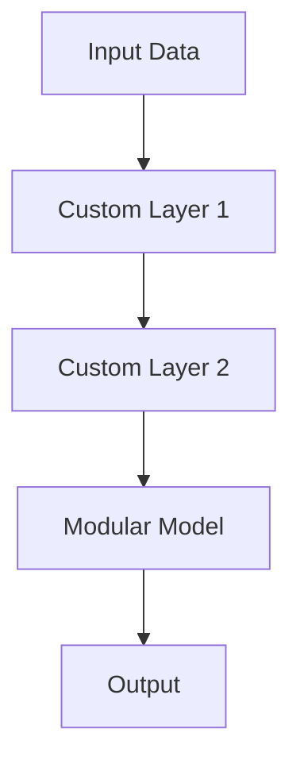

## 11.4 Advanced Modeling and Custom Layers

In the realm of machine learning, the ability to create custom layers and advanced models is crucial for tackling complex problems and optimizing performance. Julia, with its high-performance capabilities and expressive syntax, provides a robust platform for developing scalable machine learning applications. In this section, we will delve into creating custom layers, building complex architectures, and implementing regularization techniques to prevent overfitting. We will also explore use cases such as medical imaging and time-series forecasting.

### Creating Custom Layers

Custom layers allow us to define unique operations that are not available in standard libraries. In Julia, we can create custom layers by defining new structs and implementing the necessary functions.

#### Custom Operations

To create a custom layer, we start by defining a struct that holds the parameters of the layer. Then, we implement the forward pass function that defines the operation of the layer.

```julia
struct CustomLayer
    weights::Array{Float64, 2}
    bias::Array{Float64, 1}
end

function (layer::CustomLayer)(x::Array{Float64, 2})
    return layer.weights * x .+ layer.bias
end

weights = rand(3, 3)
bias = rand(3)
layer = CustomLayer(weights, bias)
input_data = rand(3, 5)
output = layer(input_data)
println(output)
```

In this example, we define a `CustomLayer` struct with weights and bias as its parameters. The forward pass function performs a matrix multiplication followed by a bias addition.

#### Parameter Initialization

Customizing the initialization of weights and biases is essential for ensuring that the model converges efficiently. We can define custom initialization functions to achieve this.

```julia
function initialize_custom_layer(input_dim::Int, output_dim::Int)
    weights = randn(output_dim, input_dim) * 0.01
    bias = zeros(output_dim)
    return CustomLayer(weights, bias)
end

layer = initialize_custom_layer(3, 3)
```

Here, we use a Gaussian distribution to initialize the weights and set the biases to zero. This initialization strategy helps in achieving faster convergence.

### Complex Architectures

Building complex architectures involves combining multiple layers to create sophisticated models like ResNets and UNets. Julia's modular design allows us to easily compose these architectures.

#### Building Modular Models

Modular models are constructed by stacking layers in a sequential manner. This approach is particularly useful for building deep networks.

```julia
struct ModularModel
    layers::Vector{Any}
end

function (model::ModularModel)(x::Array{Float64, 2})
    for layer in model.layers
        x = layer(x)
    end
    return x
end

layer1 = CustomLayer(rand(3, 3), rand(3))
layer2 = CustomLayer(rand(3, 3), rand(3))
model = ModularModel([layer1, layer2])

output = model(input_data)
println(output)
```

In this example, we define a `ModularModel` struct that holds a vector of layers. The forward pass function iterates over each layer, applying it to the input data sequentially.

#### Recursive and Attention Models

Recursive and attention models are powerful tools for natural language processing (NLP) tasks. These models can capture dependencies and focus on relevant parts of the input.

```julia
struct AttentionLayer
    query::Array{Float64, 2}
    key::Array{Float64, 2}
    value::Array{Float64, 2}
end

function (layer::AttentionLayer)(x::Array{Float64, 2})
    scores = layer.query * layer.key'
    attention_weights = softmax(scores, dims=1)
    return attention_weights * layer.value
end

query = rand(3, 3)
key = rand(3, 3)
value = rand(3, 3)
attention_layer = AttentionLayer(query, key, value)
output = attention_layer(input_data)
println(output)
```

The `AttentionLayer` struct implements a simple attention mechanism. The forward pass function computes attention scores and applies the softmax function to obtain attention weights.

### Regularization Techniques

Regularization techniques are essential for preventing overfitting in machine learning models. Common techniques include dropout, weight decay, and early stopping.

#### Preventing Overfitting

1. **Dropout**: Randomly drops units during training to prevent co-adaptation.

```julia
struct DropoutLayer
    rate::Float64
end

function (layer::DropoutLayer)(x::Array{Float64, 2})
    mask = rand(size(x)) .> layer.rate
    return x .* mask
end

dropout_layer = DropoutLayer(0.5)
output = dropout_layer(input_data)
println(output)
```

2. **Weight Decay**: Adds a penalty to the loss function to discourage large weights.

```julia
function weight_decay(weights::Array{Float64, 2}, lambda::Float64)
    return lambda * sum(weights .^ 2)
end

lambda = 0.01
penalty = weight_decay(weights, lambda)
println(penalty)
```

3. **Early Stopping**: Monitors validation performance and stops training when performance degrades.

```julia
function early_stopping(validation_loss::Vector{Float64}, patience::Int)
    if length(validation_loss) < patience
        return false
    end
    recent_losses = validation_loss[end-patience+1:end]
    return all(recent_losses[i] >= recent_losses[i+1] for i in 1:patience-1)
end

validation_loss = [0.5, 0.4, 0.35, 0.36, 0.37]
patience = 3
stop_training = early_stopping(validation_loss, patience)
println(stop_training)
```

### Use Cases

Advanced modeling techniques and custom layers can be applied to various domains, including medical imaging and time-series forecasting.

#### Medical Imaging

In medical imaging, custom layers can be used to develop specialized models for tasks such as image segmentation and classification.

```julia
struct ConvLayer
    kernel::Array{Float64, 4}
    bias::Array{Float64, 1}
end

function (layer::ConvLayer)(x::Array{Float64, 4})
    # Perform convolution operation
    return conv(x, layer.kernel) .+ layer.bias
end

kernel = rand(3, 3, 1, 1)
bias = rand(1)
conv_layer = ConvLayer(kernel, bias)
image_data = rand(28, 28, 1, 1)
output = conv_layer(image_data)
println(output)
```

#### Time-Series Forecasting

For time-series forecasting, recursive and attention models can capture temporal dependencies and improve prediction accuracy.

```julia
struct RecurrentLayer
    weights::Array{Float64, 2}
    bias::Array{Float64, 1}
end

function (layer::RecurrentLayer)(x::Array{Float64, 2}, h::Array{Float64, 1})
    return tanh.(layer.weights * x .+ layer.bias .+ h)
end

weights = rand(3, 3)
bias = rand(3)
recurrent_layer = RecurrentLayer(weights, bias)
hidden_state = rand(3)
output = recurrent_layer(input_data, hidden_state)
println(output)
```

### Visualizing Advanced Modeling and Custom Layers

To better understand the flow of data through custom layers and complex architectures, we can use diagrams to visualize the process.



**Diagram Description:** This flowchart illustrates the data flow through a series of custom layers within a modular model, leading to the final output.

### References and Links

- [Flux.jl Documentation](https://fluxml.ai/Flux.jl/stable/)
- [JuliaLang Official Website](https://julialang.org/)
- [Machine Learning with Julia](https://juliacomputing.com/case-studies/machine-learning/)

### Knowledge Check

- What are the benefits of creating custom layers in Julia?
- How can parameter initialization affect model performance?
- Describe the role of dropout in preventing overfitting.
- What are some use cases for advanced modeling techniques in Julia?

### Embrace the Journey

Remember, mastering advanced modeling and custom layers in Julia is a journey. As you continue to experiment and build more complex models, you'll gain deeper insights and improve your skills. Stay curious, keep learning, and enjoy the process!

## Quiz Time!



### What is the primary purpose of creating custom layers in Julia?

- [x] To define unique operations not available in standard libraries
- [ ] To simplify the codebase
- [ ] To reduce computational cost
- [ ] To increase the number of parameters

> **Explanation:** Custom layers allow developers to define unique operations tailored to specific needs, which are not available in standard libraries.

### How does parameter initialization impact model training?

- [x] It affects convergence speed and model performance
- [ ] It reduces the number of epochs required
- [ ] It simplifies the model architecture
- [ ] It increases the model's complexity

> **Explanation:** Proper parameter initialization can significantly impact the convergence speed and overall performance of the model.

### Which regularization technique involves adding a penalty to the loss function?

- [x] Weight decay
- [ ] Dropout
- [ ] Early stopping
- [ ] Batch normalization

> **Explanation:** Weight decay adds a penalty to the loss function to discourage large weights, helping to prevent overfitting.

### What is the role of dropout in neural networks?

- [x] To prevent co-adaptation of neurons
- [ ] To increase the learning rate
- [ ] To reduce the number of layers
- [ ] To simplify the model

> **Explanation:** Dropout randomly drops units during training to prevent co-adaptation, which helps in regularizing the model.

### Which architecture is commonly used for image segmentation tasks?

- [x] UNet
- [ ] ResNet
- [ ] VGGNet
- [ ] AlexNet

> **Explanation:** UNet is a popular architecture used for image segmentation tasks due to its ability to capture context and precise localization.

### What is a key advantage of using attention mechanisms in NLP models?

- [x] They focus on relevant parts of the input
- [ ] They reduce model size
- [ ] They simplify the training process
- [ ] They increase the number of parameters

> **Explanation:** Attention mechanisms allow models to focus on relevant parts of the input, improving performance in NLP tasks.

### How can early stopping help in training models?

- [x] By stopping training when validation performance degrades
- [ ] By increasing the learning rate
- [ ] By reducing the number of layers
- [ ] By simplifying the model architecture

> **Explanation:** Early stopping monitors validation performance and stops training when performance degrades, preventing overfitting.

### What is a common use case for recursive models in machine learning?

- [x] Time-series forecasting
- [ ] Image classification
- [ ] Object detection
- [ ] Clustering

> **Explanation:** Recursive models are commonly used in time-series forecasting due to their ability to capture temporal dependencies.

### Which of the following is NOT a regularization technique?

- [x] Batch normalization
- [ ] Dropout
- [ ] Weight decay
- [ ] Early stopping

> **Explanation:** Batch normalization is a technique used to normalize inputs of each layer, not a regularization technique.

### True or False: Custom layers in Julia can only be used for image processing tasks.

- [ ] True
- [x] False

> **Explanation:** Custom layers in Julia can be used for a wide range of tasks, including NLP, time-series forecasting, and more.


