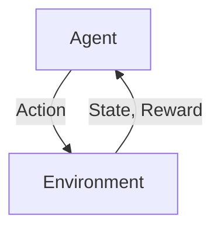
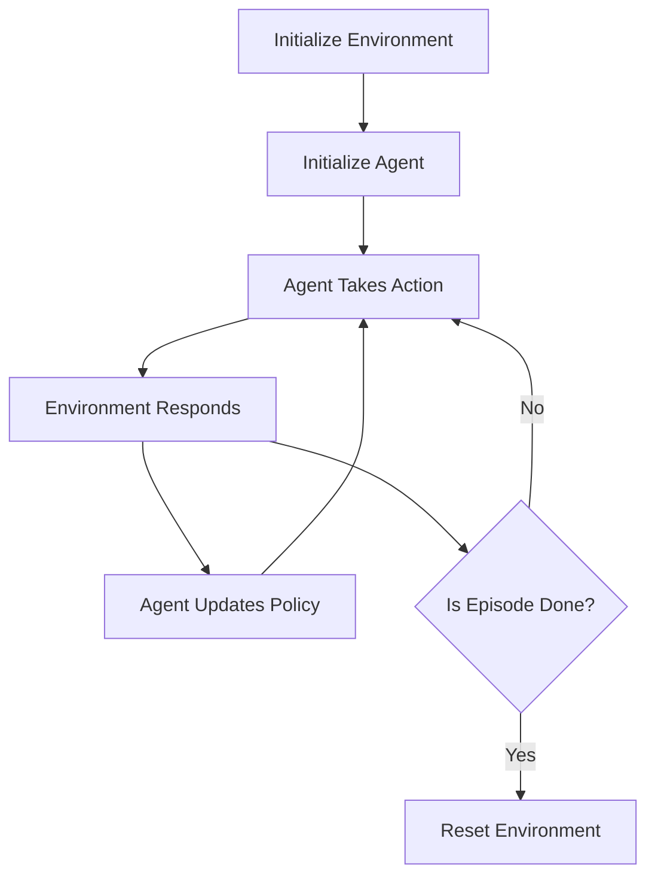

## 11.6 Reinforcement Learning with ReinforcementLearning.jl

Reinforcement Learning (RL) is a fascinating area of machine learning where agents learn to make decisions by interacting with an environment. In this section, we will delve into the world of RL using the powerful Julia package, ReinforcementLearning.jl. This package provides a comprehensive suite of tools to define environments, implement agents, and apply various RL algorithms. Let's embark on this journey to master reinforcement learning in Julia.

### Fundamentals of Reinforcement Learning

Reinforcement Learning is a type of machine learning where an agent learns to make decisions by taking actions in an environment to maximize some notion of cumulative reward. The key components of RL include:

#### Agents, Environments, and Policies

- **Agents**: The decision-makers in RL. They interact with the environment by taking actions based on a policy.
- **Environments**: The world in which the agent operates. It provides feedback to the agent in the form of rewards and new states.
- **Policies**: The strategy used by the agent to determine the next action based on the current state.

These components interact in a loop, as illustrated in the following diagram:



**Diagram Description**: The agent takes an action, which affects the environment. The environment then provides a new state and a reward back to the agent, forming a feedback loop.

### Using ReinforcementLearning.jl

ReinforcementLearning.jl is a robust Julia package that simplifies the implementation of RL algorithms. It provides a variety of tools to define environments, implement agents, and apply different RL strategies.

#### Defining Environments

In RL, environments are crucial as they define the space in which agents operate. ReinforcementLearning.jl supports both custom and standard environments, such as those from OpenAI Gym.

**Example: Defining a Custom Environment**

```julia
using ReinforcementLearningBase

struct SimpleEnvironment <: AbstractEnv
    state::Int
end

ReinforcementLearningBase.reset!(env::SimpleEnvironment) = env.state = 0

ReinforcementLearningBase.step!(env::SimpleEnvironment, action) = begin
    env.state += action
    reward = env.state
    done = env.state >= 10
    return env.state, reward, done
end

ReinforcementLearningBase.action_space(::SimpleEnvironment) = 1:2
ReinforcementLearningBase.state_space(::SimpleEnvironment) = 0:10
```

**Explanation**: This code defines a simple environment where the state is an integer. The agent can take actions to increment the state, and the environment provides a reward equal to the current state. The episode ends when the state reaches 10.

#### Implementing Agents

Agents are implemented using predefined algorithms or by creating custom agents. ReinforcementLearning.jl offers a variety of built-in algorithms, making it easy to get started.

**Example: Implementing a Q-Learning Agent**

```julia
using ReinforcementLearningEnvironments
using ReinforcementLearningAgents

env = SimpleEnvironment()
agent = QLearningAgent(
    policy = EpsilonGreedyPolicy(0.1),
    approximator = TabularApproximator(),
    n_actions = length(action_space(env))
)

run(agent, env, StopAfterEpisode(100))
```

**Explanation**: This example demonstrates a Q-Learning agent using an epsilon-greedy policy. The agent learns to maximize the cumulative reward by exploring the environment over 100 episodes.

### Algorithms and Strategies

ReinforcementLearning.jl supports various RL algorithms, categorized into value-based and policy-based methods.

#### Value-Based Methods

- **Q-Learning**: A model-free algorithm that learns the value of actions in a state-action pair.
- **Deep Q-Networks (DQN)**: An extension of Q-Learning using deep neural networks to approximate the Q-values.

**Example: Q-Learning Implementation**

```julia
using Flux

function create_dqn(env)
    model = Chain(
        Dense(length(state_space(env)), 24, relu),
        Dense(24, length(action_space(env)))
    )
    return model
end

dqn_agent = DQNAgent(
    policy = EpsilonGreedyPolicy(0.1),
    approximator = NeuralNetworkApproximator(create_dqn(env))
)

run(dqn_agent, env, StopAfterEpisode(200))
```

**Explanation**: This code snippet sets up a Deep Q-Network agent using a simple neural network model. The agent interacts with the environment for 200 episodes, learning to optimize its actions.

#### Policy-Based Methods

- **Policy Gradients**: Directly optimize the policy by adjusting the parameters using gradient ascent.
- **Actor-Critic**: Combines value-based and policy-based methods, using an actor to select actions and a critic to evaluate them.

**Example: Actor-Critic Implementation**

```julia
using ReinforcementLearningAgents

actor_critic_agent = ActorCriticAgent(
    actor = NeuralNetworkApproximator(create_dqn(env)),
    critic = TabularApproximator()
)

run(actor_critic_agent, env, StopAfterEpisode(300))
```

**Explanation**: This example demonstrates an Actor-Critic agent, which uses a neural network for the actor and a tabular approximator for the critic. The agent learns over 300 episodes.

### Use Cases and Examples

Reinforcement learning has a wide range of applications, from game playing to robotics simulations. Here are some practical examples:

- **Training Agents for Games**: Use RL to train agents to play games like chess or Go, where strategic decision-making is crucial.
- **Robotics Simulations**: Implement RL to control robotic arms or autonomous vehicles, optimizing their actions in complex environments.

**Example: Training an Agent for a Simple Game**

```julia
using ReinforcementLearningEnvironments
using ReinforcementLearningAgents

env = CartPoleEnv()
agent = DQNAgent(
    policy = EpsilonGreedyPolicy(0.1),
    approximator = NeuralNetworkApproximator(create_dqn(env))
)

run(agent, env, StopAfterEpisode(500))
```

**Explanation**: This example uses the CartPole environment, a classic RL problem. The agent is trained using a DQN algorithm to balance the pole on the cart over 500 episodes.

### Try It Yourself

Now that we've explored the basics of reinforcement learning with ReinforcementLearning.jl, it's time to experiment. Try modifying the code examples to:

- Change the environment dynamics or reward structure.
- Implement a different RL algorithm, such as SARSA or PPO.
- Adjust the neural network architecture for the DQN agent.

### Visualizing Reinforcement Learning Workflows

To better understand the RL process, let's visualize the workflow of a typical reinforcement learning setup:



**Diagram Description**: This flowchart illustrates the reinforcement learning loop, where the agent interacts with the environment, receives feedback, and updates its policy accordingly.

### References and Links

For further reading and deeper dives into reinforcement learning concepts, consider the following resources:

- [OpenAI Gym Documentation](https://gym.openai.com/docs/)
- [ReinforcementLearning.jl Documentation](https://juliareinforcementlearning.org/)
- [Deep Reinforcement Learning Hands-On](https://www.packtpub.com/product/deep-reinforcement-learning-hands-on-second-edition/9781838826994)

### Knowledge Check

Before we conclude, let's reinforce what we've learned with some questions and exercises:

- What are the main components of a reinforcement learning system?
- How does Q-Learning differ from policy gradient methods?
- Implement a custom environment and train an agent using a different RL algorithm.

### Embrace the Journey

Remember, mastering reinforcement learning is a journey. As you progress, you'll build more complex and intelligent agents. Keep experimenting, stay curious, and enjoy the process!

## Quiz Time!



### What are the key components of reinforcement learning?

- [x] Agents, Environments, Policies
- [ ] Models, Data, Algorithms
- [ ] Layers, Neurons, Weights
- [ ] Inputs, Outputs, Feedback

> **Explanation:** The key components of reinforcement learning are agents, environments, and policies, which interact in a loop to optimize decision-making.

### Which package in Julia is used for reinforcement learning?

- [x] ReinforcementLearning.jl
- [ ] Flux.jl
- [ ] DataFrames.jl
- [ ] Plots.jl

> **Explanation:** ReinforcementLearning.jl is the package used in Julia for implementing reinforcement learning algorithms.

### What is the role of an agent in reinforcement learning?

- [x] To make decisions and take actions
- [ ] To provide rewards and states
- [ ] To visualize data
- [ ] To preprocess inputs

> **Explanation:** An agent is responsible for making decisions and taking actions based on the policy to maximize rewards.

### What is Q-Learning?

- [x] A value-based reinforcement learning algorithm
- [ ] A policy-based reinforcement learning algorithm
- [ ] A supervised learning algorithm
- [ ] A clustering algorithm

> **Explanation:** Q-Learning is a value-based reinforcement learning algorithm that learns the value of actions in a state-action pair.

### What is the purpose of the epsilon-greedy policy?

- [x] To balance exploration and exploitation
- [ ] To maximize immediate rewards
- [x] To encourage exploration of new actions
- [ ] To minimize errors

> **Explanation:** The epsilon-greedy policy balances exploration and exploitation by allowing the agent to explore new actions while exploiting known rewards.

### What is the difference between policy gradients and actor-critic methods?

- [x] Policy gradients directly optimize the policy, while actor-critic uses both actor and critic
- [ ] Policy gradients use value functions, while actor-critic does not
- [ ] Policy gradients are unsupervised, while actor-critic is supervised
- [ ] Policy gradients are deterministic, while actor-critic is stochastic

> **Explanation:** Policy gradients directly optimize the policy, whereas actor-critic methods use both an actor to select actions and a critic to evaluate them.

### What is the main advantage of using Deep Q-Networks (DQN)?

- [x] They can handle high-dimensional state spaces
- [ ] They require less data
- [x] They use neural networks to approximate Q-values
- [ ] They are faster than Q-Learning

> **Explanation:** DQNs use neural networks to approximate Q-values, allowing them to handle high-dimensional state spaces effectively.

### How can you define a custom environment in ReinforcementLearning.jl?

- [x] By implementing the AbstractEnv interface
- [ ] By using predefined templates
- [ ] By writing a script in Python
- [ ] By using a GUI tool

> **Explanation:** Custom environments in ReinforcementLearning.jl are defined by implementing the AbstractEnv interface.

### What is the role of the critic in actor-critic methods?

- [x] To evaluate the actions taken by the actor
- [ ] To generate actions
- [ ] To preprocess data
- [ ] To visualize results

> **Explanation:** The critic evaluates the actions taken by the actor, providing feedback to improve the policy.

### True or False: ReinforcementLearning.jl can only be used for game simulations.

- [ ] True
- [x] False

> **Explanation:** ReinforcementLearning.jl can be used for a wide range of applications beyond game simulations, including robotics and autonomous systems.


