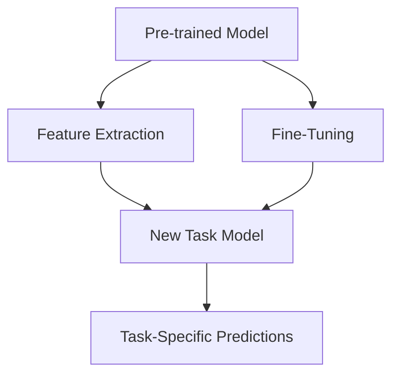

## 11.7 Utilizing Pre-trained Models and Transfer Learning

In the realm of machine learning, pre-trained models and transfer learning have emerged as powerful tools that allow developers to leverage existing models trained on large datasets. This approach not only saves time and computational resources but also enhances model performance on specific tasks with limited data. In this section, we will delve into how Julia, with its rich ecosystem, facilitates the use of pre-trained models and transfer learning techniques.

### Accessing Pre-trained Models

#### Model Zoos and Packages

Julia provides access to a variety of pre-trained models through packages such as Metalhead.jl. These models are trained on extensive datasets and can be used directly or adapted for specific tasks.

- **Metalhead.jl**: This package offers a collection of pre-trained models primarily for computer vision tasks. It includes popular architectures such as ResNet, VGG, and BERT, which are widely used for image classification, object detection, and natural language processing tasks.

```julia
using Metalhead

model = ResNet()

img = load("path_to_image.jpg")

img_resized = resize(img, (224, 224))

prediction = model(img_resized)
```

In the above example, we demonstrate how to load a pre-trained ResNet model using Metalhead.jl and make predictions on a given image. This simplicity allows developers to quickly integrate powerful models into their applications.

#### Access to Models like ResNet, VGG, BERT

These models are part of the model zoo available in Metalhead.jl and other Julia packages. Each model has its strengths and is suited for different types of tasks:

- **ResNet**: Known for its deep architecture and residual connections, making it effective for image classification.
- **VGG**: Offers simplicity and depth, suitable for image recognition tasks.
- **BERT**: A transformer-based model for natural language processing, capable of understanding context in text.

### Transfer Learning Techniques

Transfer learning involves taking a pre-trained model and adapting it to a new, related task. This is particularly useful when you have limited data for the new task.

#### Fine-Tuning

Fine-tuning is a transfer learning technique where we take a pre-trained model and adjust its parameters slightly to fit a new task. This is done by training the model on a smaller dataset specific to the new task.

- **Adapting Models to New Tasks with Limited Data**: Fine-tuning is effective when you have a small dataset. By starting with a pre-trained model, you can achieve better performance than training from scratch.

```julia
using Flux

# Freeze all layers except the last one
for layer in model.layers[1:end-1]
    Flux.freeze!(layer)
end

model.layers[end] = Dense(512, num_classes)

loss(x, y) = Flux.crossentropy(model(x), y)
opt = ADAM()
Flux.train!(loss, params(model), data, opt)
```

In this example, we freeze the layers of a pre-trained model except for the last one, which we replace with a new layer suited for our specific task. This allows the model to retain the learned features from the original dataset while adapting to the new task.

#### Feature Extraction

Feature extraction involves using the pre-trained model as a fixed feature extractor. The idea is to leverage the learned features from the pre-trained model and use them as input to a new model.

- **Using Pretrained Layers to Extract Features**: This technique is useful when the new task is similar to the original task the model was trained on.

```julia
features = model.layers[1:end-1](img_resized)

new_model = Chain(Dense(size(features, 1), num_classes), softmax)
```

Here, we use the pre-trained model to extract features from the input image and then pass these features to a new model for classification.

### Use Cases

Transfer learning and pre-trained models can be applied to a variety of tasks, enhancing performance and reducing training time.

#### Image Classification

Pre-trained models like ResNet and VGG are particularly effective for image classification tasks. By fine-tuning these models, you can adapt them to classify images in your specific domain.

#### Object Detection

Using pre-trained models for object detection allows you to leverage existing knowledge of object features and improve detection accuracy in your applications.

#### Sentiment Analysis

BERT and other transformer-based models can be fine-tuned for sentiment analysis tasks, enabling the model to understand and classify text based on sentiment.

### Visualizing the Transfer Learning Process

To better understand the transfer learning process, let's visualize the workflow using a diagram.



**Diagram Description**: This diagram illustrates the transfer learning process. The pre-trained model is used for feature extraction and fine-tuning, which feeds into the new task model, ultimately leading to task-specific predictions.

### References and Links

- [Metalhead.jl Documentation](https://github.com/FluxML/Metalhead.jl)
- [Flux.jl Documentation](https://fluxml.ai/Flux.jl/stable/)
- [Transfer Learning in Machine Learning](https://machinelearningmastery.com/transfer-learning/)

### Knowledge Check

- What are the benefits of using pre-trained models in machine learning?
- How does fine-tuning differ from feature extraction in transfer learning?
- Why is transfer learning particularly useful for tasks with limited data?

### Embrace the Journey

Remember, utilizing pre-trained models and transfer learning is just the beginning. As you progress, you'll be able to tackle more complex tasks and build sophisticated machine learning applications. Keep experimenting, stay curious, and enjoy the journey!

## Quiz Time!



### What is the primary advantage of using pre-trained models?

- [x] Saves time and computational resources
- [ ] Increases model complexity
- [ ] Requires more data
- [ ] Decreases model accuracy

> **Explanation:** Pre-trained models save time and computational resources by leveraging existing models trained on large datasets.

### Which Julia package provides access to pre-trained models for computer vision?

- [x] Metalhead.jl
- [ ] Flux.jl
- [ ] DataFrames.jl
- [ ] Plots.jl

> **Explanation:** Metalhead.jl is a Julia package that provides access to pre-trained models for computer vision tasks.

### What is fine-tuning in the context of transfer learning?

- [x] Adjusting a pre-trained model's parameters for a new task
- [ ] Training a model from scratch
- [ ] Using a model without any modifications
- [ ] Extracting features from a model

> **Explanation:** Fine-tuning involves adjusting a pre-trained model's parameters to adapt it to a new task.

### What is feature extraction in transfer learning?

- [x] Using pre-trained layers to extract features
- [ ] Training a model from scratch
- [ ] Adjusting a model's parameters
- [ ] Using a model without any modifications

> **Explanation:** Feature extraction involves using pre-trained layers to extract features, which are then used as input to a new model.

### Which model is known for its deep architecture and residual connections?

- [x] ResNet
- [ ] VGG
- [ ] BERT
- [ ] LSTM

> **Explanation:** ResNet is known for its deep architecture and residual connections, making it effective for image classification.

### What is the role of Metalhead.jl in Julia?

- [x] Provides pre-trained models for computer vision
- [ ] Offers data manipulation tools
- [ ] Facilitates plotting and visualization
- [ ] Manages package dependencies

> **Explanation:** Metalhead.jl provides pre-trained models for computer vision tasks in Julia.

### How does transfer learning benefit tasks with limited data?

- [x] By leveraging existing models trained on large datasets
- [ ] By requiring more data for training
- [ ] By increasing model complexity
- [ ] By decreasing model accuracy

> **Explanation:** Transfer learning benefits tasks with limited data by leveraging existing models trained on large datasets.

### Which model is transformer-based and used for natural language processing?

- [x] BERT
- [ ] ResNet
- [ ] VGG
- [ ] CNN

> **Explanation:** BERT is a transformer-based model used for natural language processing tasks.

### What is the purpose of freezing layers in a pre-trained model?

- [x] To retain learned features while adapting to a new task
- [ ] To increase model complexity
- [ ] To require more data
- [ ] To decrease model accuracy

> **Explanation:** Freezing layers in a pre-trained model helps retain learned features while adapting to a new task.

### True or False: Transfer learning can only be applied to image classification tasks.

- [ ] True
- [x] False

> **Explanation:** Transfer learning can be applied to various tasks, including image classification, object detection, and sentiment analysis.




