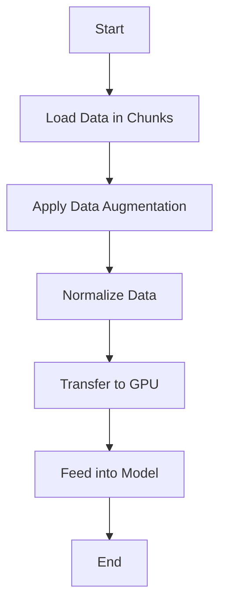

## 11.8 Handling Large Datasets and Data Loaders

In the realm of scalable machine learning, efficiently handling large datasets is crucial. Julia, with its high-performance capabilities, offers several strategies to manage and process large datasets effectively. In this section, we will explore memory management techniques, the creation of custom data loaders using iterators and generators, parallel data loading with multi-threading, and integration with GPUs. We will also discuss practical use cases, such as training deep learning models on large image datasets.

### Efficient Data Handling

Handling large datasets requires careful consideration of memory management and data processing techniques. Let's delve into some strategies that can help manage datasets that exceed the available RAM.

#### Memory Management

Efficient memory management is key when dealing with large datasets. Here are some techniques to consider:

- **Chunking Data**: Break down large datasets into smaller chunks that can be processed independently. This allows you to load only a portion of the data into memory at a time.

- **Memory Mapping**: Use memory-mapped files to access large datasets stored on disk as if they were in memory. This technique is particularly useful for datasets that do not fit into RAM.

- **Data Compression**: Compress data to reduce its size before loading it into memory. This can be done using libraries such as `CodecZlib.jl` for gzip compression.

- **Garbage Collection Tuning**: Adjust Julia's garbage collection settings to optimize memory usage. This can be done by setting environment variables such as `JULIA_GC_ALLOC_POOL` and `JULIA_GC_ALLOC_OTHER`.

- **Lazy Loading**: Load data only when it is needed, rather than loading the entire dataset at once. This can be achieved using iterators and generators.

### Data Loaders

Data loaders are essential for efficiently feeding data into machine learning models. In Julia, we can create custom data loaders using iterators and generators.

#### Iterators and Generators

Iterators and generators allow us to lazily load data, which means data is loaded on-the-fly as it is needed. This approach is particularly useful for large datasets that cannot be loaded into memory all at once.

```julia
struct DataLoader
    data::Vector{Float64}
    batch_size::Int
end

function Base.iterate(loader::DataLoader, state=1)
    if state > length(loader.data)
        return nothing
    end
    batch = loader.data[state:min(state + loader.batch_size - 1, end)]
    return batch, state + loader.batch_size
end

data = rand(1000)  # Simulate a large dataset
loader = DataLoader(data, 100)

for batch in loader
    println("Processing batch of size: ", length(batch))
end
```

In this example, we define a `DataLoader` struct that takes a dataset and a batch size. The `iterate` function is implemented to load data in batches, allowing us to process the dataset in chunks.

### Parallel Data Loading

Parallel data loading can significantly speed up the data preparation process, especially when dealing with large datasets. Julia's multi-threading capabilities make it easy to implement concurrent data loading.

#### Multi-threading

Using threads, we can load and preprocess data concurrently, reducing the time it takes to prepare data for training.

```julia
using Threads

function parallel_data_loader(data, batch_size)
    n_batches = div(length(data), batch_size)
    results = Vector{Vector{Float64}}(undef, n_batches)

    Threads.@threads for i in 1:n_batches
        start_idx = (i - 1) * batch_size + 1
        end_idx = min(i * batch_size, length(data))
        results[i] = data[start_idx:end_idx]
    end

    return results
end

data = rand(1000)  # Simulate a large dataset
batch_size = 100
batches = parallel_data_loader(data, batch_size)

for batch in batches
    println("Processing batch of size: ", length(batch))
end
```

In this example, we use the `Threads.@threads` macro to parallelize the data loading process. Each thread processes a different batch of data, allowing us to load data concurrently.

#### Integration with GPUs

When working with deep learning models, integrating data pipelines with GPUs can greatly enhance performance. Ensuring that data is efficiently fed into GPU computations is crucial for maximizing throughput.

```julia
using CUDA

function gpu_data_loader(data, batch_size)
    n_batches = div(length(data), batch_size)
    results = Vector{CuArray{Float32, 1}}(undef, n_batches)

    for i in 1:n_batches
        start_idx = (i - 1) * batch_size + 1
        end_idx = min(i * batch_size, length(data))
        results[i] = CuArray(data[start_idx:end_idx])
    end

    return results
end

data = rand(Float32, 1000)  # Simulate a large dataset
batch_size = 100
batches = gpu_data_loader(data, batch_size)

for batch in batches
    println("Processing batch on GPU of size: ", length(batch))
end
```

In this example, we use the `CUDA` package to transfer data to the GPU. The `CuArray` type is used to store data on the GPU, allowing us to leverage GPU acceleration for data processing.

### Use Cases

Handling large datasets is a common challenge in machine learning. Let's explore some practical use cases where efficient data handling is essential.

#### Training Deep Learning Models on Large Image Datasets

Training deep learning models on large image datasets, such as ImageNet, requires efficient data loading and preprocessing. By using the techniques discussed above, we can ensure that data is fed into the model efficiently, minimizing bottlenecks.

1. **Data Augmentation**: Apply data augmentation techniques, such as random cropping and flipping, to increase the diversity of the training data.

2. **Batch Normalization**: Normalize batches of data to improve convergence and stability during training.

3. **Prefetching**: Load data in advance to ensure that the model is never waiting for data.

4. **Distributed Training**: Use distributed computing to train models on multiple GPUs or machines, further speeding up the training process.

### Visualizing Data Loading Workflow

To better understand the data loading workflow, let's visualize the process using a flowchart.



This flowchart illustrates the steps involved in loading and preprocessing data for training a deep learning model. By following this workflow, we can ensure that data is efficiently prepared and fed into the model.

### References and Links

For further reading on handling large datasets and data loaders in Julia, consider the following resources:

- [JuliaLang Documentation](https://docs.julialang.org/)
- [CUDA.jl Documentation](https://cuda.juliagpu.org/stable/)
- [CodecZlib.jl Documentation](https://github.com/JuliaIO/CodecZlib.jl)

### Knowledge Check

Let's reinforce our understanding of handling large datasets and data loaders with some questions and challenges.

- **Question**: What are some techniques for managing memory when dealing with large datasets?
- **Challenge**: Modify the `DataLoader` example to include data augmentation techniques, such as random cropping and flipping.

### Embrace the Journey

Remember, handling large datasets is a crucial skill in machine learning. As you continue to explore Julia's capabilities, you'll find new ways to optimize data loading and processing. Keep experimenting, stay curious, and enjoy the journey!

## Quiz Time!



### What is a key benefit of using iterators for data loading in Julia?

- [x] Lazy loading of data
- [ ] Immediate loading of all data
- [ ] Increased memory usage
- [ ] Slower data processing

> **Explanation:** Iterators allow for lazy loading, meaning data is loaded on-the-fly as needed, reducing memory usage.

### Which Julia package is used for GPU programming?

- [x] CUDA.jl
- [ ] DataFrames.jl
- [ ] Plots.jl
- [ ] Flux.jl

> **Explanation:** CUDA.jl is used for GPU programming in Julia, enabling efficient data processing on GPUs.

### What is the purpose of memory mapping?

- [x] Access large datasets stored on disk as if they were in memory
- [ ] Compress data to reduce size
- [ ] Load all data into RAM at once
- [ ] Increase data processing speed

> **Explanation:** Memory mapping allows large datasets to be accessed as if they were in memory, without loading them entirely into RAM.

### How can multi-threading improve data loading?

- [x] By allowing concurrent data loading and processing
- [ ] By reducing the number of data batches
- [ ] By increasing memory usage
- [ ] By slowing down data processing

> **Explanation:** Multi-threading enables concurrent data loading and processing, speeding up the data preparation process.

### What is a common use case for handling large datasets in machine learning?

- [x] Training deep learning models on large image datasets
- [ ] Running small-scale simulations
- [ ] Processing text data
- [ ] Analyzing small datasets

> **Explanation:** Handling large datasets is crucial for training deep learning models on large image datasets, such as ImageNet.

### Which technique can be used to reduce the size of data before loading it into memory?

- [x] Data compression
- [ ] Data augmentation
- [ ] Data normalization
- [ ] Data prefetching

> **Explanation:** Data compression reduces the size of data, making it easier to load into memory.

### What is the benefit of using CuArray in Julia?

- [x] It allows data to be stored on the GPU for faster processing
- [ ] It increases memory usage on the CPU
- [ ] It slows down data processing
- [ ] It is used for data visualization

> **Explanation:** CuArray stores data on the GPU, enabling faster processing and leveraging GPU acceleration.

### What is the role of data augmentation in training deep learning models?

- [x] To increase the diversity of the training data
- [ ] To reduce the size of the dataset
- [ ] To normalize the data
- [ ] To compress the data

> **Explanation:** Data augmentation increases the diversity of the training data, improving model generalization.

### Which environment variable can be adjusted to optimize Julia's garbage collection?

- [x] JULIA_GC_ALLOC_POOL
- [ ] JULIA_DATA_PATH
- [ ] JULIA_THREAD_COUNT
- [ ] JULIA_PKG_DIR

> **Explanation:** JULIA_GC_ALLOC_POOL is an environment variable that can be adjusted to optimize garbage collection in Julia.

### True or False: Lazy loading means loading all data into memory at once.

- [ ] True
- [x] False

> **Explanation:** False. Lazy loading means loading data on-the-fly as needed, rather than all at once.


