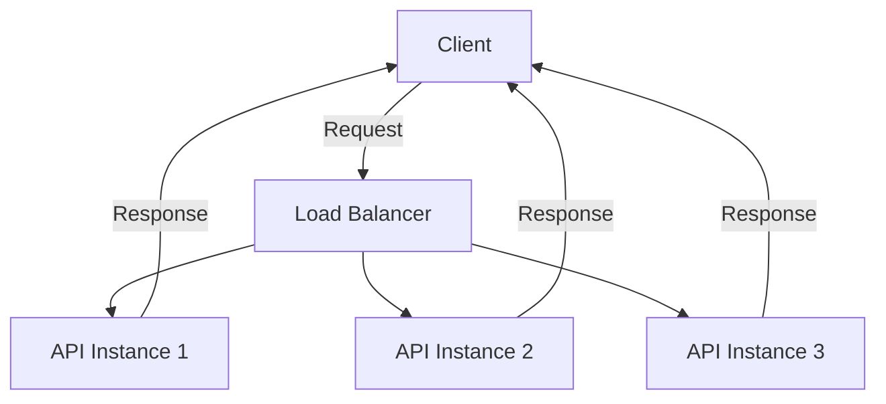

## 11.9 Deploying Machine Learning Models to Production

Deploying machine learning models to production is a critical step in transforming your data-driven insights into actionable applications. This section will guide you through the essential steps of deploying machine learning models using Julia, focusing on model serialization, building APIs, optimizing performance, and scaling services. We'll also explore a real-world case study to illustrate these concepts in action.

### Model Serialization and Saving

Before deploying a machine learning model, it's crucial to serialize and save it for future use. Serialization involves converting the model into a format that can be easily stored and retrieved. Julia offers several packages for model serialization, including BSON.jl and JLD2.jl.

#### Saving Models

**BSON.jl**: BSON (Binary JSON) is a lightweight, binary format that is easy to use and efficient for storing models. BSON.jl provides a simple interface for saving and loading Julia objects.

```julia
using BSON

BSON.@save "model.bson" model

BSON.@load "model.bson" model
```

**JLD2.jl**: JLD2 is another popular format for saving Julia objects. It is particularly useful for saving complex data structures and large datasets.

```julia
using JLD2

@save "model.jld2" model

@load "model.jld2" model
```

Both BSON.jl and JLD2.jl are efficient and easy to use, making them ideal choices for model serialization in Julia.

### Building APIs

Once your model is serialized, the next step is to make it accessible to other applications or users. This is typically done by building an API (Application Programming Interface) that can serve predictions. Julia provides several tools for creating web servers and APIs, including HTTP.jl and Genie.jl.

#### Web Servers in Julia

**HTTP.jl**: A lightweight and flexible package for building HTTP servers and clients. It allows you to create RESTful APIs with minimal setup.

```julia
using HTTP

function predict_handler(req)
    # Deserialize the model
    BSON.@load "model.bson" model
    
    # Extract input data from the request
    input_data = JSON.parse(String(req.body))
    
    # Make predictions
    prediction = model(input_data)
    
    # Return the prediction as a JSON response
    return HTTP.Response(200, JSON.json(prediction))
end

HTTP.serve(predict_handler, "0.0.0.0", 8080)
```

**Genie.jl**: A full-featured web framework for Julia, Genie.jl simplifies the process of building complex web applications and APIs.

```julia
using Genie, Genie.Router, Genie.Renderer.Json

route("/predict", method = POST) do
    # Deserialize the model
    BSON.@load "model.bson" model
    
    # Extract input data from the request
    input_data = parse_json(Genie.Requests.body())
    
    # Make predictions
    prediction = model(input_data)
    
    # Return the prediction as a JSON response
    json(prediction)
end

Genie.startup()
```

Both HTTP.jl and Genie.jl provide powerful tools for building APIs, allowing you to serve your machine learning models efficiently.

### Performance Considerations

Deploying machine learning models to production requires careful consideration of performance. Optimizing inference time and ensuring scalability are key to providing a seamless user experience.

#### Optimizing Inference

**Reducing Model Size**: One way to optimize inference is by reducing the model size. Techniques such as model pruning, quantization, and knowledge distillation can help achieve this.

**Optimizing Code for Latency**: Ensure that your code is optimized for low latency. This includes using efficient data structures, minimizing data transfer, and leveraging Julia's performance features such as type stability and multiple dispatch.

```julia
function predict(input_data::Vector{Float64})
    # Ensure all operations are type-stable
    result = sum(input_data) / length(input_data)
    return result
end
```

#### Scaling Services

**Load Balancing**: Distribute incoming requests across multiple instances of your API to ensure high availability and reliability.

**Microservices Architectures**: Break down your application into smaller, independent services that can be deployed and scaled independently.



### Case Studies

To illustrate these concepts, let's explore a case study of deploying a recommendation system in a web application.

#### Deploying a Recommendation System

**Problem Statement**: A company wants to deploy a recommendation system to suggest products to users based on their browsing history.

**Solution**:
1. **Model Training**: Train a collaborative filtering model using user-item interaction data.
2. **Model Serialization**: Serialize the trained model using BSON.jl.
3. **API Development**: Develop a RESTful API using HTTP.jl to serve recommendations.
4. **Performance Optimization**: Optimize the model for low latency and high throughput.
5. **Scaling**: Deploy the API on a cloud platform with load balancing to handle high traffic.

**Implementation**:
- **Model Training**: Use a collaborative filtering algorithm to train the model.
- **Serialization**: Save the model using BSON.jl.
- **API**: Create an API endpoint using HTTP.jl to serve recommendations.
- **Optimization**: Apply model pruning and code optimization techniques.
- **Deployment**: Use a cloud platform to deploy the API with load balancing.

### Try It Yourself

Experiment with the provided code examples by modifying the model architecture, changing the API endpoints, or optimizing the code for different use cases. This hands-on approach will deepen your understanding of deploying machine learning models in Julia.

### Knowledge Check

- What are the benefits of using BSON.jl and JLD2.jl for model serialization?
- How can HTTP.jl and Genie.jl be used to build APIs in Julia?
- What techniques can be used to optimize inference time for machine learning models?
- How does load balancing improve the scalability of deployed services?

### Embrace the Journey

Deploying machine learning models to production is a rewarding journey that transforms your insights into impactful applications. Remember, this is just the beginning. As you progress, you'll build more complex and scalable systems. Keep experimenting, stay curious, and enjoy the journey!

## Quiz Time!



### What is the primary purpose of model serialization in Julia?

- [x] To save and load models efficiently
- [ ] To train models faster
- [ ] To improve model accuracy
- [ ] To reduce model size

> **Explanation:** Model serialization is used to save and load models efficiently, allowing them to be reused without retraining.

### Which package is used for creating lightweight HTTP servers in Julia?

- [x] HTTP.jl
- [ ] BSON.jl
- [ ] JLD2.jl
- [ ] Flux.jl

> **Explanation:** HTTP.jl is used for creating lightweight HTTP servers in Julia, enabling the development of RESTful APIs.

### What is a key benefit of using Genie.jl for web development in Julia?

- [x] It simplifies building complex web applications
- [ ] It improves model accuracy
- [ ] It reduces code size
- [ ] It enhances data visualization

> **Explanation:** Genie.jl simplifies building complex web applications by providing a full-featured web framework for Julia.

### What technique can be used to reduce the size of a machine learning model?

- [x] Model pruning
- [ ] Data augmentation
- [ ] Hyperparameter tuning
- [ ] Cross-validation

> **Explanation:** Model pruning is a technique used to reduce the size of a machine learning model by removing unnecessary parameters.

### How does load balancing improve the scalability of a deployed service?

- [x] By distributing requests across multiple instances
- [ ] By increasing model accuracy
- [ ] By reducing code complexity
- [ ] By enhancing data visualization

> **Explanation:** Load balancing improves scalability by distributing incoming requests across multiple instances, ensuring high availability and reliability.

### Which package is used for saving complex data structures in Julia?

- [x] JLD2.jl
- [ ] BSON.jl
- [ ] HTTP.jl
- [ ] Flux.jl

> **Explanation:** JLD2.jl is used for saving complex data structures and large datasets in Julia.

### What is the role of microservices architectures in deploying machine learning models?

- [x] To allow independent deployment and scaling of services
- [ ] To improve model accuracy
- [ ] To reduce code size
- [ ] To enhance data visualization

> **Explanation:** Microservices architectures allow independent deployment and scaling of services, improving flexibility and scalability.

### What is a common method for optimizing inference time in machine learning models?

- [x] Reducing model size
- [ ] Increasing model complexity
- [ ] Adding more layers
- [ ] Using larger datasets

> **Explanation:** Reducing model size is a common method for optimizing inference time, as it decreases the computational load.

### Which package is used for building full-featured web applications in Julia?

- [x] Genie.jl
- [ ] BSON.jl
- [ ] JLD2.jl
- [ ] HTTP.jl

> **Explanation:** Genie.jl is used for building full-featured web applications in Julia, providing a comprehensive web framework.

### True or False: Model serialization is only necessary for large models.

- [ ] True
- [x] False

> **Explanation:** False. Model serialization is necessary for any model that needs to be saved and loaded, regardless of its size.


