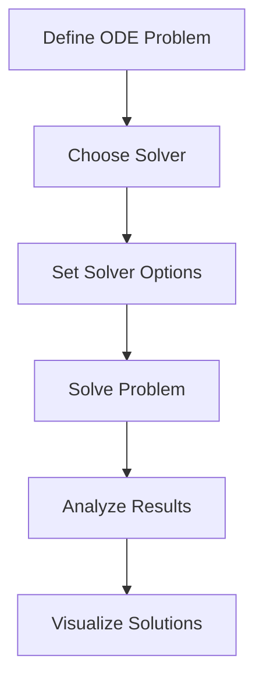

## 12.1 Differential Equations with DifferentialEquations.jl

Differential equations are a cornerstone of scientific computing, modeling everything from the motion of planets to the spread of diseases. In Julia, the **DifferentialEquations.jl** package provides a comprehensive suite for solving a wide variety of differential equations, including ordinary differential equations (ODEs), stochastic differential equations (SDEs), delay differential equations (DDEs), and partial differential equations (PDEs). This section will guide you through the features and capabilities of DifferentialEquations.jl, demonstrating how to define problems, choose solvers, handle events, and apply these tools to real-world scenarios.

### Overview

DifferentialEquations.jl is a powerful and flexible library designed to handle a broad spectrum of differential equations. It offers:

- **Comprehensive Solver Suite**: Support for ODEs, SDEs, DDEs, PDEs, and more.
- **Adaptive Algorithms**: Solvers that automatically adjust step sizes for improved accuracy and efficiency.
- **Event Handling**: Mechanisms to trigger actions when certain conditions are met during integration.
- **Extensibility**: Ability to define custom solvers and integrate with other Julia packages.

### Defining Problems

Before solving a differential equation, we must define the problem. DifferentialEquations.jl provides a structured way to set up initial value problems (IVPs) and boundary value problems (BVPs).

#### Problem Types

1. **Ordinary Differential Equations (ODEs)**:
   - **Initial Value Problems (IVPs)**: Specify the initial state and solve forward in time.
   - **Boundary Value Problems (BVPs)**: Specify conditions at the boundaries of the domain.

2. **Stochastic Differential Equations (SDEs)**:
   - Incorporate randomness into the model, useful for systems influenced by noise.

3. **Delay Differential Equations (DDEs)**:
   - Include delays in the system, where the rate of change depends on past states.

4. **Partial Differential Equations (PDEs)**:
   - Involve multiple independent variables, often requiring spatial discretization.

#### Setting Up an ODE Problem

Let's start with a simple ODE example: the classic Lotka-Volterra predator-prey model.

```julia
using DifferentialEquations

function lotka_volterra!(du, u, p, t)
    α, β, δ, γ = p
    du[1] = α * u[1] - β * u[1] * u[2]
    du[2] = δ * u[1] * u[2] - γ * u[2]
end

u0 = [10.0, 5.0]

p = (1.5, 1.0, 0.1, 1.0)

tspan = (0.0, 10.0)

prob = ODEProblem(lotka_volterra!, u0, tspan, p)
```

### Solvers and Options

DifferentialEquations.jl provides a variety of solvers, each suited to different types of problems. Choosing the right solver is crucial for efficiency and accuracy.

#### Adaptive Algorithms

Adaptive solvers automatically adjust their step sizes to maintain a balance between accuracy and computational cost. This is particularly useful for stiff equations or when the solution exhibits rapid changes.

```julia
sol = solve(prob, Tsit5())

using Plots
plot(sol, xlabel="Time", ylabel="Population", label=["Prey" "Predator"])
```

### Event Handling and Callback Functions

Event handling allows us to define custom behavior during the integration process. This is useful for modeling systems where certain conditions trigger specific actions, such as stopping the simulation or changing parameters.

#### Implementing Events and Actions

Consider a scenario where we want to stop the simulation if the predator population falls below a certain threshold.

```julia
function condition(u, t, integrator)
    u[2] - 1.0  # Trigger event when predator population < 1
end

function affect!(integrator)
    terminate!(integrator)
end

cb = ContinuousCallback(condition, affect!)

sol = solve(prob, Tsit5(), callback=cb)

plot(sol, xlabel="Time", ylabel="Population", label=["Prey" "Predator"])
```

### Use Cases and Examples

DifferentialEquations.jl is versatile and can be applied to a wide range of scientific and engineering problems. Here are a few examples:

#### Modeling Chemical Reactions

Chemical kinetics often involve systems of ODEs. DifferentialEquations.jl can simulate the concentration changes over time.

#### Epidemiological Models

Models like SIR (Susceptible-Infectious-Recovered) can be implemented to study the spread of diseases.

#### Physical Systems

Simulate mechanical systems, electrical circuits, or any physical phenomena described by differential equations.

### Try It Yourself

Experiment with the Lotka-Volterra model by changing the initial conditions or parameters. Observe how the dynamics change with different predator-prey interactions.

### Visualizing Differential Equations

Visualizing the solutions of differential equations can provide insights into the behavior of the system. Use plots to analyze the results and identify patterns or anomalies.



### References and Links

- [DifferentialEquations.jl Documentation](https://diffeq.sciml.ai/stable/)
- [JuliaLang](https://julialang.org/)
- [Scientific Computing with Julia](https://sciml.ai/)

### Knowledge Check

- What are the main types of differential equations supported by DifferentialEquations.jl?
- How do adaptive solvers improve the efficiency of solving differential equations?
- What is the purpose of event handling in differential equation solvers?

### Embrace the Journey

Remember, mastering differential equations with Julia is a journey. As you explore more complex models and scenarios, you'll gain deeper insights into the systems you're studying. Keep experimenting, stay curious, and enjoy the process!

## Quiz Time!



### What types of differential equations can be solved using DifferentialEquations.jl?

- [x] ODEs
- [x] SDEs
- [x] DDEs
- [x] PDEs

> **Explanation:** DifferentialEquations.jl supports a wide range of differential equations, including ordinary, stochastic, delay, and partial differential equations.

### What is the primary advantage of using adaptive solvers?

- [x] They adjust step sizes for accuracy and efficiency.
- [ ] They are faster than fixed-step solvers.
- [ ] They require less memory.
- [ ] They are easier to implement.

> **Explanation:** Adaptive solvers dynamically adjust their step sizes to maintain accuracy while optimizing computational efficiency.

### How can event handling be used in differential equation solvers?

- [x] To trigger actions when certain conditions are met.
- [ ] To improve solver speed.
- [ ] To reduce memory usage.
- [ ] To simplify code implementation.

> **Explanation:** Event handling allows for custom behavior during integration, such as stopping the simulation or changing parameters when specific conditions occur.

### What is an example of a real-world application of DifferentialEquations.jl?

- [x] Modeling chemical reactions
- [x] Epidemiological models
- [x] Physical systems
- [ ] Web development

> **Explanation:** DifferentialEquations.jl is used in scientific computing applications like chemical kinetics, disease modeling, and simulating physical systems.

### Which function is used to define an ODE problem in DifferentialEquations.jl?

- [x] ODEProblem
- [ ] solve
- [ ] plot
- [ ] callback

> **Explanation:** The `ODEProblem` function is used to define the initial conditions, parameters, and time span for an ordinary differential equation problem.

### What role do callbacks play in solving differential equations?

- [x] They allow for custom actions during integration.
- [ ] They speed up the solver.
- [ ] They reduce code complexity.
- [ ] They handle memory management.

> **Explanation:** Callbacks enable the implementation of custom actions, such as event handling, during the integration process.

### How can you visualize the solution of a differential equation in Julia?

- [x] Using the Plots.jl package
- [ ] Using the solve function
- [ ] Using the callback function
- [ ] Using the ODEProblem function

> **Explanation:** The Plots.jl package is commonly used to visualize the solutions of differential equations in Julia.

### What is the purpose of the `affect!` function in event handling?

- [x] To define actions that occur when an event is triggered
- [ ] To define the initial conditions
- [ ] To choose the solver
- [ ] To visualize the results

> **Explanation:** The `affect!` function specifies the actions to be taken when an event condition is met during the integration.

### What does the `condition` function do in event handling?

- [x] It defines the condition that triggers an event.
- [ ] It solves the differential equation.
- [ ] It visualizes the solution.
- [ ] It sets the initial conditions.

> **Explanation:** The `condition` function specifies the criteria that must be met for an event to be triggered during the integration process.

### True or False: DifferentialEquations.jl can only solve ODEs.

- [ ] True
- [x] False

> **Explanation:** DifferentialEquations.jl is capable of solving a wide range of differential equations, including ODEs, SDEs, DDEs, and PDEs.


