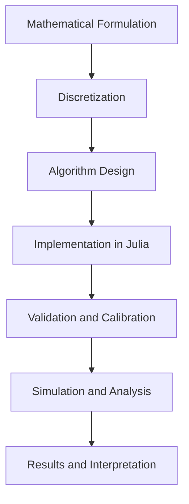

## 12.10 Case Study: Solving Complex Scientific Problems

In this section, we delve into the application of Julia in solving complex scientific problems, with a focus on climate modeling. This case study illustrates the power of Julia's ecosystem in handling intricate computations, optimizing performance, and providing meaningful insights from simulations.

### Real-world Applications

#### Climate Modeling

Climate modeling is a quintessential example of a complex scientific problem that requires immense computational resources and sophisticated algorithms. Climate models simulate the interactions of the atmosphere, oceans, land surface, and ice. These models are crucial for understanding climate change and predicting future climate scenarios.

**Why Julia for Climate Modeling?**

Julia is particularly suited for climate modeling due to its high performance, ease of use, and ability to handle large datasets. Its ability to seamlessly integrate with other languages and tools makes it an ideal choice for scientists who need to leverage existing codebases and libraries.

### Workflow and Methodology

#### Model Development

The development of a climate model involves several stages, from the initial mathematical formulation to the final computational implementation. Let's explore these stages in detail:

1. **Mathematical Formulation**

   Climate models are based on the fundamental laws of physics, such as the conservation of mass, momentum, and energy. These laws are expressed as partial differential equations (PDEs).

2. **Discretization**

   The continuous PDEs are discretized into a form that can be solved numerically. This involves dividing the Earth's surface into a grid and approximating the equations at each grid point.

3. **Algorithm Design**

   Efficient algorithms are designed to solve the discretized equations. This includes selecting appropriate numerical methods, such as finite difference, finite volume, or spectral methods.

4. **Implementation in Julia**

   Julia's syntax and performance make it an excellent choice for implementing these algorithms. The language's multiple dispatch feature allows for writing generic and efficient code.

```julia

nx, nt = 100, 1000
dx, dt = 1.0 / (nx - 1), 0.01

u = zeros(Float64, nx, nt)

u[:, 1] .= exp.(-((1:nx) .- nx/2).^2 / 10)

for n in 1:nt-1
    for i in 2:nx-1
        u[i, n+1] = u[i, n] - dt/dx * (u[i, n] - u[i-1, n])
    end
end
```

5. **Validation and Calibration**

   The model is validated against observational data to ensure its accuracy. Calibration involves adjusting model parameters to improve the fit to data.

6. **Simulation and Analysis**

   Once validated, the model is used to run simulations under various scenarios. The results are analyzed to draw conclusions about climate trends and impacts.

### Challenges and Solutions

#### Computational Efficiency

One of the main challenges in climate modeling is computational efficiency. Climate models require solving large systems of equations over long time periods, which can be computationally expensive.

**Optimizing Code for Performance**

Julia offers several features that can be leveraged to optimize performance:

- **Type Stability**

  Ensuring that functions are type-stable can significantly improve performance. Type stability means that the return type of a function is predictable based on the input types.

```julia
function add_numbers(a::Float64, b::Float64)::Float64
    return a + b
end
```

- **Parallel Computing**

  Julia's built-in support for parallel computing allows for distributing computations across multiple processors, reducing computation time.

```julia
using Distributed

addprocs(4)

@everywhere function compute_heavy_task(x)
    # Simulate a heavy computation
    return sum(sin, x)
end

results = pmap(compute_heavy_task, [1:1000, 1001:2000, 2001:3000, 3001:4000])
```

- **Memory Management**

  Efficient memory management is crucial for handling large datasets. Julia's garbage collector and memory allocation strategies help manage memory usage effectively.

### Results and Interpretation

#### Analyzing Outcomes

The final step in the workflow is analyzing the outcomes of the simulations. This involves visualizing the results, interpreting the data, and drawing conclusions.

**Visualization**

Julia offers powerful visualization libraries, such as Plots.jl and Makie.jl, to create detailed and interactive plots.

```julia
using Plots

plot(1:nx, u[:, end], title="Final State of the Simulation", xlabel="Grid Point", ylabel="Value")
```

**Interpreting Results**

Interpreting the results involves comparing the simulation outcomes with real-world data and assessing the model's predictions. This step is critical for understanding the implications of climate change and informing policy decisions.

### Visualizing the Workflow

To better understand the workflow of climate modeling in Julia, let's visualize the process using a flowchart.



**Figure 1:** Workflow of Climate Modeling in Julia

### Try It Yourself

To deepen your understanding, try modifying the code examples provided. Experiment with different initial conditions, grid sizes, or numerical methods. Observe how these changes affect the simulation outcomes.

### References and Links

For further reading on climate modeling and Julia, consider the following resources:

- [JuliaLang Documentation](https://docs.julialang.org/)
- [Climate Modeling with Julia](https://julialang.org/blog/2020/09/climate-modeling/)
- [Numerical Methods for PDEs](https://www.siam.org/Publications/Books/CS06)

### Knowledge Check

To reinforce your learning, consider the following questions:

1. What are the key stages in developing a climate model?
2. How does Julia's type stability feature improve performance?
3. What are some challenges in climate modeling, and how can they be addressed using Julia?

### Embrace the Journey

Remember, mastering complex scientific problems with Julia is a journey. As you progress, you'll gain deeper insights into the intricacies of climate modeling and other scientific domains. Keep experimenting, stay curious, and enjoy the journey!

## Quiz Time!



### What is one of the main advantages of using Julia for climate modeling?

- [x] High performance and ease of use
- [ ] Limited library support
- [ ] Complex syntax
- [ ] Lack of integration with other languages

> **Explanation:** Julia offers high performance and ease of use, making it ideal for complex computations like climate modeling.

### Which stage involves dividing the Earth's surface into a grid?

- [ ] Mathematical Formulation
- [x] Discretization
- [ ] Algorithm Design
- [ ] Validation and Calibration

> **Explanation:** Discretization involves dividing the Earth's surface into a grid for numerical approximation.

### What feature of Julia allows for writing generic and efficient code?

- [ ] Single Dispatch
- [x] Multiple Dispatch
- [ ] Static Typing
- [ ] Dynamic Typing

> **Explanation:** Julia's multiple dispatch feature allows for writing generic and efficient code.

### How can computational efficiency be improved in Julia?

- [x] Using parallel computing
- [ ] Increasing code complexity
- [ ] Avoiding type stability
- [ ] Reducing the number of processors

> **Explanation:** Parallel computing can distribute computations across multiple processors, improving efficiency.

### What is the purpose of validation and calibration in model development?

- [ ] To increase computational cost
- [x] To ensure accuracy and improve fit to data
- [ ] To simplify the model
- [ ] To avoid using observational data

> **Explanation:** Validation and calibration ensure the model's accuracy and improve its fit to observational data.

### Which library is used for visualization in Julia?

- [ ] NumPy
- [ ] TensorFlow
- [x] Plots.jl
- [ ] Pandas

> **Explanation:** Plots.jl is a powerful visualization library in Julia.

### What is the role of memory management in climate modeling?

- [ ] To increase memory usage
- [x] To handle large datasets efficiently
- [ ] To slow down computations
- [ ] To avoid using garbage collection

> **Explanation:** Efficient memory management is crucial for handling large datasets in climate modeling.

### What is a key challenge in climate modeling?

- [ ] Lack of data
- [x] Computational efficiency
- [ ] Simple algorithms
- [ ] Small datasets

> **Explanation:** Computational efficiency is a key challenge due to the large systems of equations involved.

### What does the flowchart in the article represent?

- [ ] A simple algorithm
- [x] The workflow of climate modeling in Julia
- [ ] A data structure
- [ ] A type system

> **Explanation:** The flowchart represents the workflow of climate modeling in Julia.

### True or False: Julia is not suitable for integrating with existing codebases.

- [ ] True
- [x] False

> **Explanation:** False. Julia can seamlessly integrate with existing codebases and libraries.


