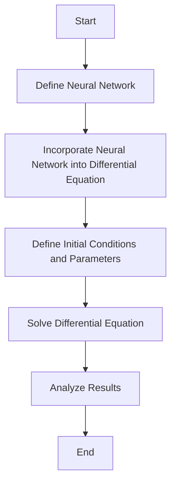

## 12.11 Scientific Machine Learning and Hybrid Modeling

Scientific Machine Learning (SciML) represents a transformative approach in computational science, where the strengths of machine learning (ML) are combined with traditional scientific computing. This integration allows for the development of models that are both data-driven and physics-informed, leading to more accurate and robust predictions. In this section, we will explore the concepts of SciML, focusing on hybrid modeling and universal differential equations, and provide practical examples of their application using Julia.

### Introduction to Scientific Machine Learning

Scientific Machine Learning is an interdisciplinary field that merges the predictive power of machine learning with the rigorous frameworks of scientific computing. This fusion is particularly beneficial in scenarios where traditional models fall short due to incomplete data or complex phenomena that are difficult to model purely through physics-based equations.

#### Key Concepts

- **Data-Driven Models**: These models rely on data to make predictions. They are flexible and can adapt to new data but may lack interpretability and fail to generalize beyond the training data.
- **Physics-Informed Models**: These models are based on scientific laws and principles. They are interpretable and can generalize well but may not capture all the nuances of real-world data.
- **Hybrid Models**: By combining data-driven and physics-informed approaches, hybrid models aim to leverage the strengths of both, leading to improved accuracy and robustness.

### Integrating Machine Learning with Scientific Computing

The integration of machine learning with scientific computing involves several strategies, including the use of neural networks to enhance traditional models and the development of universal differential equations.

#### Universal Differential Equations

Universal Differential Equations (UDEs) are a powerful tool in SciML, allowing for the incorporation of neural networks into differential equations. This approach enables the modeling of complex systems where traditional differential equations may be insufficient.

##### Key Features of UDEs

- **Flexibility**: UDEs can adapt to new data and capture complex dynamics that are difficult to model with standard differential equations.
- **Interpretability**: By embedding neural networks within a differential equation framework, UDEs maintain a level of interpretability that is often lacking in purely data-driven models.

##### Implementing UDEs in Julia

Julia provides robust support for UDEs through packages like `DifferentialEquations.jl` and `Flux.jl`. Let's explore a simple example of implementing a UDE in Julia.

```julia
using DifferentialEquations
using Flux

nn = Chain(Dense(1, 10, relu), Dense(10, 1))

function ude!(du, u, p, t)
    du[1] = nn(u)[1] + p[1] * u[1]
end

u0 = [1.0]
tspan = (0.0, 10.0)

prob = ODEProblem(ude!, u0, tspan, [0.1])

sol = solve(prob, Tsit5())
```

In this example, we define a simple neural network using `Flux.jl` and incorporate it into a differential equation using `DifferentialEquations.jl`. The result is a UDE that can be solved using Julia's powerful differential equation solvers.

### Hybrid Modeling

Hybrid modeling involves the integration of machine learning models, such as neural networks, with traditional scientific models. This approach is particularly useful in scenarios where the underlying physics is partially known or too complex to model directly.

#### Benefits of Hybrid Modeling

- **Enhanced Predictive Accuracy**: By combining data-driven insights with physics-based models, hybrid models can achieve higher predictive accuracy.
- **Robustness**: Hybrid models are more robust to changes in the system or environment, as they can leverage both data and scientific principles.
- **Interpretability**: By incorporating scientific knowledge, hybrid models maintain a level of interpretability that is often lacking in purely data-driven models.

#### Use Cases of Hybrid Modeling

Hybrid modeling is applicable in various fields, including:

- **Turbulent Flows**: Modeling turbulent flows is challenging due to the complex interactions between different scales of motion. Hybrid models can capture these interactions more accurately than traditional models.
- **Material Properties Prediction**: Predicting material properties often involves complex interactions between different physical phenomena. Hybrid models can incorporate these interactions to improve predictive accuracy.

### Examples of Scientific Machine Learning in Julia

Let's explore some practical examples of SciML in Julia, focusing on hybrid modeling and UDEs.

#### Example 1: Modeling Turbulent Flows

Turbulent flows are characterized by chaotic and unpredictable behavior, making them difficult to model using traditional methods. By incorporating neural networks into the modeling process, we can capture the complex dynamics of turbulent flows more accurately.

```julia
using DifferentialEquations
using Flux

nn_turbulence = Chain(Dense(2, 20, relu), Dense(20, 2))

function turbulence_ude!(du, u, p, t)
    du[1] = nn_turbulence(u)[1] + p[1] * u[1]
    du[2] = nn_turbulence(u)[2] + p[2] * u[2]
end

u0_turbulence = [1.0, 0.0]
tspan_turbulence = (0.0, 5.0)

prob_turbulence = ODEProblem(turbulence_ude!, u0_turbulence, tspan_turbulence, [0.1, 0.2])

sol_turbulence = solve(prob_turbulence, Tsit5())
```

In this example, we define a neural network to model the dynamics of turbulent flows and incorporate it into a differential equation framework using UDEs.

#### Example 2: Material Properties Prediction

Predicting material properties involves understanding complex interactions between different physical phenomena. By using hybrid models, we can incorporate these interactions into the prediction process.

```julia
using DifferentialEquations
using Flux

nn_material = Chain(Dense(3, 30, relu), Dense(30, 3))

function material_ude!(du, u, p, t)
    du[1] = nn_material(u)[1] + p[1] * u[1]
    du[2] = nn_material(u)[2] + p[2] * u[2]
    du[3] = nn_material(u)[3] + p[3] * u[3]
end

u0_material = [1.0, 0.5, 0.0]
tspan_material = (0.0, 10.0)

prob_material = ODEProblem(material_ude!, u0_material, tspan_material, [0.1, 0.2, 0.3])

sol_material = solve(prob_material, Tsit5())
```

In this example, we define a neural network to predict material properties and incorporate it into a differential equation framework using UDEs.

### Visualizing the Integration of Machine Learning and Scientific Computing

To better understand the integration of machine learning and scientific computing, let's visualize the workflow of a hybrid modeling process using a flowchart.



**Figure 1**: Workflow of a Hybrid Modeling Process

This flowchart illustrates the key steps involved in developing a hybrid model, from defining the neural network to analyzing the results.

### Challenges and Considerations

While SciML offers significant advantages, it also presents several challenges and considerations:

- **Model Complexity**: Hybrid models can become complex, making them difficult to interpret and validate.
- **Data Requirements**: High-quality data is essential for training accurate models, and obtaining such data can be challenging.
- **Computational Resources**: Training and evaluating hybrid models can be computationally intensive, requiring significant resources.

### Try It Yourself

To deepen your understanding of SciML and hybrid modeling, try modifying the examples provided in this section. Experiment with different neural network architectures, initial conditions, and parameters to see how they affect the results. This hands-on approach will help you gain a deeper understanding of the concepts and techniques discussed.

### Further Reading and Resources

For more information on SciML and hybrid modeling, consider exploring the following resources:

- [SciML: Scientific Machine Learning](https://sciml.ai/)
- [DifferentialEquations.jl Documentation](https://diffeq.sciml.ai/stable/)
- [Flux.jl Documentation](https://fluxml.ai/Flux.jl/stable/)

### Summary

In this section, we explored the integration of machine learning with scientific computing, focusing on hybrid modeling and universal differential equations. We discussed the benefits and challenges of SciML and provided practical examples of its application using Julia. By combining data-driven and physics-informed approaches, SciML offers a powerful framework for developing accurate and robust predictive models.

## Quiz Time!



### What is Scientific Machine Learning (SciML)?

- [x] An interdisciplinary field combining machine learning with scientific computing
- [ ] A purely data-driven approach to modeling
- [ ] A method for solving differential equations
- [ ] A technique for optimizing neural networks

> **Explanation:** SciML combines machine learning with scientific computing to create models that are both data-driven and physics-informed.

### What is a key benefit of hybrid modeling?

- [x] Enhanced predictive accuracy
- [ ] Reduced computational resources
- [ ] Simplified model complexity
- [ ] Elimination of data requirements

> **Explanation:** Hybrid modeling combines data-driven and physics-informed approaches, leading to enhanced predictive accuracy.

### What is a Universal Differential Equation (UDE)?

- [x] A differential equation that incorporates neural networks
- [ ] A purely data-driven model
- [ ] A traditional physics-based model
- [ ] A method for solving algebraic equations

> **Explanation:** UDEs incorporate neural networks into differential equations, allowing for the modeling of complex systems.

### Which Julia package is used for defining neural networks in the examples?

- [x] Flux.jl
- [ ] DifferentialEquations.jl
- [ ] SciML.jl
- [ ] DataFrames.jl

> **Explanation:** Flux.jl is used for defining neural networks in the examples provided.

### What is the purpose of using a neural network in a UDE?

- [x] To capture complex dynamics that are difficult to model with standard differential equations
- [ ] To reduce the computational cost of solving the equation
- [ ] To eliminate the need for initial conditions
- [ ] To simplify the model structure

> **Explanation:** Neural networks in UDEs capture complex dynamics that are difficult to model with standard differential equations.

### What is a challenge associated with SciML?

- [x] Model complexity
- [ ] Lack of interpretability
- [ ] Inability to generalize
- [ ] Limited applicability

> **Explanation:** SciML models can become complex, making them difficult to interpret and validate.

### What is the role of initial conditions in a UDE?

- [x] To define the starting point of the solution
- [ ] To eliminate the need for neural networks
- [ ] To simplify the model structure
- [ ] To reduce computational resources

> **Explanation:** Initial conditions define the starting point of the solution for a UDE.

### Which of the following is a use case for hybrid modeling?

- [x] Modeling turbulent flows
- [ ] Solving algebraic equations
- [ ] Data visualization
- [ ] Database management

> **Explanation:** Hybrid modeling is used for complex scenarios like modeling turbulent flows.

### What is a potential benefit of using hybrid models in material properties prediction?

- [x] Improved predictive accuracy
- [ ] Reduced data requirements
- [ ] Simplified model structure
- [ ] Elimination of computational resources

> **Explanation:** Hybrid models can incorporate complex interactions, leading to improved predictive accuracy.

### True or False: SciML can only be applied to physics-based models.

- [ ] True
- [x] False

> **Explanation:** SciML can be applied to both physics-based and data-driven models, enhancing their predictive capabilities.


