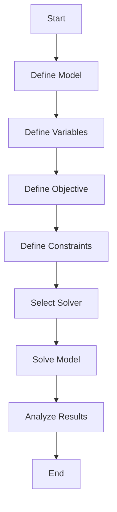

## 12.2 Optimization Techniques Using JuMP.jl and Optimization.jl

Optimization is a cornerstone of scientific computing, enabling us to find the best solutions under given constraints. In Julia, JuMP.jl and Optimization.jl are powerful tools that facilitate the modeling and solving of optimization problems. This section will guide you through using these packages to tackle various optimization challenges.

### Introduction to JuMP.jl

JuMP.jl is a domain-specific modeling language for mathematical optimization embedded in Julia. It allows users to define optimization problems in a high-level syntax that is both expressive and efficient. JuMP.jl supports a wide range of problem types, including linear, quadratic, and nonlinear optimization.

#### Modeling Language for Optimization

JuMP.jl provides a user-friendly interface for defining optimization models. It abstracts the complexity of optimization problems, allowing you to focus on the problem formulation rather than the underlying mathematical details.

- **Defining Optimization Problems**: JuMP.jl allows you to define optimization problems using a syntax that closely resembles mathematical notation. This makes it easier to translate mathematical models into code.

```julia
using JuMP

model = Model()

@variable(model, x >= 0)
@variable(model, y >= 0)

@objective(model, Max, 5x + 3y)

@constraint(model, 2x + y <= 10)
@constraint(model, x + 2y <= 8)

optimize!(model)

println("Optimal value of x: ", value(x))
println("Optimal value of y: ", value(y))
```

In this example, we define a simple linear optimization problem with two variables and two constraints. The objective is to maximize the function `5x + 3y`.

### Defining Variables and Constraints

JuMP.jl supports various types of variables and constraints, allowing you to model a wide range of optimization problems.

#### Variable Types

- **Continuous Variables**: These are variables that can take any value within a specified range. They are used in problems where the decision variables are not restricted to integer values.

- **Integer Variables**: These variables are restricted to integer values. They are used in problems where the decision variables must be whole numbers, such as scheduling or allocation problems.

- **Binary Variables**: These are special integer variables that can only take values of 0 or 1. They are often used in problems involving yes/no decisions.

```julia
@variable(model, 0 <= z <= 10)  # Continuous variable
@variable(model, x, Int)        # Integer variable
@variable(model, y, Bin)        # Binary variable
```

#### Constraints

JuMP.jl allows you to define various types of constraints, including linear, quadratic, conic, and nonlinear constraints.

- **Linear Constraints**: These are constraints where the relationship between variables is linear.

- **Quadratic Constraints**: These involve quadratic terms and are used in problems like portfolio optimization.

- **Conic Constraints**: These are used in conic optimization problems, such as second-order cone programming.

- **Nonlinear Constraints**: These are used in problems where the relationship between variables is nonlinear.

```julia
@constraint(model, x + y <= 5)          # Linear constraint
@constraint(model, x^2 + y^2 <= 10)     # Quadratic constraint
@NLconstraint(model, sin(x) + y <= 1)   # Nonlinear constraint
```

### Using Solvers

JuMP.jl is solver-agnostic, meaning it can interface with a variety of optimization solvers. This flexibility allows you to choose the best solver for your specific problem.

#### Solver Integration

JuMP.jl can connect to both open-source and commercial solvers. Some popular solvers include:

- **GLPK**: An open-source solver for linear programming (LP) and mixed-integer programming (MIP).
- **Gurobi**: A commercial solver known for its speed and efficiency in solving large-scale LP and MIP problems.
- **Ipopt**: An open-source solver for large-scale nonlinear optimization.

```julia
using GLPK

set_optimizer(model, GLPK.Optimizer)

optimize!(model)
```

### Optimization.jl

Optimization.jl provides a unified interface for optimization algorithms in Julia. It offers access to a variety of optimization methods, making it a versatile tool for solving different types of optimization problems.

#### Unified Interface for Optimization Algorithms

Optimization.jl simplifies the process of selecting and using optimization algorithms. It provides a consistent API for different optimization methods, allowing you to switch between algorithms with minimal code changes.

```julia
using Optimization

function rosenbrock(x)
    return (1.0 - x[1])^2 + 100.0 * (x[2] - x[1]^2)^2
end

x0 = [0.0, 0.0]

result = optimize(rosenbrock, x0, BFGS())

println("Optimal solution: ", result.minimizer)
println("Minimum value: ", result.minimum)
```

In this example, we solve the Rosenbrock function, a common test problem for optimization algorithms, using the BFGS method.

### Use Cases and Examples

Optimization techniques are widely used in various fields. Here are some common use cases:

- **Logistics and Supply Chain Optimization**: Optimize routes, schedules, and inventory levels to minimize costs and improve efficiency.

- **Portfolio Optimization**: Allocate assets in a portfolio to maximize returns while minimizing risk.

- **Energy Management**: Optimize the operation of energy systems to reduce costs and emissions.

- **Machine Learning**: Use optimization algorithms to train models and tune hyperparameters.

```julia
using JuMP, GLPK

model = Model(GLPK.Optimizer)

@variable(model, 0 <= x[1:3] <= 1)

@objective(model, Max, 0.1x[1] + 0.2x[2] + 0.15x[3])

@constraint(model, sum(x) == 1)
@constraint(model, 0.05x[1] + 0.1x[2] + 0.07x[3] <= 0.08)

optimize!(model)

println("Optimal allocation: ", value.(x))
```

In this portfolio optimization example, we allocate assets to maximize returns while keeping risk below a certain threshold.

### Visualizing Optimization Processes

To better understand the optimization process, we can use visualizations. Below is a simple flowchart illustrating the steps involved in solving an optimization problem using JuMP.jl.



**Figure 1**: Flowchart of the optimization process using JuMP.jl.

### Try It Yourself

Experiment with the code examples provided in this section. Try modifying the constraints, objective functions, or variable types to see how the solutions change. This hands-on approach will deepen your understanding of optimization techniques in Julia.

### References and Further Reading

- [JuMP.jl Documentation](https://jump.dev/JuMP.jl/stable/)
- [Optimization.jl Documentation](https://github.com/JuliaOpt/Optimization.jl)
- [GLPK Solver](https://www.gnu.org/software/glpk/)
- [Gurobi Solver](https://www.gurobi.com/)
- [Ipopt Solver](https://coin-or.github.io/Ipopt/)

### Knowledge Check

- What are the different types of variables supported by JuMP.jl?
- How can you switch between different solvers in JuMP.jl?
- What are some common use cases for optimization techniques?

### Embrace the Journey

Optimization is a powerful tool that can significantly impact decision-making and efficiency in various fields. As you continue to explore JuMP.jl and Optimization.jl, remember that practice and experimentation are key to mastering these techniques. Keep pushing the boundaries of what you can achieve with optimization in Julia!

## Quiz Time!



### What is JuMP.jl primarily used for in Julia?

- [x] Modeling optimization problems
- [ ] Data visualization
- [ ] Machine learning
- [ ] Web development

> **Explanation:** JuMP.jl is a domain-specific language for modeling optimization problems in Julia.

### Which of the following is NOT a type of variable supported by JuMP.jl?

- [ ] Continuous
- [ ] Integer
- [x] Complex
- [ ] Binary

> **Explanation:** JuMP.jl supports continuous, integer, and binary variables, but not complex variables.

### What is the purpose of Optimization.jl in Julia?

- [x] Provide a unified interface for optimization algorithms
- [ ] Create data visualizations
- [ ] Develop web applications
- [ ] Perform statistical analysis

> **Explanation:** Optimization.jl offers a unified interface for accessing various optimization algorithms in Julia.

### Which solver is known for its efficiency in solving large-scale LP and MIP problems?

- [ ] GLPK
- [x] Gurobi
- [ ] Ipopt
- [ ] CPLEX

> **Explanation:** Gurobi is a commercial solver known for its speed and efficiency in solving large-scale linear and mixed-integer programming problems.

### What type of constraint involves quadratic terms?

- [ ] Linear
- [x] Quadratic
- [ ] Conic
- [ ] Nonlinear

> **Explanation:** Quadratic constraints involve quadratic terms and are used in problems like portfolio optimization.

### How can you define a binary variable in JuMP.jl?

- [x] `@variable(model, y, Bin)`
- [ ] `@variable(model, y, Int)`
- [ ] `@variable(model, y >= 0)`
- [ ] `@variable(model, y <= 1)`

> **Explanation:** The `Bin` keyword is used to define a binary variable in JuMP.jl.

### What is a common use case for optimization techniques?

- [x] Portfolio optimization
- [ ] Image processing
- [ ] Text analysis
- [ ] Web scraping

> **Explanation:** Portfolio optimization is a common use case for optimization techniques, where assets are allocated to maximize returns while minimizing risk.

### Which package provides a consistent API for different optimization methods in Julia?

- [ ] JuMP.jl
- [x] Optimization.jl
- [ ] Plots.jl
- [ ] DataFrames.jl

> **Explanation:** Optimization.jl provides a consistent API for accessing various optimization methods in Julia.

### What is the first step in the optimization process using JuMP.jl?

- [x] Define the model
- [ ] Select the solver
- [ ] Define constraints
- [ ] Analyze results

> **Explanation:** The first step in the optimization process using JuMP.jl is to define the model.

### True or False: JuMP.jl can only interface with open-source solvers.

- [ ] True
- [x] False

> **Explanation:** JuMP.jl can interface with both open-source and commercial solvers, providing flexibility in choosing the best solver for your problem.


