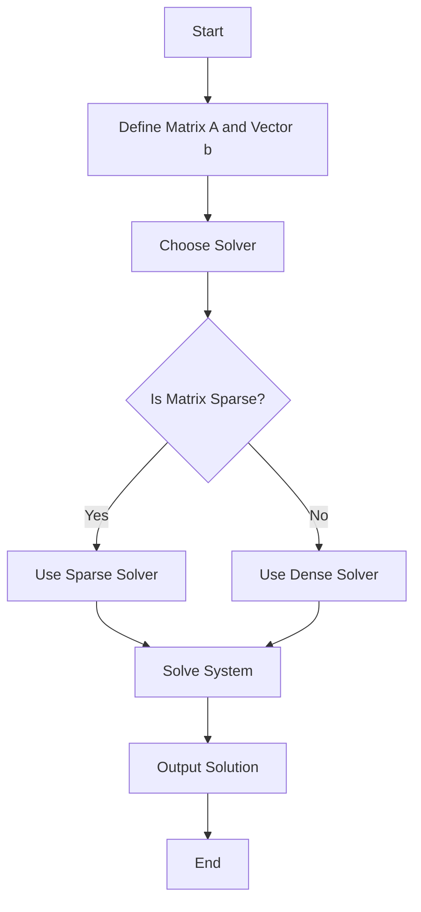

## 12.3 Linear Algebra with BLAS, LAPACK, and LinearSolve.jl

Linear algebra is a cornerstone of scientific computing, providing the mathematical foundation for solving systems of equations, performing transformations, and analyzing data. Julia, with its rich ecosystem, offers powerful tools for linear algebra through libraries like BLAS, LAPACK, and LinearSolve.jl. In this section, we will explore how to harness these tools to perform high-performance linear algebra operations, solve complex systems, and efficiently manage sparse matrices.

### High-Performance Linear Algebra

#### Utilizing BLAS/LAPACK

BLAS (Basic Linear Algebra Subprograms) and LAPACK (Linear Algebra Package) are industry-standard libraries for performing basic vector and matrix operations. Julia leverages these libraries to provide optimized routines for a wide range of linear algebra tasks.

##### Leveraging Optimized Routines for Matrix Operations

BLAS and LAPACK offer a variety of functions for performing operations such as matrix multiplication, factorization, and solving linear systems. These libraries are highly optimized for performance, often utilizing hardware-specific instructions to achieve maximum efficiency.

**Example: Matrix Multiplication Using BLAS**

```julia
using LinearAlgebra

A = rand(1000, 1000)
B = rand(1000, 1000)

C = A * B

println("Matrix multiplication completed.")
```

In this example, the `*` operator automatically utilizes BLAS to perform the matrix multiplication, ensuring optimal performance.

##### Key Functions in LAPACK

LAPACK extends the capabilities of BLAS by providing routines for more complex operations, such as eigenvalue decomposition, singular value decomposition (SVD), and matrix factorizations.

**Example: Solving a Linear System Using LAPACK**

```julia
A = rand(1000, 1000)
b = rand(1000)

x = A \ b

println("Solution to the linear system computed.")
```

The backslash operator `\` in Julia is a high-level interface to LAPACK's linear system solvers, providing a simple yet powerful way to solve equations.

### Using LinearSolve.jl

LinearSolve.jl is a Julia package that provides a unified interface for solving linear systems using various methods. It abstracts the complexity of choosing the right solver, allowing you to focus on your problem.

#### Unified Interface for Solving Linear Systems

LinearSolve.jl supports a wide range of solvers, including direct and iterative methods, and can handle both dense and sparse matrices. This flexibility makes it an excellent choice for tackling diverse linear algebra problems.

**Example: Solving a Linear System with LinearSolve.jl**

```julia
using LinearSolve

A = rand(1000, 1000)
b = rand(1000)

solver = LinearSolve.solve(A, b)

println("Solution using LinearSolve.jl: ", solver.solution)
```

This example demonstrates how to use LinearSolve.jl to solve a linear system. The package automatically selects the most appropriate solver based on the properties of the matrix.

### Sparse Matrices and Operations

Sparse matrices are essential for efficiently handling large datasets with many zero elements. Julia provides robust support for sparse matrices, enabling you to perform operations without unnecessary memory usage.

#### Efficient Storage and Operations

Sparse matrices are stored in a compressed format, reducing memory usage and improving computational efficiency. Julia's `SparseArrays` module provides tools for creating and manipulating sparse matrices.

**Example: Creating and Using Sparse Matrices**

```julia
using SparseArrays

A = sprand(1000, 1000, 0.01)

b = rand(1000)
x = A \ b

println("Sparse matrix operations completed.")
```

In this example, `sprand` creates a sparse matrix with a specified density of non-zero elements. Operations on sparse matrices are optimized to take advantage of their structure.

### Use Cases and Examples

Linear algebra is widely used in various fields, including physics, engineering, and data science. Let's explore some practical applications of the concepts we've covered.

#### Solving Large-Scale Systems in Physics Simulations

In physics simulations, solving large systems of equations is common. Julia's linear algebra capabilities enable efficient computation, even for complex models.

**Example: Simulating a Physical System**

```julia
A = sprand(10000, 10000, 0.001)
b = rand(10000)

x = A \ b

println("Physics simulation completed.")
```

This example illustrates how to solve a large-scale system using sparse matrices, a common requirement in physics simulations.

#### Engineering Computations

Engineering problems often involve solving systems of equations to model structures, circuits, and other systems. Julia's linear algebra tools provide the performance needed for these computations.

**Example: Structural Analysis**

```julia
A = sprand(5000, 5000, 0.002)
b = rand(5000)

x = A \ b

println("Structural analysis completed.")
```

In this example, we solve a system representing a structural model, demonstrating Julia's capability to handle engineering computations efficiently.

### Visualizing Linear Algebra Operations

To better understand the flow of linear algebra operations, let's visualize the process of solving a linear system using a flowchart.



**Figure 1: Flowchart of Solving a Linear System**

This flowchart illustrates the decision-making process when solving a linear system, highlighting the choice between sparse and dense solvers.

### Try It Yourself

Experiment with the code examples provided in this section. Try modifying the matrix sizes, densities, and solvers to observe how they affect performance and results. This hands-on approach will deepen your understanding of Julia's linear algebra capabilities.

### References and Further Reading

- [BLAS and LAPACK Documentation](http://www.netlib.org/lapack/)
- [LinearSolve.jl GitHub Repository](https://github.com/SciML/LinearSolve.jl)
- [SparseArrays.jl Documentation](https://docs.julialang.org/en/v1/stdlib/SparseArrays/)

### Knowledge Check

Before moving on, take a moment to reflect on the key concepts covered in this section. Consider how you might apply these tools in your own projects and what additional questions you might have.

### Embrace the Journey

As you continue to explore Julia's linear algebra capabilities, remember that mastery comes with practice and experimentation. Stay curious, keep learning, and enjoy the journey of discovering new ways to solve complex problems with Julia.

## Quiz Time!



### Which library in Julia provides optimized routines for basic vector and matrix operations?

- [x] BLAS
- [ ] NumPy
- [ ] SciPy
- [ ] TensorFlow

> **Explanation:** BLAS (Basic Linear Algebra Subprograms) provides optimized routines for basic vector and matrix operations in Julia.

### What does the backslash operator `\` in Julia do?

- [x] Solves linear systems
- [ ] Performs matrix multiplication
- [ ] Computes eigenvalues
- [ ] Transposes matrices

> **Explanation:** The backslash operator `\` in Julia is used to solve linear systems of equations.

### Which package in Julia provides a unified interface for solving linear systems?

- [x] LinearSolve.jl
- [ ] SparseArrays.jl
- [ ] DataFrames.jl
- [ ] Plots.jl

> **Explanation:** LinearSolve.jl provides a unified interface for solving linear systems using various methods.

### What is the primary advantage of using sparse matrices?

- [x] Efficient storage and computation
- [ ] Faster matrix multiplication
- [ ] Improved visualization
- [ ] Easier debugging

> **Explanation:** Sparse matrices offer efficient storage and computation, especially for large datasets with many zero elements.

### Which function is used to create a sparse matrix with a specified density of non-zero elements?

- [x] sprand
- [ ] rand
- [ ] zeros
- [ ] ones

> **Explanation:** The `sprand` function is used to create a sparse matrix with a specified density of non-zero elements.

### What is the main benefit of using LAPACK in Julia?

- [x] Provides routines for complex operations like eigenvalue decomposition
- [ ] Simplifies syntax for matrix operations
- [ ] Enhances visualization capabilities
- [ ] Offers built-in machine learning models

> **Explanation:** LAPACK provides routines for complex operations such as eigenvalue decomposition and matrix factorizations.

### Which of the following is a common use case for linear algebra in engineering?

- [x] Structural analysis
- [ ] Image processing
- [ ] Natural language processing
- [ ] Web development

> **Explanation:** Structural analysis is a common use case for linear algebra in engineering, involving solving systems of equations.

### What is the purpose of the `SparseArrays` module in Julia?

- [x] To provide tools for creating and manipulating sparse matrices
- [ ] To enhance plotting capabilities
- [ ] To simplify data manipulation
- [ ] To improve string handling

> **Explanation:** The `SparseArrays` module in Julia provides tools for creating and manipulating sparse matrices.

### True or False: LinearSolve.jl can handle both dense and sparse matrices.

- [x] True
- [ ] False

> **Explanation:** LinearSolve.jl is designed to handle both dense and sparse matrices, offering flexibility in solving linear systems.

### Which of the following is NOT a feature of BLAS?

- [ ] Optimized vector operations
- [ ] Matrix multiplication
- [x] Data visualization
- [ ] Basic linear algebra routines

> **Explanation:** BLAS is focused on optimized vector and matrix operations, not data visualization.


