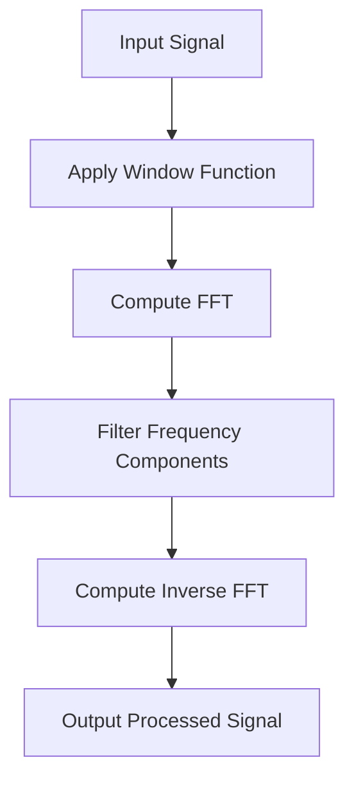

## 12.4 Fast Fourier Transforms and Signal Processing

Fast Fourier Transforms (FFT) are a cornerstone of modern signal processing, enabling efficient computation of discrete Fourier transforms (DFT). In Julia, the `AbstractFFTs.jl` and `FFTW.jl` packages provide powerful tools for performing FFTs and implementing various signal processing techniques. This section will guide you through the concepts, applications, and best practices for using FFTs in Julia, with a focus on practical examples and code snippets.

### Introduction to Fast Fourier Transforms

The Fourier Transform is a mathematical operation that transforms a time-domain signal into its frequency-domain representation. The Discrete Fourier Transform (DFT) is a specific type of Fourier Transform used for discrete signals. The Fast Fourier Transform (FFT) is an algorithm that efficiently computes the DFT, reducing the computational complexity from O(n^2) to O(n log n).

#### Key Concepts

- **Time-Domain vs Frequency-Domain**: The time-domain representation of a signal shows how it changes over time, while the frequency-domain representation shows the signal's frequency components.
- **Discrete Fourier Transform (DFT)**: Converts a finite sequence of equally spaced samples of a function into a sequence of coefficients of a finite combination of complex sinusoids.
- **Fast Fourier Transform (FFT)**: An efficient algorithm to compute the DFT and its inverse.

### Performing FFTs in Julia

Julia provides robust support for FFTs through the `AbstractFFTs.jl` and `FFTW.jl` packages. These packages offer a high-level interface for performing FFTs on arrays of various dimensions.

#### Installing and Using FFTW.jl

To get started with FFTs in Julia, you need to install the `FFTW.jl` package:

```julia
using Pkg
Pkg.add("FFTW")
```

Once installed, you can use the package to perform FFTs:

```julia
using FFTW

signal = [sin(2π * 1 * t) + 0.5 * sin(2π * 3 * t) for t in 0:0.01:1]

fft_result = fft(signal)

ifft_result = ifft(fft_result)

println("FFT Result: ", fft_result)
println("Inverse FFT Result: ", ifft_result)
```

#### Understanding the Output

- **FFT Result**: The output of the `fft` function is a complex array representing the frequency components of the input signal.
- **Inverse FFT**: The `ifft` function computes the inverse FFT, transforming the frequency-domain data back to the time-domain.

### Signal Processing Techniques

Signal processing involves manipulating signals to extract useful information or to enhance certain features. Common techniques include filtering, windowing, and spectral analysis.

#### Filtering

Filtering is used to remove unwanted components from a signal. In Julia, you can implement filters using various techniques, such as convolution.

```julia
using DSP

filter_coefficients = fir1(20, 0.3)

filtered_signal = filt(filter_coefficients, 1, signal)

using Plots
plot([signal, filtered_signal], label=["Original" "Filtered"])
```

#### Windowing

Windowing is used to reduce spectral leakage when performing FFTs on finite-length signals. Common window functions include Hamming, Hanning, and Blackman windows.

```julia
using DSP

windowed_signal = signal .* hamming(length(signal))

fft_windowed_signal = fft(windowed_signal)

plot([windowed_signal, abs.(fft_windowed_signal)], label=["Windowed Signal" "FFT"])
```

#### Spectral Analysis

Spectral analysis involves examining the frequency components of a signal. It is commonly used in audio processing, vibration analysis, and other applications.

```julia
using DSP

psd = periodogram(signal)

plot(psd.freq, psd.power, xlabel="Frequency", ylabel="Power", title="Power Spectral Density")
```

### Use Cases of FFT and Signal Processing

Fast Fourier Transforms and signal processing techniques have a wide range of applications, including:

- **Audio Signal Processing**: Enhancing audio quality, noise reduction, and feature extraction.
- **Image Filtering**: Applying filters to images for edge detection, blurring, and sharpening.
- **Vibration Analysis**: Monitoring and analyzing mechanical vibrations in engineering applications.

### Visualizing FFT and Signal Processing

To better understand the concepts, let's visualize the process of applying FFT and signal processing techniques using a flowchart.



This flowchart illustrates the typical steps involved in processing a signal using FFT and signal processing techniques.

### Try It Yourself

Experiment with the code examples provided in this section. Try modifying the signal, applying different window functions, or using various filters to see how the output changes. This hands-on approach will deepen your understanding of FFT and signal processing in Julia.

### References and Further Reading

- [FFTW.jl Documentation](https://juliamath.github.io/FFTW.jl/stable/)
- [DSP.jl Documentation](https://juliadsp.github.io/DSP.jl/stable/)
- [Understanding the Fourier Transform](https://www.mathworks.com/help/matlab/ref/fft.html)

### Knowledge Check

Let's reinforce your understanding with a few questions:

1. What is the primary advantage of using FFT over DFT?
2. How does windowing help in spectral analysis?
3. What are some common applications of FFT in signal processing?

### Embrace the Journey

Remember, mastering FFT and signal processing is a journey. As you continue to explore and experiment, you'll gain deeper insights and develop more advanced skills. Keep pushing the boundaries of what's possible with Julia and enjoy the process of discovery!

## Quiz Time!



### What is the primary advantage of using FFT over DFT?

- [x] Reduced computational complexity
- [ ] Increased accuracy
- [ ] Simpler implementation
- [ ] Better visualization

> **Explanation:** The FFT algorithm reduces the computational complexity from O(n^2) to O(n log n), making it much faster than the DFT for large datasets.

### Which package in Julia is commonly used for performing FFTs?

- [x] FFTW.jl
- [ ] DataFrames.jl
- [ ] Plots.jl
- [ ] LinearAlgebra.jl

> **Explanation:** FFTW.jl is the package used in Julia for performing Fast Fourier Transforms.

### What is the purpose of windowing in signal processing?

- [x] To reduce spectral leakage
- [ ] To increase signal amplitude
- [ ] To filter out noise
- [ ] To enhance frequency components

> **Explanation:** Windowing is used to reduce spectral leakage when performing FFTs on finite-length signals.

### Which function is used to compute the inverse FFT in Julia?

- [x] ifft
- [ ] fft
- [ ] inverse_fft
- [ ] fft_inverse

> **Explanation:** The `ifft` function is used to compute the inverse Fast Fourier Transform in Julia.

### What is spectral analysis used for?

- [x] Examining frequency components of a signal
- [ ] Enhancing signal amplitude
- [ ] Reducing noise
- [ ] Increasing computational efficiency

> **Explanation:** Spectral analysis involves examining the frequency components of a signal, which is useful in various applications like audio processing and vibration analysis.

### Which of the following is a common window function used in signal processing?

- [x] Hamming
- [ ] Gaussian
- [ ] Exponential
- [ ] Linear

> **Explanation:** The Hamming window is a common window function used to reduce spectral leakage in signal processing.

### What is the output of the `fft` function in Julia?

- [x] A complex array representing frequency components
- [ ] A real array representing time-domain data
- [ ] A matrix of coefficients
- [ ] A scalar value

> **Explanation:** The `fft` function outputs a complex array that represents the frequency components of the input signal.

### Which Julia package provides tools for digital signal processing?

- [x] DSP.jl
- [ ] FFTW.jl
- [ ] Plots.jl
- [ ] Statistics.jl

> **Explanation:** DSP.jl is a Julia package that provides tools for digital signal processing, including filtering and windowing.

### What is the primary use of filtering in signal processing?

- [x] Removing unwanted components from a signal
- [ ] Increasing signal amplitude
- [ ] Enhancing frequency components
- [ ] Reducing computational complexity

> **Explanation:** Filtering is used to remove unwanted components from a signal, such as noise or specific frequency bands.

### True or False: FFT can be used for both time-domain and frequency-domain analysis.

- [x] True
- [ ] False

> **Explanation:** True. FFT is used to transform time-domain data into frequency-domain data and vice versa, making it useful for both types of analysis.


