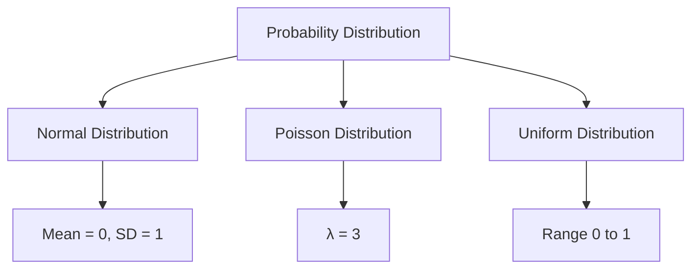

## 12.5 Statistical Computing with Statistics.jl and Distributions.jl

Statistical computing is a cornerstone of data analysis, enabling us to extract meaningful insights from data. In Julia, the `Statistics.jl` and `Distributions.jl` packages provide powerful tools for performing statistical computations and working with probability distributions. This section will guide you through the essential features of these packages, helping you to master statistical computing in Julia.

### Descriptive Statistics

Descriptive statistics provide a way to summarize and describe the main features of a dataset. Let's explore how to calculate key descriptive statistics using `Statistics.jl`.

#### Summarizing Data

To begin, we need to calculate basic statistics such as the mean, median, variance, and standard deviation. These metrics give us a quick overview of the data's central tendency and variability.

```julia
using Statistics

data = [23, 45, 67, 89, 12, 34, 56, 78, 90, 21]

mean_value = mean(data)
println("Mean: $mean_value")

median_value = median(data)
println("Median: $median_value")

variance_value = var(data)
println("Variance: $variance_value")

std_dev_value = std(data)
println("Standard Deviation: $std_dev_value")
```

In this example, we use the `mean`, `median`, `var`, and `std` functions to compute the respective statistics. These functions are part of the `Statistics.jl` package, which is included in Julia's standard library.

### Probability Distributions

Probability distributions are mathematical functions that describe the likelihood of different outcomes. The `Distributions.jl` package in Julia provides a comprehensive suite of tools for working with probability distributions.

#### Defining and Sampling

Let's explore how to define and sample from various probability distributions, including normal, Poisson, and uniform distributions.

```julia
using Distributions

normal_dist = Normal(0, 1)

samples = rand(normal_dist, 5)
println("Normal Distribution Samples: $samples")

poisson_dist = Poisson(3)

poisson_samples = rand(poisson_dist, 5)
println("Poisson Distribution Samples: $poisson_samples")

uniform_dist = Uniform(0, 1)

uniform_samples = rand(uniform_dist, 5)
println("Uniform Distribution Samples: $uniform_samples")
```

In this code, we define three different distributions using `Normal`, `Poisson`, and `Uniform` constructors. We then use the `rand` function to sample random values from these distributions.

### Statistical Tests

Statistical tests are used to make inferences about populations based on sample data. Let's explore how to perform hypothesis testing using `Statistics.jl` and `Distributions.jl`.

#### Hypothesis Testing

Hypothesis testing involves comparing sample data to a null hypothesis to determine if there is enough evidence to reject the null hypothesis. We'll demonstrate how to perform t-tests, chi-squared tests, and ANOVA.

**T-Test**

A t-test is used to compare the means of two groups. Here's how to perform a t-test in Julia:

```julia
using Statistics, HypothesisTests

group1 = [23, 45, 67, 89, 12]
group2 = [34, 56, 78, 90, 21]

t_test_result = ttest(group1, group2)
println("T-Test Result: $(t_test_result.pvalue)")
```

**Chi-Squared Test**

A chi-squared test is used to determine if there is a significant association between categorical variables. Here's an example:

```julia
using HypothesisTests

observed = [20, 30, 50]

expected = [25, 25, 50]

chi_squared_result = ChisqTest(observed, expected)
println("Chi-Squared Test Result: $(chi_squared_result.pvalue)")
```

**ANOVA**

ANOVA (Analysis of Variance) is used to compare the means of three or more groups. Here's how to perform ANOVA in Julia:

```julia
using StatsBase

group1 = [23, 45, 67, 89, 12]
group2 = [34, 56, 78, 90, 21]
group3 = [11, 22, 33, 44, 55]

anova_result = anova([group1, group2, group3])
println("ANOVA Result: $(anova_result)")
```

### Use Cases and Examples

Statistical computing is widely used in various fields, including research and quality control. Let's explore some practical use cases.

#### Data Analysis in Research

Researchers often use statistical computing to analyze experimental data. For example, a biologist might use statistical tests to determine if a new drug has a significant effect on a disease.

#### Quality Control in Manufacturing

In manufacturing, statistical computing is used to monitor and control product quality. For instance, a factory might use control charts to detect variations in the production process.

### Try It Yourself

Now that we've covered the basics, it's time to experiment with the code examples. Try modifying the parameters of the distributions or the sample data for the statistical tests. Observe how the results change and think about the implications.

### Visualizing Statistical Concepts

To enhance your understanding, let's visualize some statistical concepts using diagrams.

#### Probability Distribution Diagram



*Diagram: This diagram illustrates the relationships between different probability distributions and their parameters.*

### References and Links

For further reading, consider exploring the following resources:

- [Statistics.jl Documentation](https://docs.julialang.org/en/v1/stdlib/Statistics/)
- [Distributions.jl Documentation](https://juliastats.org/Distributions.jl/stable/)
- [HypothesisTests.jl Documentation](https://juliastats.org/HypothesisTests.jl/stable/)

### Knowledge Check

Let's reinforce what we've learned with some questions and exercises.

1. What is the purpose of descriptive statistics?
2. How do you define a normal distribution in Julia?
3. What is the difference between a t-test and ANOVA?
4. Try performing a chi-squared test with your own data.

### Embrace the Journey

Remember, this is just the beginning. As you continue to explore statistical computing in Julia, you'll discover more advanced techniques and applications. Keep experimenting, stay curious, and enjoy the journey!

## Quiz Time!



### What is the primary purpose of descriptive statistics?

- [x] To summarize and describe the main features of a dataset
- [ ] To perform hypothesis testing
- [ ] To define probability distributions
- [ ] To visualize data

> **Explanation:** Descriptive statistics are used to summarize and describe the main features of a dataset, providing a quick overview of its central tendency and variability.

### Which function is used to calculate the mean in Julia?

- [x] mean
- [ ] median
- [ ] var
- [ ] std

> **Explanation:** The `mean` function in Julia is used to calculate the average value of a dataset.

### How do you define a normal distribution with mean 0 and standard deviation 1 in Julia?

- [x] Normal(0, 1)
- [ ] Poisson(0, 1)
- [ ] Uniform(0, 1)
- [ ] Exponential(0, 1)

> **Explanation:** The `Normal(0, 1)` constructor is used to define a normal distribution with mean 0 and standard deviation 1 in Julia.

### What is the purpose of a t-test?

- [x] To compare the means of two groups
- [ ] To determine the association between categorical variables
- [ ] To compare the means of three or more groups
- [ ] To define a probability distribution

> **Explanation:** A t-test is used to compare the means of two groups to determine if there is a significant difference between them.

### Which package is used for hypothesis testing in Julia?

- [x] HypothesisTests.jl
- [ ] Statistics.jl
- [ ] Distributions.jl
- [ ] StatsBase.jl

> **Explanation:** The `HypothesisTests.jl` package in Julia is used for performing various hypothesis tests.

### What is the primary use of ANOVA?

- [x] To compare the means of three or more groups
- [ ] To compare the means of two groups
- [ ] To define a probability distribution
- [ ] To perform chi-squared tests

> **Explanation:** ANOVA (Analysis of Variance) is used to compare the means of three or more groups to determine if there are significant differences among them.

### How do you sample random values from a distribution in Julia?

- [x] Using the `rand` function
- [ ] Using the `mean` function
- [ ] Using the `median` function
- [ ] Using the `std` function

> **Explanation:** The `rand` function is used to sample random values from a specified probability distribution in Julia.

### Which function is used to calculate the standard deviation in Julia?

- [x] std
- [ ] mean
- [ ] median
- [ ] var

> **Explanation:** The `std` function in Julia is used to calculate the standard deviation of a dataset.

### What is the primary purpose of a chi-squared test?

- [x] To determine the association between categorical variables
- [ ] To compare the means of two groups
- [ ] To compare the means of three or more groups
- [ ] To define a probability distribution

> **Explanation:** A chi-squared test is used to determine if there is a significant association between categorical variables.

### True or False: The `Distributions.jl` package is used for working with probability distributions in Julia.

- [x] True
- [ ] False

> **Explanation:** The `Distributions.jl` package provides tools for defining and working with various probability distributions in Julia.



By mastering these statistical tools in Julia, you'll be well-equipped to tackle a wide range of data analysis challenges. Keep practicing and exploring the rich ecosystem of Julia packages to enhance your statistical computing skills.
